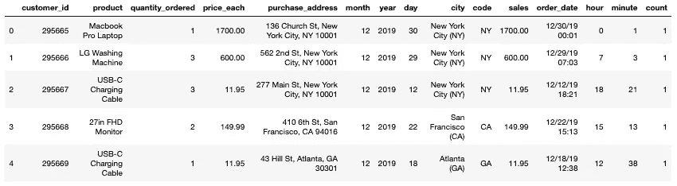
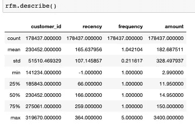
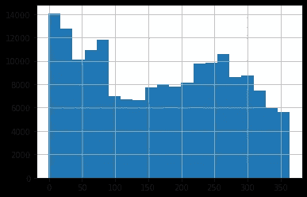
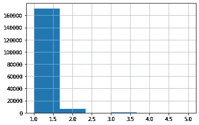
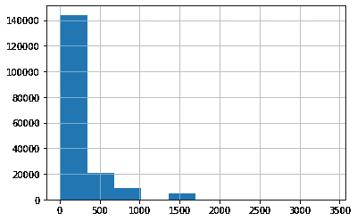
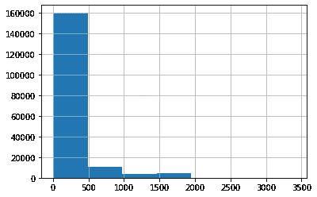
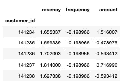
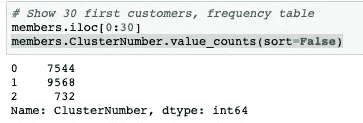
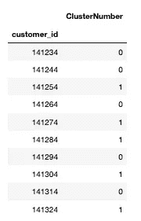

# 基础营销分析:RFM 分析

> 原文：<https://towardsdatascience.com/fundamental-marketing-analytics-f875018391d5?source=collection_archive---------19----------------------->


威廉·艾文在 [Unsplash](https://unsplash.com/s/photos/marketing?utm_source=unsplash&utm_medium=referral&utm_content=creditCopyText) 上的照片

## **通过**最近频率货币模型**和用 Python 实现的管理细分机器学习模型**

如今，要成为一名成功的营销专业人士，营销分析是一项必备技能。因此，具有经济学和统计学背景的营销专家通常被认为比其他人更有优势。但是不管你的背景如何，仍然有一个简单的分析技术你可以利用——RFM(最近频率货币)模型。

RFM 分析是一种营销分析工具，用来确定你的客户是最好的。RFM 模型基于 3 个定量因素:首先是最近度(R ),它显示了客户购买的时间；然后是频率(F ),它告诉客户多久购买一次；最后，货币(M)，它显示了客户花了多少钱。

在这篇短文中，我们将通过 Python 环境探索零售数据集，向您展示这种营销分析技巧。(将使用一个非常简单的 SQL 语句来实现这个目标)

作为一个读者，没有什么比弄脏自己的手更有收获的了，走吧！

# 数据

*   分析中使用的数据集可从[这里](https://raw.githubusercontent.com/lorenzoyeung/Fundamental-marketing-analytics-/master/data.csv)下载。
*   我们没有使用所有的列。我们将主要关注客户 id、订单日期和销售额。
*   销售额:每笔订单的总金额。

# RFM 分析和分割

*   像往常一样，首先要做的是导入必要的库。

```
import pandas as pd
import numpy as np
import matplotlib.pyplot as plt
from pandasql import sqldf
from sklearn.preprocessing import scale
from scipy.cluster.hierarchy import linkage, dendrogram, cut_tree
```

*   让我们导入数据并检查它的前 5 行。

```
df = pd.read_csv('data.csv')
df.head()
```



检查数据的前 5 行

*   将 order_date 列转换为日期格式。
*   然后我们需要找出数据集的持续时间。

```
df["order_date"] = df["order_date"].astype('datetime64[ns]')
print(df["order_date"].max(),"\n",df["order_date"].min())
```

*   创建一个新列，并将其命名为 days_since。这是为了显示最后一次购买的日期。

```
df['days_since'] = (pd.Timestamp('2020-01-01') - df['order_date']).dt.days
```

个人认为这是文章最有趣的部分。我们将只使用一行 sql 代码来计算最近、频率和平均购买量。

*   “GROUP BY 1”表示结果集的第一列。这与我们的 python 语言完全不同，如您所见，别名为 1 的列是不存在的。
*   然后我们检查新的数据集“rfm”。

```
rfm = sqldf("SELECT customer_id, MIN(days_since) AS 'recency', COUNT(*) AS 'frequency', AVG(sales) AS 'amount' FROM df GROUP BY 1", globals())rfm.describe()
```



数据帧“rfm”

*   现在将数据可视化。

```
rfm.recency.hist(bins=20)
```



崭新

```
customers.frequency.hist(bins=6)
```



频率

```
customers.amount.hist()
```



数量

## ***观察:***

1.  大多数顾客是最近买的。
2.  大多数顾客一年中只来购物一次，很少光顾超过两次，这意味着在顾客满意度方面需要做很多工作。
3.  平均订单值位于图表(金额)的左侧，这是合理的。

*   现在，我们将客户数据复制到一个新的数据框中。
*   并将 customer_id 设置为索引

```
new_data = rfm
new_data.head()
new_data = new_data.set_index(new_data.customer_id).iloc[:,1:4]
new_data.head()
```

*   然后我们对数量和图形进行对数变换。

```
new_data.amount = np.log(new_data.amount)new_data.amount.hist(bins=7)
```



对数转换后的数量

*   标准化变量。

```
new_data = pd.DataFrame(scale(new_data), index=new_data.index, columns=new_data.columns)
new_data.head()
```



新数据数据框架

## 运行分层分段

*   取标准化数据的 10%样本。

```
new_data_sample = new_data.iloc[::10, :]
```

*   对距离度量执行分层聚类。

```
c = linkage(new_data_sample, method='ward')
```

*   将分段设置为 3，
*   并查看频率表。

```
members = pd.DataFrame(cut_tree(c, n_clusters = 3), index=new_data_sample.index, columns=['ClusterNumber'])members.ClusterNumber.value_counts(sort=False)
```



*   展示前 10 名顾客。

```
members.iloc[0:10]
```



客户表

# **结论:**

是不是很简单，简单的脚本，简单的工作流程！

有了这个客户表(上表)，营销经理就能够针对每个客户的细分市场和相关的营销活动。

例如，客户群 2 是那些具有较高购买频率和中等消费金额的客户群。营销人员可以通过积极的优惠券营销或频繁的激励电子邮件来瞄准这一客户群。你也可以用各种各样的参数，如折扣价值、持续时间、打折产品等，开展小规模的活动，来测试这群客户。

而那些在第一部分的人，他们是那些很少花钱的休眠者。要恢复它们并不容易，因此暂时跳过它们可能是个不错的选择。

最后，分析的 [Jupyter 笔记本](https://github.com/lorenzoyeung/Fundamental-marketing-analytics-)可以在 [Github](https://github.com/lorenzoyeung/Fundamental-marketing-analytics-) 上找到。

编码快乐！

要查看我的其他中国传统营销博客，这里有链接，

[营销博客](https://elartedm.com/marketing-blog/)

[数字营销博客](https://positivehk.com/category/專欄/digital-marketing-blog/)