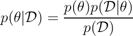
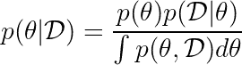

# 概率推理的基本问题

> 原文：<https://towardsdatascience.com/fundamental-problems-of-probabilistic-inference-b46be1f96127?source=collection_archive---------42----------------------->

肖恩·辛克莱在 [Unsplash](https://unsplash.com?utm_source=medium&utm_medium=referral) 上拍摄的照片

## 如果你是机器学习从业者，为什么要关心采样？

到目前为止，我知道很多人从事 ML 研究或者研究机器学习算法。然而，他们中的大多数人不知何故没有意识到机器学习所基于的基本问题，即概率推理的问题。这篇文章的重点可能是将你的注意力转向你在编写机器学习算法时可能没有考虑到的问题。

为什么我们首先要讨论概率？随机性从何而来？真的有随机变量这种东西吗？最后，我们希望预测一些相对具体的东西，给定图像的类别标签，给定马尔可夫决策过程中某种状态描述的最佳行动。可以说，这些事情没有什么随机性。从随机的意义上来说，一个对象实际上并没有被赋予一个类标签。一头牛可能不是一头牛，它肯定是一头牛。

照片由[让·卡洛·埃默](https://unsplash.com/@jeancarloemer?utm_source=medium&utm_medium=referral)在 [Unsplash](https://unsplash.com?utm_source=medium&utm_medium=referral) 拍摄

另一方面，我们有一些问题，比如不同风格的无监督学习，我们可能希望降低数据的维度，对数据进行聚类，学习反映数据概率分布的生成模型。所有这些味道都可以用概率来表示。但是，将一个潜在的低维表示分配给一个数据点并不是真正随机的。我们希望将输入数据点直接映射到潜在表示(一个聚类，一个低维的潜在变量)。

那么，我们最后为什么要用随机性和概率呢？主要论点是**不存在随机性。**当我们谈论机器学习世界中的概率分布、密度时，我们实际上谈论的是什么。**我们实际上谈论的是信息或不确定性。**概率度量反映了我们对给定事件有多少信息。让我们看一个监督的例子，一个包含一头牛的图像。当我说，图像包含一头牛的概率是 0.9。这并不意味着奶牛有时就在那里，这意味着我 90%确定这张照片里有一头奶牛。也许是因为图像没有足够的信息来完全确定它包含一头奶牛，或者也许是我的模型是错误的…谁知道呢。

**随机性从何而来？**笑点在于没有随机性。让我们讨论一下先验分布。这意味着我有一个模型参数的先验分布，或者说假设空间？这意味着我比其他人更确定特定的配置，特定的假设。这并不意味着模型是随机的，它可以根据潜在的随机过程而变化。

当我们进行机器学习时，我们的目标主要是(以不同的形式)以下，在最一般的意义上来说。给定某种类型的数据，我们希望推断出最能描述数据的模型的一些参数。如果你想成为贝叶斯，那么你将坚持这些不确定性的概念。下面是贝叶斯法则给定数据 **D** 来推断模型参数 **θ** 。

**p(θ)** 我们称之为先验， **p(D|θ)** 似然，LHS(左手边)就是后验。后验仅仅表达了我们对参数的确定程度。分母中是边际超过**的 D** 。请注意，我们不能神奇地访问这个边际，我们需要以某种方式评估它。为了得到分母的积分公式，我们可以从 **θ** 和 **D** 的联合分布中忽略θ。在这种情况下，我们有下面的贝叶斯规则公式:

等效地，我们可以在积分中分离分母中的项，使得它包含 **θ** 上的似然和先验。

**为什么这是一个难题？ML 从业者说评估这个积分是困难的，但是理解它为什么困难有时可能是棘手的。首先，分母中的 **θ** 和分子中的不是同一个。积分基本上意味着我们对所有可能的参数 **θ** 的联合分布求和。现在，假设这个 **θ** 是神经网络的参数，它们是实数。分母中有无限多的参数配置需要评估。这显然很难处理。即使我们认为实数仅限于 32 位精度，可能的配置数量也是用于存储模型的位数的指数。此外，评估积分的过程涉及到采样**，**显然，我们的采样越好，我们就能更好地预期我们的估计。**

照片由[TAHA·AJMI](https://unsplash.com/@aj40?utm_source=medium&utm_medium=referral)在 [Unsplash](https://unsplash.com?utm_source=medium&utm_medium=referral) 上拍摄

当你继续阅读时，记住以下几点是很有用的:

> 在估计和采样的情况下，计算复杂度是重要的。

然而，情况并非没有希望。虽然有些积分不能求值，但是我们还是可以估计的。估计一个积分有不同的方法，其中一种是(最基本的一种)蒙特卡罗抽样(注意名字的抽样部分)。所以我们能做的就是画出一定数量的参数 **θ** 并在积分内对函数求值(注意我们假设我们有访问函数的权限对其求值)，看起来是这样的:

这是一个相对简单的估计量，它是无偏的，这意味着它是正确的，并在无限数量的样本下产生精确的正确结果。然而，它也有一个缺点。

> 可以证明，对于蒙特卡罗估计量，估计误差随着样本数的平方根而渐近下降。

这意味着，如果我们想要对目标价值有一个大概的估计，这可能已经足够好了。但是如果我们想要一个高精度的估计，也许存在更好的具有更快收敛特性的选择。此外，我们可能不喜欢经常从参数分布中取样，因为取样可能很昂贵。

## **从分布中取样的计算考虑**

到目前为止，我们已经讨论了计算后验概率的贝叶斯规则中分母的计算问题。在蒙特卡罗估计中，我们需要抽取θ的样本来估计积分。但是在 **θ** 上的分布到底是什么样的呢？你有没有想过**采样实际上是如何工作的**，当使用 Python 或 R 库时，我们如何得出一个“随机”数？即使我给你一个能够从均匀分布中采样的采样器，你如何使用它从更复杂的分布中采样呢？事实证明，采样问题本身就是一个迷人的问题，无论是计算上还是数学上。

取样时，我们想问自己的主要问题如下。如果我们有可能从一个简单的概率分布中有效地抽样，我们如何从一个更复杂的概率分布中抽样呢？事实证明，从复杂分布中采样是一个重要的问题，并且构成了 ML 中许多方法的基础。举几个例子:离线强化学习、规范化流程、变分推理……但是这个讨论我留到以后的文章中。

## 相关文章

[信息论中的“信息”是什么](/what-is-the-information-in-information-theory-d916250e4899) —了解更多不确定性和信息概念的关系。