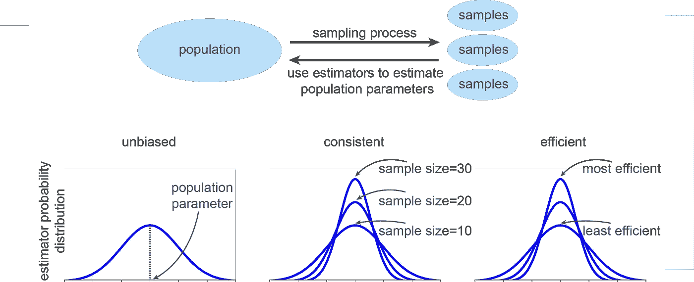
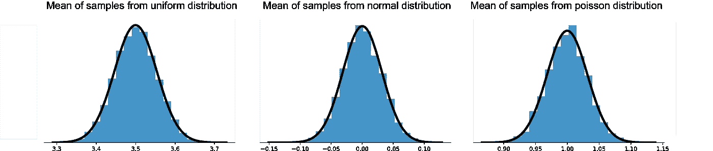
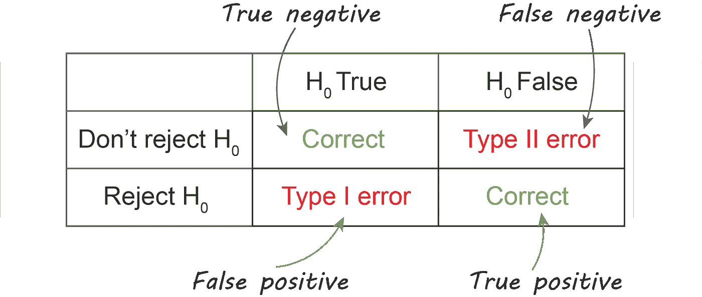
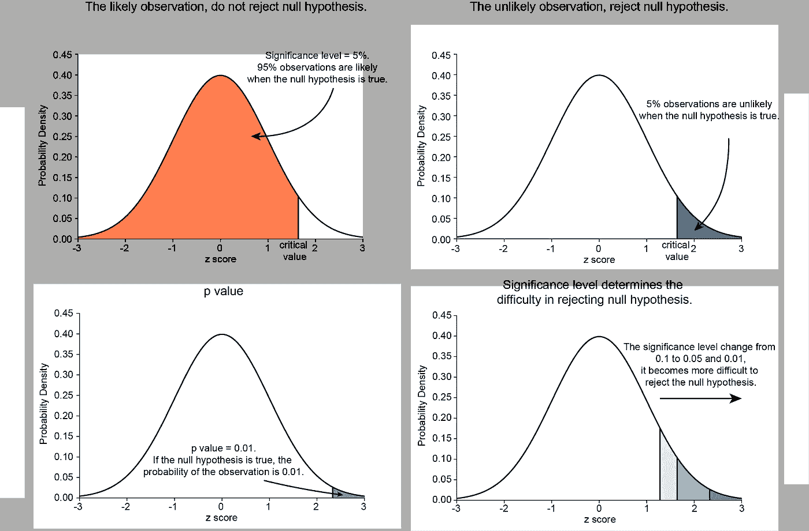

# 基础统计学

> 原文：<https://towardsdatascience.com/fundamental-statistics-7770376593b?source=collection_archive---------25----------------------->

## [**探索时间序列建模**](https://towardsdatascience.com/tagged/time-series-modeling)

## 用 Python 代码进行时间序列建模


照片由[坦吉·贝尔坦](https://unsplash.com/@tangib?utm_source=medium&utm_medium=referral)在 [Unsplash](https://unsplash.com?utm_source=medium&utm_medium=referral) 上拍摄

时间序列数据在我们身边无处不在，从股票市场价格到你所在城市的每日气温。顾名思义，时间序列数据的 x 轴就是时间。我们总是站在当前的时间点。在 x 轴的左侧，我们正在回顾过去。如果幸运的话，简单的一瞥，也许能发现过去的一些周期性模式。或者，如果我们付出更多的努力，并引入一些其他变量，我们可能会得到一些“相关性”来解释我们过去的数据。但是，我们能评估这些其他变量对数据建模的效果吗？这些“相关性”在未来会成立吗？我们能指望这些过去的“相关性”并做出预测吗？

如果你也有这些问题，让我们一起探索时间序列数据的分析和建模！我将使用 Python 进行一些实验和统计测试。使用 Python 学习统计学的一个好处是，我们可以使用已建立的库并绘制漂亮的图表来更好地理解复杂的统计概念。

未来，我还计划拥有以下职位:

[***用 Python 代码进行时间序列建模:如何分析单个时间序列变量*** *。*](/how-to-analyse-a-single-time-series-variable-11dcca7bf16c)

***用 Python 代码进行时间序列建模:如何分析多个时间序列变量*** 。

***用 Python 代码进行时间序列建模:如何用线性回归进行时间序列数据建模*** 。

由于我将从非常基本的统计概念开始，到更复杂的分析和建模，如果你是时间序列数据的初学者，我强烈建议你从这篇文章开始。

# 1.总体、样本和估计量

人口有一个潜在的分布过程，我们通常无法准确知道。我们能做的是从总体中抽样，并用样本来估计总体。但是如何选择合适的估计量呢？定义一个好的估计量有三个特性:无偏、一致和有效。

当样本参数的期望值等于总体参数时，估计量是无偏的:


如果样本参数的方差随着样本量的增加而减小，则估计量是一致的。

在样本容量相同的情况下，方差越小的估计量越有效。



一个好的评估者是无偏的、一致的和有效的。

# 2.概率密度分布

概率密度分布(PDF)用于指定随机变量落在特定值范围内的概率。某一 x 处的概率密度表示为 f(x)。通过在(x1，x2)的范围内对 f(x)应用积分函数，可以计算 x 落入(x1，x2)的概率。


正态分布的概率密度函数和概率密度函数

# 3.中心极限定理和大数定律

中心极限定理指出，当样本容量较大时，独立随机变量的样本均值服从正态分布。通常，当样本量大于 30 时，大样本量的要求被认为是满足的。独立随机变量可以服从任何分布，而这些独立随机变量的样本均值服从正态分布。

```
import numpy as np
import matplotlib.pyplot as plt
from scipy.stats import normmeanList = []num_trials = 10000
num_observations = 1000for i in range(num_trials):
    # sample from uniform distribution
    numList = np.random.randint(1,7,num_observations)
    # sample from normal distribution
    #numList = np.random.normal(loc=0,scale=1,size=num_observations)
    # sample from poisson distribution
    #numList = np.random.poisson(lam=1,size=num_observations)
    meanList.append(np.mean(numList))mu, std = norm.fit(meanList)
fig, ax = plt.subplots()
ax.hist(meanList, bins=20, density=True, alpha=1, color='#4495c9')xmin, xmax = ax.get_xlim()
x = np.linspace(xmin, xmax, 100)
p = norm.pdf(x, mu, std)
ax.plot(x, p, 'k', linewidth=4)ax.spines['top'].set_visible(False)
ax.spines['right'].set_visible(False)
ax.spines['left'].set_visible(False)
ax.set_yticks([])
plt.show()
```



大数定律表明，给定大量试验，估计值的平均值会更接近理论值。对于上面的实验，如果我们只重复试验 10 次，分布将与图非常不同。如果您感兴趣，您可以快速测试结果，直观地了解大数定律是如何产生影响的。

# 4.假设检验

假设只能计算样本参数，我们需要使用假设检验对总体参数进行推断。在假设检验中，提出一组互补的假设，包括一个零假设和一个备择假设。当进行假设检验时，我们选择相信零假设成立。如果观测值很可能出现在原假设为真的条件下，那么我们不拒绝原假设。然而，如果观察值不可能出现，那么我们拒绝零假设，接受替代假设。



假设矩阵

# 5.显著性水平和 P 值

在进行假设检验之前，我们需要首先定义一个显著性水平。显著性水平决定了我们对零假设的置信水平。如果我们将显著性水平设置为 0.05，那么只要观察值的概率高于 5%，我们就不拒绝零假设。然而，如果观察的概率低于 5%，我们拒绝零假设，接受替代假设。在类型 I 和类型 II 误差之间有一个折衷。基本上，较高的显著性水平更容易拒绝零假设。虽然以这种方式，较高的显著性水平减少了类型 II 误差，但同时也导致了较高的类型 I 误差。减少 I 型和 II 型误差的唯一方法是增加样本量。

观察值的概率称为 p 值。较低的 p 值意味着在零假设成立的情况下，观察不太可能发生。当 p 值低于显著性水平时，我们拒绝零假设。但是，有一点需要注意，p 值应该解释为二进制:它只是大于或小于显著性水平。



如何解释显著性水平和 p 值

# 摘要

在这篇文章中，我强调了一些基本的统计概念，这些概念对于理解未来关于时间序列数据分析和建模的文章非常重要。希望您有信心在我们的期刊上更进一步，探索时间序列数据！敬请关注下面这篇关于如何分析单个时间序列变量的文章！