# 数据架构基础，帮助数据科学家更好地理解架构图

> 原文：<https://towardsdatascience.com/fundamentals-of-data-architecture-to-help-data-scientists-understand-architectural-diagrams-better-7bd26de41c66?source=collection_archive---------3----------------------->

## 在假装你理解你聪明的同事给你看的图表之前。

贾里德·穆雷在 [Unsplash](https://unsplash.com?utm_source=medium&utm_medium=referral) 上的照片

# 介绍

在一家使用数据获取商业价值的公司中，尽管您可能并不总是被赏识您的数据科学技能，但当您管理好数据基础架构时，您总是会被赏识的。每个人都希望数据存储在一个可访问的位置，清理好，并定期更新。

在这些不引人注目但稳定的需求的支持下，数据架构师的工资与数据科学家一样高，甚至更高。事实上，根据 PayScale([https://www . PayScale . com/research/US/Country = United _ United States/Salary](https://www.payscale.com/research/US/Country=United_States/Salary))进行的薪酬研究显示，美国数据架构师的平均薪酬为*$ 121816*，而数据科学家的平均薪酬为*$ 96089*。

并不是说所有的数据科学家都应该改变他们的工作，至少学习数据架构的基础知识对我们来说会有很多好处。实际上，有一个简单(但有意义)的框架可以帮助您理解任何类型的真实世界的数据架构。

# 目录

*   **数据架构的三个组成部分:数据湖- >数据仓库- >数据集市**
*   **每个组件中使用的工具**
*   **案例研究—构建预定的&从 BigQuery(数据仓库)到 Google Sheets(数据集市)的自动数据馈送**
*   **结尾注释**

# 数据架构的三个组成部分:数据湖->数据仓库->数据集市

“数据湖”、“数据仓库”和“数据集市”是数据平台架构中的典型组件。按照这种顺序，业务中产生的数据被处理和设置，以创建另一个数据含义。

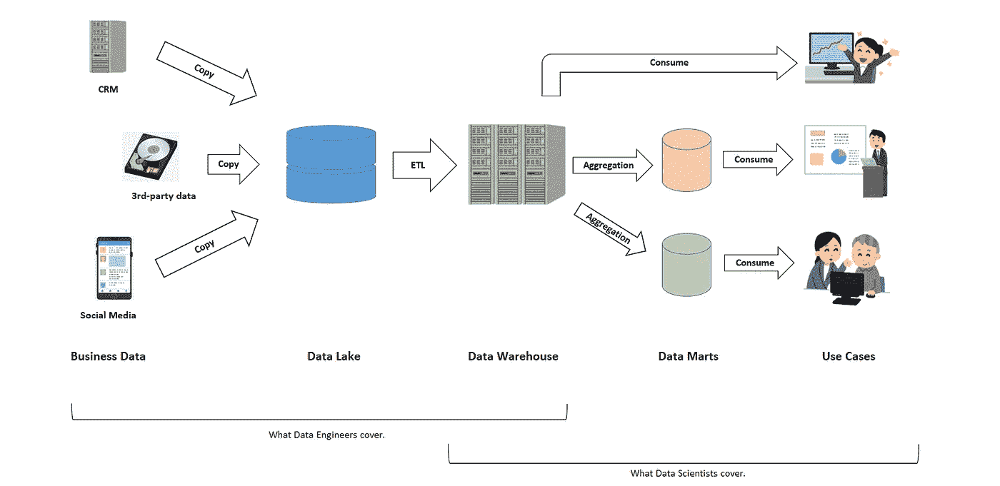

作者使用 Irasuto-ya([https://www.irasutoya.com/](https://www.irasutoya.com/))的材料制作的图表

三个组件负责三种不同的功能:

*   **数据湖**:保存业务中产生的数据的原始副本。来自原始数据的数据处理即使有也应该是最小的；否则，万一某些数据处理最终被证明是错误的，将不可能追溯性地修复错误。
*   **数据仓库**:保存由托管数据模型处理和结构化的数据，反映数据最终用途的全局(非特定)方向。在许多情况下，数据是表格形式的。
*   **数据集市**:保存特定业务功能使用的子部分和/或聚合数据集，例如特定业务单位或特定地理区域。一个典型的例子是当我们准备一个特定业务线的 KPI 摘要，然后在 BI 工具中可视化。特别是，当用户希望定期和频繁地更新数据集市时，在仓库之后准备这种单独和独立的组件是值得的。相反，在用户只想对某组数据进行一次特别分析的情况下，可以跳过这一部分。

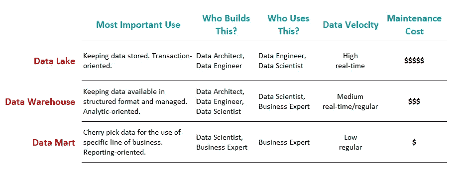

三个数据架构组件的摘要(由作者创建的图表)

除了这种简单的描述之外，更多真实世界的例子，请享受谷歌“数据架构”来找到大量的数据架构图。

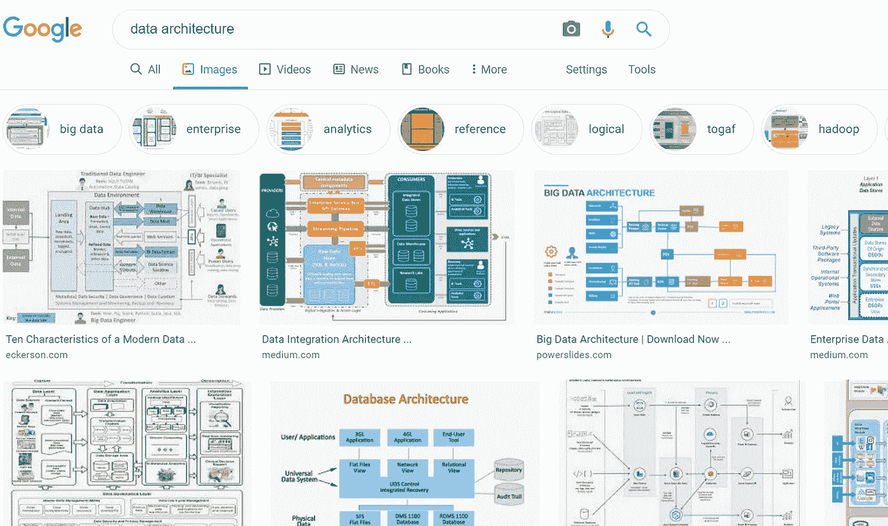

你所看到的，当你用“数据架构”谷歌一下。(图片由作者拍摄)

## 为什么我们需要分成这三个部分？

因为流程中的不同阶段有不同的要求。

在数据湖阶段，我们希望数据接近原始数据，而数据仓库旨在保持数据集更加结构化，通过清晰的维护计划进行管理，并具有清晰的所有权。在数据仓库中，我们也希望数据库类型是面向分析的，而不是面向事务的。另一方面，数据集市应该能够方便地接触到非技术人员，他们可能会使用数据旅程的最终输出。

不同用途的系统组件往往在不同的时间进行重新设计。然后，配置松散连接的组件在将来的维护和扩展中具有优势。

## 数据工程师和数据科学家如何处理这三个部分？

粗略地说，数据工程师涵盖了从业务中产生的数据抽取到数据仓库中的数据湖和数据建模以及建立 ETL 管道；而数据科学家则负责从数据仓库中提取数据，构建数据集市，并引导进一步的业务应用和价值创造。

当然，数据工程师和数据科学家之间的这种角色分配有些理想，许多公司不会为了符合这一定义而同时聘用两者。实际上，他们的工作描述有重叠的趋势。

## 超越三组分方法的新趋势

最后但并非最不重要的一点是，值得注意的是，这种由三部分组成的方法是二十多年来一直存在的传统方法，而且新技术一直在不断出现。例如， **"** [**数据虚拟化**](https://en.wikipedia.org/wiki/Data_virtualization#:~:text=Data%20virtualization%20is%20an%20approach,of%20any%20other%20entity)%20of) **"** 是一种允许对数据源进行一站式数据管理和操作接口的思想，而不管它们的格式和物理位置。

# 每个组件中使用的工具

现在，我们了解了三个数据平台组件的概念。那么，人们用什么工具呢？基于[这份“数据平台指南”](https://speakerdeck.com/yuzutas0/20200715)(日语)，以下是一些想法:

## 数据湖/仓库

数据湖和数据仓库有以下选项。

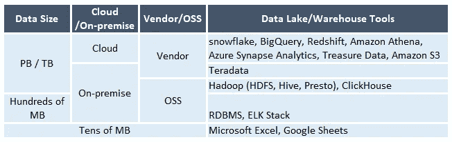

作者根据“[数据平台指南”](https://speakerdeck.com/yuzutas0/20200715)(日文)精心制作

## ETL 工具

ETL 发生在数据到达数据湖并被处理以适应数据仓库的地方。数据实时到达，因此 ETL 更喜欢事件驱动的消息传递工具。

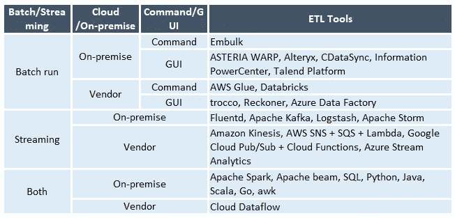

作者根据“[数据平台指南”](https://speakerdeck.com/yuzutas0/20200715)(日文)精心制作

## 工作流引擎

工作流引擎用于管理数据的整体流水线操作，例如，通过流程图可视化流程进行的位置，在出错时触发自动重试等。

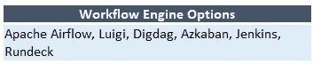

作者根据“[数据平台指南”](https://speakerdeck.com/yuzutas0/20200715)(日文)精心制作

## 数据集市/商务智能工具

以下工具可以用作数据集市和/或 BI 解决方案。选择将取决于业务环境、贵公司熟悉的工具(例如，您是 Tableau 人还是 Power BI 人？)，聚合数据的大小(例如，如果数据大小很小，为什么像 Excel 或 Google Sheets 这样的基本解决方案达不到目标？)、您使用什么数据仓库解决方案(例如，如果您的数据仓库在 BigQuery 上，Google DataStudio 可能是一个简单的解决方案，因为它在 Google circle 内有天然的链接)等等。

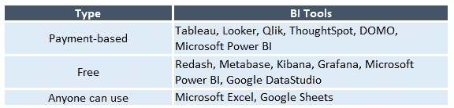

作者根据“[数据平台指南”](https://speakerdeck.com/yuzutas0/20200715)(日文)精心制作

# 案例研究—构建从 BigQuery(数据仓库)到 Google Sheets(数据集市)的预定和自动数据馈送

当数据大小保持在几十兆字节左右或不到几十兆字节，并且不依赖于其他大型数据集时，坚持使用基于电子表格的工具来存储、处理和可视化数据是很好的，因为它成本较低，并且每个人都可以使用它。

一旦数据变得更大，并开始与其他数据表有数据依赖性，那么从云存储开始作为一站式数据仓库是有益的。(当数据变得更大，达到数十 TB 时，使用本地解决方案来实现成本效益和可管理性是有意义的。)

在这一章中，我将演示一个案例，当**数据作为数据仓库存储在 Google BigQuery 中时。** BigQuery 数据实时或短频率处理存储。最终用户仍然希望在电子表格上看到高度汇总的每日 KPI。这意味着**数据集市可以很小，甚至适合电子表格解决方案**。让我们在这里使用 **Google Sheets** 而不是 Excel，因为它可以与 BigQuery 中的数据源在同一个环境中。哦，顺便说一下，不要想着每天手动运行查询。尝试找到一种解决方案，让一切自动运行，无需你采取任何行动。

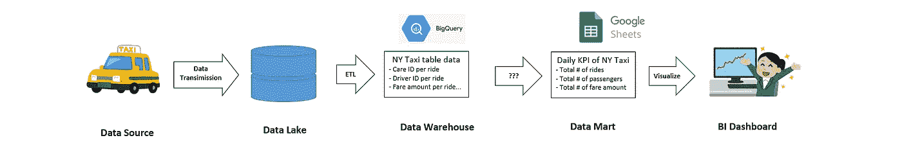

案例研究中的数据管道(作者使用 IRA suto-ya([https://www.irasutoya.com/](https://www.irasutoya.com/))的材料制作的图表)

## 本案例研究中使用的数据

在本案例研究中，我将使用一个样本表数据，其中包含每次乘坐纽约出租车的乘客记录，包括以下数据字段:

*   汽车 ID
*   驱动程序 ID
*   乘车日期
*   乘客人数
*   票价金额
*   等等。

示例数据作为数据仓库存储在 BigQuery 中。

## Google Sheets 可以从 BigQuery 表中提取数据吗？

从技术上来说是的，但目前这只能通过**连接的表获得，并且您需要一个 G Suite Enterprise、Enterprise for Education 或 G Suite Enterprise Essentials 的帐户**。

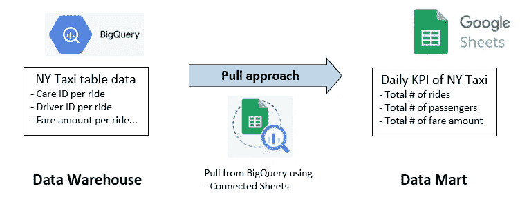

作者创建的图表。

Connected Sheets 允许用户操纵 BigQuery 表数据，就像在电子表格上播放一样。参见“BenCollins”博客文章本页的 GIF 演示[。](https://www.benlcollins.com/spreadsheets/connected-sheets/)

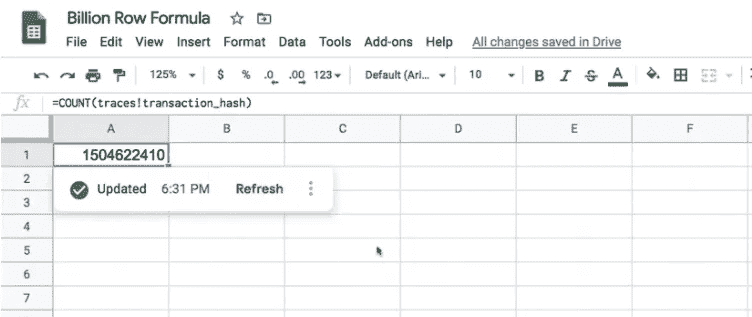

使用 Google Sheets 通过 Connected Sheets 连接到 BigQuery 的示例(由作者捕获)

**连接的工作表还允许自动调度和刷新工作表**，这是作为数据集市的自然需求。

虽然这是一个很好的选择，但一个可能的问题是，欠 G Suite 帐户并不常见。

关于设置的更多细节，见[这篇来自“Ben Collins”](https://www.benlcollins.com/spreadsheets/connected-sheets/)的博文。

## 我们可以做些什么来将数据从 BigQuery 推送到 Google Sheets？

要从 BigQuery 中提取数据并将其推送到 Google Sheets，单靠 BigQuery 是不够的，我们需要服务器功能的帮助来调用 API 向 BigQuery 发送查询，接收数据，并将其传递给 Google Sheets。

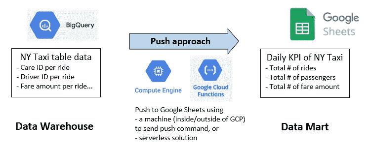

作者创建的图表。

服务器功能可以在 GCP 外部或内部的服务器机器上(例如 GCP 的“计算引擎”实例；或 AWS 上的“EC2”实例)。可以使用 [unix-cron 作业](https://en.wikipedia.org/wiki/Cron)来调度代码运行。但是这里的一个缺点是它需要实例的维护工作和成本，并且对于运行一个小程序来说太多了。

“谷歌云功能”是一种所谓的“无服务器”解决方案，在不启动服务器的情况下运行代码。将代码放入云函数并设置触发事件(例如，本案例研究中的预定时间，但也可以是来自一些互联网用户的 HTML 请求)，GCP 会自动管理代码的运行。

## 我案例研究中的设置

使用纽约出租车数据配置我的案例研究有两个步骤。

*第一步:设置调度——设置云调度器和发布/订阅来触发云功能。*

这里，“发布/订阅”是一个消息服务，由云功能订阅，并在每天的某个时间触发其运行。“云调度程序”是基于 [unix-cron 格式](https://en.wikipedia.org/wiki/Cron)以用户定义的频率启动的功能。结合这两者，我们可以创建由云函数订阅的常规消息。参见[这份关于如何做](https://cloud.google.com/scheduler/docs/tut-pub-sub)的官方说明。这是我在 GCP 拍摄的截图。

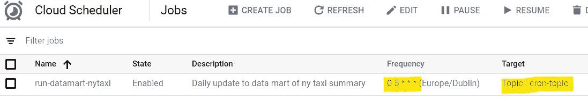

在云调度程序中设置(由作者捕获)

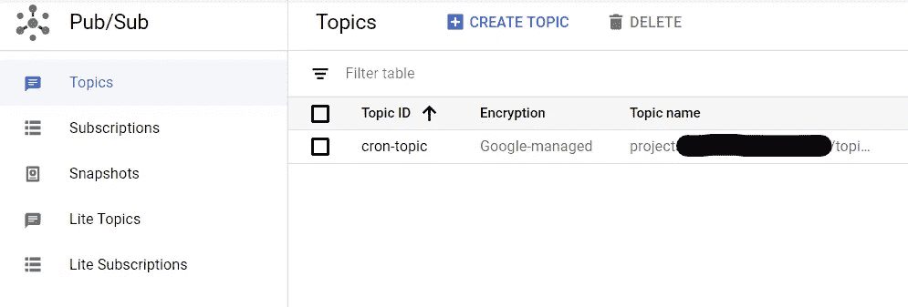

在发布/订阅中设置(由作者捕获)

*第二步:设置代码——在云函数上准备代码，查询 BigQuery 表，推送给 Google Sheets。*

下一步是设置云功能。在云函数中，您定义 1)什么是触发器(在这个案例研究中，从 Pub/Sub 发送的“cron-topic ”,链接到云调度程序，它在每天早上 6 点提取触发器)和 2)当检测到触发器时您想要运行的代码。

更多细节见[这个官方说明](https://cloud.google.com/scheduler/docs/tut-pub-sub)，这里是我设置的截图。

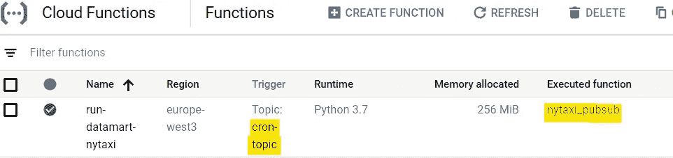

在云函数中设置(由作者捕获)

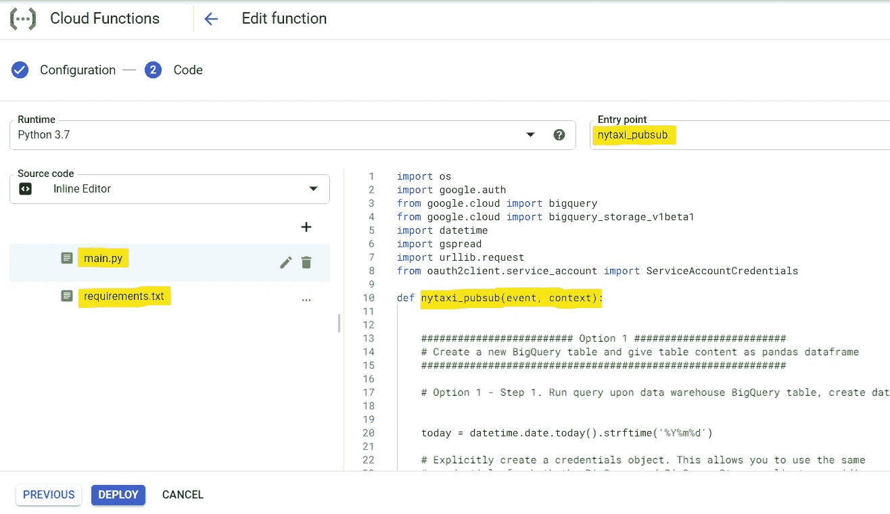

云函数中的代码输入——在这里，您还可以设置 requirements.txt 来使用 mail.py 程序中的可安装库。(作者捕捉)

要运行的代码必须包含在一个函数中，这个函数的名称可以是任何您喜欢的名称(在我的例子中是“nytaxi_pubsub”)。)代码内容由两部分组成:第 1 部分在 BigQuery 上运行查询，以将原始 BigQuery 表简化为 KPI，并将其保存为 BigQuery 中的另一个数据表，以及使其成为 Pandas 数据框，第 2 部分将数据框推送到工作表。

以下是我实际使用的代码。重要的是，对 BigQuery 的认证是自动的，只要它与云函数驻留在同一个 GCP 项目中(参见[本页](https://cloud.google.com/docs/authentication/production)了解解释)。)然而，Google Sheets 的情况并非如此，它至少需要一个通过服务帐户共享目标工作表的过程。更多细节参见[gspread 库](https://gspread.readthedocs.io/en/latest/oauth2.html)中的描述。

main.py(由作者编码)

requirements.txt(由作者编码)

## Google Sheets 上的最终数据集市

最后，我在 Google Sheets 中得到这样的汇总数据:

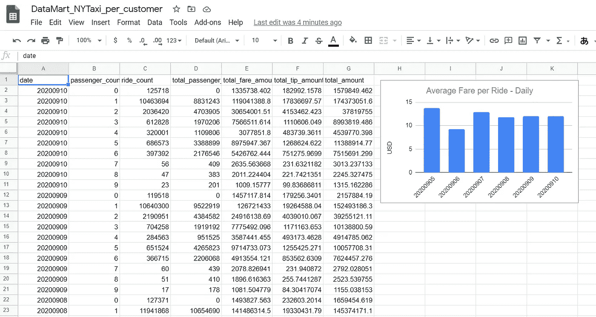

经过漫长的设置过程后，自动更新数据集市。(作者捕捉)

该表每天早上自动更新，当数据仓库通过 ETL 从数据湖接收新数据时，我们可以轻松地跟踪纽约出租车 KPI。

# 结尾注释

在雇用数据工程师和/或数据架构师以及数据科学家的大公司中，数据科学家的主要角色不一定是准备数据基础设施并将其放置到位，但至少了解数据架构的要点将有助于了解我们在日常工作中所处的位置。

数据湖->数据仓库->数据集市是一个典型的平台框架，用于处理从起点到用例的数据。将过程分成三个系统组件对于维护和目的性有很多好处。

在工具的选择上有很多选项。应根据数据环境(大小、类型等)明智地选择它们。)和企业的目标。

最后，在这篇文章中，我讨论了一个案例研究，我们在 Google Sheets 上准备了一个小型数据集市，从 BigQuery 中提取数据作为数据仓库。通过使用云调度程序和发布/订阅，更新变得自动化。

# 参考

*   “数据湖 vs 数据仓库 vs 数据集市”， [Jatin Raisinghani](https://www.holistics.io/blog/author/jatin/) ，整体博客([https://www . holistics . io/Blog/Data-Lake-vs-Data-Warehouse-vs-Data-Mart/](https://www.holistics.io/blog/data-lake-vs-data-warehouse-vs-data-mart/))
*   一张幻灯片《数据平台指南》(日文)，@yuzutas0(推特)，[https://speakerdeck.com/yuzutas0/20200715](https://speakerdeck.com/yuzutas0/20200715)
*   “连接的工作表:分析谷歌工作表中的大数据”，BenCollins，【https://www.benlcollins.com/spreadsheets/connected-sheets/ 