# 生成对抗网络的基础

> 原文：<https://towardsdatascience.com/fundamentals-of-generative-adversarial-networks-b7ca8c34f0bc?source=collection_archive---------17----------------------->

## [入门](https://towardsdatascience.com/tagged/getting-started)

## GANs——图解、解释和编码

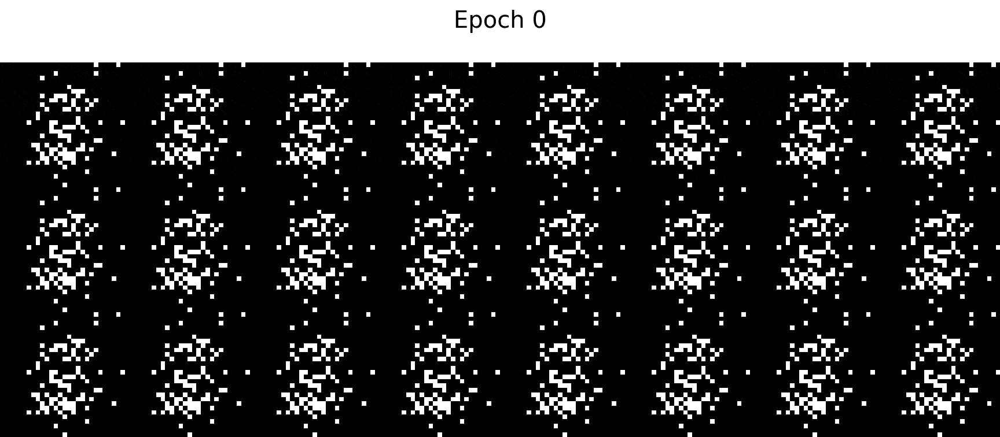

由 GAN 生成的合成手写数字。在本教程中，我们将创建自己的 GAN，它可以像这样生成数字，以及创建上面这个动画的代码。请继续阅读！

# 介绍

2014 年，一位名不见经传的博士生 Ian Goodfellow 向世界介绍了生成性对抗网络(GANs)。GANs 不同于 AI 社区见过的任何东西，Yann LeCun 将其描述为“[在 ML](https://www.quora.com/What-are-some-recent-and-potentially-upcoming-breakthroughs-in-deep-learning) 的过去 10 年中最有趣的想法”。

从那时起，许多研究工作都倾注在 GANs 上，许多最先进的人工智能应用程序，如[英伟达的超现实人脸生成器](https://github.com/NVlabs/stylegan2)都源自 Goodfellow 对 GANs 的研究。

> 作者注:本文所有图片和动画均由作者创作。如果你想把这些图片用于教育目的，请在评论中给我留言。谢谢大家！

# 什么是甘，他们能做什么？

在高层次上，GANs 是一种神经网络，它学习如何生成真实的数据样本，并根据这些样本对其进行训练。例如，给定手写数字的照片，GANs 学习如何生成更多手写数字的逼真照片。更令人印象深刻的是，GANs 甚至可以学习生成人类的逼真照片，如下图所示。

GAN 生成的人脸。以上这些面孔都不是真实的。来源:[https://thispersondoesnotexist.com/](https://thispersondoesnotexist.com/)

那么 GANs 是如何工作的呢？从根本上说，GANs 学习兴趣主题的分布。比如说。受过手写数字训练的 GANs 学习数据的分布。一旦学习了数据的分布，GAN 可以简单地从分布中采样以产生真实的图像。

# 数据的分布

为了巩固我们对数据分布的理解，让我们考虑下面的例子。假设我们有下面的 6 张图片。

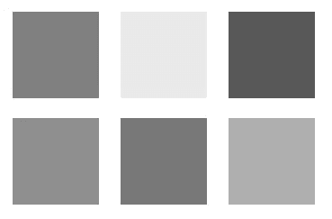

每个图像都是一个浅灰色的盒子，为了简单起见，让我们假设每个图像只包含一个像素。换句话说，每个图像中只有一个灰色像素。

现在，假设每个像素都有一个介于-1 和 1 之间的可能值，其中白色像素的值为-1，黑色像素的值为 1。因此，6 幅灰度图像将具有以下像素值:

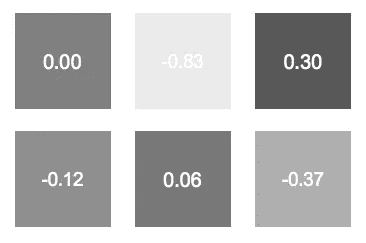

关于像素值的分布，我们知道些什么？嗯，通过检查，我们知道大多数像素值都在 0 左右，只有少数值接近极值(-1 和 1)。因此，我们可以假设分布是高斯分布，平均值为 0。

> 注意:对于更多的样本，通过计算平均值和标准偏差来导出该数据的高斯分布是很简单的。然而，这不是我们的重点，因为计算复杂主题的数据分布是很困难的，不像这个简单的例子。

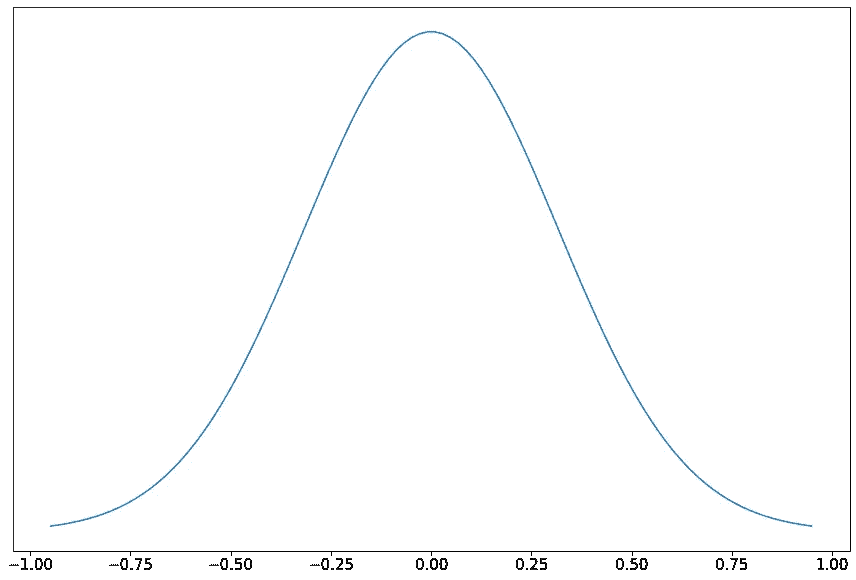

我们像素的基本分布是平均值为 0 的高斯分布

这种数据分布是有用的，因为它允许我们生成更多的灰色图像，就像上面的 6。为了生成更多相似的图像，我们可以从分布中随机取样。

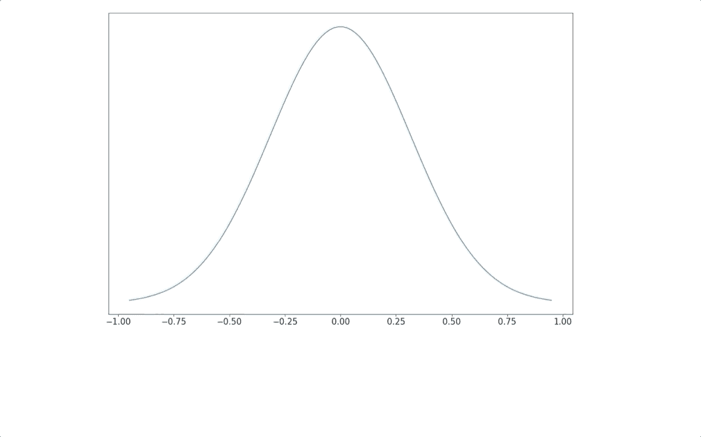

从高斯分布中随机独立抽取 10 个像素。请注意，大多数像素值都接近平均值(0)，只有极少数异常值(-1 和 1)。

虽然计算出灰色像素的基本分布可能是微不足道的，但计算猫、狗、汽车或任何其他复杂对象的分布通常是数学上难以处理的。

那么，我们如何学习复杂对象的底层分布呢？显而易见的答案是使用神经网络。给定足够的数据，我们可以训练神经网络来学习任何复杂的功能，例如数据的基本分布。

# 生成器——分布式学习模型

在 GAN 中，生成器是学习数据底层分布的神经网络。更具体地说，生成器将随机分布(在 GANs 文献中也称为“噪声”)作为输入，并学习将输入映射到期望输出的映射函数，期望输出是数据的实际底层分布。

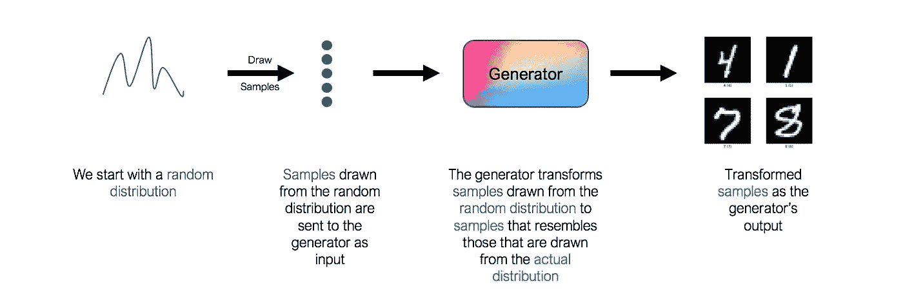

但是，请注意，上面的体系结构中缺少一个关键组件。我们应该用什么损失函数来训练发电机？我们如何知道生成的图像实际上是否类似于实际的手写数字？一如既往，答案是“*使用神经网络*”。第二个网络被称为鉴别器。

# 鉴别器——生成器的对手

鉴别器的作用是判断和评估发生器输出图像的质量。从技术上讲，鉴别器是一个二元分类器。它接受图像作为输入，并输出图像是真实的(即实际的训练图像)还是虚假的(即来自生成器)的概率。

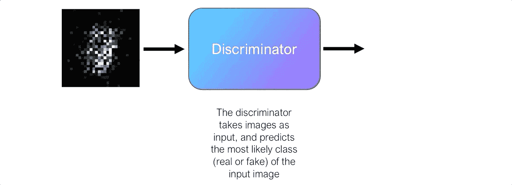

最初，生成器很难产生看起来真实的图像，鉴别器可以轻松区分真假图像，而不会犯太多错误。由于鉴别器是二进制分类器，我们可以使用二进制交叉熵(BCE)损失来量化鉴别器的性能。

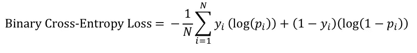

鉴频器的 BCE 损耗是发生器的一个重要信号。回想一下，生成器本身并不知道生成的图像是否与真实图像相似。然而，发生器可以使用鉴别器的 BCE 损失作为信号来获得对其生成的图像的反馈。

它是这样工作的。我们将生成器输出的图像发送到鉴别器，它预测图像是真实的概率。最初，当生成器很差时，鉴别器可以很容易地将图像分类为假的，从而导致 BCE 损失很低。然而，生成器最终会改进，鉴别器开始犯更多的错误，将假图像误分类为真实图像，这导致了更高的 BCE 丢失。因此，鉴频器的 BCE 损耗表示发生器输出的图像质量，并且发生器寻求最大化该损耗。

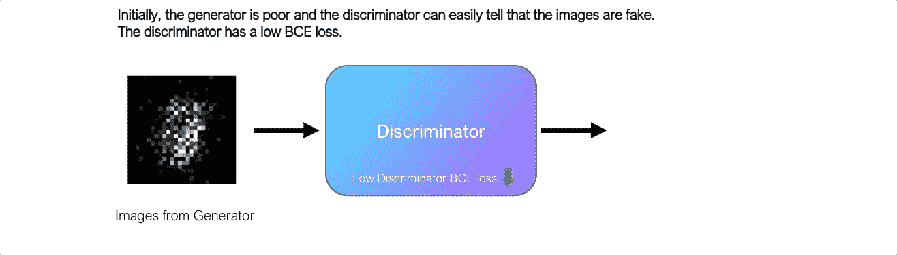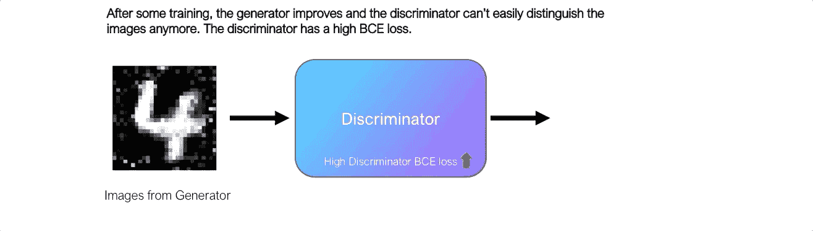

鉴别器的 BCE 损失是发生器输出图像质量的指标

从上面的动画中我们可以看到，鉴频器的 BCE 损耗与发生器产生的图像质量相关。

> 发生器使用鉴频器的损耗作为其生成图像质量的指标。生成器的目标是调整其权重，使得来自鉴别器的 BCE 损失最大化，有效地“愚弄”鉴别器。

## 训练鉴别器

但是鉴别器呢？到目前为止，我们从一开始就假设我们有一个完美工作的鉴别器。然而，这个假设是不正确的，鉴别器也需要训练。

由于鉴别器是一个二元分类器，它的训练过程很简单。我们将向鉴别器提供一批标记的真实和虚假图像，并且我们将使用 BCE 损失来调整鉴别器的权重。我们训练鉴别器来识别真假图像，防止鉴别器被生成器“愚弄”。

# GANs——两个网络的故事

现在让我们把所有的东西放在一起，看看 GANs 是如何工作的。

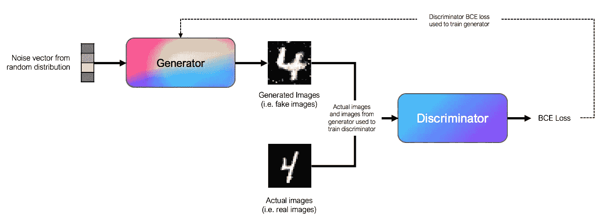

基本 GAN 的体系结构

到目前为止，您已经知道 GANs 由两个相互连接的网络组成，即生成器和鉴别器。在传统的 GANs 中，发生器和鉴别器是简单的前馈神经网络。

> 甘斯的独特之处在于，生成器和鉴别器轮流接受训练，彼此对立。

为了训练生成器，我们使用从随机分布中采样的噪声向量作为输入。在实践中，我们使用从高斯分布中抽取的长度为 100 的向量作为噪声向量。输入通过前馈神经网络中一系列完全连接的层。生成器的输出是一个图像，在我们的 MNIST 例子中，是一个`28x28`数组。发生器将其输出传递给鉴频器，并使用鉴频器的 BCE 损耗来调整其权重，目的是最大化鉴频器的损耗。

为了训练鉴别器，我们使用来自生成器的标记图像以及实际图像作为输入。鉴别器学习将图像分类为真或假，并且使用 BCE 损失函数来训练。

在实践中，我们依次训练生成器和鉴别器。这种训练方案类似于两个玩家的 minimax 对抗游戏，因为生成器的目标是**最大化**鉴别器的损失，而鉴别器的目标是**最小化**它自己的损失。

# 创造我们自己的 GAN

现在我们已经理解了 GAN 背后的理论，让我们通过使用 PyTorch 从头开始创建我们自己的 GAN 来将其付诸实践！

首先，让我们引入 MNIST 数据集。`torchvision`库让我们可以轻松获得 MNIST 数据集。在将`28x28` MNIST 图像展平为`784`张量之前，我们将对图像进行一些标准归一化。这种扁平化是必需的，因为网络中的层是完全连接的层。

接下来，让我们编写生成器类的代码。从我们前面看到的，生成器只是一个前馈神经网络，它接受一个`100`长度张量并输出一个`784`张量。在生成器中，密集层的大小通常会在每层之后翻倍(256、512、1024)。

那很容易，不是吗？现在，让我们为 discriminator 类编写代码。鉴别器也是一个前馈神经网络，它接受一个`784`长度张量，并输出一个`1`大小的张量，表示输入属于类别 1(真实图像)的概率。与生成器不同，我们在每个层(1024、512、256)之后将密集层的大小减半。

现在，我们将创建一个包含生成器和鉴别器类的 GAN 类。根据我们之前讨论的训练方案，这个 GAN 类将包含依次训练生成器和鉴别器的代码。为了简化我们的代码并减少样板代码，我们将使用 [PyTorch Lightning](https://www.pytorchlightning.ai/) 来实现这一点。

上面的代码是注释过的，根据我们到目前为止所讨论的内容，它是非常简单明了的。请注意，使用 PyTorch Lightning 将我们的代码模块化是如何让它看起来如此整洁和易读的！

我们现在可以训练我们的 GAN 了。我们将使用 GPU 训练它 100 个纪元。

# 可视化生成的图像

现在剩下的就是可视化生成的图像。在上面我们的 GAN 类的`training_epoch_end()`函数中，我们在每个训练时期之后将生成器输出的图像保存到一个列表中。

我们可以把这些图像绘制在网格上，使之形象化。下面的代码随机选择了在第 100 个训练时期后生成的 10 幅图像，并将它们绘制在一个网格上。

这是输出结果:

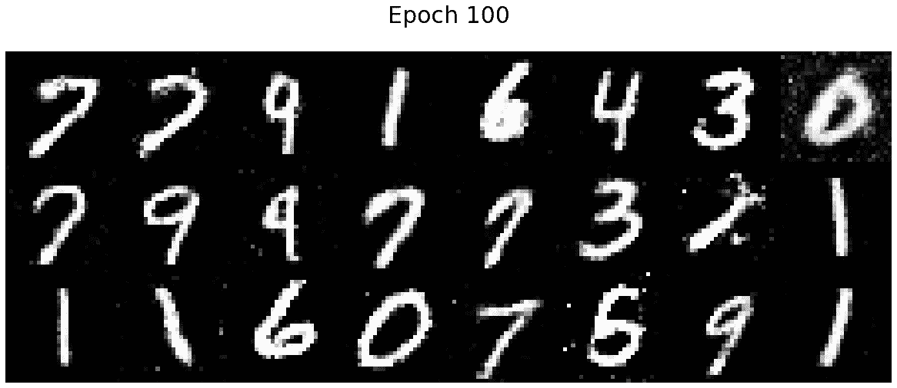

那挺好的！输出类似于真正的手写数字。我们的发电机肯定学会了如何骗过鉴别器。

最后，正如承诺的那样，我们将创建帖子顶部显示的动画。使用`matplotlib`中的`FuncAnimation`函数，我们将一帧一帧地制作图上图像的动画。

# 下一步是什么？

恭喜你。您已经完成了本教程的学习。我希望你喜欢读这篇文章，就像我喜欢写这篇文章一样。幸运的是，这不是我们旅程的终点。在 Goodfellow 推出最初的 GAN 后不久，科学界在这一领域投入了巨大的努力，这导致了基于 GAN 的 AI 模型的激增。

我正在开始一系列这样的教程，在这些教程中，我将举例说明、解释和编码 GAN 的不同变体，包括一些重要的变体，如**深度卷积 GAN (DCGAN)** 和**条件 GAN (CGAN)** 。一定要关注我(如果你还没有！)以便在新教程发布时得到通知。

# 其他资源

这里的代码也可以在我的 Github 库中找到。我将不断更新这个库，在将来包含 GANs 的其他变体。

 [## jamesloyys/py torch-Lightning-GAN

### 使用 py torch Lightning github.com 实现各种 GAN 架构](https://github.com/jamesloyys/PyTorch-Lightning-GAN)