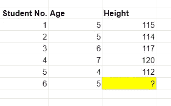
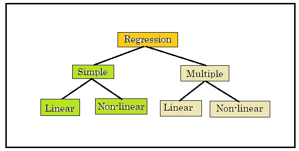
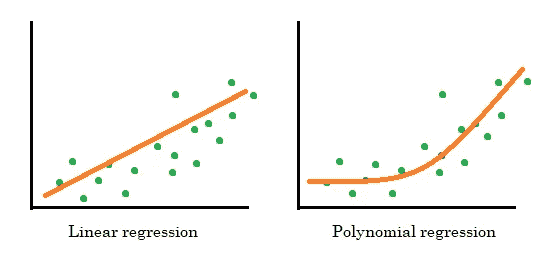
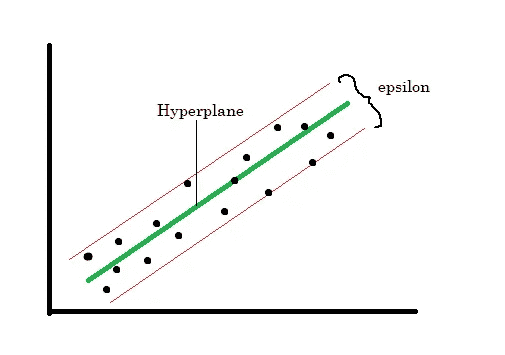

# 回归的基础:什么，为什么和如何

> 原文：<https://towardsdatascience.com/fundamentals-of-regression-what-why-and-how-37ae02489e19?source=collection_archive---------30----------------------->

## 回归技术的变体和真实世界用例

Katie Rodriguez 在 [Unsplash](https://unsplash.com?utm_source=medium&utm_medium=referral) 上的照片

凯文，如果你知道一个男孩的年龄，你能预测他的身高吗？

可以；如果你知道什么是回归以及它是如何工作的。

假设您有一个游泳班 5 名学生的记录，他们的年龄和身高如下。

然后一个新学生凯文(6 号学生)加入进来，他 5 岁。但他的身高未知。没问题！由于回归分析，可以根据班上其他学生的年龄-身高关系来估计他的未知身高。

回归只不过是两个变量之间的统计关系——在这种情况下是年龄和身高——这样，如果你知道另一个，你就可以预测其中一个。

在本文中，我将给出回归背后的高级统计直觉，并讨论它如何工作以及为什么工作。最后，我概述了一些真实世界的用例。

# 什么是回归？

让我们用一个正规的、教科书式的回归定义。

> 回归分析是一种调查变量之间关系的统计工具。通常，调查者试图确定一个变量对另一个变量的因果影响——例如，价格上涨对需求的影响，或者货币供应量的变化对通货膨胀率的影响。”[资料来源:塞克斯(1993 年)](https://chicagounbound.uchicago.edu/cgi/viewcontent.cgi?article=1050&context=law_and_economics)。

里面装了不少东西。如果我们稍微打开包装，我们可以提取一些东西:

a)回归是一套工具/技术

b)回归确定两个或多个变量之间是否存在关系

c)回归测量关系的大小/强度

# 回归中的一些变化

我上面举的例子——年龄和身高——是两个变量之间的关系。身高是因变量，年龄是预测变量或自变量。从数学角度来说:

*身高= f(年龄)*

在统计学的行话中，它被称为“简单回归”，因为它只有一个预测因子(年龄)。但是如果需要几个预测器来预测一个因变量呢？我们来考虑一下房价，想想影响价格的因素有哪些？

回归模型的概念公式

房子的价格取决于几个因素——卧室和浴室的数量，建筑面积是其中的一部分(当然还有位置！).由于价格受到这些因素的影响，你需要所有这些因素作为预测因素。这种带有多个预测因子的回归称为“多元回归”。数学表示如下:

***房价= f(#床位数、#卫生间数、建筑面积)***

我们也可以把它写成回归方程的形式:

***房价= a+ b1 *(床位数)+ b2 *(浴池数)+ b3 *(建筑面积)***

回归的目的是通过某种统计程序找出 *a，b1，b2* 和 *b3* 的参数值，这样只需知道模型中的 3 个变量就可以预测未知房屋的价格。

刚刚讨论的简单和多重回归技术被称为“线性回归”——因为你用一条线性线来拟合数据。接下来，我将在下一节讨论一些非线性回归技术。

不同种类的回归

# 回归:统计与机器学习

取决于你是从事统计学还是机器学习，回归对你来说可能意味着稍微不同的东西。

很大一部分学统计学和计量经济学的学生倾向于认为回归是关于找出影响因变量的因素及其解释力的程度。这大概就是为什么在很多经典教材里，相关和回归是并行教授的。相关性告诉你一段关系的方向和强度，而回归则量化了效果。

然而，在机器学习中，一切都与应用有关。回归是许多进行预测的算法之一。

机器学习问题大致分为(1)分类和(2)回归问题。分类预测离散的类别(例如，狗对猫)，回归预测数量(例如，在给定一些因素的情况下预测销售收入)。

# 机器学习中的回归算法

除了预测结果的线性回归技术之外，机器学习领域还使用了广泛的算法。以下是一些经常被引用的方法，并对每种方法进行了简要描述:

***1)逻辑回归*** 是用来预测一个二元结果；例如对图片中的动物是狗还是猫等进行分类。

***2)多项式回归*** 用于两个变量之间的关系不是线性的时候。换句话说，如果线性回归拟合数据不足(下图左)，则拟合非线性线(右图)。

线性和多项式回归模型中的拟合线

***3)岭回归*** 是一种降低模型复杂度的方法。如果有太多的预测因子，尤其是相关的预测因子，一些预测因子会被惩罚以减少它们的影响，而不是完全消除它们。

***4)拉索*** *，*的简称最小绝对收缩和选择算子，在概念上类似于岭回归，但系数可以被罚以将它们设置为接近于零。

***5)支持向量回归:*** 支持向量机是分类问题的一种流行算法，但在回归问题中使用了类似的原理。虽然正常回归使误差最小化，但是 SVR 拟合模型使得误差在阈值内。

支持向量回归

***6)面板数据回归:*** 面板数据回归是一种非常专业化的回归技术，用于时间序列数据的建模。这是一种预测时间相关观测值的强大技术(无耻之徒:请看下面我的一篇旧文章)。

 [## 面板数据回归:一种强有力的时间序列建模技术

### 在数据科学和机器学习问题中应用计量经济学

towardsdatascience.com](/panel-data-regression-a-powerful-time-series-modeling-technique-7509ce043fa8) 

# 一些使用案例

现在是讨论的最后也是最重要的部分——回归的用例。作为一名数据科学家，你懂多少算法，能建立多精密的模型都不重要，真正的价值在于现实世界的应用。这里是我们到目前为止讨论过的各种技术的一些用例。

*   **确定二手车的价格**:假设你是一名汽车经销商，你要给一辆刚刚入库的汽车贴上价格标签。传统上，价格是根据经销商的经验和市场趋势确定的。但数据科学改变了一切，你可以根据车型、品牌、年份、里程、颜色、车门数量等特征来设定汽车价格…..尽可能多的功能。
*   **房屋定价**:概念差不多。如果你曾经在房地产市场，你会注意到房价是如何起作用的——基于最重要的特征，如建造年份、建筑面积、位置、学区等。你可以进行回归拟合，从而轻松估算即将上市的房子的价格。
*   影响结果的因素:不是为了预测，而是在一些统计应用中，回归技术被用来找出影响特定结果的因素。例如，测量气候变化对 GDP 的影响。有一门完全不同的学科——计量经济学——专门研究这类问题。

 [## 数据科学家的计量经济学 101

### 数据科学家如何利用经济学家的工具箱

towardsdatascience.com](/econometrics-101-for-data-scientists-584f4f879c4f) 

*   **确定保险费**:你有没有想过保险费是怎么定的？当你注册汽车保险时，你会被问及一系列关于汽车和司机的问题——汽车的品牌和型号、你的年龄、驾驶记录等等。所有的信息都用在回归模型中，以确定你将支付多少保费。

## 一锤定音

本文的目的是通过例子讨论回归背后的一些基本的统计直觉。我们还讨论了机器学习中使用的不同种类的线性和非线性回归技术。在最后一部分，我介绍了回归的一些实际用例。

当然，关于回归技术及其使用标准编程库的实现，还有很多可以说的。不过那个又搁置了一天，敬请关注！

【*注:所有数字均由作者制作*