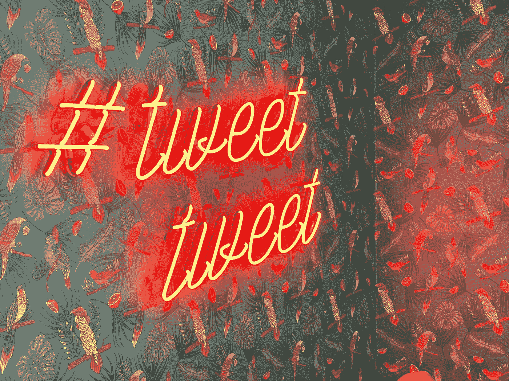
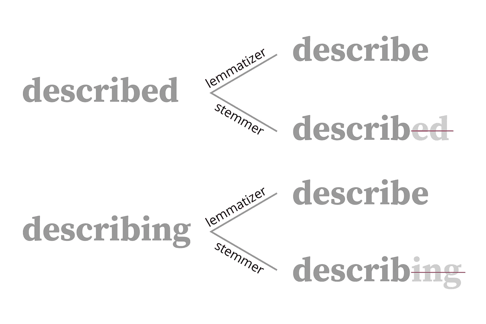

# 监督情感分析的基础

> 原文：<https://towardsdatascience.com/fundamentals-of-supervised-sentiment-analysis-1975b5b54108?source=collection_archive---------26----------------------->

## NLP 预处理、BoW、TF-IDF、朴素贝叶斯、SVM、Spacy、Shapely、LSTM 等等



克里斯·j·戴维斯在 [Unsplash](https://unsplash.com?utm_source=medium&utm_medium=referral) 拍摄的照片

在这篇文章中，我将解释一些基本的机器学习方法来对推特情感进行分类，以及如何在 Python 中运行它们。

# 情感分析

情感分析用于识别数据的影响或情绪(积极的、消极的或中性的)。对于一个企业来说，这是一个简单的方法来确定客户对产品或服务的反应，并迅速发现任何可能需要立即关注的情绪变化。解决这个问题的最基本的方法是使用监督学习。我们可以让真正的人来确定和标记我们数据的情感，并像对待文本分类问题一样对待它。这正是我将在这篇文章中讨论的，并且将在后面的文章中重新讨论这个话题，讨论无监督的方法。

# 数据

1.  你可能会在 [data.world](https://data.world/crowdflower/brands-and-product-emotions) 上找到一些人为标注的推文数据。数据包含超过 8000 条被标记为积极、消极、中立或未知(“我不能说”)的推文。
2.  斯坦福大学的一个团队提供了训练数据。此数据集的标签被自动标注。

# 自然语言处理预处理

在清理数据(删除带有缺失文本的观察结果、删除“未知”类、删除 RTs)并将我们的数据分成训练集、测试集和验证集之后，我们需要预处理文本，以便它们可以在我们的分析中正确量化。我将一个一个地检查它们。

## 1.仅保留 ASCII 字符

不同的编码会导致数据中出现一些奇怪的字符。因此，首先我们将确保我们只保留 ASCII 字符。下面的代码将过滤掉所有非 ASCII 字符。

```
**def** ascii_only(str_):
    **return** str_.encode("ascii", "ignore").decode()
```

## 2.全部小写

这个很简单。

```
**def** make_lower(str_):
    **return** str_.lower()
```

## 3.删除 HTML 符号、提及和链接

由于编码错误，一些推文包含 HTML 符号，如`&nbsp;`。在我们删除标点符号之前，我们将首先删除这些单词，这样我们就不会在删除标点符号后留下胡言乱语。我们要删除的其他字母单词是用户名(例如@stereopickle)和超链接(在这个数据集中写成{link})。我们将使用 regex 来完成这项工作。

```
**import** **re 
def** remove_nonwords(str_):
    **return** re.sub("[^A-Za-z0-9 ]\w+[^A-Za-z0-9]*", ' ', str_)
```

这个表达式的意思是用空格替换所有不以字母数字字符开头的单词。这些单词可能以非字母数字字符结尾，也可能不以非字母数字字符结尾。

## 4.删除品牌词

这是特定于该数据集的步骤。因为我们的数据集包含关于产品的推文，所以有很多对实际品牌和产品名称的引用。我们不希望不同品牌或产品的总体情绪分布影响我们的模型，因此我们将删除其中一些。

```
**def** remove_brandwords(str_):
    p = '''#?(iphone|ipad|sxsw|hcsm|google|apple|cisco|austin|
    atari|intel|mac|pc|blackberry|android|linux|ubuntu)[a-z0-9]*'''
    **return** re.sub(p, ' ', str_)
```

## 5.删除标点符号

又一次简单的清洗。请注意，为了简单起见，我在这里删除了所有标点符号，但在现实中，许多推文可能会使用标点符号来表达情绪，例如:)和:(。

```
**import** **string**
punctuations = string.punctuation
punctuations = punctuations + '�' + string.digits

**def** remove_punctuations(str_, punctuations):
    table_ = str.maketrans('', '', punctuations)
    **return** str_.translate(table_)
```

如果你对上面的方法感到好奇，请看看我的另一篇关于如何有效去除标点符号的帖子。

[](/how-to-efficiently-remove-punctuations-from-a-string-899ad4a059fb) [## 如何有效地从字符串中删除标点符号

### Python 中清理字符串的 8 种不同方法

towardsdatascience.com](/how-to-efficiently-remove-punctuations-from-a-string-899ad4a059fb) 

## 6.词汇化&删除停用词

最后，我们将使用 NLTK 对我们的词汇表进行词汇化并删除停用词。总之，lemmatizer 将把词汇表还原成它的基本形式 lemma。



```
**from** **nltk.stem** **import** WordNetLemmatizer
**from nltk.corpus import** stopwordssw = stopwords.words('english')**def** lemmatize(str_, sw):
    wnl = WordNetLemmatizer()
    **return** ' '.join([wnl.lemmatize(w) **for** w **in** x.split() **if** w **not** **in** sw])
```

在这里阅读更多关于词汇化或词干化的内容。

[](https://medium.com/swlh/understanding-art-through-art-description-data-part-1-2682e899dfe5) [## 通过艺术描述数据理解艺术

### 使用 Python 预处理艺术描述数据

medium.com](https://medium.com/swlh/understanding-art-through-art-description-data-part-1-2682e899dfe5) 

## 7.特征选择

在将上述函数应用到我们的文本数据之后，我们应该有一组非常干净的单词可以使用。但我喜欢在这里添加一个特征选择步骤，因为当每个词汇或二元或三元语法被标记化时，NLP 问题往往会以太多的特征结束。

当然，有许多方法可以清除特征，但是我喜欢使用 Spacy 来组合相似的单词。基本思想是遍历只出现几次的单词，并找到一个具有高相似性(在向量空间中更接近)的现有单词。

这个自定义函数返回一个字典，将出现频率低的单词作为关键字，将它们的替换词作为值。这一步通常会修复一些拼写错误，并纠正术语化可能遗漏的地方。我们可以使用这个替换词典将单词转换为更频繁出现的对应词，并删除出现次数少于指定次数的单词。

# 模型评估

## 估价

通常我们的数据会有很高的阶层不平衡问题，因为在大多数情况下，人们更可能写中立或积极的推文，而不是消极的推文。但对于大多数商业问题，我们的模型必须检测到这些负面推文。因此，我们将通过观察宏观平均 f1 分数以及精确召回曲线来关注这些问题。下面的函数将绘制 ROC 曲线和精度-召回曲线，并打印关键评估指标。

## 基线模型

我们可以使用 scikit-learn 的`DummyClassifier`来首先查看我们的基线度量是什么，如果我们只是根据每个类出现的频率来分类的话。

```
**from sklearn.dummy import** DummyClassifier
dummy_classifier = **DummyClassifier**()
dummy_classifier.**fit**(tweets_train, labels_train)y_pred_p = dummy_classifier.predict_proba(tweets_validation)    
y_pred = dummy_classifier.predict(tweets_validation)
```

## 词袋模型(计数向量)

量化文本数据的一个最简单的方法是计算每个单词的频率。scikit-learn 的`CountVectorizer`可以轻松完成这项工作。

```
**from** **sklearn.feature_extraction.text** **import** CountVectorizer

countvec = **CountVectorizer**(ngram_range = (1, 2), min_df = 2)
count_vectors = countvec.**fit_transform**(tweets_train)
```

这将返回至少出现两次的单个词汇和二元模型的计数向量。然后我们可以使用这些计数向量来训练不同的分类算法。

## TF-IDF 载体

计数向量的一个问题是，它只关注单个单词的频率，而不关心单词出现的上下文。没有办法评估一条推文中的特定单词有多重要。这就是术语频率-逆文档频率(TF-IDF)得分的由来。TF-IDF 得分对在一条推文中出现频率更高的词的权重大于在所有推文中出现频率更高的词。

```
**from** **sklearn.feature_extraction.text** **import** TfidfVectorizer

tfvec = **TfidfVectorizer**(ngram_range = (1, 2), min_df = 2)
tf_vectors = tfvec.fit_transform(tweets_train)
```

现在我们有了两个矢量化的文本，我们可以为每个矢量测试不同的分类器。

## 朴素贝叶斯

朴素贝叶斯是文本分类中比较流行的选择之一。这是对每个类和预测器的简单应用**贝叶斯定理**，并且它假设每个单独的特征(在我们的例子中是单词)是相互独立的。

比方说，我们有一条推特，上面写着… *“我爱我的新手机。真的很快，很可靠，设计的很好！”。*这条推文明显带有积极的情绪。在这种情况下，朴素贝叶斯模型假设像“爱”、“新”、“真的”、“快”、“可靠”这样的单个单词都独立地贡献给它的正类。换句话说，当使用“可靠”一词时，推文是正面的可能性不会因其他词而改变。这并不意味着这些词在外观上是独立的。一些单词可能经常一起出现，但这并不意味着每个单词对其类别的贡献是独立的。

当上述假设成立时，朴素贝叶斯算法使用简单且可靠。因为在我们的模型上测试需要矢量化，所以我们可以将管道构建到我们的模型中。

```
**from** **sklearn.naive_bayes** **import** MultinomialNB
**from** **sklearn.pipeline** **import** Pipelinemn_nb = **MultinomialNB**()# change countvec to tfvec for tf-idf 
model = **Pipeline**([('vectorize', countvec), ('classify', mn_nb)])# fitting training count vectors (change to tf_vectors for tf-idf)
**model**['classify'].**fit**(count_vectors, labels_train)y_pred_p = **model**.predict_proba(tweets_validation)    
y_pred = **model**.predict(tweets_validation)
**evaluating**(labels_validation, y_pred, y_pred_p)
```

由于朴素贝叶斯假设要素之间相互独立，因此它高估了每个要素对标注贡献的置信度，从而使其成为一个糟糕的估计器。所以对预测的概率要有所保留。

## **支持向量机(SVM)**

文本分类算法的另一个流行选择是支持向量机(SVM)。简而言之，SVM 找到了一个超平面，这个超平面以最大的间距来划分这些类。在文本分类中 SVM 是首选的主要原因是我们倾向于以大量的特征结束。如果我们在这样一个拥有我们所有特征的高维空间中工作，就会导致一个被称为**维度诅咒**的问题。基本上，我们的空间太大了，我们的观察开始失去意义。但是 SVM 在处理大量特性时更加健壮，因为它使用了**内核技巧**。SVM 实际上并不在高维度中工作，它只是看着观察之间的成对距离，就好像它们在高维度中一样。做这项工作确实需要很长时间，但它很健壮。

```
**from** **sklearn.svm** **import** SVCsvm_classifier = SVC(class_weight = 'balanced', probability= **True**)
# don't forget to adjust the hyperparameters! # change countvec to tfvec for tf-idf 
svm_model = **Pipeline**([('vectorize', countvec), ('classify', svm_classifier)])# fitting training count vectors (change to tf_vectors for tf-idf)
**svm_model**['classify'].**fit**(count_vectors, labels_train)y_pred_p = **svm_model**.predict_proba(tweets_validation)    
y_pred = **svm_model**.predict(tweets_validation)
**evaluating**(labels_validation, y_pred, y_pred_p)
```

## SHAP 评估

当 SVM 使用内核技巧时，就可解释性而言，事情就进入了一个灰色地带。但是我们可以使用 Shapley 值来解释单个特征是如何对分类起作用的。我们将使用 [SHAP](https://github.com/slundberg/shap) 的友好界面来可视化 Shapley 值。关于这方面的详细教程，我推荐阅读关于 SHAP 的文档。

```
**import** **shap** shap.initjs() 
sample = shap.**kmeans**(count_vectors, 10)
e = shap.**KernelExplainer**(svm_model.predict_proba, sample, link = 'logit')
shap_vals = e.**shap_values**(X_val_tf, nsamples = 100)
shap.**summary_plot**(shap_vals, 
                  feature_names = countvec.get_feature_names(),
                  class_names = svm_model.classes_)
```


唷，太多了。让我们休息一下。 [freestocks](https://unsplash.com/@freestocks?utm_source=medium&utm_medium=referral) 在 [Unsplash](https://unsplash.com?utm_source=medium&utm_medium=referral) 上拍照

## LSTM

让我们再深入一点(字面上)。到目前为止，我们用两种不同的频率度量来量化我们的文本数据。但是每个单词的出现频率只讲述了故事的一小部分。理解语言及其意义需要理解句法，或者至少是单词的顺序。因此，我们将研究一种关心词汇序列的深度学习架构:**长短期记忆(LSTM)** 架构。

对于 LSTM，我们需要按顺序输入文本。以下步骤概述了运行和评估 LSTM 分类器的步骤。我解释了代码中的每一步。

## 单词嵌入(手套)

我们的 LSTM 模型的一个缺点是，它只包含我们训练数据中存在的信息，而词汇具有推文之外的语义。了解每个词汇在语义相似性方面的相互关系可能有助于我们的模型。我们可以基于预先训练的单词嵌入算法对我们的词汇应用权重。

为此，我们将使用由斯坦福大学的一个团队获得的矢量表示法 [GloVe](https://nlp.stanford.edu/projects/glove/) 。我用他们在 20 亿条推特上训练的 200 维词汇向量。你需要从他们的网站上下载载体。

然后，您可以将获得的向量矩阵作为嵌入权重添加到我们的 LSTM 架构的嵌入层中。

```
# adding the bolded part
model.add(Embedding(num_vocab, 200, **weights = [vector_matrix]**, 
                    input_length = max_len))
```

通过使用单词嵌入和 LSTM，我的模型显示整体准确性提高了 20%，宏观平均 F1 分数提高了 16%。

我们回顾了使用 tweets 数据构建情感分析模型的基础。我将以一些需要思考和扩展的问题来结束这篇文章。

1.  如果我们没有标签，我们如何解决同样的问题？(无监督学习)
2.  在保持其可解释性的同时，还有哪些方法可以降低维度？

# 快乐学习！


照片由 [Jonathan Daniels](https://unsplash.com/@dear_jondog?utm_source=medium&utm_medium=referral) 在 [Unsplash](https://unsplash.com?utm_source=medium&utm_medium=referral) 上拍摄