# 高维数据聚类的基础(3D 点云)

> 原文：<https://towardsdatascience.com/fundamentals-to-clustering-high-dimensional-data-3d-point-clouds-3196ee56f5da?source=collection_archive---------14----------------------->

## 3D 地理数据

为什么无监督的分割和聚类是“人工智能的主体”？使用它们时要注意什么？如何评价表演？三维点云数据的解释和说明。

聚类算法允许以无人监管的方式将数据划分为子组或聚类。直观上，这些片段将相似的观察结果组合在一起。因此，聚类算法在很大程度上取决于如何定义相似性这一概念，这通常是特定于应用领域的。

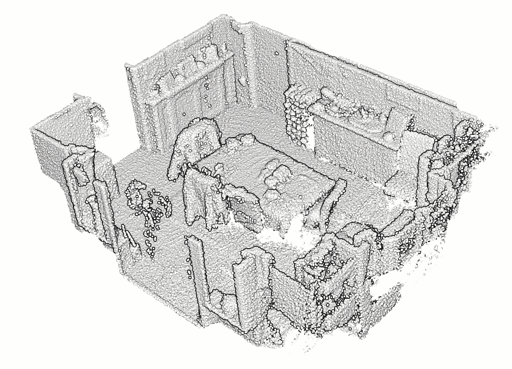

不同的聚类策略应用于这个房间的噪声点云。可以看出，空间邻近性似乎是定义这种相似性以构成片段的选择标准。[弗洛伦特·普克斯博士](https://medium.com/u/8ba7bf4ad784?source=post_page-----3196ee56f5da--------------------------------)

# 什么是集群？

聚类算法通常用于探索性数据分析。它们也构成了人工智能分类管道中的大部分过程，以无监督/自学的方式创建良好标记的数据集。

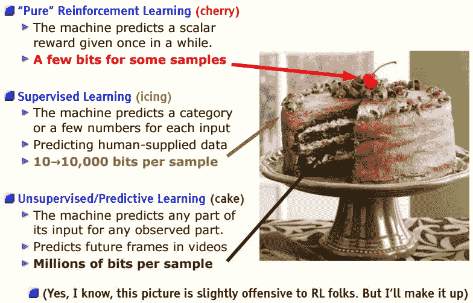

在 NIPS 2016 上展示的原始 LeCun 蛋糕模拟幻灯片，突出显示的区域现已更新。

在 3D 地理数据的范围内，聚类算法(也被定义为无监督分割)允许获得片段汤，该片段汤成为若干过程的主干，例如特征提取、分类或 3D 建模，如下图所示。

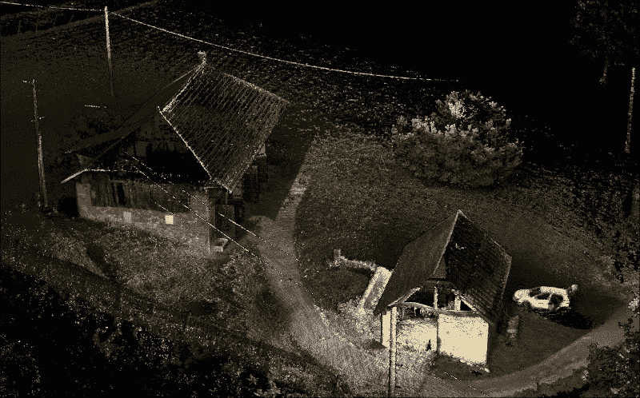

在这里，您可以看到一个自动建模过程，该过程利用分段信息来很好地提取 3D 网格。[弗洛朗·普克斯博士](https://medium.com/u/8ba7bf4ad784?source=post_page-----3196ee56f5da--------------------------------)

除了地理数据应用之外，它们还用于识别:

*   行为相似的客户(市场细分)；
*   对某个工具有类似使用的用户；
*   社交网络中的社区；
*   金融交易中的循环模式。

它们通常是降维算法的补充，降维算法允许在二维或三维中查看不同的属性(称为维度)。如果“视图”表现出足够的去相关性，可以使用聚类算法来形成这些点的子组，即聚类，如下图所示。

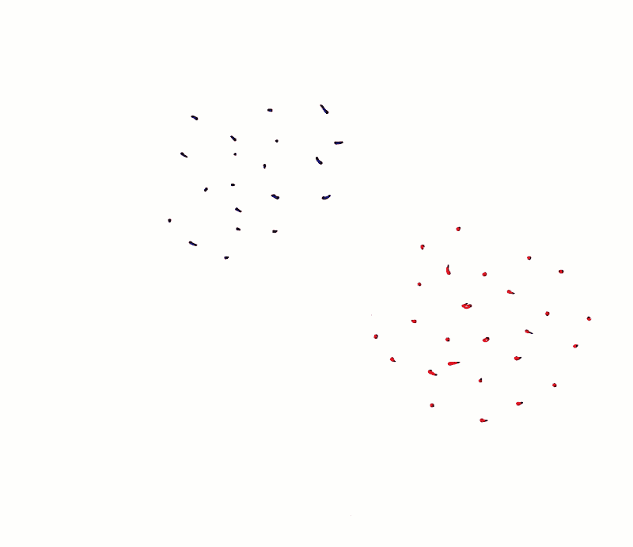

通过创建一条线将数据集分成两个子组来查找两个分类的简单示例。

这样，点之间的关系可以直观地表示出来。或者，不是表示整个数据，而是每个聚类仅显示一个代表点。

一旦识别出聚类，也可以只使用每个聚类的一个代表来查看数据，而丢弃其他的。

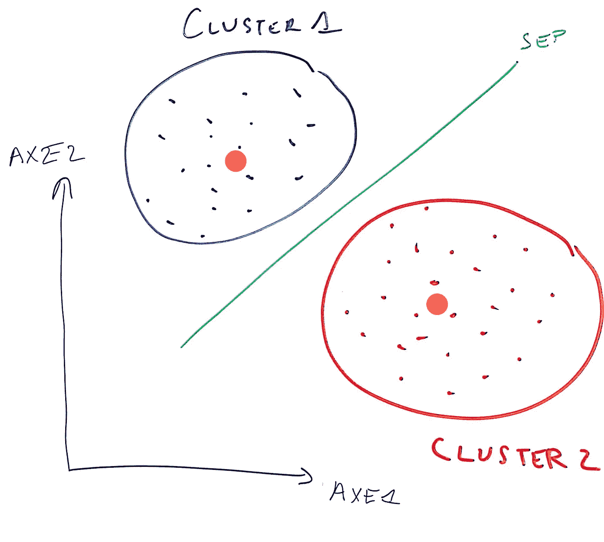

确定两个聚类的质心作为新的基数据。[弗洛伦特·普克斯博士](https://medium.com/u/8ba7bf4ad784?source=post_page-----3196ee56f5da--------------------------------)

# 这为什么有用？

聚类算法在标记数据代价昂贵的常见情况下特别有用。以注释大型点云为例。根据每个点所代表的内容对其进行注释可能是一项漫长而乏味的工作(参见我在这里所做的)😄)这样做的人可能会由于疏忽或疲劳而无意中引入错误。让聚类算法将相似的点分组在一起，然后在给聚类分配标签时只需要人工操作，这样更便宜，甚至可能更有效。

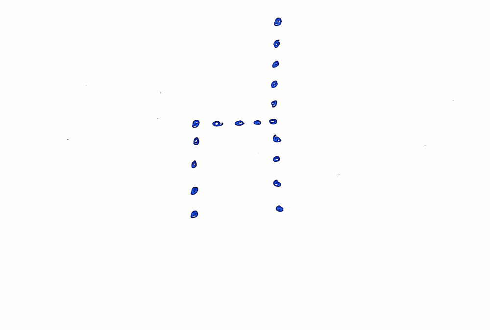

语义分割工作流程中一个优势的简单说明。[弗洛朗·普克斯博士](https://medium.com/u/8ba7bf4ad784?source=post_page-----3196ee56f5da--------------------------------)

因此，聚类算法可以用于将同一聚类中的一个点的属性扩展到同一聚类中的所有点(在前面的例子中，表示的椅子对象。).

在地理数据范围之外，推断数据属性有助于:

*   找到相似的图像，可能代表相同的物体、相同的动物或相同的人；
*   提取可能谈论同一主题的相似文本；
*   在图像中搜索属于同一对象的像素(这被称为分割)。

在上面的例子中，主题(图像、文本、像素)被表示为 2D/3D/nD 点，然后被分组为簇。然后，足以推断，如果一个群集中的一个图像代表一只鸭子，则该群集中的所有图像部分都可能代表鸭子。

我们将定义几个需要优化的标准，以定义一个有趣的数据分区。这些然后被用来派生一些最著名的聚类算法，将在另一篇文章中讨论，否则阅读会有点密集😇。

# 如何知道聚类是否具有代表性？

在无监督算法的情况下，算法的目的不像在有监督算法的情况下那样明显，在有监督算法的情况下，有明确的任务要完成(例如分类或回归)。因此，该模式的成功更加主观。任务更难定义的事实并不妨碍我在下面详述的各种性能测量。

## 距离和相似性

聚类意味着将最接近或最相似的点组合在一起。聚类的概念很大程度上依赖于距离和相似性的概念。

这些概念对于形式化非常有用:

*   (1)两个观测值彼此接近的程度；
*   (2)观测值与群集的接近程度；
*   (3)两个星团之间的距离。

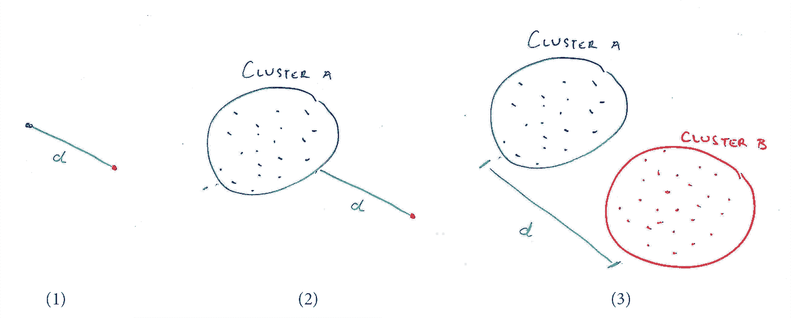

简单说明两个观测值之间的一些距离(1)，一个观测值和一个集群(2)，两个集群(3)。[弗洛伦特·普克斯博士](https://medium.com/u/8ba7bf4ad784?source=post_page-----3196ee56f5da--------------------------------)

最常用的距离示例是欧几里德距离和曼哈顿距离。欧几里得距离是欧几里得空间中两点之间的“普通”直线距离。曼哈顿距离之所以被称为曼哈顿距离，是因为它在两个维度上对应于出租车在曼哈顿街道上行驶的距离，这两个维度要么相互平行，要么相互垂直。

欧几里德距离和曼哈顿距离的简单说明。[弗洛朗·普克斯博士](https://medium.com/u/8ba7bf4ad784?source=post_page-----3196ee56f5da--------------------------------)

因此，距离可以用来定义相似性:两个点离得越远，它们就越不相似，反之亦然。为了注入一点数学知识，我们可以非常简单地将 x 和 y 之间的距离 d 转换为相似性度量 s，例如:s(x，y)=1/1+d(x，y)。

定义相似性的另一种常见方法是使用皮尔逊相关，它测量当基础数据居中时由向量 x 和 y 形成的角度的余弦。

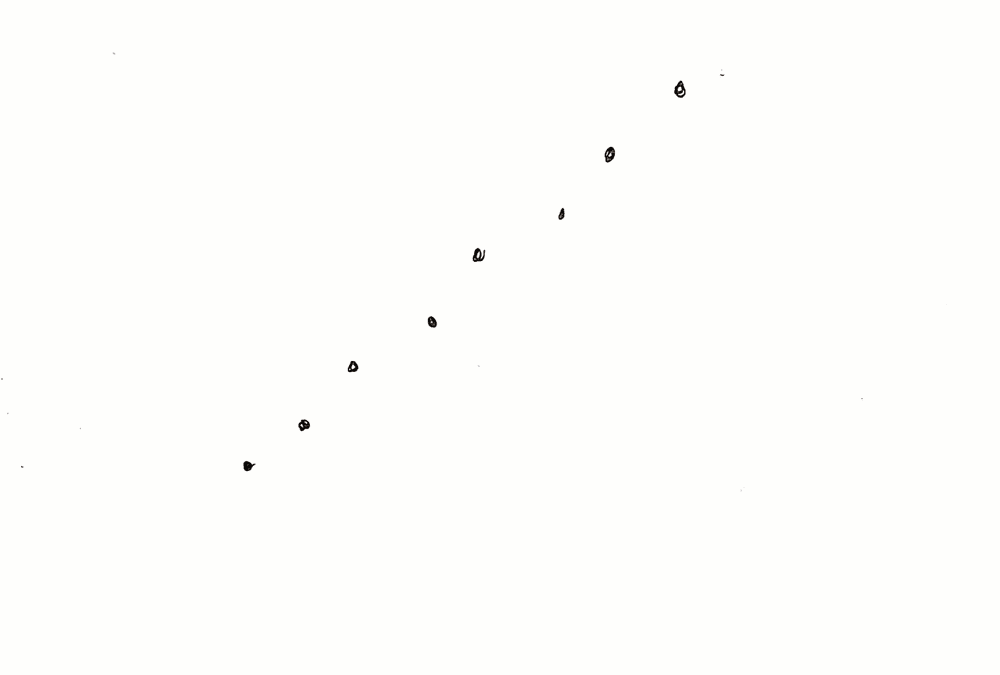

皮尔逊相关系数的简单说明。[弗洛朗·普克斯博士](https://medium.com/u/8ba7bf4ad784?source=post_page-----3196ee56f5da--------------------------------)

但不要太深入，重要的是要注意皮尔逊相关性将考虑分布的形状，而不是它们的振幅，欧几里德距离主要考虑的是振幅。因此，距离度量的选择是重要的。

## 集群形状

簇的形状是一个重要的元素，我们最初描述为:

*   (1)自我收紧:两个接近的点必须属于同一个群集
*   (2)相距较远:相距较远的两个点必定属于不同的簇。

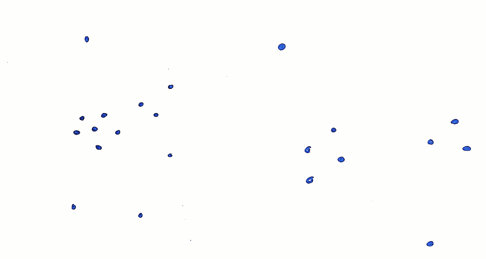

紧密程度可以提示凝聚簇的形成。[弗洛伦特·普克斯博士](https://medium.com/u/8ba7bf4ad784?source=post_page-----3196ee56f5da--------------------------------)

通常，我们寻找自身紧密的星团。让我们用一个例子来解释这些性质，使用欧几里得距离。首先，我们可以很容易地计算一个簇的质心(这个簇的点的重心)。然后，聚类的均匀性可以定义为该聚类中包含的每个点到质心的距离的平均值。以这种方式，紧密的集群将比分散的点的集群具有更低的异质性。然后，为了表征数据集中的所有聚类，而不是一个聚类，我们可以计算每个聚类的同质性的平均值。

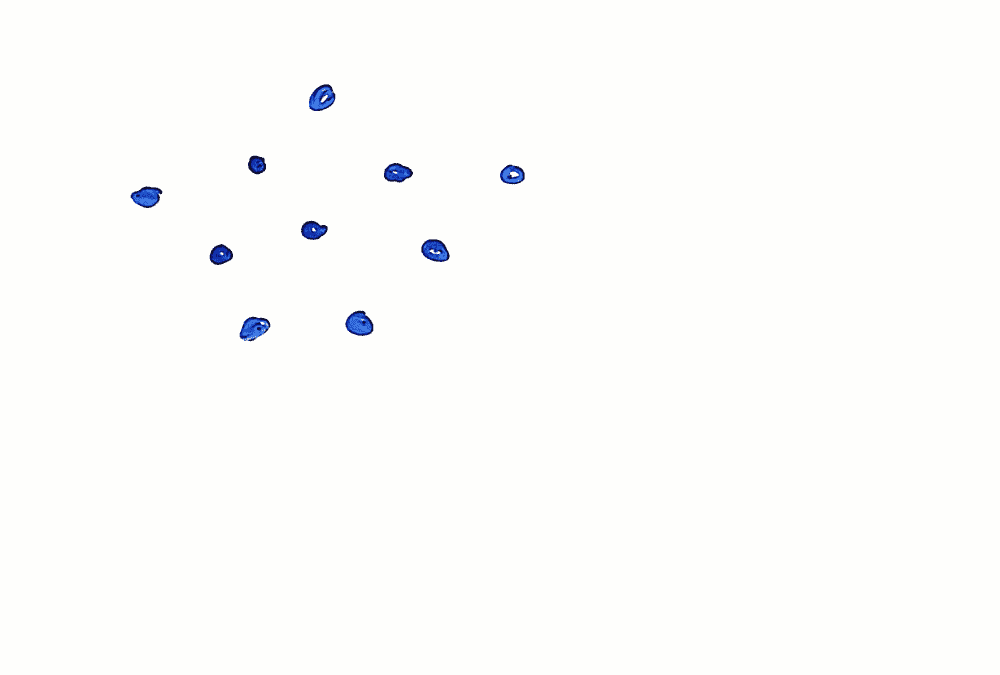

简单说明同质性如何提供直观的感觉来更好地表征集群。[弗洛伦特·普克斯博士](https://medium.com/u/8ba7bf4ad784?source=post_page-----3196ee56f5da--------------------------------)

其次，我们希望集群彼此远离。为了量化这一点，我们通常将两个聚类的间距定义为它们的质心之间的距离。再一次，我们可以计算得到的所有成对簇上这些量的平均值。

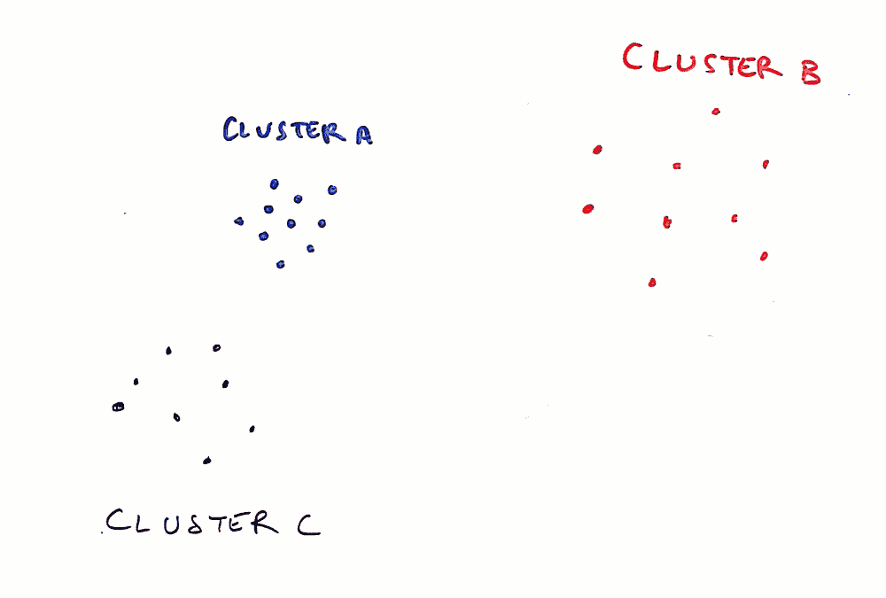

一个简单的例子展示了如何使用分离来获得一个好的聚类。[弗洛朗·普克斯博士](https://medium.com/u/8ba7bf4ad784?source=post_page-----3196ee56f5da--------------------------------)

我们现在有两个优化标准:同质性和分离性。为了方便起见，我们可以将它们归为一个标准，即**戴维斯-波尔丁指数**。该指数的思想是比较类内距离(同质性)——我们希望它低——和类间距离(分离性)——我们希望它高。对于一个给定的集群，这个指数更弱，因为所有的集群都是同类的，并且分离得很好。

另一种量化聚类满足这两个要求(同质性和分离性)的方式是测量所谓的**轮廓系数**。对于给定点 p，轮廓系数 s(p)用于评估该点是否属于“正确的”聚类。为此，我们尝试回答两个问题:

*   p 靠近它所属的簇的点吗？我们可以计算 p 到它所属的簇中所有其他点的平均距离 a(p)。
*   这个点离其他点远吗？如果 p 被分配给另一个簇，我们计算 a(p)可以取的最小值 b(p)。如果 p 已经被正确赋值，那么 a(x) < b(x)。轮廓系数由 s(x)= b(x)-a(x)/max(a(x)，b(x))给出，范围在-1 和 1 之间。它越接近 1，p 对其簇的分配就越令人满意。

💡 ***提示:*** *对一个聚类进行评估，其平均轮廓系数可以计算出来，例如使用* `scikit-learn` *和* `sklearn.metrics.silhouette_score.`命令

## 集群稳定性

另一个重要的标准是聚类的稳定性:如果我用不同的初始化对相同的数据，或者对数据的不同子集，或者对相同的稍微有噪声的数据运行该算法几次，我会得到相同的结果吗？这个标准在选择分类数时特别重要:如果选择的分类数符合数据的自然结构，则分类将比不符合数据的自然结构更稳定。

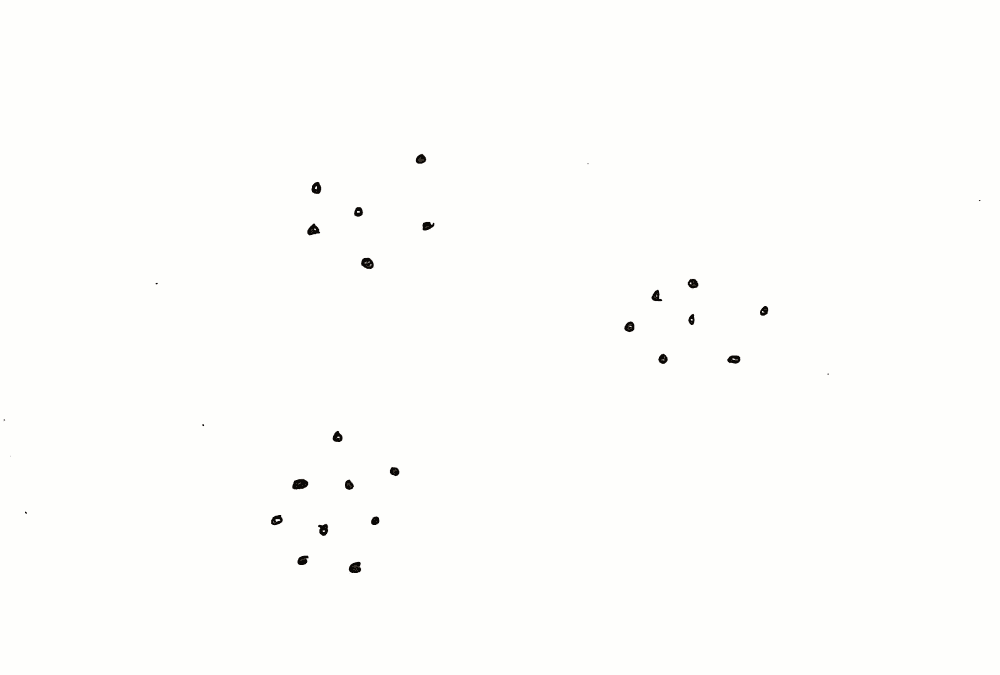

寻找集群的“参数监督”及其影响的一个例子。[弗洛朗·普克斯博士](https://medium.com/u/8ba7bf4ad784?source=post_page-----3196ee56f5da--------------------------------)

在上面的例子中，试图确定 3 个聚类的算法将合理地找到我们看到的 3 个聚类。但是如果要求确定 4 个群，这 4 个群中的分布将更加随机，并且不一定是相同的两倍。这是确定 3 是比 4 更好的聚类数的一种方法。

# 与特定领域知识的兼容性

很多时候，我们还会“用眼睛”评估一个聚类算法，看看建议的聚类是否有意义。这个集群中分组的点都代表同一个对象吗？这两个集群中的点代表不同的对象吗？

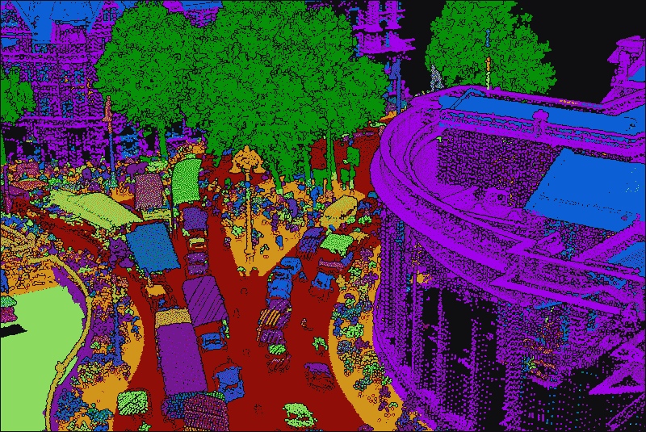

请注意下图中的各个群集。它们有直观意义吗？中央灯柱是否应该用一簇来描述？3 簇？更多？[弗洛朗·普克斯博士](https://medium.com/u/8ba7bf4ad784?source=post_page-----3196ee56f5da--------------------------------)

为了更灵活地做到这一点，我们可以在一个数据集上工作，在这个数据集上我们知道数据的合理分区。然后，我们将这个分区与我们的聚类算法返回的分区进行比较。例如，我们可以处理由平面形状分割的点云。下一步是评估由聚类算法形成的组是否对应于那些预先定义的组。

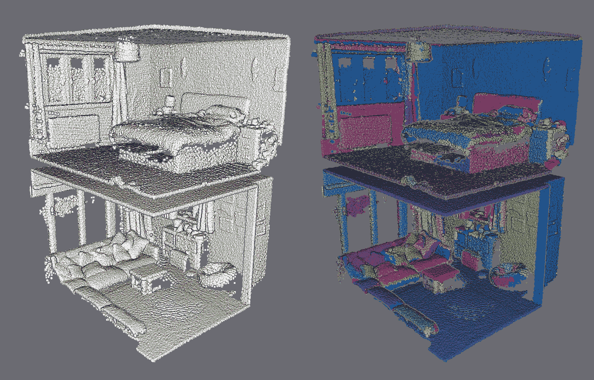

获取点云的一部分，并创建“平面标记”数据集以与聚类结果进行比较的示例。[弗洛朗·普克斯博士](https://medium.com/u/8ba7bf4ad784?source=post_page-----3196ee56f5da--------------------------------)

很简单！就像评价一个多类分类算法。但没那么快:如果我们感兴趣的是相同的对象是否属于同一个集群，那么这个集群是第一个、第二个还是第 k 个集群都无关紧要。因此，必须使用特定的性能指标来评估数据集的两个分区的一致性。

💡 ***提示:*****这些可以在* `sklearn.metrics.`中找到*

*这些措施的一个例子是兰德指数。Rand 指数是在两个分区中以相同方式分组的点对(p1，p2)的比例:或者因为在这两种情况下，P1 和 p2 属于相同的聚类，或者因为在这两种情况下，P1 和 p2 属于不同的聚类。*

*Rand 指数可以通过预测大量的聚类来人为地膨胀:属于不同聚类的点对将是众多的，并且很有可能两个标记不同的点将在两个不同的聚类中。调整后的 Rand 指数(ARI)通过归一化 Rand 指数(RI)来校正这种影响:ARI=RI-E(RI)/max(RI)-E(RI)，其中 E(RI)是 Rand 指数的期望值，即通过随机划分数据获得的指数。对于随机聚类，该调整后的索引接近于 0，并且仅当聚类恰好对应于初始分区时，该索引才等于 1。*

*💡 ***提示:*** *在* `scikit-learn` *中可以算出感谢* `sklearn.metrics.adjusted_rand_score`*

# *结论*

*无监督和自学习方法对于解决自动化挑战非常重要。特别是，在深度学习时代，手动创建标记数据集是乏味的，缓解这一过程的方法非常受欢迎。聚类算法为此提供了至关重要的解决方案，用于将数据集划分为相似观察值的子组:*

*   *它们可以用来更好地理解数据；*
*   *它们可用于促进数据可视化；*
*   *它们可用于推断数据属性。*

*然后，为了评估聚类算法，我们可以考虑:*

*   *它产生的簇的形状(它们是否密集、分离良好)。这里经常用到剪影系数；*
*   *算法的稳定性；*
*   *结果与特定领域知识的兼容性，可以使用丰富的度量来评估。*

# *更进一步*

*在本文中，我介绍了集群的基本原理，特别是在 3D 点云上。下一步是非常自然的，包括直接进入代码，并查看可以用来开始的最突出的方法。这将在下一篇文章和使用 Python 中讨论。*

*如果您想扩展阅读范围并获得有关 Python 和使用 3D 数据(点云、网格)的基础知识，我建议您深入了解 3D 地理数据学院的信息:*

* [## 点云处理在线课程- 3D 地理数据学院

### 编队学习先进的点云处理和三维自动化。开发新的 python 地理数据技能和开源…

learngeodata.eu](https://learngeodata.eu/point-cloud-processor-formation/) 

或者你可以阅读以下内容:

 [## 三维点云的未来:一个新的视角

### 被称为点云的离散空间数据集通常为决策应用奠定基础。但是他们能不能…

towardsdatascience.com](/the-future-of-3d-point-clouds-a-new-perspective-125b35b558b9)  [## 使用 Python 探索 3D 点云处理

### 教程简单地设置 python 环境，开始处理和可视化 3D 点云数据。

towardsdatascience.com](/discover-3d-point-cloud-processing-with-python-6112d9ee38e7)  [## 使用 Python 从点云生成 3D 网格的 5 步指南

### 生成 3D 网格的教程(。obj，。ply，。stl，。gltf)自动从三维点云使用 python。(奖金)…

towardsdatascience.com](/5-step-guide-to-generate-3d-meshes-from-point-clouds-with-python-36bad397d8ba) 

## 参考文献和相关作品

集群应用和智能点云概念的简要概述

**中:**这篇[的顶级文章](/the-5-clustering-algorithms-data-scientists-need-to-know-a36d136ef68)作者是同行作家[乔治·赛义夫](https://medium.com/u/e2af5c8737ec?source=post_page-----3196ee56f5da--------------------------------)

**科技文章:**

1. **Poux，F.** ，& Billen，R. (2019)。基于体素的三维点云语义分割:无监督的几何和关系特征与深度学习方法。 *ISPRS 国际地理信息杂志*。8(5), 213;[https://doi.org/10.3390/ijgi8050213](https://doi.org/10.3390/ijgi8050213)

2. **Poux，F.** ，纽维尔，r .，纽约，g .-a .&比伦，R. (2018)。三维点云语义建模:室内空间和家具的集成框架。*遥感*、 *10* (9)、1412。[https://doi.org/10.3390/rs10091412](https://doi.org/10.3390/rs10091412)

3. **Poux，F.** ，Neuville，r .，Van Wersch，l .，Nys，g .-a .&Billen，R. (2017)。考古学中的 3D 点云:应用于准平面物体的获取、处理和知识集成的进展。*地学*， *7* (4)，96。[https://doi.org/10.3390/GEOSCIENCES7040096](https://doi.org/10.3390/GEOSCIENCES7040096)*