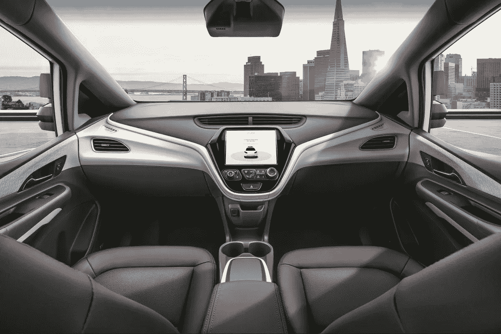
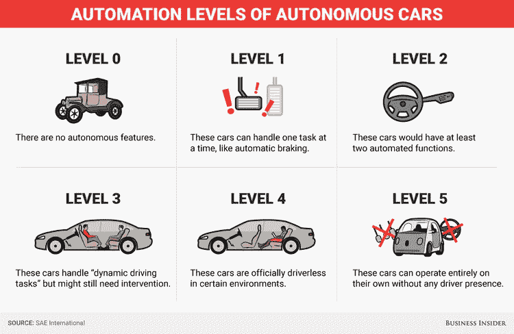
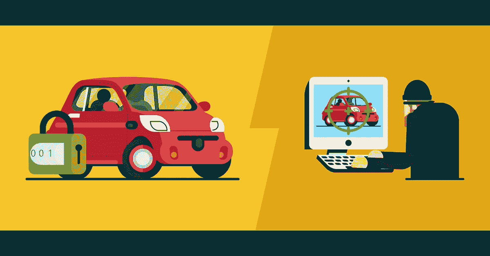
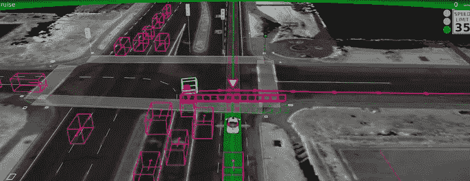

# 互联和自动驾驶汽车网络安全的未来

> 原文：<https://towardsdatascience.com/future-of-cyber-security-for-connected-and-autonomous-vehicles-4c553def6d50?source=collection_archive---------20----------------------->

## 介绍自动驾驶汽车面临的不同安全挑战以及应对这些挑战的机器学习方法。

(来源:[https://cdn . vox-cdn . com/thumb or/7 mrpkqpfqup 1 pqslq 3 nyzo 9 ecws =/0x 0:6144 x 4099/1200 x800/filters:focal(2581 x 1559:3563 x 2541)/cdn . vox-cdn . com/uploads/chorus _ image/image/64798397/GM _ Cruise _ av . 0 . JPEG](https://cdn.vox-cdn.com/thumbor/7MrpKqpFquP1pqslq3nyZO9ECWs=/0x0:6144x4099/1200x800/filters:focal(2581x1559:3563x2541)/cdn.vox-cdn.com/uploads/chorus_image/image/64798397/GM_Cruise_AV.0.jpeg))

# 介绍

自动驾驶汽车利用传感器和复杂的算法来检测和响应周围的环境。自动驾驶汽车常用技术的一些例子有:计算机视觉、激光雷达、全球定位系统等

由于这些技术，自动驾驶汽车不需要司机来完成甚至复杂的旅程。此外，多辆自动驾驶汽车可以相互通信，以改善交通和避障。

图 1 总结了汽车自动化水平的发展。许多公司，如 Waymo 和特斯拉，现在都在大力投资于自动驾驶汽车(自动驾驶汽车)的未来领先地位。

图 1:自动驾驶汽车的自动化水平[1]

> “交通部的研究人员估计，全自动驾驶汽车，也称为自动驾驶汽车，可以通过消除这些由于人为错误造成的事故，将交通死亡人数减少高达 94%。”
> 
> -兹德涅特，蒂娜·马多克斯[2]

# 网络安全

由[查理·米勒和克里斯·沃洛塞克](http://illmatics.com/Remote%20Car%20Hacking.pdf)最近进行的一项研究表明，一辆吉普切诺基只需通过互联网连接就能被黑客攻击(让汽车停在高速公路上！).此外，其他类型的车辆已被证明对有线或无线攻击敏感(如丰田普锐斯、福特 Escape)。在这些情况下，黑客已经能够:激活/禁用车辆刹车、方向盘并提高车辆速度。

图 2:自动驾驶汽车中的网络安全[3]

黑客可以尝试以许多可能的方式利用自动驾驶汽车的漏洞[4]:

1.  **云计算**:自动驾驶汽车每秒钟都会产生和存储新数据，并利用云计算进行快速存储/检索(例如识别 GPS 位置以预测交通流量)。如果黑客能够访问汽车的云数据库，就能够操纵汽车的许多功能(例如，关闭安全设备)。此外，因为信息传输必须尽可能快，所以很难对发送的信息进行高度加密。
2.  **多种编码语言**:现在的汽车是由不同制造商制造的许多部件组装而成的。为了确保汽车完美运行，所有不同的部件都需要完美地相互通信。如果不能确保安全通信，黑客可能会试图利用这一点。汽车制造商通常会进行[渗透测试](https://searchsecurity.techtarget.com/definition/penetration-testing)来确保他们车辆的安全性。

黑客攻击自动驾驶汽车有两个主要风险:

1.  黑客也许能远程控制这辆车。
2.  黑客可能能够访问用户的个人信息。

像美国和英国这样的国家已经实施立法，以确保汽车制造商保持最低的网络安全标准。

确保自动驾驶汽车的高安全性也可以增加公众对投资这项新技术的信任。

如果你有兴趣了解更多关于自动驾驶汽车网络安全的信息，[这篇研究论文](https://www.sciencedirect.com/science/article/pii/S096585641830555X)是一个很好的起点。

# 机器学习

如前所述，车辆总是产生和存储大量数据，然后就轮到我们来决定如何充分利用这些数据。

机器学习有可能被用来识别和防止异常行为(例如，在高速公路上高速行驶时让汽车进入停车模式)[5]。通过这种方式，可以阻止黑客攻击的发生。

研究人员现在仍在进行，以提高预测的准确性。事实上，为了创建能够区分正常和异常驾驶行为的模型，必须考虑与汽车及其周围环境相关的许多因素。

此外，如果驾驶员根据自己的判断认为有必要，可以增加一个功能，使其允许“异常”行为。

图 3:自动驾驶汽车中的机器学习[6]

# 法律含义

随着自动驾驶汽车变得越来越受欢迎，机构现在开始担心是否有必要制定新的法律来规范它们的使用。

例如，2018 年[在美国亚利桑那州，第一起自动驾驶汽车撞死行人的案件已经登记](https://www.theatlantic.com/technology/archive/2018/03/can-you-sue-a-robocar/556007/)。根据警方的报告，行人可能有过错。在这种情况下，应该认定谁有过错？

*   是车里的司机吗？(事故发生时没有控制车辆的人)。
*   是软件开发商吗？(谁开发了处理这类情况的软件)。
*   是汽车制造商吗？(谁在设计和供应车辆时没有采取足够的预防措施)。
*   谁应该负责汽车保险？(因为在大多数情况下驾驶员不控制车辆)。
*   如果发生不可避免的碰撞，汽车应该优先考虑自身安全还是其他车辆/行人的安全？

这些问题中的大多数仍然没有答案，可能会采取不同的方法来解决它们(取决于监管国家和文化相对主义)。

# 联系人

如果你想了解我最新的文章和项目[，请通过媒体](https://medium.com/@pierpaoloippolito28?source=post_page---------------------------)关注我，并订阅我的[邮件列表](http://eepurl.com/gwO-Dr?source=post_page---------------------------)。以下是我的一些联系人详细信息:

*   [领英](https://uk.linkedin.com/in/pier-paolo-ippolito-202917146?source=post_page---------------------------)
*   [个人博客](https://pierpaolo28.github.io/blog/?source=post_page---------------------------)
*   [个人网站](https://pierpaolo28.github.io/?source=post_page---------------------------)
*   [中等轮廓](https://towardsdatascience.com/@pierpaoloippolito28?source=post_page---------------------------)
*   [GitHub](https://github.com/pierpaolo28?source=post_page---------------------------)
*   [卡格尔](https://www.kaggle.com/pierpaolo28?source=post_page---------------------------)

# 文献学

[1]这就是自动驾驶汽车进化的样子。商业内幕。访问:[https://www . business insider . com/what-the-different-levels-of-drilling-cars-2016-10？r=US & IR=T](https://www.businessinsider.com/what-are-the-different-levels-of-driverless-cars-2016-10?r=US&IR=T)

[2]自动驾驶汽车如何在美国拯救超过 35 万人的生命，在全球拯救数百万人的生命。兹德涅特，蒂娜·马多克斯。访问:[https://www . zdnet . com/article/how-autonomous-vehicles-can-save-over-35 万-lifes-in-the-us-and-millions-world wide/](https://www.zdnet.com/article/how-autonomous-vehicles-could-save-over-350k-lives-in-the-us-and-millions-worldwide/)

[3]宾夕法尼亚州关于自动驾驶汽车的公众意见。可查阅:[https://sites . PSU . edu/mihiryouthere/2017/03/03/关于自动驾驶汽车的公众意见/](https://sites.psu.edu/mihiryouthere/2017/03/03/public-opinion-on-self-driving-cars/)

[4]自动驾驶汽车:汽车制造商如何克服网络安全问题。杰迈玛·迈耶斯，绊网。可查阅:[https://www . tripwire . com/state-security/featured/auto-drive-cars-cyber security-issues/](https://www.tripwire.com/state-of-security/featured/self-driving-cars-cybersecurity-issues/)

[5]机器学习如何增强自动驾驶汽车的网络安全。DINO CAUSEVIC，toptal。访问网址:[https://www . top tal . com/insights/innovation/how-machine-learning-can-enhanced-cyber safety-for-autonomous-cars](https://www.toptal.com/insights/innovation/how-machine-learning-can-enhance-cybersecurity-for-autonomous-cars)

[6]安全测试自动驾驶汽车需要考虑潜在的深层学习弱点，下一个大未来。可查阅:[https://www . next big future . com/2016/10/safety-testing-auto-drive-cars-needs . html](https://www.nextbigfuture.com/2016/10/safety-testing-self-driving-cars-needs.html)