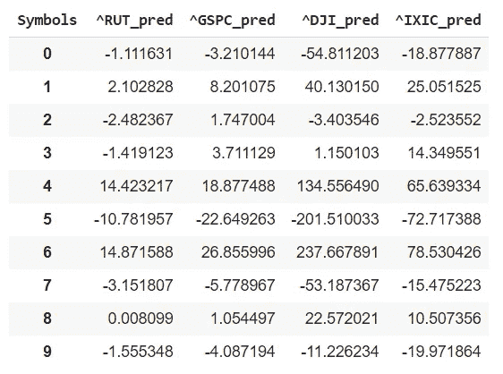

# 基于向量自回归的未来价格预测

> 原文：<https://towardsdatascience.com/future-price-prediction-beyond-test-data-using-vector-auto-regression-eedb7e0c04e?source=collection_archive---------25----------------------->

## 预测分析和时间序列数据

## 多步未来预测的简单步骤


作者图片

向量自回归(VAR)具有易于实施的优势。VAR 中的每个方程在右边有相同数量的变量，整个系统的系数{α1，α2，…，β11，β21，…， *γ* 11， *γ* 21，… }可以通过对每个方程单独应用(OLS)回归来容易地估计。我们可以使用普通的最小二乘(OLS)估计器从每个方程中分别计算出这个模型。由于 OLS 估计量具有标准的渐近性质，因此可以用标准的 t 和 F 统计量来检验一个方程或多个方程中的任何线性约束。VAR 模型相对于传统机器学习模型的优势在于，结果不会被庞大复杂的结构(“黑盒”)所隐藏，而是易于解释和获得。

格兰杰因果关系测试有助于了解一个或多个变量是否具有预测内容，脉冲响应函数和方差分解通常用于量化长期影响。我已经在过去的[中写过关于 VAR 的](/vector-autoregressive-for-forecasting-time-series-a60e6f168c70)以及[多元时间](/vector-autoregressions-vector-error-correction-multivariate-model-a69daf6ab618)序列如何被拟合以生成涵盖两者的预测。

在这里，我将讨论使用 VAR 预测未知未来的简单步骤。

```
stock = ['^RUT', '^GSPC', '^DJI', '^IXIC' ]
start = pd.to_datetime('1990-01-03')
df = web.DataReader(stock, data_source = 'yahoo', start = start);
print(df.tail());
```


这里，我们有来自罗素 2000 (^RUT)、标准普尔 500 (^GSPC)、纳斯达克综合指数(^IXIC)和道琼斯工业平均指数(^DJI).)的数据让我们为所有变量分离 Adj Close 列。

```
data = df['Adj Close']
data.tail()
```


让我们在应用标准化后在一个图表中直观地比较这些系列。我们可以看到这里选择的所有变量之间的高度相关性。这是多元 VAR 的一个很好的候选。

```
scaler = MinMaxScaler(feature_range=(0, 1))
sdf_np = scaler.fit_transform(data)  
sdf = DataFrame(sdf_np, columns=data.columns, index=data.index)
plt.figure(figsize=(12,6))
plt.grid()
plt.plot(sdf)
plt.legend(sdf.columns)
plt.show()
```


我们的目标是预测^RUT 的预期未来价格，选择 DJI、GSPC 和 IXIC 的动机是它们与 RUT 的高度相关性。

我们还可以通过测量滚动窗口大小函数中的滚动窗口上的平均线性相关性来诊断相关性；在这里，我选择了 5 天和 20 天的窗口大小进行可视化显示。

```
blue, orange, red = '#1f77b4', '#ff7f0e', '#d62728'  # color codes
plt.figure(figsize=(12,4))
plt.grid()
cor1, cor2, cor3 = list(), list(), list()
# average correlation for increasing rolling window size
for win in range(5, 20):  # Days
cor1.append(data['^GSPC'].rolling(win).corr(data['^RUT']) \
.replace([np.inf, -np.inf], np.nan).dropna().mean())
cor2.append(data['^DJI'].rolling(win).corr(data['^RUT']) \
.replace([np.inf, -np.inf], np.nan).dropna().mean())
cor3.append(data['^IXIC'].rolling(win).corr(data['^RUT']) \
.replace([np.inf, -np.inf], np.nan).dropna().mean())plt.plot(range(5, 20), cor1, '.-', color=blue, label='RUT vs GSPC')
plt.plot(range(5, 20), cor2, '.-', color=orange, label='DJI vs RUT')
plt.plot(range(5, 20), cor3, '.-', color=red, label='IXIC vs RUT')
plt.legend()
plt.xlabel('Rolling Window Length [Days]', fontsize=12)
plt.ylabel('Average Correlation', fontsize=12)
plt.show()
```


在变量或特征选择的上下文中，我们需要决定将哪些变量包含到模型中。由于我们不能也不应该包括所有潜在利益的变量，我们在选择变量时必须有一个先验的想法。

## ADFuller 测试平稳性

我们需要消除数据中的趋势，让模型进行预测。让我们检查一下数据集的平稳性。

```
def adfuller_test(series, signif=0.05, name='', verbose=False):
r = adfuller(series, autolag='AIC')
output = {'test_statistic':round(r[0], 4), 'pvalue':round(r[1], 4), 'n_lags':round(r[2], 4), 'n_obs':r[3]}
p_value = output['pvalue']
def adjust(val, length= 6): return str(val).ljust(length)print(f'Augmented Dickey-Fuller Test on "{name}"', "\n   ", '-'*47)
print(f'Null Hypothesis: Data has unit root. Non-Stationary.')
print(f'Significance Level = {signif}')
print(f'Test Statistic = {output["test_statistic"]}')
print(f'No. Lags Chosen = {output["n_lags"]}')for key,val in r[4].items():
  print(f' Critical value {adjust(key)} = {round(val, 3)}')
  if p_value <= signif:
     print(f" => P-Value = {p_value}. Rejecting Null Hypothesis.")
     print(f" => Series is Stationary.")
  else:
     print(f" => P-Value = {p_value}. Weak evidence to reject the   Null Hypothesis.")
     print(f" => Series is Non-Stationary.")# ADF test on each column
for name, column in data.iteritems():
  adfuller_test(column, name = column.name)
```


很明显，我们现有的数据集是不稳定的。让我们取一阶差分，再次检查平稳性。

```
nobs = int(10) # number of future steps to predict# differenced train data
data_diff = data.diff()
data_diff.dropna(inplace=True)
print('Glimpse of differenced data:')
print(data_diff.head())# plotting differenced data
data_diff.plot(figsize=(10,6), linewidth=5, fontsize=20)
plt.title('Differenced data')
plt.show()
```


从图中，我们可以评估一阶差分使数据稳定。然而，让我们运行 ADF 测试增益来验证。

```
# ADF Test on each column
for name, column in data_diff.iteritems():
adfuller_test(column, name=column.name)
```


我们的数据是平稳的，以适应回归模型。

# 向量自动回归

指定了一个模型，就必须决定 VAR 模型的适当滞后长度。在决定滞后的数量时，通常使用统计方法，如 Akaike 信息标准。

```
var_model = smt.VAR(data_diff)
res = var_model.select_order(maxlags=15)
print(res.summary())results = var_model.fit(maxlags=15, ic='aic')
print(results.summary())
```


## 未来预测

既然模型已经拟合好了，让我们来预测一下。

```
# make predictions
pred = results.forecast(results.y, steps=nobs)
pred = DataFrame(pred, columns = data.columns+ '_pred')
print(pred)
```



使用下面几行代码可以获得类似的观察结果。在这两种情况下，我们都得到了输出，但规模不同，因为我们的输入数据是不同的，以便稳定。


## 将转换数据反转为原始形状

```
pred = DataFrame(pred, columns=data.columns+ '_pred')def invert_transformation(data_diff, pred):
  forecast = pred.copy()
  columns = data.columns
  for col in columns:
    forecast[str(col)+'_pred'] = data[col].iloc[-1] +   forecast[str(col) +'_pred'].cumsum()
  return forecastoutput = invert_transformation(data_diff, pred)
print(output.loc[:, ['^RUT_pred']])
output = DataFrame(output['^RUT_pred'])
print(output)
```


以上是未来 10 天的预测；让我们为这些值指定未来的日期。

## 分配未来日期

```
d = data.tail(nobs)
d.reset_index(inplace = True)
d = d.append(DataFrame({'Date': pd.date_range(start = d.Date.iloc[-1], periods = (len(d)+1), freq = 'd', closed = 'right')}))
d.set_index('Date', inplace = True)
d = d.tail(nobs)
output.index = d.index
print(output)
```


所以，这里我们可以看到未来的预测。让我们用历史数据画一个图表来形象化。

```
fig = go.Figure()
n = output.index[0]
fig.add_trace(go.Scatter(x = data.index[-200:], y = data['^RUT'][-200:], marker = dict(color ="red"), name = "Actual close price"))
fig.add_trace(go.Scatter(x = output.index, y = output['^RUT_pred'], marker=dict(color = "green"), name = "Future prediction"))
fig.update_xaxes(showline = True, linewidth = 2, linecolor='black', mirror = True, showspikes = True,)
fig.update_yaxes(showline = True, linewidth = 2, linecolor='black', mirror = True, showspikes = True,)
fig.update_layout(title= "10 days days RUT Forecast", yaxis_title = 'RUTC (US$)', hovermode = "x", hoverdistance = 100, # Distance to show hover label of data point spikedistance = 1000,shapes = [dict( x0 = n, x1 = n, y0 = 0, y1 = 1, xref = 'x', yref = 'paper', line_width = 2)], annotations = [dict(x = n, y = 0.05, xref = 'x', yref = 'paper', showarrow = False, xanchor = 'left', text = 'Prediction')])
fig.update_layout(autosize = False, width = 1000, height = 400,)fig.show()
```


在这里，我们可以看到风险值预测未来价格的接近程度。

# 关键要点

VAR 很容易估计。具有良好的预测能力；VAR 模型能够捕捉时间序列变量的动态结构，通常将所有变量视为先验内生变量。然而，将标准风险值模型拟合到大维时间序列可能具有挑战性，主要是因为涉及大量参数。

我们在这里讨论了如何找到最大滞后，以及如何用转换后的数据拟合 VAR 模型。模型拟合后，下一步是预测多步未来价格，并将转换后的数据转换回原始形状，以查看实际预测价格。

在最后一个阶段，绘制历史价格和预测价格可以清晰直观地展示我们的预测。

我这里可以到达[](https://www.linkedin.com/in/saritmaitra/)*。*

**注意:* *此处描述的程序是实验性的，在用于任何商业目的时都应谨慎使用。所有此类使用风险自负。**