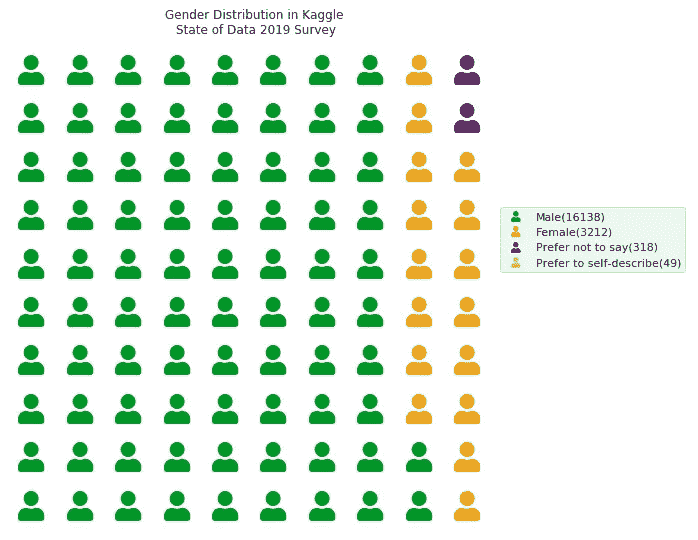

# 面向未来的 2020 年分析工作:雇佣多元化团队

> 原文：<https://towardsdatascience.com/future-proof-your-analytics-efforts-hire-diverse-teams-9e8f9a471859?source=collection_archive---------26----------------------->

在[之前的一篇文章](/tv-shows-are-right-to-be-scared-about-ai-for-all-the-wrong-reasons-81dde746f1a4)中，我们讨论了人工智能领域一些最紧迫的问题，例如自动化系统对糟糕或不道德的决策缺乏人类问责，对偏见来源的理解不足，以及这些问题是如何因过度依赖“黑盒”方法和所谓的“客观”数据而加剧的。随着消费者越来越了解分析对他们生活的影响，行业将目光转向联邦和自我监管，以提供针对这些问题的安全网，任何分析企业都必须将这些问题放在战略的最前沿，以此为基础设施、方法和考虑事项的转变做好准备，一旦这些问题的影响完全确立，就必须考虑这些转变。

在这种情况下，我想重点谈谈上述文章末尾列出的建议之一；**雇佣多元化团队**。雇佣多元化团队的好处已经广为人知；麦肯锡在 2015 年发布的报告《多样性至关重要》(T4)中发现，性别多样性排名前四分之一的公司，其财务回报比全国行业中值高出 15%。考虑到种族/民族多样性，这一比例上升至 35%。与此同时，与数据集中的平均公司相比，性别和民族/种族均处于底部四分之一的公司在统计上不太可能实现高于平均水平的财务回报。

Sanford C. Bernstein & Co .领导和道德中心主任 Katherine W. Phillips 在《科学美国人》上发表的一篇文章强调了长达几十年的研究表明，多样性通过消除我们如何与人交往的隐藏偏见，如期望与我们有相似背景的人得出相同的结论，或分享对我们仅有的信息的看法，来促进创新、创造力和信息共享。

在分析领域，当涉及到处理数据和设计有偏见的决策系统时，很容易在上述问题和考虑多元化团队构成的好处之间划出一条线。作为一个领域，在真正理解和利用其方法和技术所需的专业知识领域(软件工程和架构、统计学、甚至社会学)中已经存在重要的交叉点，因此，考虑其他不太明显的多样性轴心(如性别、种族、民族和性取向)将导致创新、信息共享和事实核查的激增，这在行业的当前状态下是非常需要的。没有培育和培养多元化环境的公司，在处理数据、数据处理以及最终如何输入预测或分析系统方面，陷入偏见陷阱的风险更高。他们还错过了可能带来新机会的重要见解，特别是当这些数据来自一个异构和多样化的背景，团队甚至在分析的初始探索阶段都不准备识别或考虑这些背景时。

非多样化分析团队的高风险不仅仅是猜测。英伟达人工智能总监、加州理工学院教授阿尼玛·阿南德·库马尔(Anima Anandkumar)表示，当研究团队是同质的时候，人工智能系统对某些群体造成伤害的风险就更高:“(T4)多样化的团队更有可能在产品推出之前就发现可能产生负面社会后果的问题，”她说。在《与像我一样的人合作:美国的种族合作》一书中，作者理查德·弗里曼和黄伟分析了 1985 年至 2008 年间发表的 150 万篇科学论文，发现由不同种族的作者撰写的论文被引用的次数更多，影响因子也更高。证据很明显:**多样性阻止偏见，鼓励好奇、怀疑和分析性思维；任何分析企业都会高度重视的属性。**

来源:Kaggle 数据调查 2019 年数据集

然而，像 2018 年 Burtch Works 关于数据科学工作需求和薪酬的研究报告指出，只有 15%的数据科学家、22%的早期职业数据科学家和少得可怜的 10%的数据科学执行领导者是女性。 [2019 年 Kaggle State of Data](https://www.kaggle.com/kaggle-survey-2019) 调查显示了同样令人担忧的性别差距，84%的受访者认为自己是男性，这一数字与之前的调查相比几乎没有变化。对少数群体的研究更难获得；咨询公司 Priceonomics 的一篇 [2017 年文章](https://theindex.generalassemb.ly/data-science-education-lags-behind-in-diversity-ff59ffa718ec)使用大会的学生入学数据发现，数据科学课程迄今为止西班牙裔/拉美裔和非裔美国学生的总比例最低。

哥斯达黎加 Granadilla 的 GAP 办事处

随着越来越多的证据表明多元化分析团队可以识别和处理偏见，产生强大的数据管道，并利用多元化数据集提供的文化和行为洞察，更令人失望的是，大多数企业数据工作仍未利用这些优势。

在我任职于 Growth Acceleration Partners 期间，我发现“投资于人”的价值不仅仅是其品牌材料中的一个要点。毫无疑问，我们的近岸性质鼓励并使我们能够与我有幸与之互动的极其多样化的员工接触，但偶然发现多样性的公司与真正理解多样性不仅是一种文化资产或“值得拥有的东西”，而且是其成长和创新框架不可或缺的一部分的公司之间是有区别的。在 [Ideas to Invoices 播客](http://www.siliconhillsnews.com/2019/10/25/growth-acceleration-partners-says-diversity-and-inclusion-is-key-to-its-success-as-a-custom-software-developer/)中，首席执行官乔伊斯·德斯特(Joyce Durst)被引用说“*让女性在公司各个级别的各个岗位上工作的关键在于思想的多样性。(……)我们可以有多样性，让最好的想法、创新和想法摆在桌面上(……)，包括性别、年龄和多元文化的多样性。GAP 最近获得了全国妇女商业企业理事会颁发的妇女商业企业证书。*

这种对多样性的理解和依赖使得我们构建和改进分析工作和产品的工作对于经验丰富的领导和新员工来说都更加容易。作为一家专注于软件的公司，建立一个强大的分析实践提出了在我们习惯的领域之外招聘的挑战。我们第一次接触到其他领域的精算学家、经济学家和专业人士，这些人与我们过去很少接触的学术机构的工作和项目有关。所有这些迫使我们修改我们的招聘和入职流程，但将它作为多元化思想的另一个来源被证明是一个成功的战略，并导致了一个强大的人才和机会渠道的创建，通过我们在行业内取得的有意义的成功提升了我们的地位。

对新员工如何融入公司其他部门的担忧，变成了一个例子，说明一家为欢迎各种风格的多样性而成立的公司如何能够轻松地融合来自意想不到背景的人，并发现自己在短期内获得技术和文化上的好处，不仅对他们受雇的特定团队，而且对整个公司都是如此。

多元化的价值已被充分研究和理解。鉴于上述优势以及分析行业及其消费者越来越意识到的关于偏见的特定陷阱，多元化团队已被证明是对这些偏见的有效威慑，这使得多元化必然是行业必须努力改善的领域之一这一结论成为定局。通过分析招聘实践中可能影响少数族裔招聘差距的偏见，从非常规背景中招聘，并将这些实践作为公司增长和创新战略的组成部分，我们不仅将开始理解和缓解这些问题的漫长道路，还将准备好应对和解决这十年不可避免地要面临的道德、问责和隐私挑战。在她为 2019 年最具影响力的 10 位女性领导人所做的[简介中，阿尼玛·阿南德·库玛(Anima Anandkumar)对这一概念给予了肯定:*“我希望这是人工智能革命的开始，它促进了多样性和包容性。我坚信这将是我们开发更好的人工智能技术的关键因素，这些技术可以促进公平性、可解释性、透明度和鲁棒性。”*](https://aspioneer.com/anima-anandkumar-developing-next-generation-ai-algorithms/)