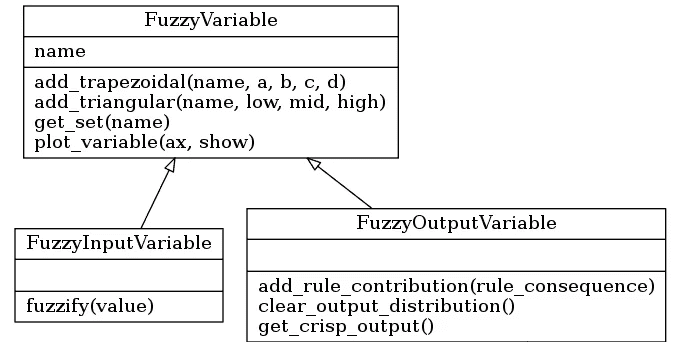

# 模糊推理系统的 Python 实现

> 原文：<https://towardsdatascience.com/fuzzy-inference-system-implementation-in-python-8af88d1f0a6e?source=collection_archive---------1----------------------->

## "一个故事在远处听起来总是很清楚，但你越靠近事件现场，它就变得越模糊。"― **乔治·奥威尔**


照片由卡梅尔·加法拍摄

# 介绍

在[以前的文章](/a-very-brief-introduction-to-fuzzy-logic-and-fuzzy-systems-d68d14b3a3b8)中，我们讨论了模糊集和模糊推理的基础。该报告还说明了使用模糊推理方法构建可能的控制应用程序。在本文中，我们将使用 Python 编程语言构建一个多输入/多输出模糊推理系统。假设读者对模糊推理有清晰的理解，并且已经阅读了前面提到的文章。

本文列出的所有代码都可以在 [Github](https://github.com/carmelgafa/ml_from_scratch/tree/master/fuzzy_inference) 上获得。

# 系统结构

下图说明了应用程序的结构。该设计基于对模糊推理系统的几个考虑，一些是:

*   模糊推理系统需要输入和输出变量以及一组模糊规则。
*   如果模糊推理系统是 Mamdani 类型的，则输入和输出变量都将包含模糊集的集合。
*   输入和输出变量非常相似，但是它们被模糊规则不同地使用。在执行过程中，输入变量使用系统的输入值来模糊化它们的集合，也就是说，它们确定该输入值属于变量的所有模糊集合的程度。每个规则在一定程度上对输出变量有贡献；这种贡献的总和将决定系统的输出。
*   模糊规则具有以下形式的结构:

```
**if** {antecedent clauses} **then** {consequent clauses}
```

因此，一个规则将包含几个先行类型的子句和一些结果类型的子句。条款将采用以下形式:

```
{variable name} **is** {set name}
```


系统图

我们将在以下部分讨论为该系统开发的类的一些实现细节:

## 模糊集类

***模糊集*** 需要以下参数才能启动:

*   **名称—** 集合的名称
*   **最小值—** 集合的最小值
*   **最大值—** 集合的最大值
*   **分辨率—** 最小值和最大值之间的步数

因此，有可能通过使用两个 **numpy** 数组来表示模糊集；一个保存域值，另一个保存隶属度值。最初，所有隶属度值都将被设置为零。可以认为，如果最小值和最大值以及集合的分辨率可用，则不需要域 numpy 数组，因为可以计算相应的值。虽然这是完全正确的，但是在这个示例项目中，域数组是首选的，这样代码更加易读和简单。

模糊集初始化

在模糊变量的上下文中，所有集合将具有相同的最小值、最大值和分辨率值。

当我们处理一个离散化的域时，有必要将用于设置或检索隶属度的任何值调整为域数组中最接近的值。

模糊集域值调整

该类包含一些方法，通过这些方法，可以在给定相应数量的参数的情况下构造一组给定的形状。例如，在三角形集合的情况下，提供三个参数，两个定义集合的范围，一个定义顶点。通过使用这三个参数可以构建一个三角形集合，如下图所示。


三角模糊集方程

因为集合是基于 numpy 数组的，所以上面的等式可以直接转换成代码，如下所示。可以使用类似的方法构建具有不同形状的集合。

三角形集合创建

***FuzzySet*** 类还包含联合、交集和非运算符，这些运算符是进行推理所必需的。所有运算符方法都返回一个新的模糊集，其中包含所发生运算的结果。

两个模糊集对象的并集

最后，我们实现了使用重心法从模糊集获得清晰结果的能力，这在上一篇文章中有详细介绍。值得一提的是，文献中有大量的去模糊化方法。尽管如此，由于重心法非常流行，所以在这个实现中使用了它。

重心去模糊化

## 模糊可变类



模糊可变类

如前所述，变量可以是输入或输出类型，其不同会影响模糊推理计算。 ***模糊变量*** 是保存在 python 字典中的集合的集合，该字典以集合名作为关键字。有一些方法可以将**模糊集**添加到变量中，这些模糊集将接受变量的限制和分辨率。

对于输入变量，通过检索给定域值的变量中所有集合的隶属度来进行模糊化。隶属度存储在集合中，因为规则在评估时需要它。

输入变量的模糊化

输出变量将最终产生模糊推理迭代的结果。这意味着，对于 Mamdani 类型的系统，正如我们在这里所构建的，输出变量将保存所有规则的模糊贡献的联合，并随后将该结果去模糊化，以获得可以在实际应用中使用的清晰值。

因此，输出变量将需要一个额外的 ***模糊集*** 属性来保存该变量的输出分布，其中的贡献是由每个规则产生的，并使用集合联合运算符相加。然后，通过调用输出分布集的重心法可以获得反模糊化结果。

模糊输出变量输出分布及反模糊化方法

## 模糊规则类

***FuzzyClause*** 类需要两个属性；一个模糊变量和一个模糊集

```
variable **is** set
```

可以被创造出来。子句用于实现语句，这些语句可以链接在一起，形成规则的先行部分和后续部分。

当用作先行子句时， ***FuzzyClause*** 返回集合的最后一个隶属度值，该值是在模糊化阶段计算的，如前所述。

该规则将使用 ***min*** 运算符组合来自各种前提子句的隶属度值，获得*规则激活*，该规则激活然后与结果子句一起使用，以获得规则对输出变量的贡献。该操作分为两步:

*   使用**最小**操作符将激活值与结果 ***模糊集*** 相结合，这将作为**模糊集**的隶属度值的阈值。
*   使用**联合**运算符，将结果 ***模糊集*** 与从其他规则获得的 ***模糊集*** 组合，获得该变量的输出分布。

模糊子句作为前提或结果的执行方法

因此， ***模糊规则*** 类需要两个属性:

*   包含先行子句和的列表
*   包含结果从句的列表

在执行 ***模糊规则*** 的过程中，执行上述程序。 ***模糊规则*** 通过适当地利用所有各种 ***模糊子句*** 来协调所有任务。

\规则执行

## 模糊系统类——将所有这些集合在一起。

在这个架构的最顶层，我们有 ***模糊系统*** ，它协调模糊变量和模糊规则之间的所有活动。因此，系统包含输入和输出变量，它们存储在 python 字典中，使用变量名作为关键字和一个规则列表。

此阶段面临的挑战之一是最终用户将用来添加规则的方法，该方法应该理想地抽象出 ***FuzzyClause*** 类的实现细节。实现的方法包括提供两个 python 字典，其中包含以下格式的规则的前提和结果子句；

```
variable name : set name
```

一种更加用户友好的方法是以字符串的形式提供规则，然后解析该字符串来创建规则，但是对于演示应用程序来说，这似乎是一种不必要的开销。

向模糊系统添加新规则

推理过程的执行可以通过给定这种结构的几行代码来实现，其中执行以下步骤；

1.  所有输出变量的输出分布集被清除。
2.  系统的输入值被传递给相应的输入变量，以便变量中的每个集合可以确定其对于该输入值的隶属度。
3.  模糊规则的执行发生了，这意味着所有输出变量的输出分布集现在将包含来自每个规则的贡献的并集。
4.  使用重心去模糊化器对输出分布集进行去模糊化，以获得清晰的结果。

最后要注意的是，这里实现的模糊推理系统包含额外的函数来绘制模糊集和变量，并获取关于推理步骤执行的信息。

# 图书馆使用示例

在这一节中，我们将讨论模糊推理系统的使用。特别是，我们将实现在本系列的前一篇[文章](/a-very-brief-introduction-to-fuzzy-logic-and-fuzzy-systems-d68d14b3a3b8)中设计的风扇速度案例研究。

模糊系统首先考虑输入和输出变量，然后设计模糊集来解释这些变量。

变量将需要一个下限和上限，正如我们将要处理的离散模糊集，系统的分辨率。因此，变量定义将如下所示

```
temp = FuzzyInputVariable('Temperature', 10, 40, 100)
```

其中变量'**温度**的范围在 10 到 40 度之间，并在 100 个箱中离散化。

根据变量的形状，为变量定义的模糊集需要不同的参数。例如，在三角形集合的情况下，需要三个参数，两个参数用于隶属度为 0 的上下极值，一个参数用于隶属度为 1 的顶点。因此，变量'**温度**'的三角形集合定义如下:

```
temp.add_triangular('Cold', 10, 10, 25)
```

其中被称为“T2”的集合“冷”在 10 度和 25 度具有极值，在 10 度具有顶点。在我们的系统中，我们考虑了两个输入变量，“T4”温度“T5”和“T6”湿度“T7”，以及一个输出变量“T8”速度“T9”。每个变量由三个模糊集描述。输出变量'**速度**'的定义如下:

```
motor_speed = FuzzyOutputVariable('Speed', 0, 100, 100) motor_speed.add_triangular('Slow', 0, 0, 50) motor_speed.add_triangular('Moderate', 10, 50, 90) motor_speed.add_triangular('Fast', 50, 100, 100)
```

正如我们之前看到的，模糊系统是包含这些变量和模糊规则的实体。因此，必须将变量添加到系统中，如下所示:

```
system = FuzzySystem() 
system.add_input_variable(temp) 
system.add_input_variable(humidity)
system.add_output_variable(motor_speed)
```

# 模糊规则

一个模糊系统执行模糊规则操作的形式

```
If x1 is S and x2 is M then y is S
```

其中，规则的 If 部分包含几个先行子句，then 部分将包含几个结果子句。为了简单起见，我们假设规则要求每个输入变量都有一个 antecedent 子句，并且只通过“and”语句连接在一起。可以用“or”连接语句，语句也可以包含集合上的运算符，如“not”。

向我们的系统添加模糊规则的最简单的方法是提供先行子句和结果子句的列表。一种方法是使用包含以下内容的 python 字典

```
Variable:Set
```

条款集的条目。因此，上述规则可以实现如下:

```
system.add_rule(  
{ 'Temperature':'Cold',   
'Humidity':'Wet' },{ 'Speed':'Slow'})
```

系统的执行包括输入所有输入变量的值，并获得输出值的值作为回报。同样，这是通过使用字典来实现的，字典使用变量的名称作为关键字。

```
output = system.evaluate_output({    
'Temperature':18,    
'Humidity':60  })
```

系统将返回一个字典，其中包含作为关键字的输出变量的名称，以及作为值的反模糊结果。

# 结论

在本文中，我们研究了模糊推理系统的实际实现。虽然这里介绍的库还需要进一步的工作，以便可以在实际项目中使用，包括验证和异常处理，但它可以作为需要模糊推理的项目的基础。还建议看看一些可用的开源项目，特别是 SciPy 的模糊逻辑工具箱 [skfuzzy](https://pythonhosted.org/scikit-fuzzy/) 。

在下一篇文章中，我们将研究从数据集创建模糊系统的方法，以便在机器学习场景中使用模糊逻辑。类似于模糊逻辑概念的介绍，接下来是一篇实用的文章。