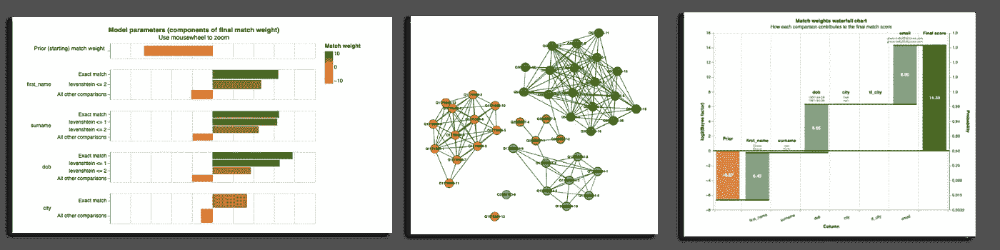

# 使用 Splink 对数亿条记录进行模糊匹配和重复数据删除

> 原文：<https://towardsdatascience.com/fuzzy-matching-and-deduplicating-hundreds-of-millions-of-records-using-apache-spark-93d0f095001f?source=collection_archive---------22----------------------->

## 支持 Python、PySpark 和 AWS Athena 的快速、准确和可扩展的记录链接

## 摘要

Splink 是一个用于概率记录链接(实体解析)的 Python 库。它支持使用`Apache Spark`、`AWS Athena`或`DuckDB`后端运行记录链接工作负载。

其主要特点是:

*   它非常快。使用`DuckDB`后端，它能够在两分钟内连接现代笔记本电脑上的一百万条记录。
*   它非常精确，支持词频调整和复杂的模糊匹配逻辑。
*   它能够使用`Spark`或`AWS Athena`后端链接非常大的数据集(超过 1 亿条记录)。
*   具有简单但高度可定制的界面，因此用户可以解决大多数记录链接和重复数据删除问题
*   不需要训练数据，因为可以使用无监督的方法来训练模型。
*   支持从探索性分析师到模型预测、诊断和质量保证的数据链接的完整工作流程。
*   是健壮的，有一套自动化的单元和集成测试。


## 问题陈述

一个常见的数据质量问题是有多个不同的记录引用同一个实体，但没有唯一的标识符将这些实体联系在一起。

例如，客户数据可能已经被多次输入到多个不同的计算机系统中，具有不同的姓名拼写、不同的地址和其他打字错误。缺乏唯一的客户标识符给数据分析的所有阶段带来了挑战，从计算唯一客户的数量等基本问题，到用于机器学习目的的客户详细信息的特征工程。

对这个问题有大量的理论和实证研究。该解决方案通常涉及使用统计估计、机器学习和/或基于规则的逻辑来计算新的唯一标识符列，该唯一标识符列允许实体被链接和分组。

然而，缺乏能够在数百万条记录的规模上解决这个问题的自由软件——这是大型组织中常见的规模。解决这个问题通常需要生成大量的记录比较，因此不适合 R 或 Python 中的内存解决方案。像 Apache Spark 这样的分布式计算框架，或者像 DuckDB 这样并行化且不受内存限制的后端，是更好的选择。

我们发布了一个名为`splink`的免费[开源](https://github.com/moj-analytical-services/splink)库，实现了 fell egi-Sunter/期望最大化方法，这是数据链接文献的关键统计模型之一。这是一种无监督的学习算法，它为每对记录比较产生一个匹配分数。

## 尝试一下

你可以使用我们的活页夹链接[在这里](https://mybinder.org/v2/gh/moj-analytical-services/splink_demos/master?urlpath=lab/tree/index.ipynb)在 Jupyter 笔记本上试试这个图书馆。

这些演示说明了如何使用这个库，但是请注意，它们是在免费服务器上以本地模式运行的，所以不要期望有很好的性能。

您也可以访问我们的[文档网站](https://moj-analytical-services.github.io/splink)。

## 它是如何工作的

Splink 是 Fellegi-Sunter 模型的一个实现。该软件使用一种称为[阻塞](https://en.wikipedia.org/wiki/Record_linkage#Probabilistic_record_linkage)的方法生成成对记录比较，并为每对记录计算匹配分数，量化两个记录之间的相似性。

匹配分数由称为部分匹配权重的参数确定。这些量化了比较的不同方面的重要性。

例如，出生日期匹配比性别匹配更有利于两个记录匹配。邮政编码的不匹配可能提供不匹配的弱证据，因为人们搬家了，而出生日期的不匹配可能是不匹配记录的强有力证据。

这个简单的想法有很大的力量来构建高度微妙的模型。可以为任意数量的用户定义的场景计算部分匹配权重，而不仅仅是匹配或不匹配。例如，对于邮政编码不匹配但彼此相距在 10 英里以内的情况，可以估计部分匹配权重。

这些部分匹配权重被组合成一个总匹配分数，该分数表示两个记录匹配的证据的权重。

该库使用无监督学习(期望最大化算法)来估计这些匹配权重。你可以在我的互动培训材料中了解更多关于理论[的内容。](https://www.robinlinacre.com/probabilistic_linkage/)

关于这一切如何工作的更详细的视频描述可以在[这里](https://youtu.be/msz3T741KQI?t=497)找到。



Splink 的一些图形输出

## **样本代码**

我们试图设计一个简单的界面，但仍然可以适应大多数记录链接和重复数据删除问题。

在下面的代码中，我们:

*   指定数据链接模型
*   估计它的参数
*   使用该模型计算成对匹配分数
*   将匹配分数分组以产生估计的唯一个人 id

```
from splink.duckdb.duckdb_linker import DuckDBLinker
from splink.duckdb.duckdb_comparison_library import (
    exact_match,
    levenshtein_at_thresholds,
)

import pandas as pd

df = pd.read_csv("./tests/datasets/fake_1000_from_splink_demos.csv")

*# Specify a data linkage model*
settings = {
    "link_type": "dedupe_only",
    "blocking_rules_to_generate_predictions": [
        "l.first_name = r.first_name",
        "l.surname = r.surname",
    ],
    "comparisons": [
        levenshtein_at_thresholds("first_name", 2),
        exact_match("surname"),
        exact_match("dob"),
        exact_match("city", term_frequency_adjustments=True),
        exact_match("email"),
    ],
}

linker = DuckDBLinker(df, settings)

*# Estimate its parameters*
linker.estimate_u_using_random_sampling(target_rows=1e6)

blocking_rule_for_training = "l.first_name = r.first_name and l.surname = r.surname"
linker.estimate_parameters_using_expectation_maximisation(blocking_rule_for_training)

blocking_rule_for_training = "l.dob = r.dob"
linker.estimate_parameters_using_expectation_maximisation(blocking_rule_for_training)

*# Use the model to compute pairwise match scores*
pairwise_predictions = linker.predict()

*# Cluster the match scores into groups to produce an estimated unique person id*
clusters = linker.cluster_pairwise_predictions_at_threshold(pairwise_predictions, 0.95)
clusters.as_pandas_dataframe(limit=5)
```

## 反馈

我们感谢所有做出贡献并提供反馈的用户。请通过以下方式继续这样做:

*   开始讨论如果你对如何做某事有疑问
*   提出[一个问题](https://github.com/moj-analytical-services/splink/issues)如果你发现了一个 bug 或者想要请求一个新特性
*   如果你想修复一个错误或者增加一个特性，提出一个[拉请求](https://github.com/moj-analytical-services/splink/pulls)

或者我是推特上的 [@robinlinacre](https://twitter.com/RobinLinacre) 。