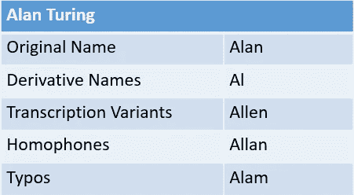
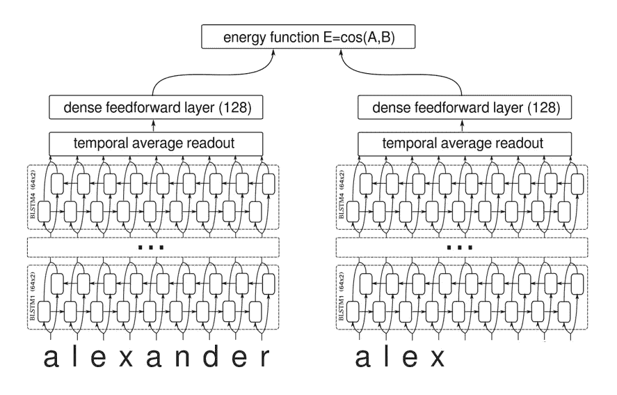
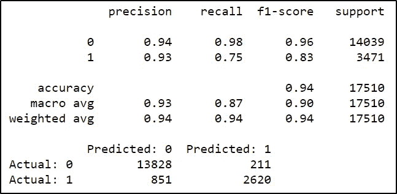
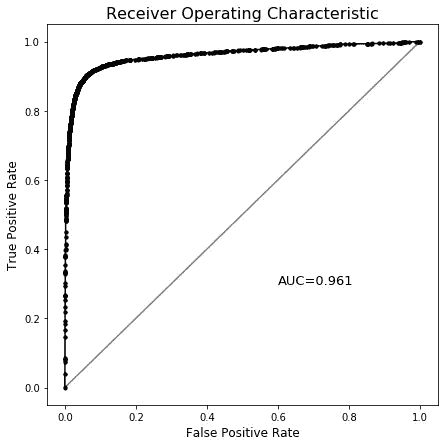
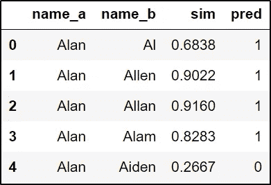

# 基于机器学习的模糊姓名匹配

> 原文：<https://towardsdatascience.com/fuzzy-name-matching-with-machine-learning-f09895dce7b4?source=collection_archive---------13----------------------->

## 用于语义名称匹配的堆叠语音算法、字符串度量和字符嵌入

## [在 GitHub 上查看完整代码](https://github.com/Christopher-Thornton/hmni)


由 [Thom Masat](https://unsplash.com/@tomterifx?utm_source=medium&utm_medium=referral) 在 [Unsplash](https://unsplash.com?utm_source=medium&utm_medium=referral) 上拍摄的照片

在处理外部数据时，通常情况下不存在一个公共标识符，如数字键。代替唯一标识符，一个人的全名可以用作链接数据的通用或复合密钥的一部分，但是，这不是一个万无一失的解决方案。

让我们以名字 ***艾伦图灵*** 为例；不同的数据源可能已经记录了呼叫名字。数据录入可能会无意中记录:*艾伦*、*艾伦*，或者更糟，未被发现的错别字( *Alam Turing* )到他们的数据库中。企业文档扫描解决方案(OCR)也充斥着误读。



通过应用软逻辑来近似拼写和**语音**(声音)特征的认知过程，人类代理可以直观地将这些变化分配给艾伦·图灵的同一实体。通常简称为**的伪君子**并不总是具有这些特征，而是代理人习得联想*的一部分，即* **Charles → Chip** 。

> 接下来的研究是应用机器学习来实现替代名称识别的类人逻辑和语义的外观。

## 数据收集

我搜集了许多名字的常用替代拼法，大约有 17500 对。这些名字被限制为 ASCII 码，并包括许多 Unicode 编码的跨文化例子，以避免过度适应西方的命名惯例。

使用名字作为我们的模型的核心数据的直觉是在名字成分上集成集成方法，要求姓氏的精确或语音匹配，以确保更高的精确度/更少的误报，代价是一些回忆。

我决定使类不平衡(1:4 ),因为对负类的欠采样会导致对正类的明显的人为偏向。很难近似每一类的先验概率，但是假设这些类是不平衡的，有利于负类。

## 特征选择

有许多字符串度量和语音算法可用作特征，基本级别模型使用 20 多种特征，包括:

*   莱文斯坦距离
*   二元模型相似性
*   Jaro 距离
*   编辑距离
*   Soundex 编码

## **字符嵌入**

**深层的 LSTM 暹罗网络**已经被证明在**学习文本相似性方面是有效的。我使用 **TensorFlow** 在名字对上训练这些网络，并使用非折叠预测作为元模型的一个特征。**



深层架构包括一个字符嵌入层，后面是一个 biLSTM 和能量损耗层。

## **原始变换**

名称可以被转换，以帮助我们的模型从相同的数据中学习新的模式。转换包括:

*   将名称分割成音节以获得有意义的多记号串度量(例如，来自 fuzzywuzzy 包的记号排序和记号集)
*   移除高频名称结尾
*   去除元音
*   转换为国际音标

## 模型结构

我使用 AutoML 软件包 **TPOT** 来帮助选择一个优化的管道和超参数，以 **F1** 作为评分标准。

基本模型和字符嵌入网络通过分层 10 折交叉验证进行堆叠，以训练一个**逻辑回归**元模型。基础模型中的一些特性被包含进来，为元模型提供额外的上下文和维度。**网格搜索**用于选择最佳参数和特征，优先考虑精度。

## 估价

*国际备选名测试集的评估指标:*



这个模型是专门训练来处理替代名称的，但也能很好地正确分类所有上述变体，包括印刷错误。



> 所用的方法和由此产生的模型从此被戏称为 HMNI(你好我的名字是)。我已经开源了这个项目(处于测试阶段),作为一个 Python 包，使用了相同的名字。

# 如何在你的项目中使用 HMNI

## 通过 PyPI 使用 PIP 安装

```
pip install hmni
```

## 快速使用指南—配对相似性、记录关联、重复数据删除和标准化

# **更多即将推出……**

我会在[](https://github.com/Christopher-Thornton/hmni)**HMNI 的未来版本中更新这篇文章；包括最佳性能模型、特定语言配置和数据处理优化。**