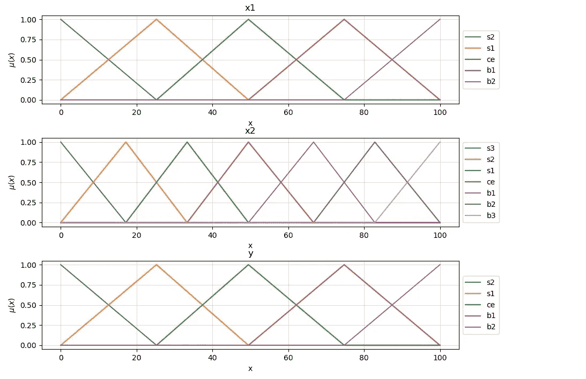

# 来自数据的模糊系统

> 原文：<https://towardsdatascience.com/fuzzy-systems-from-data-51a53bcbc9b1?source=collection_archive---------29----------------------->

## 从传感器信息中生成人类可读的知识


图片来自[https://www.pexels.com/](https://www.pexels.com/)

# 介绍

模糊逻辑理论引入了一个框架，通过这个框架，人类的知识可以被形式化，并由机器在从相机到火车的各种应用中使用。我们在以前的帖子中讨论的基本思想只涉及到使用基于模糊逻辑的系统的这一方面；这是人类经验在机器驱动的应用中的应用。虽然有许多这样的技术相关的例子；也有一些应用程序，在这些应用程序中，人类用户很难清楚地表达他们所掌握的知识。这些应用包括驾驶汽车或识别图像。机器学习技术在这种情况下提供了一个极好的平台，在这种情况下，输入和相应的输出集合是可用的，建立一个模型，使用可用的数据提供从输入数据到输出的转换。

在这篇文章中，我们将讨论一种算法，这种算法是由李教授和 Jerry Mendel 教授提出的从数据中构造模糊系统。这种技术和类似技术的一个令人兴奋的方面是能够从数据中以模糊集和规则的形式获得人类容易理解的知识。

# 程序

正如我们在简介中所解释的，本练习的目标是，给定一组输入/输出组合，我们将生成一个规则集，确定输入和输出之间的映射。在这个讨论中，我们将考虑一个双输入单输出系统。对于读者来说，将这个过程扩展到更复杂的系统应该是一项简单的任务。

## 步骤 1-将输入和输出空间划分为模糊区域。

我们首先给每个输入和输出空间分配一些模糊集。王和孟德尔指定了奇数个均匀间隔的模糊区域，由 **2N+1** 决定，其中 **N** 为整数。正如我们将在后面看到的， **N** 的值会影响我们模型的性能，有时会导致欠拟合/过拟合。 **N** 因此是我们用来调整该系统性能的超参数之一。



将输入空间划分成模糊区域，其中 N=2

## 第二步——从数据中生成模糊规则。

我们可以使用我们的输入和输出空间，以及我们刚刚定义的模糊区域和应用程序的数据集来生成以下形式的模糊规则:

```
**If** {antecedent clauses} **then** {consequent clauses}
```

我们首先确定数据集中每个样本对该空间中不同模糊区域的隶属度。例如，我们考虑下面描述的一个例子:


科雷斯

我们获得以下隶属度值。


样本 1 的隶属度值

然后，我们将具有最大隶属度的区域分配给空间，这由上表中突出显示的元素表示，以便可以获得一个规则:

```
sample 1 => **If** x1 is b1 and x2 is s1 **then** y is ce => Rule 1
```

下图显示了第二个示例，以及它生成的隶属度结果。


因此，该示例将产生以下规则:

```
sample 2=> **If** x1 is b1 **and** x2 is ce **then** y is b1 => Rule 2
```

## 步骤 3-为每个规则分配一个等级。

步骤 2 实现起来非常简单，但是它有一个问题；它将生成冲突的规则，即具有相同的前置子句但不同的后置子句的规则。Wang 和 Medel 通过给每个规则分配一个度来解决这个问题，使用乘积策略，使得度是来自形成规则的前件和后件空间的所有隶属度值的乘积。我们保留具有最重要程度的规则，而我们丢弃具有相同前提但具有较小程度的规则。

如果我们参考前面的例子，规则 1 的度数将等于:


对于规则 2，我们得到:


我们注意到，这个过程在实践中极大地减少了规则的数量。

还可以通过将人的因素引入到规则程度来将人的知识融合到从数据获得的知识中，这在实践中具有很高的适用性，因为人的监督可以评估数据的可靠性，因此可以直接从数据中生成规则。在不需要人工干预的情况下，对于所有规则，该因子都设置为 1。因此，规则 1 可以定义如下:


## 步骤 4-创建一个组合模糊规则库

组合模糊规则库的概念在之前的[文章](/a-very-brief-introduction-to-fuzzy-logic-and-fuzzy-systems-d68d14b3a3b8)中已经讨论过了。它是一个矩阵，保存系统的模糊规则库信息。组合的模糊规则库可以包含使用上述过程以数字方式生成的规则，也可以包含从人类经验中获得的规则。


本系统的组合模糊规则库。注意规则 1 和规则 2。

## 步骤 5-基于组合的模糊规则库确定映射。

该过程的最后一步解释了用于确定给定的 **y，**(x1，x2)的值的去模糊化策略。王和孟德尔提出了一种不同于马姆达尼使用的最大最小计算方法。我们必须考虑到，在实际应用中，与通常使用模糊逻辑的典型控制应用相比，输入空间的数量是很大的。此外，此过程将生成大量规则，因此使用“正常”方法计算输出是不切实际的。

对于给定的输入组合(x1，x2)，我们结合给定规则的前件，使用乘积运算符确定对应于(x1，x2)的输出控制程度。如果


是第 I 条规则的输出控制程度，


因此对于规则 1

```
**If** x1 is b1 and x2 is s1 **then** y is ce
```


我们现在将模糊区域的中心定义为在该区域的隶属函数等于 1 的所有点中具有最小绝对值的点，如下所示；


模糊区域的中心

因此，给定(x1，x2)组合的 y 值为


其中 **K** 是规则数。

# 测试

用 Python 开发了上述算法的一个(非常脏的)实现，用真实数据集进行测试。使用的代码和数据可以在 [Github](https://github.com/carmelgafa/ml_from_scratch) 中找到。对该系统的一些考虑包括。

*   模糊系统直接由测试数据生成。
*   这些集合是使用原始论文中的建议创建的，即均匀分布。然而，有趣的是看到改变这种方法的效果。一种想法是围绕数据集平均值创建集合，其分布与标准差相关，这可能会在未来的帖子中进行调查。
*   所创建的系统没有隐式地迎合分类数据，这是将来的改进，可以在现实生活场景中相当大地影响系统的性能。

## 测试指标

我们将使用决定系数(R 平方)来评估该系统的性能，并调整被识别的超参数，即生成的模糊集的数量。

要解释 R-Squared，首先要定义平方和 total 和平方和残差。

**平方和总和**是因变量(y)和观察到的因变量平均值之间的平方差总和。


残差平方和是因变量的实际值和估计值之差的平方和。


r 平方可以通过下式计算


我们注意到 R 平方的值在 0 和 1 之间，越大越好。如果 R 平方=1，则没有误差，估计值将等于实际值。

# 案例研究 1——噪声传感器

我们用一个简单的应用程序开始测试这个过程；一个单输入单输出系统，代表一个具有指数响应的假想传感器。让事情变得复杂一点，我们在传感器数据中添加了一些噪声，如下图所示:


我们首先检查 **x** 和 **y** 的 **N** 的不同值的各种结果。下图显示了在搜索最佳值的过程中获得的结果。


当 N_x 设置为 4，N_y 设置为 3 时，获得最佳响应，R 平方值为 0.985。由该系统生成的规则是特别令人感兴趣的，因为它们可以以容易理解的方式解释该系统如何工作；

```
If x is s4 then Y is s3
If x is s3 then Y is s3
If x is s2 then Y is s3
If x is s1 then Y is s3
If x is ce then Y is s2
If x is b1 then Y is s2
If x is b2 then Y is s1
If x is b3 then Y is ce
If x is b4 then Y is b3
```

我们注意到显示指数性质的系统的特征被清楚地解释。对于所有小的输入值，输出值保持最小，随着输入值的进一步增加，输出值迅速增加。

系统也容易出现过拟合，例如 N_x=5 和 N_y=2。


# 案例研究 2 —温度

对于第二个测试，我们使用了 2006-2016 年 Szeged 的[天气。该数据集包含超过 96，000 个由 12 个特征组成的训练示例。](https://www.kaggle.com/budincsevity/szeged-weather/)

```
Formatted Date               object
Summary                      object
Precip Type                  object
Temperature (C)             float64
Apparent Temperature (C)    float64
Humidity                    float64
Wind Speed (km/h)           float64
Wind Bearing (degrees)      float64
Visibility (km)             float64
Loud Cover                  float64
Pressure (millibars)        float64
Daily Summary                object
```

在这个练习中，我们将放弃这些特征中的大部分，并评估我们是否可以预测给定月份的温度和湿度。

在检查数据时，我们注意到平均温度在 1 到 23 摄氏度之间变化，每月变化约 20 度。


平均湿度在 0.63 和 0.85 之间变化，但我们也注意到它总是可能达到 100%，与月份无关。


被测试的最佳模糊系统由用于输入变量的 3 个模糊空间( **N** =1)和用于温度的 9 个模糊空间( **N** =4)组成。系统生成了下面的模糊分布图中描述的九条规则，并使用 20%的测试样本获得了 0.75 的 R 平方值。


# 结论

上述系统从数据中产生人类可读的规则，可以帮助我们获得对复杂系统的洞察力。以下是对未来工作的几点看法和想法:

1.  该系统需要一个相当大的数据集，需要覆盖所有可能产生的规则。因此，随着要素数量的增加，需要更大的数据集，因为所需的规则数量将呈指数增长。
2.  也许可以通过检查相邻的规则来生成缺失的规则。如果一个不存在的规则可以在一个由相同的输出空间包围的组合模糊规则库中被说明，则该规则可能属于相同的空间。这一想法将在未来得到检验。
3.  模糊空间的分布影响系统的性能，尽管像标准化和规范化这样的预处理有助于限制数据分布对系统的影响。
4.  必须调查手工制定的规则的影响。验证人类经验是否真的可以增强机器生成系统的性能是一件有趣的事情。
5.  检查负责规则的数据并使用信息来确定为什么测试样本会产生重大错误也是很有趣的。