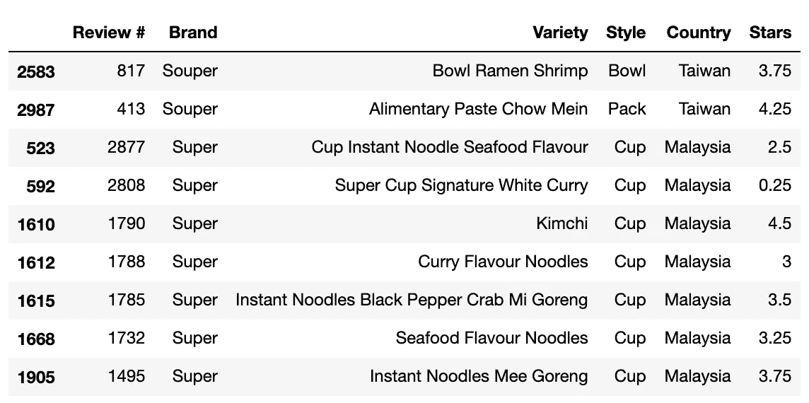

# FuzzyWuzzy:用 Python 在一列中查找相似的字符串

> 原文：<https://towardsdatascience.com/fuzzywuzzy-find-similar-strings-within-one-column-in-a-pandas-data-frame-99f6c2a0c212?source=collection_archive---------2----------------------->


马特&克里斯·普阿在 [Unsplash](https://unsplash.com/s/photos/ramen?utm_source=unsplash&utm_medium=referral&utm_content=creditCopyText) 上的照片

## 令牌排序比率与令牌集比率

使数据变脏的方法有很多种，数据录入不一致就是其中之一。不一致的值比重复的值更糟糕，有时很难检测到。本文介绍了我如何应用 [FuzzyWuzzy](https://github.com/seatgeek/fuzzywuzzy) 包在[一个拉面评论数据集](https://www.theramenrater.com/resources-2/the-list/)中查找相似的拉面品牌名称(完整的 Jupyter 笔记本可以在我的 [GitHub](https://github.com/thuynh323/Python-data-preprocessing/blob/master/FuzzyWuzzy%20-%20Ramen%20Rater%20List/Find%20similar%20strings%20with%20FuzzyWuzzy.ipynb) 中找到)。你也可以在这里找到缩短代码[的函数。](https://github.com/thuynh323/Natural-language-processing/blob/master/FuzzyWuzzy%20-%20Ramen%20Rater%20List/fuzz_match_function.py)

# 数据

```
import pandas as pd
import numpy as np
from fuzzywuzzy import process, fuzzramen = pd.read_excel('The-Ramen-Rater-The-Big-List-1-3400-Current-                    As-Of-Jan-25-2020.xlsx')
ramen.head()
```


数据集的前几行

```
ramen.info()**<class 'pandas.core.frame.DataFrame'>
RangeIndex: 3400 entries, 0 to 3399
Data columns (total 6 columns):
Review #    3400 non-null int64
Brand       3400 non-null object
Variety     3400 non-null object
Style       3400 non-null object
Country     3400 non-null object
Stars       3400 non-null object
dtypes: int64(1), object(5)
memory usage: 159.5+ KB**
```

这个数据集非常简单，容易理解。在搬到 FuzzyWuzzy 之前，我想再核实一些信息。首先，我删除了每一列中的前导空格和尾随空格(如果有的话)，然后打印出它们的唯一值的数量。

```
for col in ramen[['Brand','Variety','Style','Country']]:
    ramen[col] = ramen[col].str.strip()
    print('Number of unique values in ' + str(col) +': ' + str(ramen[col].nunique()))**Number of unique values in Brand: 499
Number of unique values in Variety: 3170
Number of unique values in Style: 8
Number of unique values in Country: 48**
```

通过对独特的品牌名称进行排序，可以看出是否有相似的。结果只显示前 20 个品牌。

```
unique_brand = ramen['Brand'].unique().tolist()
sorted(unique_brand)[:20]**['1 To 3 Noodles',
 '7 Select',
 '7 Select/Nissin',
 '7-Eleven / Nissin',
 'A-One',
 'A-Sha',
 'A-Sha Dry Noodle',
 'A1',
 'ABC',
 'Acecook',
 'Adabi',
 'Ah Lai',
 'Aji-no-men',
 'Ajinatori',
 'Ajinomoto',
 'Alhami',
 'Amianda',
 'Amino',
 "Annie Chun's",
 'Aroi']**
```

我们可以在一开始就看到一些可疑的名字。接下来，让我们用 FuzzyWuzzy 做一些测试。

# 快速模糊测试

FuzzyWuzzy 有四个记分员选项来查找两个字符串之间的 Levenshtein 距离。在本例中，我将检查标记排序比率和标记集比率，因为我认为它们更适合这个可能有混合单词顺序和重复单词的数据集。

我挑选了四个品牌名称，并在品牌栏中找到了它们相似的名称。因为我们将 Brand 列与其自身进行匹配，所以结果将始终包括得分为 100 的所选名称。

## 令牌排序比率

token sort ratio scorer 对字符串进行标记化，并通过将这些字符串还原为小写字母、删除标点符号，然后按字母顺序排序来清理它们。之后，它会找到 Levenshtein 距离并返回相似度百分比。

```
process.extract('7 Select', unique_brand, scorer=fuzz.token_sort_ratio)**[('7 Select', 100),
 ('7 Select/Nissin', 70),
 ('Jinbo Selection', 61),
 ('Seven & I', 53),
 ('Lele', 50)]**
```

这个结果意味着 7 Select/Nissin 在参考 7 Select 时有 70%的相似度。如果我将阈值设置为 70%以获得 7 Select-7 Select/Nissin 对，这还不错。

```
process.extract('A-Sha', unique_brand, scorer=fuzz.token_sort_ratio)**[('A-Sha', 100), ('Shan', 67), ('Nasoya', 55), ('Alhami', 55), ('Ah Lai', 55)]**
```

低于 70%就不是阿沙的对手了。

```
process.extract('Acecook', unique_brand, scorer=fuzz.token_sort_ratio)**[('Acecook', 100),
 ('Vina Acecook', 74),
 ('Yatekomo', 53),
 ('Sahmyook', 53),
 ('Panco', 50)]**
```

仍然擅长 70%的阈值。

```
process.extract("Chef Nic's Noodles", unique_brand, scorer=fuzz.token_sort_ratio)**[("Chef Nic's Noodles", 100),
 ("Mr. Lee's Noodles", 71),
 ('Fantastic Noodles', 69),
 ('1 To 3 Noodles', 62),
 ("Mom's Dry Noodle", 59)]**
```

现在，我们有一个问题。如果我设置 70%的阈值，令牌排序比率计分器将得到错误的一对厨师 Nic 的面条-李先生的面条。

```
process.extract('Chorip Dong', unique_brand, scorer=fuzz.token_sort_ratio)**[('Chorip Dong', 100),
 ('ChoripDong', 95),
 ('Hi-Myon', 56),
 ('Mr. Udon', 56),
 ('Maison de Coree', 54)]**
```

这个看起来足够好了。

## 令牌集比率

标记集比率计分器还对字符串进行标记化，并遵循与标记排序比率一样的处理步骤。然后，它收集两个字符串之间的公共标记，并执行成对比较以找到相似性百分比。

```
process.extract('7 Select', unique_brand, scorer=fuzz.token_set_ratio)**[('7 Select', 100),
 ('7 Select/Nissin', 100),
 ('The Ramen Rater Select', 86),
 ('Jinbo Selection', 61),
 ('Seven & I', 53)]**
```

由于令牌集比例更加灵活，7 Select — 7 Select/Nissin 的分数从 70%提高到了 100%。

```
process.extract('A-Sha', unique_brand, scorer=fuzz.token_set_ratio)**[('A-Sha', 100),
 ('A-Sha Dry Noodle', 100),
 ('Shan', 67),
 ('Nasoya', 55),
 ('Alhami', 55)]**
```

现在我们看到阿沙还有另外一个名字叫阿沙挂面。而我们只有通过使用令牌集比率才能看到这一点。

```
process.extract('Acecook', unique_brand, scorer=fuzz.token_set_ratio)**[('Acecook', 100),
 ('Vina Acecook', 100),
 ('Yatekomo', 53),
 ('Sahmyook', 53),
 ('Panco', 50)]**
```

这一个得到 100%就像 7 选择的情况。

```
process.extract("Chef Nic's Noodles", unique_brand, scorer=fuzz.token_set_ratio)**[("Chef Nic's Noodles", 100),
 ('S&S', 100),
 ('Mr. Noodles', 82),
 ("Mr. Lee's Noodles", 72),
 ('Tseng Noodles', 70)]**
```

当 Nic 主厨的面条 S&S 的令牌集比率返回 100%时，情况会变得更糟。

```
process.extract('Chorip Dong', unique_brand, scorer=fuzz.token_set_ratio)**[('Chorip Dong', 100),
 ('ChoripDong', 95),
 ('Hi-Myon', 56),
 ('Mr. Udon', 56),
 ('Maison de Coree', 54)]**
```

我们对这个有相同的结果。

尽管标记集比率比标记排序比率更灵活，并且可以检测到更多的相似字符串，但它也可能会带来更多的错误匹配。

# 应用 FuzzyWuzzy

在这一部分中，我首先使用了 token sort ratio，并创建了一个表来显示品牌名称、它们的相似性以及它们的得分。

```
*#Create tuples of brand names, matched brand names, and the score*
score_sort = [(x,) + i
             for x in unique_brand 
             for i in process.extract(x, unique_brand,     scorer=fuzz.token_sort_ratio)]*#Create a dataframe from the tuples*
similarity_sort = pd.DataFrame(score_sort, columns=['brand_sort','match_sort','score_sort'])
similarity_sort.head()
```


数据帧的第一行

因为我们在同一列中寻找匹配的值，所以一个值对会有另一个顺序相反的相同值对。例如，我们会找到一对江户包—高户，和另一对高户—江户包。为了稍后消除其中一个，我们需要为相同的对找到“代表”值。

```
similarity_sort['sorted_brand_sort'] = np.minimum(similarity_sort['brand_sort'], similarity_sort['match_sort'])similarity_sort.head()
```


基于上面的测试，我只关心那些至少有 80%相似度的配对。我也排除那些与自己匹配的(品牌价值和匹配价值完全相同)和那些重复的配对。

```
high_score_sort = 
similarity_sort[(similarity_sort['score_sort'] >= 80) &
                (similarity_sort['brand_sort'] !=  similarity_sort['match_sort']) &
                (similarity_sort['sorted_brand_sort'] != similarity_sort['match_sort'])]high_score_sort = high_score_sort.drop('sorted_brand_sort',axis=1).copy()
```

现在，让我们看看结果。

```
high_score_sort.groupby(['brand_sort','score_sort']).agg(
                        {'match_sort': ', '.join}).sort_values(
                        ['score_sort'], ascending=False)
```


使用令牌排序比的模糊匹配

从 95 分及以上的分数来看，一切都很好。在每一对中，这两个值可能有拼写错误、缺少一个字符或格式不一致，但总体来说，它们显然是相互引用的。低于 95 就不好说了。我们可以通过列出每一对的数据来看一些例子。

```
*#Souper - Super - 91%*
ramen[(ramen['Brand'] == 'Souper') | (ramen['Brand'] == 'Super')].sort_values(['Brand'])
```



汤和超级

对于这一对，我们看到这两个品牌来自不同的制造商/国家，他们的拉面类型或风格也没有相似之处。我会说这些品牌不一样。

```
*#Ped Chef - Red Chef - 88%*
ramen[(ramen['Brand'] == 'Ped Chef') | (ramen['Brand'] == 'Red Chef')].sort_values(['Brand'])
```


Ped 厨师和 Red 厨师

在这里，我们只有 Ped Chef 品牌的一个记录，我们也在它的品种名称中看到了与 Red Chef 品牌相同的模式。我很确定这两个牌子是一样的。

对于像这样的小数据集，我们可以通过相同的方法继续检查其他对。从 84%及以下的阈值开始，我们可以忽略一些明显不同的对，或者我们可以如上快速检查。

要应用令牌集比率，我可以只重复相同的步骤；这部分可以在我的 [Github](https://github.com/thuynh323/Python-data-preprocessing/blob/master/FuzzyWuzzy%20-%20Ramen%20Rater%20List/Find%20similar%20strings%20with%20FuzzyWuzzy.ipynb) 上找到。

# 令牌排序比率与令牌集比率

比较结果包括姓名、使用标记排序比和标记集比的匹配以及相应的分数。


这不是完整的数据集

现在我们可以看到两个得分手之间有多么不同。不出所料，记号集比率匹配高分数的错误名字(例如 S&S，面条先生)。然而，与令牌排序比相比，它确实带来了更多的匹配(例如 7 Select/Nissin、Sugakiya Foods、Vina Acecook)。这意味着要得到最多的匹配，应该使用两个记分员。

以你的拉面知识和模糊的思维，你能挑出任何正确的搭配吗？