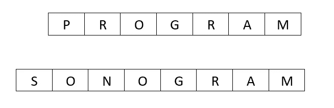
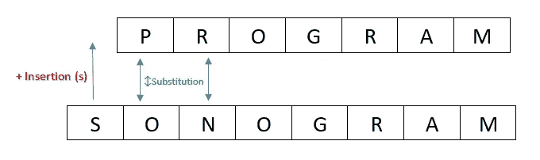
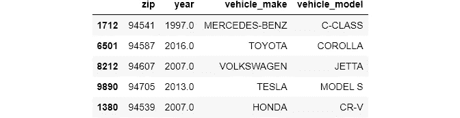
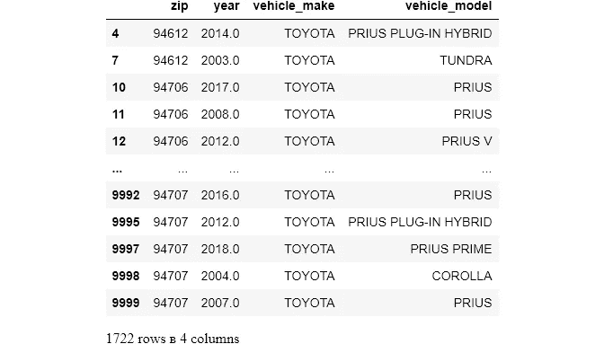
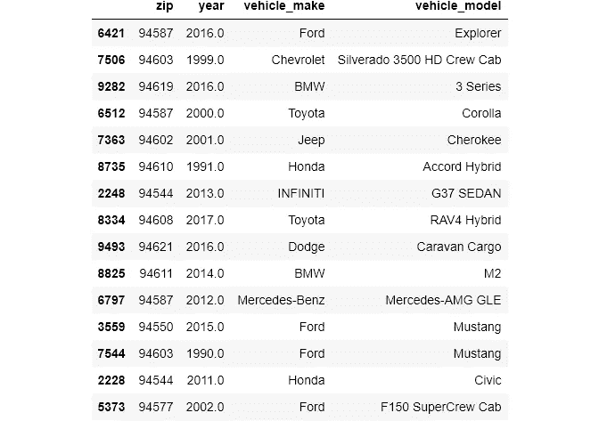

# FuzzyWuzzy:Python 中的模糊字符串匹配，初学者指南

> 原文：<https://towardsdatascience.com/fuzzywuzzy-fuzzy-string-matching-in-python-beginners-guide-9adc0edf4b35?source=collection_archive---------7----------------------->

## 以及在真实世界数据集上的实践


**照片由** [**史蒂夫·诺里斯**](https://pixabay.com/users/stephennorris-7555778/?utm_source=link-attribution&utm_medium=referral&utm_campaign=image&utm_content=3052477) **上** [**Pixabay**](https://pixabay.com/?utm_source=link-attribution&utm_medium=referral&utm_campaign=image&utm_content=3052477)

## 介绍

如果您以前处理过文本数据，您会知道它的问题是最难处理的。对于文本问题，没有一个放之四海而皆准的解决方案，对于每个数据集，你必须想出新的方法来清理你的数据。在我之前的一篇文章中，我谈到了这类问题的最坏情况:

> 例如，考虑这种最坏的情况:您正在处理一个在美国进行的调查数据，数据集中每个观察的状态都有一个 state 列。美国有 50 个州，想象一下人们能想出的各种州名。如果数据收集者决定使用缩写:ca，Ca，CA，Caliphornia，Californa，California，calipornia，calipornia，CAL，CALI，你的问题就更大了……这样的栏目总是充满了错别字、错误和不一致。

由于数据收集过程中的自由文本，经常会出现与文本相关的问题。它们将充满错别字，不一致，无论你能说出什么。当然，最基本的问题可以使用简单的正则表达式或内置的 Python 函数来解决，但是对于上面这种经常发生的情况，您必须用更复杂的工具来武装自己。

今天的特色是`fuzzywuzzy`，这是一个带有非常简单的 API 的包，可以帮助我们计算字符串相似度。

[](https://ibexorigin.medium.com/membership) [## 通过我的推荐链接加入 Medium-BEXGBoost

### 获得独家访问我的所有⚡premium⚡内容和所有媒体没有限制。支持我的工作，给我买一个…

ibexorigin.medium.com](https://ibexorigin.medium.com/membership) 

获得由强大的 AI-Alpha 信号选择和总结的最佳和最新的 ML 和 AI 论文:

[](https://alphasignal.ai/?referrer=Bex) [## 阿尔法信号|机器学习的极品。艾总结的。

### 留在循环中，不用花无数时间浏览下一个突破；我们的算法识别…

alphasignal.ai](https://alphasignal.ai/?referrer=Bex) 

## 设置

> 从[本](https://www.kaggle.com/bextuychiev/fuzzywuzzy-fuzzy-string-matching-in-python) Kaggle 笔记本或[本](https://github.com/BexTuychiev/medium_stories/tree/master/november_2020/string_matching_w_fuzzy_wuzzy) GitHub repo 获取本文使用的笔记本和数据。

## 字符串匹配是如何执行的

为了理解字符串匹配，让我们用最小编辑距离来帮助您加快速度。作为人类，如果两个或更多的字符串相似或不相似，我们没有任何问题。为了在计算机中创造这种能力，人们创造了许多算法，几乎所有的算法都依赖于最小编辑距离。

最小编辑距离(MED)是从一个字符串过渡到另一个字符串所需的最少可能的步数。MED 仅使用 4 种运算来计算:

*   插入
*   删除
*   代替
*   替换连续字符

考虑这两个词:**程序**和**声谱图**:



**图片由** [**作者**](https://medium.com/@ibexorigin)

从程序到声谱图，我们需要 3 个步骤:

1.  在“Program”的开头加上字母“S”。
2.  用 O 代替 P。
3.  用 N 代替 R。



**最小编辑距离为 3。图片由** [**作者**](https://medium.com/@ibexorigin) **提供。**

我说过，有很多算法可以计算 MED:

*   达默劳-莱文斯坦
*   莱文斯坦
*   加重平均
*   Jaro 距离

此外，还有使用这些算法的软件包:`nltk`、`fuzzywuzzy`、`textdistance`、`difflib`，...

在本文中，我们将只涉及`fuzzywuzzy`。

## 模糊不清:安装

尽管使用`pip`可以轻松完成基本安装，但对于`fuzzwuzzy`的安装还有一些其他选项或注意事项:

*   通过 PyPI 使用 PIP(标准):

`pip install fuzzywuzzy`

上述方法安装软件包的默认最新版本。起初，我用这种方法安装它。但是每当我导入它的时候，它就开始给出警告，说这个包本身很慢，我应该安装`python-Levenshtein`包来加快速度。如果你像我一样讨厌 Jupyter 笔记本上的警告，下面是你安装额外依赖项的方法:

*   直接安装`python-Levenshtein`:

`pip install python-Levenshtein`

或者

`pip install fuzzywuzzy[speedup]`

**对 Windows 用户的警告**:如果没有安装 Microsoft Visual Studio 构建工具，安装`python-Levenshtein`会失败。你可以从[这里](https://visualstudio.microsoft.com/downloads/)下载 MVS 构建工具。

## FuzzyWuzzy:WRatio 的基础

为了从`fuzzywuzzy`开始，我们首先导入`fuzz`子模块:

```
from fuzzywuzzy import fuzz
```

在这个子模块中，有 5 个函数用于两个字符串之间不同的比较方法。日常使用最灵活最好的是`WRatio`(加权比率)功能:

在这里，我们将“Python”与“Cython”进行比较。输出返回 0 到 100 之间的百分比，0 表示完全不相似，100 表示完全相同:

`fuzzywuzzy`的所有函数都不区分大小写:

`WRatio`对于不同排序的部分字符串也很好:

## 模糊:不同方法的比较

除了`WRatio`之外，还有 4 个函数可以计算字符串相似度:

*   模糊比率
*   模糊.部分 _ 比率
*   fuzz.token_sort_ratio
*   fuzz.token_set_ratio

`fuzz.ratio`非常适合长度和顺序相似的字符串:

对于不同长度的字符串，最好使用“fuzz.patial_ratio”:

如果字符串含义相同，但顺序不同，使用`fuzz.token_sort_ratio`:

更多边缘情况，有`fuzz.token_set_ratio`:

如你所见，这 5 个函数充满了警告。他们的比较完全是另一个话题，所以我给你留了一个由软件包创建者写的[文章](https://chairnerd.seatgeek.com/fuzzywuzzy-fuzzy-string-matching-in-python/)的链接，这篇文章很好地解释了他们的区别。

> 我想你已经看到了`WRatio`函数为`fuzzywuzzy`的所有函数提供了中间基础。对于许多边缘情况和不同问题，最好使用`WRatio`以获得最佳效果。

## 使用`fuzzywuzzy.process`从选项列表中提取字符串的最佳匹配

现在我们对`fuzzywuzzy`的不同功能有了一些了解，我们可以继续处理更复杂的问题。对于现实生活中的数据，大多数时候您必须从选项列表中找到与您的字符串最相似的值。考虑这个例子:

我们必须找到与`Mercedez-Benz`最匹配的，用汽车的正确拼法替换它们。我们可以对每个值进行循环，但是如果有数百万个选项可供选择，这样的过程会花费很长时间。由于这个操作非常常用，`fuzzywuzzy`为我们提供了一个有用的子模块:

```
from fuzzywuzzy import process
```

使用这个子模块，您可以从一系列字符串中提取与您的字符串最匹配的内容。让我们解决我们最初的问题:

`process.extract`中感兴趣的参数有`query`、`choices`和`limit`。该函数根据`choices`中给出的一系列选项计算`query`中给出的字符串的相似度，并返回一个元组列表。`limit`控制返回的元组数量。每个元组包含两个元素，第一个是匹配字符串，第二个是相似性得分。

在引擎盖下，`process.extract`使用默认的`WRatio`功能。但是，根据您的情况和了解 5 个功能之间的差异，您可以使用`scorer`更改评分功能:

如果你有很多选择，最好坚持使用`WRatio`，因为它最灵活。

在`process`模块中，有其他功能执行类似的操作。`process.extractOne`仅返回一个包含最高匹配分数的字符串的输出:

## 真实数据集上的模糊文本清理

现在我们准备解决一个现实世界的问题。我将加载原始数据进行练习:



```
cars.shape(8504, 4)
```

我在我的一个个人项目中使用了这个数据集，任务是根据另一个文件中给出的正确值来纠正每个车辆品牌和型号的拼写:

加载 pickle 文件后，`make_model`现在是一个字典，包含每个汽车品牌的正确拼写和每个关键字下的车型的正确拼写。

例如，让我们看看`Toyota`汽车品牌和型号的拼法:

现在，让我们对`Toyota`汽车的原始数据进行子集划分:

```
>>> cars[cars['vehicle_make'] == 'TOYOTA']
```



该数据集包含多达 100 个独特的汽车品牌，如奥迪、宾利、宝马，每一个都包含几个充满边缘案例的模型。我们不能把每一个都转换成大写或小写。我们也不知道这些是否包含任何拼写错误或不一致，视觉搜索对于这样的大数据集不是一个选项。也有一些情况下，使用多于一个单词的 make 标签用一个`space`来分隔名称，而其他标签用一个`dash`来分隔名称。如果有这么多的不一致，并且没有一个清晰的模式，请使用字符串匹配。

让我们从清理标签开始。为了便于比较，以下是两个数据集中的制作标签:

我认为差异是显而易见的。我们将使用`process.extract`将每个品牌与正确的拼写相匹配:

如您所见，存在于`make_model`中的品牌标签被转换成了正确的拼写。现在，是时候给模特贴标签了:



> 最后两个代码片段有点吓人。为了充分理解它们是如何工作的，你应该在`process.extract`上做一些练习。

这就对了。如果你不知道字符串匹配，这个任务就不可能完成，甚至正则表达式也不能帮助你。

# 如果你喜欢这篇文章，请分享并留下反馈。作为一名作家，你的支持对我来说意味着一切！

阅读更多与主题相关的文章:

[https://towards data science . com/data-type-constraints-data-range-constraints-duplicate-data-with-pandas-44897 a 350 B1 e？source=your_stories_page -](/data-type-constraints-data-range-constraints-duplicate-data-with-pandas-44897a350b1e?source=your_stories_page-------------------------------------)

[](/master-the-most-hated-task-in-ds-ml-3b9779276d7c) [## 掌握 DS/ML 中最讨厌的任务

### 用 Pandas 清理分类数据

towardsdatascience.com](/master-the-most-hated-task-in-ds-ml-3b9779276d7c) [](/meet-the-hardest-functions-of-pandas-part-i-7d1f74597e92) [## 认识熊猫最难的功能，第一部分

### 掌握 pivot_table()、stack()、unstack()的时机和方式

towardsdatascience.com](/meet-the-hardest-functions-of-pandas-part-i-7d1f74597e92)