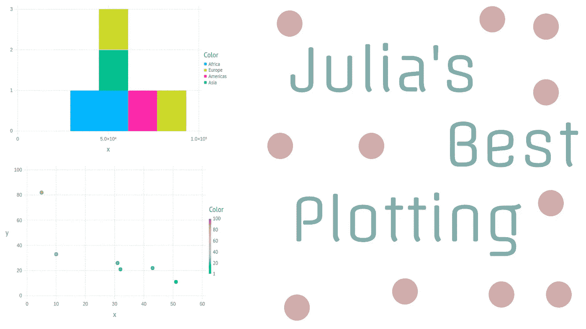
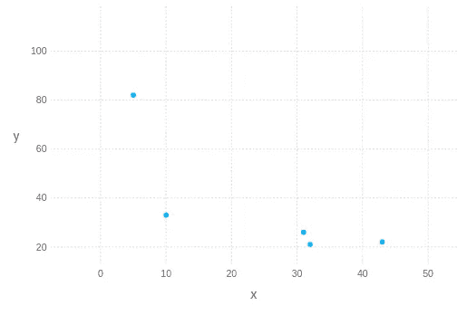
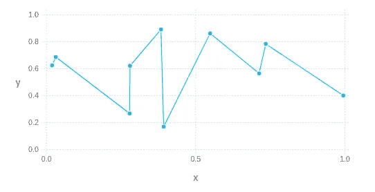
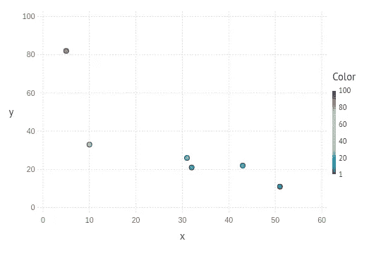
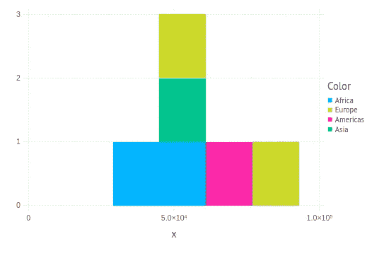
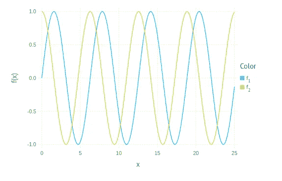

# 牛虻. JL——来自你梦中的纯朱莉娅绘图库

> 原文：<https://towardsdatascience.com/gadfly-jl-the-pure-julia-plotting-library-from-your-dreams-3ee6ca107a5c?source=collection_archive---------29----------------------->

## 看看朱莉娅对 2020 年统计绘图的最佳选择



(图片由作者提供)

# 介绍

如果您使用 Julia 的时间很短，您可能会熟悉一个名为 Plots.jl 的绘图库。Plots.jl 是一个简单的库，它通过 Plot()和 scatter()等简单的函数方法为 Plot.ly 和 Matplotlib 等 Python 库提供了端口。虽然这无疑是创建一个全新的用于 Julia 编程语言的库的好方法，但它也存在一些问题。

首先也是最重要的，用 Julia 解释 Python 会产生很多性能问题。从只是简单地导入 Plots.jl 到实际绘制值，Plots.jl 的性能绝对糟糕透顶！除了不是 Julian 之外，很多软件在 Julia 版本中是缺失的，并且很多特性完全被忽略了。虽然 GR 可能是 Plots.jl 最有前途的后端，但它缺少 Pythonic 库可能提供的许多优秀特性。尽管如此，我确实有一篇文章，你可以看看，以提高你的图形 GR 可视化技能。

[](/spruce-up-your-gr-visualizations-in-julia-88a964450a7) [## 在 Julia 中美化您的 GR 可视化

### 没错，又是 Julia，我保证 R，Scala，Python 还在这个爱情圈里

towardsdatascience.com](/spruce-up-your-gr-visualizations-in-julia-88a964450a7) 

因此，有了 Plots.jl 的这些严重的基本缺陷，很容易理解为什么科学家们在别处寻找 Julia 语言中的伟大的统计可视化。我看到的最好的选择之一是一个叫做

> 牛虻. jl。

首先，需要注意的是，牛虻与我为其创建的另一个名为 Hone.jl 的库非常相似。这两个库都使用相同的后端 Compose.jl 来在 Julia 中绘制矢量图形。相似之处可能不止于此，但它们之间也有很多关键的差异，例如 Hone 的面向对象和模块化方法与牛虻的根本不一致。尽管如此，牛虻本身确实采用了一种非常有趣的方法，并且与其他绘图库的工作方式非常不同，您可能会从中得出一些相似之处。

> [笔记本](https://github.com/emmettgb/Emmetts-DS-NoteBooks/blob/master/Julia/Gadfly%20Fun!.ipynb)

# 为什么用牛虻？

有了这些替代品，而且通常更受 Julia 用户的欢迎，你为什么还要使用牛虻呢？首先，牛虻是朱利安。这当然意味着它不仅速度快，而且非常适合 Julia 语言——这一点对于它的 Plots.jl 对应物来说就不一样了。对我来说，这是一个巨大的优势，因为你不仅不需要处理 Plots.jl 声称的性能问题，而且还变得相对简单。

牛虻的另一个伟大之处是它的开箱即用的交互性。情节本质上是互动的，可以与 Plot.ly 相提并论。这是一个在朱莉娅语言中很少见的概念，所以拥有它对牛虻来说是大胆而独特的。

# 牛虻简介

牛虻. jl 表面上遵循了大多数 Julia 用户熟悉的简单方法论。我们可以使用 plot()方法创建一个简单的绘图，带有两个关键字参数，X 和 y。

```
using Gadfly
data = Dict([:X => [5,10,32,31,51,43], :Y => [82, 33, 21, 26, 11, 22]])plot(x=data[:X], y=data[:Y])
```



(图片由作者提供)

这是事情变得有点不同的地方。在牛虻中，有一个名为“Geom.jl”的导出模块。与其使用单独的方法来创建线图，我们可以简单地使用相同的方法，只是从该模块添加几何图形。

```
plot(x=rand(10), y=rand(10), Geom.point, Geom.line)
```



(图片由作者提供)

同样，我们可以添加一个颜色关键字参数来改变几何图形的颜色。

```
plot(x=data[:X], y=data[:Y], color=data[:Y])
```



(图片由作者提供)

此外，我们可以使用 Geom.jl 模块中的更多几何图形，例如直方图:

```
data = Dict(:Location => ["Africa", "Europe", "Africa", "Americas", "Asia", "Europe"], 
    :Income => [29000, 83000, 56000, 76000, 52000, 46000])plot(x=data[:Income], color=data[:Location], Geom.histogram)
```



(图片由作者提供)

您还可以使用牛虻快速绘制语法结果，这样可以快速得到如下结果:

```
plot([sin, cos], 0, 25)
```



(图片由作者提供)

# 结论

jl 是一个非常棒的绘图库，它采用了一种有趣的方法来解决我们以前见过的用其他方法解决的问题。在我个人看来，该模块采用的方法使它比许多竞争对手更好用，也更容易使用。最重要的是，它当然是用纯 Julia 编写的，这给了它速度和易用性，这是该语言中类似包无法比拟的。

总的来说，我想说如果你正在用 Julia 语言处理大量的数据，那么牛虻绝对值得一个 Pkg.add()。它将为您提供查看数据的方法，这将大大提高您对 Plots.jl 等工具的理解和分析能力。虽然我肯定会说 Plots.jl 仍然可能有它的位置，而且肯定有它的用途，但我也想暗示牛虻作为朱莉娅梦想的绘图库完全超过了它。