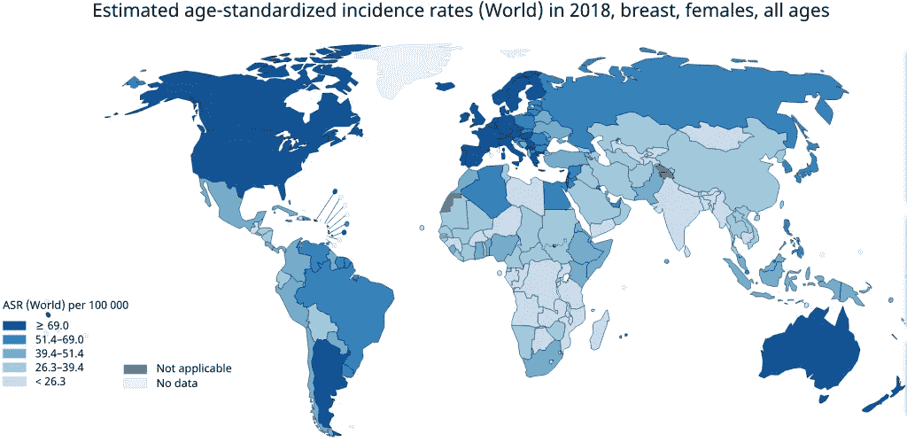

# 乳腺癌风险的盖尔模型

> 原文：<https://towardsdatascience.com/gail-model-for-breast-cancer-risk-34bf6b147f41?source=collection_archive---------32----------------------->

乳腺癌是全世界女性中诊断最多的癌症，每年有超过 200 万新病例。患者的治疗通常会给妇女及其家人带来巨大的压力。这种疾病的存活率在世界范围内各不相同。晚期和转移性乳腺癌目前无法治愈，而早期诊断的局部癌症有 99%的存活率。因此，早期发现仍然是降低乳腺癌发病率和死亡率的最佳途径。

来源:[http://mammalive . net/research/global-breast-cancer-incidence-2018/](http://mammalive.net/research/global-breast-cancer-incidence-2018/)

成功预防乳腺癌的第一步是了解患者的风险。网上有很多工具，但并不是所有的工具都有高质量的研究支持。在这篇文章中，我展示了 Gail 模型的 Python 实现，该模型允许妇女估计她们在特定时期内患浸润性乳腺癌的风险。

盖尔模型基于乳腺癌筛查研究的数据，该研究涉及超过 280，000 名不同年龄和种族的女性。该工具根据以下个人和家庭信息评估患者的风险:

*   年龄
*   月经开始时的年龄
*   第一次活产婴儿的年龄
*   患乳腺癌的一级亲属人数
*   先前乳房活检的数量
*   活检中存在非典型增生

盖尔模型已经在大规模人群中进行了测试，并已被证明可以提供乳腺癌风险的准确估计，特别是在白人女性中。它也被[美国国家乳腺癌研究所](https://bcrisktool.cancer.gov/index.html)以及其他知名机构和医院使用。该模型的源代码可以从癌症流行病学和遗传学分部[网站](https://dceg.cancer.gov/about/organization/programs-ebp/bb/resources)获得。然而，它们只提供了 R 和 SAS 宏实现，这对于所有 Python 爱好者来说都是一个遗憾。

因此，我把最新版本的 BRCA 包翻译成了 Python。这一更新版本包括一个基于旧金山湾区乳腺癌研究(SFBCS)的新的西班牙裔模型。据我所知，这是 Gail 模型扩展版本的第一个 Python 实现。这个包的代码可以在这个库中找到。

该软件包包含几个函数，用于计算乳腺癌的相对和绝对风险。这个包里的主要功能是`absolute_risk`。它使用患者数据来预测特定时间段内患乳腺癌的概率。它还可以用来预测平均人群风险，并将其与患者的结果进行比较。`recode_check`将输入数据重新编码为适合`absolute_risk`的格式。`relative_risk`功能估计风险因素组合的相对风险。它将年龄分为两组:50 岁以上和 50 岁以下。最后，`risk_summary`创建一个包含所有相对风险和绝对风险的数据框架。其输出可用于进一步分析。

在工作中可以随意使用这个包！请注意，对软件包的任何更改/修改都将由您自己承担风险。我确保当前版本产生与官方 Python 实现相同的结果。如果您有任何问题，请查看 BRCA 官方文档或给我发邮件！

页（page 的缩写）虽然一个人的风险可能很高，但这并不一定意味着他们会患乳腺癌。一些没有患乳腺癌的女性比一些患乳腺癌的女性有更高的风险评估。因此，所有女性在 45 岁以后都必须每年进行一次乳房 x 光检查。保持健康！