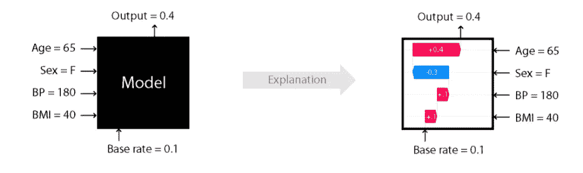
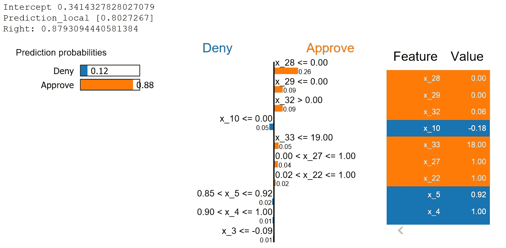
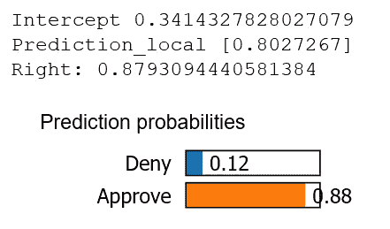
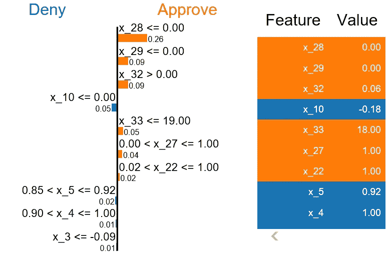
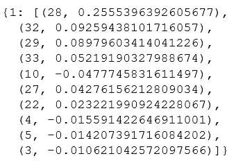
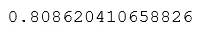
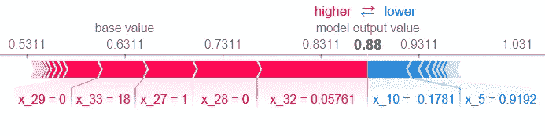
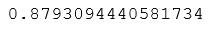
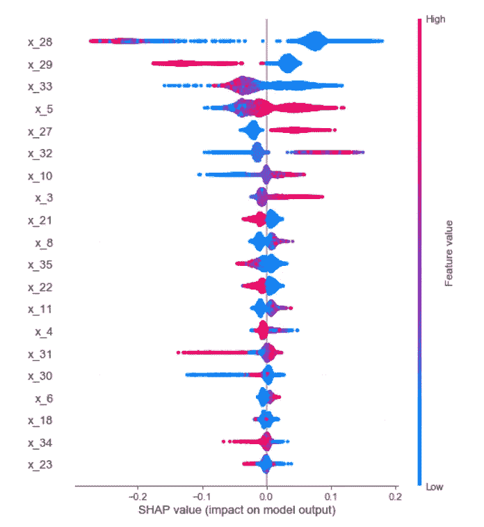

# 获得对你的模型的信任，用石灰和 SHAP 做出解释

> 原文：<https://towardsdatascience.com/gain-trust-in-your-model-and-generate-explanations-with-lime-and-shap-94288694c154?source=collection_archive---------23----------------------->

## [模型可解释性](https://towardsdatascience.com/tagged/model-interpretability)


照片由[瑞秋](https://unsplash.com/@noguidebook?utm_source=medium&utm_medium=referral)在 [Unsplash](https://unsplash.com?utm_source=medium&utm_medium=referral) 上拍摄

使用机器学习来自动化流程在全球许多组织中被广泛采用。作为戴尔数据科学工厂团队的一员，我们与不同的业务部门合作，提供基于数据的创新解决方案来优化现有流程。

在我们与定价业务部门的一次合作中，我们专注于改进导致许多延迟的手动密集型流程。手动流程包括审计销售代表提交的交易(其中一些产品的价格低于某一点)，并根据交易的特点决定是批准还是拒绝交易(您可以在此处阅读更多信息)。如果交易被拒绝，定价分析师应向销售代表提供解释。提供解释可以帮助销售代表调整交易，使其获得批准，这对双方都有利。

由于这非常耗时，并可能导致失去机会，我们希望通过减少需要手动审查的交易量来优化它。为了实现这一点，我们使用机器学习来自动批准和自动拒绝较简单的案例，这使得分析师可以专注于更复杂的交易，从而产生更多价值。

为了保持相同的质量水平，并在用户之间建立信任(这在实现机器学习模型时非常关键)，我们必须了解决策是如何做出的。考虑到这一点，我寻找现有的工具来支持我们正在进行的转型，我遇到了莱姆和 SHAP。在整个过程中，我检查了两种方法的数据，以了解哪种方法更适合我，我获得了很多知识，我想分享。在这篇博文中，我将分享我所学到的东西，并分享一些帮助我更好地理解每个工具如何工作的细节。

这篇博文将涵盖以下内容:

1.SHAP 和莱姆-背景

2.例子

3.摘要

4.进一步阅读

# 1.SHAP 和莱姆-背景

LIME(局部可解释模型不可知解释)提供局部解释；它可以帮助解释为什么单个数据点被归类为特定的类。LIME 将模型视为黑盒；它不区分随机森林、决策树或神经网络。它使用线性模型来提供局部解释。围绕 LIME 的主要概念是，即使线性模型不能很好地解释复杂的数据/模型，但当试图解释局部观察时，它可以提供足够的解释。下面你可以看到一个解释石灰直觉的图。这是摘自论文:[“我为什么要相信你？”解释任何分类器的预测。](https://arxiv.org/abs/1602.04938)

LIME 提供了三种不同的解释器:表格解释器(将重点介绍)、图像解释器和文本解释器来处理不同类型的数据。


从上面提到的论文中，有一个例子证明了关于石灰的直觉

SHAP(SHapley Additive explaints)旨在通过计算每个特征对预测的贡献来解释单个数据点的预测。生成的解释是基于从联盟博弈论中计算 Shapley 值(你可以在这里[阅读更多信息](https://en.wikipedia.org/wiki/Shapley_value))。它基于下面的场景:假设你作为团队的一员玩某个游戏，团队赢了，结果赚了一些钱(支出)。在玩家之间分配奖金的最佳方式是什么，以最好地反映每个玩家对游戏的贡献？在我们的案例中，我们希望了解如何在模型中的不同特征(玩家)之间划分预测(支出)，以最好地反映每个特征所做的贡献。

一般来说，要计算某个特征对预测的贡献，应该获取不包含该特征的所有子集，并计算添加该特征前后的预测之间的差异，然后对不同的子集进行平均。

所描述的过程可能计算量很大，而且运行一个没有某个特征的模型会创建一个全新的模型，这不是我们想要解释/理解的(你可以在 Adi Watzman 的[这个](https://www.youtube.com/watch?v=0yXtdkIL3Xk)精彩讲座中听到更多)。幸运的是，SHAP 使用不同的近似和优化方法克服了这些困难。

SHAP 提供了三种不同的解释器:KernalSHAP，它与 LIME 类似，是模型不可知的，TreeSHAP 是针对基于树的模型优化的，DeepSHAP 是深度学习模型中 SHAP 值的高速近似算法。

在这篇文章中，我将重点介绍树解释器，因为我们在项目中使用了基于树的模型。



一个展示 SHAP 输入和输出的例子，摘自 SHAP 的 GitHub 页面

# 2.例子

继续看一些基于我们使用案例的例子，使用石灰和 SHAP。

## 石灰

为了提供一个解释，首先我们必须创建一个解释器。解释者应该得到以下信息:

*   我们应该指定我们是在处理回归模型还是分类模型。
*   我们应该传递我们的训练数据、特性名和类名(这是可选的，默认为 0 和 1)。
*   Verbose-表示我们是否希望在解释中提供更多的细节。
*   因为在这个过程中有一些随机性，为了能够重现结果，您还应该设置 random_state 变量。

```
from lime.lime_tabular import LimeTabularExplainerlime_explainer = LimeTabularExplainer(train_data.values, 
mode = ’classification’, feature_names = new_feature_names, class_names = [‘Deny’, ’Approve’], verbose=True, 
random_state = 42)
```

**关于分类特征的补充说明** -如果你的模型包含分类变量，事情会变得复杂一些。这里有一个简短的解释:为了提供解释，LIME 使用原始数据集对我们想要解释的观察周围的数据点进行采样。如果我们提供的数据中的分类变量采用统一的编码格式，那么采样过程可能会创建不太可能出现在数据中的样本，并且生成的解释不会代表实际数据。为了克服这一点，分类特征应该被转换成整数标签，为了了解更多关于如何使用带有分类特征的 LIME，我鼓励你观看凯文·勒芒恩的[演讲](https://www.youtube.com/watch?v=C80SQe16Rao&t=2355s)，或者访问他的 [GitHub](https://github.com/klemag) 页面。

解释器设置好之后，让我们生成一个解释。要获得解释，您应该提供以下信息:

*   你想解释的例子。
*   生成概率的函数(在分类模型的情况下)，或者预测数据集的函数(在回归模型的情况下)(在我们的情况下是 predict_proba)。
*   您还可以指定用于构建局部线性模型的最大要素数，目前我们使用默认值 10。

```
exp = lime_explainer.explain_instance(instance, trained_model.predict_proba)exp.show_in_notebook(show_table=True)
```

接下来，让我们检查输出:



作者图片

在顶部，呈现了由 LIME 创建的线性模型的截距，随后是由线性模型生成的局部预测，以及来自我们的模型的实际预测(这是将 explainer 中的 verbose 设置为 True 的结果)。如您所见，线性模型生成的预测和我们的模型生成的结果非常接近。接下来，您可以看到每个类别的概率，就像原始模型预测的那样。



作者图片

在最右边，您可以看到特定观察的每个特性的值。这些特征根据其所属的类别进行颜色编码；橙色的特征促成了交易的批准，而蓝色的特征促成了交易的拒绝。此外，它们按对预测的影响进行排序，影响最大的要素位于顶部。在中间的图表中，您还可以看到每个类别中每个特征的大小。理解这一点也很重要，为了提供更直观的解释，数值被离散化成几组，这就是为什么在中间的图表中，特征沿着一定的范围提供。这是 LIME 中的默认值，可以通过将变量 dicretize_continuous 设置为 false 来更改。



作者图片

您可以通过运行以下代码获得有关生成的本地模型的更多信息:

```
print(‘R²: ‘+str(exp.score))
```


作者图片

这会给我们本地模型的 R 平方，我们可以用分数来决定我们是否可以相信某个解释。

此外，您可以使用以下代码访问模型中每个特性的权重:

```
exp.local_exp
```



作者图片

对权重和截距求和将导致由 LIME 生成的局部预测。

```
exp.intercept[1] + sum([weight[1] for weight in exp.local_exp[1]])
```



作者图片

## SHAP

转到 TreeSHAP，让我们为我们用于 LIME 的同一个实例生成一个解释。

首先，与 LIME 类似，我们应该导入 SHAP，创建解释器并传入训练好的模型:

```
import shap
shap.initjs() #This is for us to be able to see the visualizations 
explainer = shap.TreeExplainer(trained_model)
```

接下来，让我们生成一个解释并将其可视化。第一行计算我们提供的实例的 SHAP 值，下一行生成一个图，该图将显示每个特征对最终预测的贡献。SHAP 所做的计算是针对**两个类别进行的，这里您应该使用索引**选择您想要引用的类别(在回归模型中不需要)，在这种情况下，我想探究批准类别(类别 1)的结果。

为了计算我们想要解释的实例的 SHAP 值，您应该提供实例本身，并且为了生成绘图，您应该提供以下内容:

*   解释器生成的期望值，本质上是训练集预测的平均值，也称为基值。
*   接下来，您应该提供在前一行中计算的 SHAP 值(这些是每个要素对模型预测的贡献)。
*   您要解释的实例和功能名称。

```
shap_values = explainer.shap_values(instance)shap.force_plot(base_value=explainer.expected_value[1], shap_values[1], features=instance, feature_names=new_feature_names)
```

下图中的粗体数字是我们的预测。在左侧，您可以看到基值，如前所述，它是我们训练集中预测的平均值。顾名思义，这是我们预测的起始值，将模型中各要素的贡献相加，将得到我们的最终预测。



作者图片

特征以这样的方式排列，使得促成交易批准(类别 1)的所有特征在左边，并且用红色着色，并且促成交易拒绝(类别 0)的所有特征在右边，用蓝色着色。请注意，每一侧的要素都是按大小排序的，这在每个要素所占的空间中也很明显。您可能还会注意到，在图表的边缘，有一些附加要素也对不同的类有所贡献，但它们的贡献远远小于所显示的那些，您可以将鼠标悬停在图中的边缘，您将能够看到这些要素的名称及其值。

TreeSHAP 利用树的结构，可以计算精确值而不是近似值。将预期/基础值相加将生成准确的预测，如下所示。

```
explainer.expected_value[1] + sum(shap_values[1])
```



作者图片

SHAP 还提供了不同的可视化效果，可以根据您选择的类为您提供每个功能行为的总体概述。为此，首先您应该计算整个测试数据的 SHAP 值(注意这可能需要一些时间)，让我们看一个例子:

```
test_shap_values = explainer.shap_values(test_data.values)
shap.summary_plot(shap_values[1], test_data.values)
```



作者图片

让我们检查图表的不同方面:

*   x 轴代表对预测的贡献，这些是 SHAP 值。
*   左侧的 y 轴显示影响最大的特征(您可以指定想要显示的特征数量-默认值为 20)。这些特征按其对预测的影响进行排序，其中影响最大的位于顶部。
*   右侧的 y 轴表示如何解释每个特征的原始值。在每一行中，数据点用蓝色或红色着色，蓝色表示该特征的低值，红色表示该特征的高值。
*   该图由一条水平线分隔，在图的右侧，您可以看到促成交易批准的数据点，在图的左侧，您可以看到促成交易否决的数据点。
*   例如，特征 x_29 中的低值将有助于批准类，而高值将有助于拒绝类。

这可以帮助您了解功能是否像 SME(主题专家)期望的那样运行，并且可以帮助我们找到以前没有注意到的与数据相关的问题。

在 SHAP 还有其他的全球可视化选项，查看作者的 GitHub 页面可以看到不同的选项。

# 3.摘要

在这篇博文中，我与你分享了我使用工具来解释 ML 模型的动机，我们回顾了莱姆和 SHAP 的基础知识，并给出了基于我们用例的例子。

回顾我们所做的工作，我觉得这些工具的使用在我们的业务合作伙伴之间产生了信任，这使得我们构建的模型的实施更加顺利。此外，使用这些工具确实帮助我们发现了一些与数据相关的问题，并最终得以解决。

莱姆和 SHAP 都是很好的工具，你可以用来建立信任，也可以用来解释你所做的某个决定。当我们在相同的情况下检查两者时，我们注意到大多数影响变量在石灰和 SHAP 中几乎是相同的。但是，两者之间的顺序有点不同。

LIME 的主要优点是速度更快(至少对于表格数据来说是这样)，而且它的工作方式非常直观。然而，生成的解释有时可能不可靠，为了使用它，需要做一些预处理。SHAP 易于使用，还可以提供要素的总体视图，以及要素值对模型预测的影响。此外，TreeSHAP 利用了树的结构，并计算精确的值，而不是近似值，但是在向业务合作伙伴解释时不太直观。

如果你想了解更多关于这两个工具的知识，我鼓励你看看这篇文章中嵌入的链接，以及下面的链接。

# 4.进一步阅读

以下是一些额外的阅读推荐:

1.  [用 SHAP 价值观解释你的模型](/explain-your-model-with-the-shap-values-bc36aac4de3d)——这是一篇很棒的博客文章，用一个数字例子来解释 SHAP。
2.  [一个让黑盒模型变得可解释的指南](https://christophm.github.io/interpretable-ml-book/) -提供了可解释模型、石灰、SHAP 等等的全面补偿！
3.  [本地可解释的模型不可知解释(LIME):介绍](https://www.oreilly.com/content/introduction-to-local-interpretable-model-agnostic-explanations-lime/)——LIME 作者写的博客文章。

特别感谢 Or Herman-Saffar 和 Idan Richman-Goshen 对这篇博文的评论和宝贵反馈。