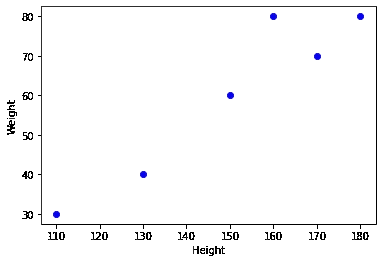
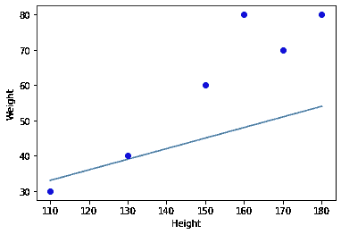
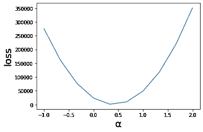

# 从 16 行代码中获得神经网络的直觉

> 原文：<https://towardsdatascience.com/gaining-an-intuition-for-neural-networks-c720b111031f?source=collection_archive---------22----------------------->


艾莉娜·格鲁布尼亚克在 [Unsplash](https://unsplash.com/s/photos/neural-network?utm_source=unsplash&utm_medium=referral&utm_content=creditCopyText) 上的照片

神经网络相当令人困惑，尤其是当你从头开始编程的时候。本文将通过创建和训练一个单变量回归模型(在输入和输出之间有一个突触),让您直观地了解神经网络工作所需的相关概念。

## 神经网络是如何工作的？

假设你是一名医生，你希望找到身高和体重之间的定量关系:也就是说，你希望能够可靠地预测某人的体重，给定他们的身高。

到目前为止，你有 5 个人的身高和体重数据。这是在笛卡尔平面上绘制数据时的图表:



作者图片

当我们看这个图表时，我们可以想象出一条线来最好地解释这些数据，但是我们想对此进行量化。这就是使用神经网络的地方，或者在这种情况下，我们的单变量回归模型。

神经网络保存一个奇异变量α，当乘以给定的身高时，给出预测的体重。让我们随机生成α，并将其绘制在我们的图表上:



我们可以看到这条线没有很好地包含数据。它对数据的量化有多糟糕？测量蓝点和这条线之间的距离，并将它们相加。平方这个值。为什么值是平方？两个原因:

*   为了防止负数不受惩罚

距离较远的负数(线下的点)仍然是不准确的预测。当我们平方它们时，它们变成正数

*   惩罚更大的距离

100–3 = 97，但是 100–3 = 9991。距离越大，网络受到的惩罚就越多。

这是均方误差损失函数，衡量网络预测数据的好坏。这个值越大，模型越差。

神经网络的目标是减少这种损失函数，从而使预测更加准确。我们如何做到这一点？我们不能改变数据，我们唯一能改变的值是α。

现在，我们不太确定α的最佳值是多少，所以我们测试了不同的α值，记录了损失值，并绘制在图表上。因为我们想找到α的哪个值使损失值最低，所以需要找到最低点。在这种情况下，介于 0 和 0.5 之间。



我们如何让计算机来做这件事？我们发现了一种叫做导数的东西。导数是图形在某一点的陡度。也是图形的梯度。我们要计算的是损失对α的导数，也就是说，当给定点 a 时，图有多陡。

但是我们不能把这两个变量直接联系起来，因为它们之间没有直接关系。我们用高度值乘以α，然后用它来计算损失。

为了计算α和损失之间的导数，我们必须计算损失和预测值之间的导数，然后计算预测值和α之间的导数。最后，我们将它们相乘，找出损失值与α之间的导数。

损失值和预测值(高度* α)之间的导数是 2 *(真实-预测)，因为 x 的导数是 2x。预测值和 alpha 之间的导数就是数据，因为 alpha 要乘以数据。

为了简单起见，不使用列表，我将体重身高的例子改为只预测值 2，作为 alpha。代码如下:

```
import numpy as np
x = 2
y = x*2alpha = np.random.randn()for i in range(100):
    pred = alpha*x
    loss = np.square((y-pred))dloss_dpred = 2*(y-pred)
    dpred_dalpha = x
    dloss_dalpha = dloss_dpred * dpred_dalphaalpha += dloss_dalpha*0.1
alpha
```

第 1 行:Python 中的一个有用工具。在这种情况下，它用于生成随机值。

第 2–3 行:网络试图计算出 x 乘以多少得到 y。它应该趋向于 2。

第 5 行:这是变量 alpha 的随机生成。

第 7–12 行:这段代码计算导数并将它们相乘。

第 15 行:Alpha 向正确的方向变化，一点一点，直到趋于最佳值。

这个程序应该输出 2 作为结果。