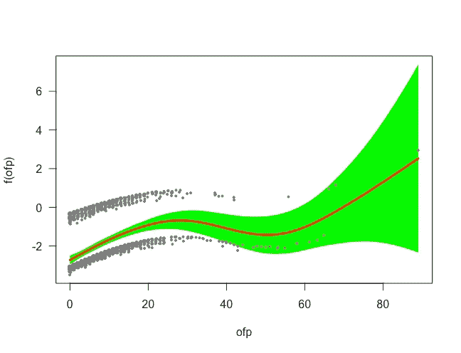
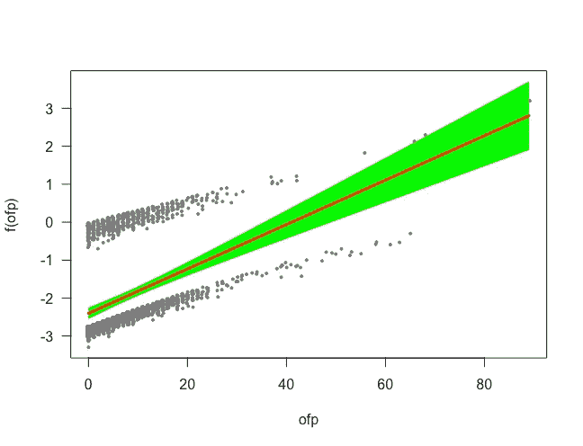
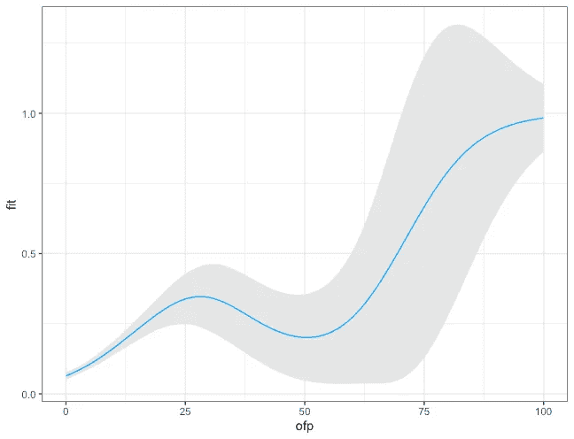

# 找到甘了吗？保持可解释性的灵活建模方法

> 原文：<https://towardsdatascience.com/gam-a-flexible-modeling-approach-that-preserves-interpretability-a68a4f235b6e?source=collection_archive---------30----------------------->


[皮特](https://unsplash.com/@pieterpanflute)在 [Unsplash](http://www.unsplash.com) 上的照片

在许多社会科学和商业问题中，解释现象发生的原因往往比提高模型对事件发生的可预测性更重要。因此，拥有一个可解释的模型对于理解不同因素如何与感兴趣的结果相互作用是至关重要的。

该模型的可解释性在高度监管的业务环境中也很重要，例如贷款审批决策。即使在预测准确性比“为什么”更重要的情况下，可解释的模型也可以帮助调试更复杂的模型，并指导特征工程和数据预处理的新方法。

# 游戏——引擎盖下

在这种情况下，广义加法模型(GAM)在简单模型(如我们用线性回归拟合的模型)和更复杂的机器学习模型(如神经网络)之间提供了一个中间地带，神经网络通常承诺比简单模型具有更好的预测性能。GAM 还可以用于各种任务:回归、分类、二元选择。

在线性回归中，我们将结果 y 建模为两个输入 X₁和 X₂的函数，如下所示:

> y = β₁X₁ + β₂ X₂ + u

在 GAM 中，β Xᵢ被 f(Xᵢ代替，其中 f()可以是任意非线性函数。换句话说，GAM 由输入上的光滑函数 f()的和组成。想法仍然是，每个输入特征对响应做出单独的贡献，这些只是相加，但是这些贡献不必与输入严格成比例。这种方法的美妙之处在于，类似于线性回归中的β，部分响应函数 f()仍然捕捉结果 y 的变化以改变输入。预测的变化取决于 Xᵢ.的初始值

处理回归模型中非线性关系的一种常用方法是创建多项式要素。对于预测因子 Xᵢ，我们加入了二次项(Xᵢ)、三次项(Xᵢ)等，以获得更好的拟合。GAM 包含了这个想法，但是还包含了一个额外的方面:*惩罚估计*。这个想法类似于脊或套索回归，其中添加了惩罚项以帮助避免过度拟合。

创建变量变换的另一种方法是将变量切割成不同的区域，并分别适合这些区域。然而，不同的拟合可能是不相关的，导致有时对相近值的预测明显不同。GAM 允许用户在变量中指定`knots`的数量，用于创建分段，在每个分段上分别拟合三次多项式，然后连接起来创建一条连续曲线。

## 那么应该用什么平滑函数呢？

在 **R** 中的 *mgcv* 包中有很多 smooth，可以通过 **smooth.terms** ( [链接](http://www.inside-r.org/r-doc/mgcv/smooth.terms))的帮助文件了解更多。默认的是薄板回归样条(TPRS)，它在一般情况下性能很好。三次样条也是一种常见的基础，反映了为协变量添加多项式项。

# 在 R 中实现

我们使用“r”中的`mgcv`包来实现 gam，并使用来自包`[catdata](https://cran.r-project.org/web/packages/catdata/catdata.pdf)`的内置数据集`medcare`来说明 gam，并使用逻辑回归与性能进行比较。

`medcare` 数据收集自 4406 名年龄在 66 岁及以上的个人，他们都有公共保险计划。结果变量是`healthpoor`，这是一个二元变量，如果个人报告健康状况不佳，则等于 1，否则等于 0。我们很想知道`ofp`，医生诊所就诊的次数，可能与健康结果有什么关联。人们可以假设这两个变量之间的非线性关系:一个健康的人去看医生的次数很少，但是看更多的医生也可以让病人变得更健康。所以我们对更灵活的建模方法感兴趣。

*mgcv* 将`gam`视为`glm`的一般化版本，因此可以直接调用`gam`方法来使用`glm`方法，例如线性和逻辑回归。

```
library(catdata)
library(mgcv)
library(Metrics)
library(ggplot2)
library(visreg)data(medcare)#### logit model (same as running glm with family set to "binomial")
lm <- gam(healthpoor ~ male+ age + ofp, family = binomial, data = medcare)
pred <- predict(lm, type="response")
lm_auc <- Metrics::auc(medcare$healthpoor, pred)
lm_auc#### generalized additive model
gam <- gam(healthpoor ~ male+s(age)+s(ofp), family = binomial, data = medcare)
pred <- predict(gam, type="response")
gam_auc <- Metrics::auc(medcare$healthpoor, pred)
gam_auc
```

gam 公式中的 [s()](https://stat.ethz.ch/R-manual/R-devel/library/mgcv/html/s.html) 项表示要平滑的项。有几个选项可以传递给 s()术语—例如，您可以指定不同的平滑函数`bs`和不同的结数`k`。

如果唯一值的数量小于基数的数量(例如，当您试图将`s()`添加到类似`male`的二进制变量时)，该函数将返回以下错误:

> 一个项的唯一协变量组合比指定的最大自由度少。

使用`visreg`来可视化`ofp`的拟合项，我们可以看到`gam`产生了对`ofp`更加细致入微的预测，而逻辑回归的预测更加线性。

```
visreg(gam, "ofp", jitter=TRUE, line=list(col="red"),
       fill=list(col="green"))
```

`gam`模型也产生了略好的 AUC，0.679，相比之下，逻辑回归模型的 AUC 为 0.673。



基于 ofp 的 I 预测:gam(左)，logistic 回归(右)。作者法师。

## 解释

我们最终感兴趣的是估计`ofp`在`healthpoor`概率上的变化。为此，我们需要将其他特性的值固定为它们的平均值或模式(如果该特性是一个分类变量)。然后，我们创建一个测试数据帧，其中包含一系列可能的值`ofp`。

```
# function to get mode of an array of values
getmode <- function(v) {
  uniqv <- unique(v)
  uniqv[which.max(tabulate(match(v, uniqv)))]
}testdata = data.frame(ofp = seq(0, 100, length = 101),
                      male = getmode(gam$model$male),
                      age = mean(gam$model$age))
```

使用`predict`函数，我们可以将之前拟合的 gam 模型外推至测试数据。该图显示，在保持其他变量不变的情况下，`ofp`与报告健康状况不佳的可能性呈非线性关系。此外，在 ofp 较高的地区，置信区间不太紧。

```
fits = predict(gam, newdata=testdata, type='response', se=T)### create a confidence interval for the fits
predicts = data.frame(testdata, fits) %>% 
  mutate(lower = fit - 1.96*se.fit,
         upper = fit + 1.96*se.fit)ggplot(aes(x=ofp,y=fit), data=predicts) +
  geom_ribbon(aes(ymin = lower, ymax=upper), fill='gray90') +
  geom_line(color='#00aaff') +theme_bw()
```



图片作者。

# 参考

有关 GAM 的更多信息:

*   [https://m-clark.github.io/generalized-additive-models](https://m-clark.github.io/generalized-additive-models)
*   [https://www . rdocumentation . org/packages/mgcv/versions/1.8-31/topics/gam](https://www.rdocumentation.org/packages/mgcv/versions/1.8-31/topics/gam)
*   [https://noamross.github.io/gams-in-r-course/](https://noamross.github.io/gams-in-r-course/)