# 用统计学家的大脑赌博。

> 原文：<https://towardsdatascience.com/gambling-with-a-statisticians-brain-ae4e0b854ca2?source=collection_archive---------18----------------------->

## *利用蒙特卡洛模拟分析赌场的胜算*


我在澳门威尼斯人赌场外徘徊(赌场内禁止拍照)

让我从我在 ***赌场的经历*** 说起，让它变得更有趣。2016 年，我在威尼斯人的世界第二大赌场**澳门**那里，在不同的游戏上试试运气，直到我到达轮盘老虎机。你可以想象，这里的气氛是超现实的，灯光闪烁，富人聚精会神地坐着，眼睛盯着老虎机和摆满“免费酒瓶”的桌子。


这是我的故事，我在赌场有 1000 美元(港币)可以花。在两个小时内，我在轮盘赌机器上赚了大约 3500 美元(港币),但是谁在赢了之后停下来。在看了一段时间人们玩不同的游戏后，我开始玩轮盘赌是在晚上 8 点(当地时间)。但是，我最终在赌场呆到了第二天早上 5 点，净赚了 1000 港币。我所有的钱都浪费在享受 9 个小时的“蒙特卡洛模拟”上了，赢的几率还不到 0.5%。玩笑归玩笑，我的一个统计学家朋友总是告诉我，赌博是零和/负和游戏，但是在赌场里，像我这样天真的人/游客很容易被显示器上显示的最后 20 个结果所诱惑(赌徒谬误)。

# **现在，至少我们有统计学和蒙特卡罗模拟来分析同样的问题。**

现在，让我从解释赌场游戏的赔率开始。我将尝试解释一个游戏，并使它简单化，便于我们的计算。让我们选择游戏大和小(原文如此)。庄家将洗牌 3 个骰子，这可能导致从(1，1，1)到(6，6，6)的任何组合。有两个选项可供选择，小(4 到 10 之和)或大(11 到 17 之和)。我会解释为什么我有一段时间没有包括 3 和 18 的总和(类似的游戏在印度到处都很常见，被称为 7 上 7 下)。现在，我们可以选择小的或大的。让我们假设支出是 1:1，这意味着如果你赢了，你可以拿回你的赌注，如果你输了，你会失去同样的金额。到目前为止，你可能会认为小企业和大企业的几率是一样的，但这是几率发生变化的地方。对于三胞胎来说，支付模式有所调整，这使得游戏更有利于玩家。为了我们的计算，让我们假设在三胞胎的情况下我们不会得到报酬。选小选大和我们差不多。因此，让我们选择小的计算。

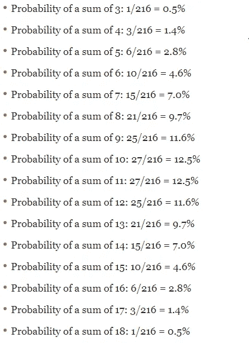

[https://www . thoughtco . com/probabilities-for-rolling three-dice-3126558](https://www.thoughtco.com/probabilities-for-rolling-three-dice-3126558)

如果我们选择小，我们的胜算将是 105/216(不包括三胞胎(1，1，1)和(2，2，2))。即 48.61%。所以，因此，房子赔率将是 51.39%。即使这样，你也会想，这么少的钱会对我有什么影响呢？对吗？嗯，我会通过蒙特卡洛模拟给你看。

***事实:***

1.  欧洲轮盘赌的最低赔率是 2.7% ( 52.7%的人看好房子)。
2.  与其他赌场游戏相比，二十一点是我们胜算较大的游戏之一。

# **进入蒙特卡洛世界**

举例来说，我假设我有 50000 美元，我将在每场比赛中下注 500 美元。现在，首先，让我们考虑上面计算的赔率值为 48.6%，让我们计算一下，如果我分别玩 5 场、50 场、5000 场、1000 场和 10000 场游戏，我最终可能会有多少钱。

让我们导入库并创建一个输赢函数。我们将使用均匀随机生成一个介于 0 和 1 之间的概率，然后使用 win_odds 概率来决定我们是赢还是输(根据赔率)。

注意:即使你对 python 或编程不熟悉，也可以试着只阅读文本并理解故事。

```
#Import required librariesimport randomimport pandas as pdimport numpy as npimport matplotlib.pyplot as pltimport seaborn as sns#win_odds take the probability of winning, returns true if prob lies between 0 and win_oddsdef win_or_lose(win_odds):dice = random.uniform(0,1)if dice <=win_odds:return Trueelif dice > win_odds:return False
```

下面的 play 函数将接受输入—手中的筹码(此处为 50000 美元)、下注金额(500 美元)、总下注数和 win_odds 概率，并在游戏结束后返回最终更新的金额(使用赢/输赔率)。

```
#chips_in_hand is the amount of chips a player has in hand#betting amount is the amount a player bets in each game#total_bets is the number of bets in one seatingdef play(chips_in_hand, betting_amount, total_bets, win_odds):game_num = []updated_chips = []game = 1#lets bet for the number of bets we have in the argument and append the value of chips in hand after each bet in updated_chips listwhile game <= total_bets:#If we winif win_or_lose(win_odds):#Add the win amount to our chips valuechips_in_hand = chips_in_hand + betting_amountgame_num.append(game)#Append the updated_chips value after each gameupdated_chips.append(chips_in_hand)#If the house winselse:#Add the money to our fundschips_in_hand = chips_in_hand — betting_amountgame_num.append(game)#Append the updated_chips value after each gameupdated_chips.append(chips_in_hand)game = game + 1return(game_num,updated_chips,updated_chips[-1])
```

现在，我们将模拟和调用 play 5000 次(模拟次数)，并分析最终金额值的统计(在 5000 次模拟中)。简单来说，由于我们是做 5000 次模拟，所以玩游戏后会有 5000 个不同的最终值。(1 场游戏基本上由投注数组成，如果投注数是 5，1 场游戏由 5 个投注组成)

```
ending_fund= []#lets try 5000 simulations to get a good mean value ( Monte Carlo Simulation)#Let’s start with $50000 and bet $500 bets each time for simplicity#Lets play 5 times and see the final chips amount possible through monte carlo simulationplt.figure(figsize=(12,6))for x in range(1,5001):game_num,updated_chips,fund = play(50000 ,500, 5, win_odds)ending_fund.append(fund)plt.plot(game_num,updated_chips)plt.title(‘Final chips value vs number of bets (After a player starts with $5000)’)plt.ylabel(‘Final chips value’)plt.xlabel(‘Number of bets’)plt.show()#Lets print the statistics of the final_chips valuemean_final = sum(ending_fund)/len(ending_fund)variance_final_funds = sum([((x — mean_final) ** 2) for x in ending_fund]) / len(ending_fund)res_final = variance_final_funds ** 0.5min_final = min(ending_fund)max_final = max(ending_fund)print(“The player starts the game with $50000 and ends with $” + str(mean_final))print(“The standard deviation is $” + str(res_final))print(‘The minimum anad maximum funds that a player can possible end with are: {} and {}’.format(min_final,max_final))
```

案例 1:下注数= 5

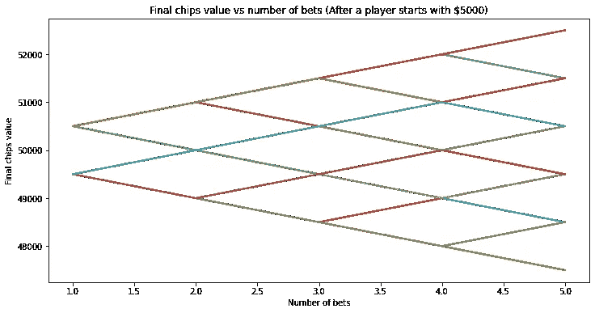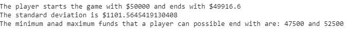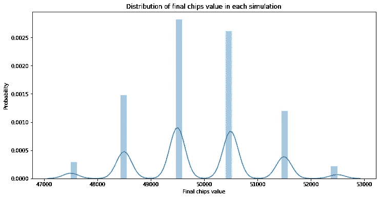

如果只是玩 5 次，不确定性就太高了，无法在一些统计上决定。即使这样，我们也可以看到玩家最终的平均金额是 49916 美元，比他实际拥有的要少。因为他每次下注只有$500，所以他在 5 次下注中只能输掉$2500。因此，让我们将下注数量增加到 50、500、1000 和 10000，并对其进行分析。没有人离开赌场时只下 4-5 次注。即使是我，在我的一生中也会下超过 500 次的赌注。

案例 2:下注数= 50

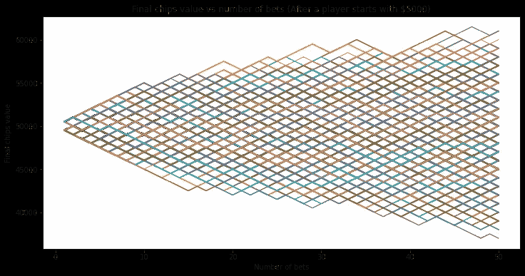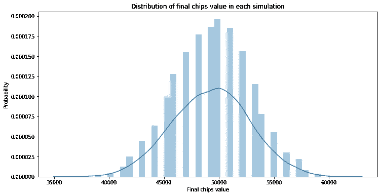

案例 3:下注数= 500

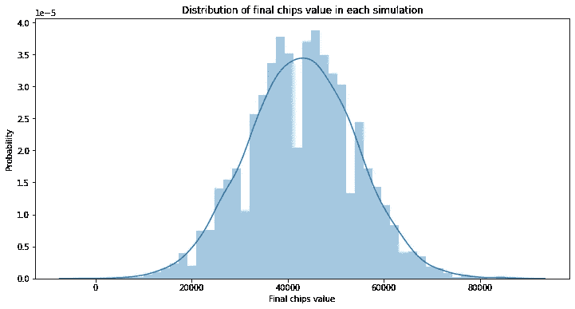

案例 4:下注数= 1000

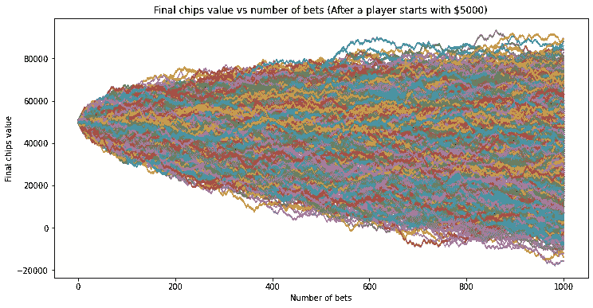

案例 5:下注数= 10000

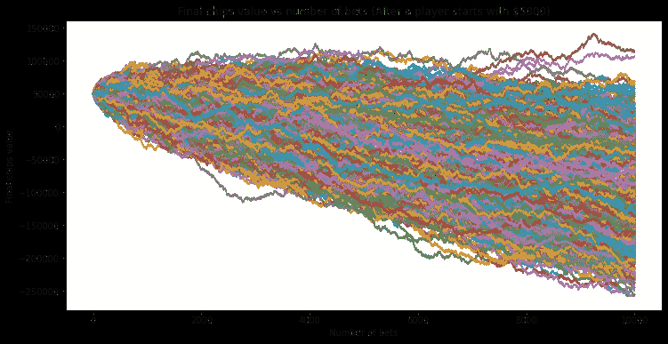

模拟图

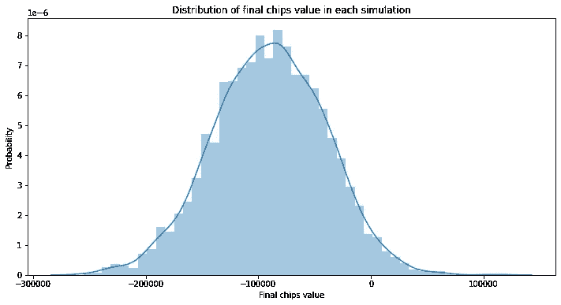

分布图

从上面的模拟图和分布图中，你可以看到一个有趣的趋势。让我给你解释其中的一个，然后你就可以对正在发生的事情有直觉了。

在案例 5 中(下注数= 10，000)，您可以在模拟图中看到，随着下注数的增加，该图向下。另外，在模拟图下方的分布图中，您可以看到平均最终金额约为-100，000 美元。想象一下，有人带着一袋 5 万美元来到这里，最后却给了房子 10 万美元。

现在你已经了解了赌博的赔率，让我们对最终金额与 odds_probability 的统计数据进行敏感性分析。

我们将从 0.45(对我们不利)到 0.495(良好的回报，如二十一点，但仍低于 0.505 的赔率)等间距小数，看看最终金额的平均值、标准差、最小值和最大值是什么样子的。

我们将赌注的数量定为 1000，这对于正常的赌徒来说是非常现实的。

```
win_odds_list = np.linspace(.45, .495, num=100)
col_names =  ['win_odds', 'mean_final', 'std_final', 'min_final', 'max_final']final_coins  = pd.DataFrame(columns = col_names)for odds in win_odds_list:mean_val, std_val, min_val, max_val = simulate_bets(50000, 500, 1000, odds, 5000)final_coins = final_coins.append({'win_odds': odds, 'mean_final': mean_val, 'std_final': std_val, 'min_final':min_val , 'max_final':max_val }, ignore_index=True)
```

在对我们上面生成的 100 个等间距赔率中的每一个进行 5000 次模拟后，我们得到了下面的数据框。

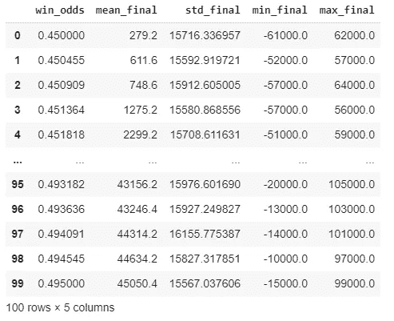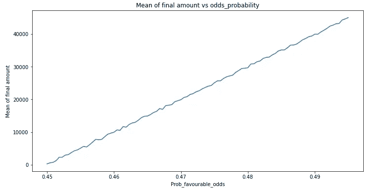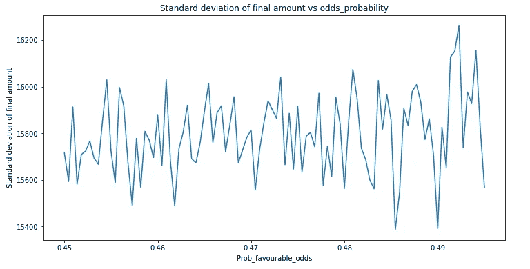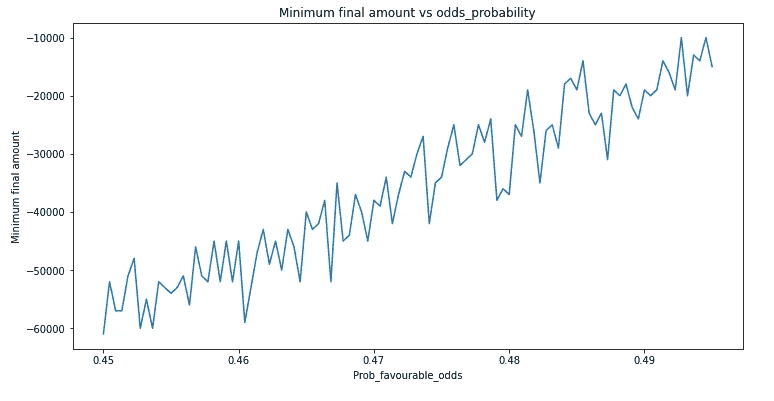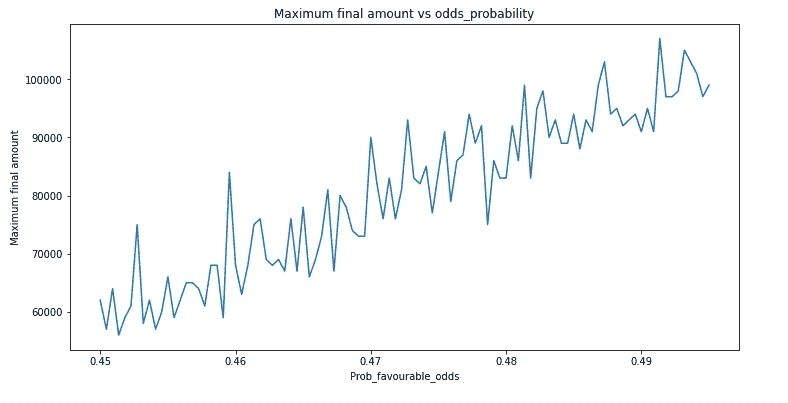

从上面 4 个图可以看出这么多有趣的趋势。即使赢了 50000 美元，玩了 1000 次，最大价值也只有 100000 美元左右(赔率为 0.495)。

下次当你去拉斯维加斯、大西洋城或澳门时，让你的统计员的大脑保持活跃。如果你打算待很久，至少试着玩赔率最高的游戏。

谢了。

# **在 Linkedin 上帮我联系:**

[T3【https://www.linkedin.com/in/saket-garodia/】T5](https://www.linkedin.com/in/saket-garodia/)

***参考文献:***

[*https://pythonprogramming.net/monte-carlo-simulator-python/*](https://pythonprogramming.net/monte-carlo-simulator-python/)

[*http://math.info/Misc/House_Edge/*](http://math.info/Misc/House_Edge/)

*h*[*ttps://wizardofodds . com/games/sic-bo/*](https://wizardofodds.com/games/sic-bo/)

[*https://towards data science . com/the-house-always-wins-Monte-Carlo-simulation-EB 82787 da 2 a 3*](/the-house-always-wins-monte-carlo-simulation-eb82787da2a3)

[](https://medium.com/eatpredlove/casinos-big-and-small-using-monte-carlo-simulation-3936f9bcf4bf) [## 赌场的大小-使用蒙特卡罗模拟

### 回到 2018 年，那是我第一次在澳门的赌场体验(是专门从香港过来的一日游)。我们选择了…

medium.com](https://medium.com/eatpredlove/casinos-big-and-small-using-monte-carlo-simulation-3936f9bcf4bf) [](/the-house-always-wins-monte-carlo-simulation-eb82787da2a3) [## 赌场总是赢家:蒙特卡洛模拟

### 赌场是怎么挣钱的？诀窍很简单——你玩的时间足够长，输钱的概率就会增加。让我们…

towardsdatascience.com](/the-house-always-wins-monte-carlo-simulation-eb82787da2a3) 

***注来自《走向数据科学》的编辑:*** *虽然我们允许独立作者根据我们的* [*规则和指导方针*](/questions-96667b06af5) *发表文章，但我们不认可每个作者的贡献。你不应该在没有寻求专业建议的情况下依赖一个作者的作品。详见我们的* [*读者术语*](/readers-terms-b5d780a700a4) *。*