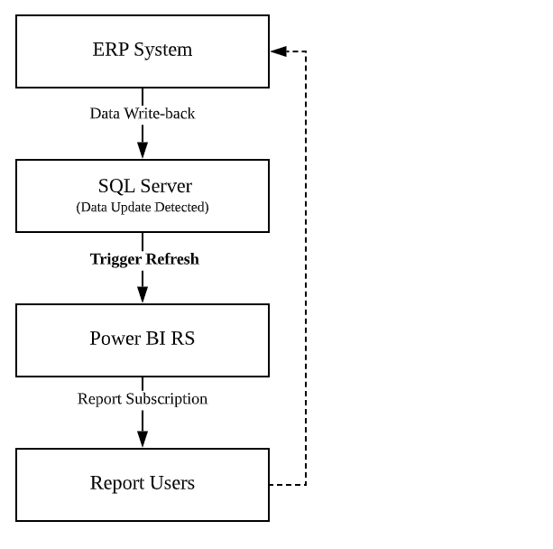
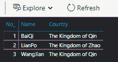
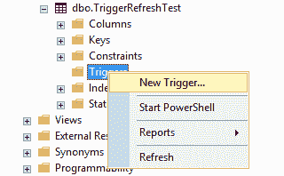
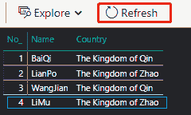

# PowerBI RS:在触发模式下设置数据刷新

> 原文：<https://towardsdatascience.com/game-changer-in-pbirs-setting-data-refresh-in-trigger-mode-62e594700b60?source=collection_archive---------23----------------------->

使用 Power BI 报告服务器数据库可以做许多在 Power BI 服务中不能做的事情，其中之一就是在报告数据集上设置触发数据刷新。

# 什么是触发模式下的数据刷新？

顾名思义，它将触发您的 PBI 报表的数据集来刷新事件。例如，当报表引用的数据源发生更改(添加、更改或删除)时，触发条件将被激活，以允许 PBI 报表立即刷新数据，并使 PBI 报表数据保持最新。典型的应用过程如下:



作者图片

# 为什么使用触发模式来刷新您的报告数据？

在 PBIRS 中，PBI 报表有两种主要的数据刷新类型:计划刷新和 DirectQuery。DirectQuery 使用户在每次使用报表时都能持续获得最新的数据，但缺点是当报表查询逻辑复杂时，可能会严重影响报表的性能。此外，计算引擎不支持某些 DAX 函数(如时间智能函数)。在计划刷新模式下，理论上，您的报告性能不会受到刷新行为的影响，您可以使用任何支持 PowerBI 的 DAX 函数，这很好，但是，您不能保证用户在使用报告时会获得最新的数据。

所以，这就成了一个很尴尬的事实。假设你需要开发一个报表，这个报表需要使用 DAX 时间智能函数(而不是 SQL)，你必须保证用户在使用它的时候能及时看到最新的数据。那么，如何为数据集选择刷新模式呢？也许你会设置你的报表每一分钟刷新一次，但是如果你的报表数据比较多，不仅会增加数据刷新失败的概率还会给服务器造成一定的负担。因此，触发模式下的数据刷新成为了最佳解决方案。它结合了 DirectQuery 和计划刷新的优点。只有当数据发生变化时，才会执行数据刷新。这不仅可以确保用户在使用报表时可以看到最新的数据，还可以在不影响报表性能的情况下减轻服务器的负担。这就是为什么您应该在触发器模式下刷新报告数据。

# 如何实现？

首先，作为示例，我在数据库中创建一个表。如下图，我创建了一个新表，插入了三行数据——中国古代战国时期(公元前 475-221)的三大名将:白起、廉颇、王建，简单的像这样:

```
CREATE TABLE [TriggerRefreshTest]
(
[No_] int,
[Name] nvarchar(10),
[Country] nvarchar(20)
)Insert Into [TriggerRefreshTest]
values(1, 'BaiQi', 'The Kingdom of Qin'),(2, 'LianPo', 'The Kingdom of Zhao'),(3, 'WangJian', 'The Kingdom of Qin')
```

将数据导入 Power BI Desktop 并按如下方式发布:



作者图片

我们现在要达到的效果是，当我在数据库中插入一行新的数据——(李牧，赵国)，然后立即触发一个数据刷新事件，使报表数据保持最新。在 SSMS，创建一个新的触发事件，如下所示:



作者图片

然后我们需要用 SQL 写一个触发脚本。对于没有学过 SQL 的读者来说还是可以的。可以直接使用下面的代码。我已经简化并优化了脚本。您只需要用您的报告信息替换下面的代码(我已经做了注释):

```
SET ANSI_NULLS ONGOSET QUOTED_IDENTIFIER ONGOIF OBJECT_ID
(
    N'trigger_data_refresh'
) is not nullDROP TRIGGER trigger_data_refresh;GOCREATE TRIGGER trigger_data_refresh 
ON [TriggerRefreshTest]  --Replace with your table name hereAFTER INSERT
AS 
SET NOCOUNT ON;DECLARE @REPORT_NAME NVARCHAR
(
    50
),
@REPORT_ID VARCHAR
(
    100
),
@SUBSCRIPTION_ID VARCHAR
(
    100
)
SET @REPORT_NAME = 'WarringStates' --Replace with your PBI report name.
SET @REPORT_ID = 
(
    SELECT TOP 1 [ItemID]
    FROM [ReportServer].[dbo].[Catalog]
    WHERE [Name] = @REPORT_NAME
)
SET @SUBSCRIPTION_ID = 
(
    SELECT TOP 1 SubscriptionID
    FROM [ReportServer].[dbo].[ReportSchedule]
    WHERE [ReportID] = @REPORT_ID
)BEGIN
WAITFOR DELAY '0:0:3'
exec [ReportServer].dbo.AddEvent 
@EventType='DataModelRefresh',
@EventData=@SUBSCRIPTION_ID
ENDGO
```

最后，运行代码，这样我们的触发器刷新就设置好了。让我们在表中插入一个新行—[triggerefreshtest]:

```
Insert Into [TriggerRefreshTest]
values (4, 'LiMu', 'The Kingdom of Zhao')
```

现在，我们的触发机制已经检测到数据更改，因此数据刷新事件已被激活。返回 Power BI RS 的报告页面，点击“刷新”刷新缓存，可以看到，刚刚插入的数据立即显示在报告中！



作者图片

# 考虑

如果数据源表由多个用户维护，那么他们可能会同时修改数据，这可能会导致问题(比如表锁定)。我认为解决方案之一是强制最小刷新间隔。这可以通过修改存储过程来实现。

*结束~*

*(本文中文首发于 2019 年 12 月*[*D-BI*](https://d-bi.gitee.io/pbi-trigger-refresh/)*)*