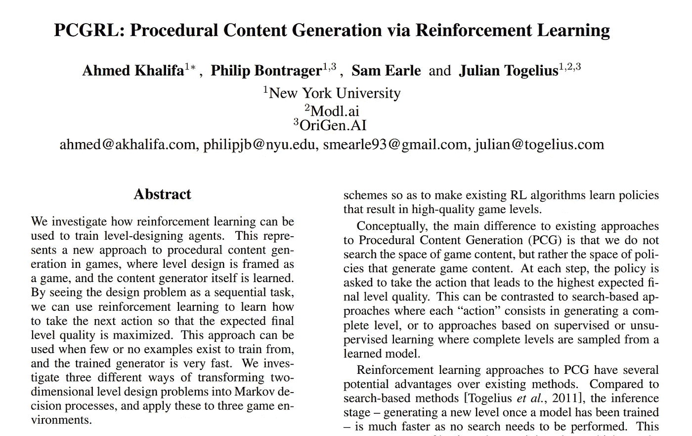
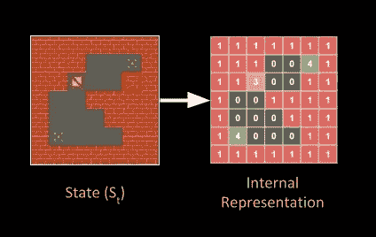
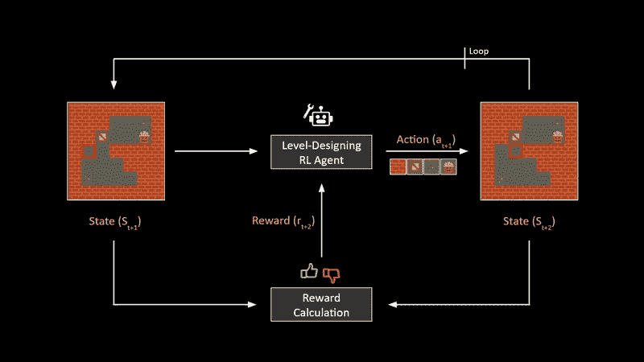
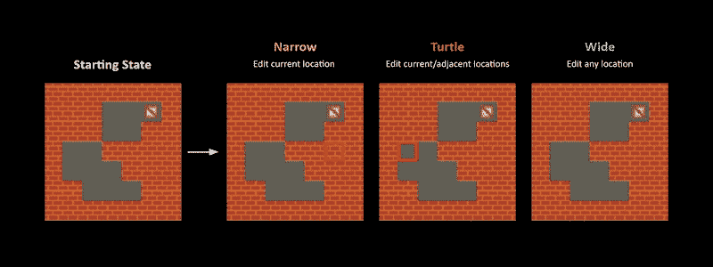
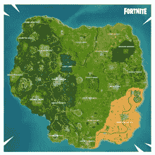

# 具有强化学习的游戏级设计

> 原文：<https://towardsdatascience.com/game-level-design-with-reinforcement-learning-fa6eb585eb4e?source=collection_archive---------58----------------------->

## “PCGRL”论文概述，介绍了一种通过训练 RL 代理程序生成游戏关卡的新方法。

[程序性内容生成(或 PCG)](https://en.wikipedia.org/wiki/Procedural_generation) 是一种使用计算机算法在游戏中生成大量内容的方法，如巨大的开放世界环境、游戏关卡和许多其他用于创建游戏的资产。

PCGRL [全文](https://arxiv.org/pdf/2001.09212.pdf)

今天，我想和大家分享一篇名为*[*PCGRL:通过强化学习的程序化内容生成*](https://arxiv.org/pdf/2001.09212.pdf)*的论文，它展示了我们如何使用自学习 AI 算法来程序化生成 2D 游戏环境。通常，我们熟悉使用称为强化学习的人工智能技术来训练人工智能代理玩游戏，但本文训练人工智能代理来设计游戏的级别。根据作者的说法，这是 RL 第一次用于 PCG 的任务。**

** [## amidos2006/gym-pcgrl

### 当前框架版本:0.4.0 通过强化学习生成程序内容的 OpenAI GYM 环境…

github.com](https://github.com/amidos2006/gym-pcgrl) 

## 推箱子游戏环境

让我们看看论文的中心思想。考虑一个简单的游戏环境，比如游戏[中的推箱子](https://en.wikipedia.org/wiki/Sokoban)。

推箱子游戏关卡。

我们可以把这个地图或者游戏级别看作是代表游戏状态的 2D 整数数组。这种状态由可以编辑游戏环境的强化学习代理来观察。通过采取行动，如添加或删除游戏的某些元素(如固体盒，板条箱，球员，目标等。)，它可以编辑这个环境给我们一个新的状态。

PCGRL 框架

现在，为了确保这个代理生成的环境是高质量的，我们需要某种反馈机制。在本文中，这种机制是通过使用手工制作的奖励计算器比较这个特定游戏的先前状态和更新状态来构建的。通过为游戏规则增加适当的奖励，我们可以训练 RL 代理生成特定类型的地图或关卡。这个框架的最大优点是，在训练完成后，我们可以通过点击一个按钮来生成几乎无限的独特游戏关卡，而不必手动设计任何东西。

RL 代理遍历和编辑游戏环境的三种方法。

本文还比较了 RL 代理可以用来遍历和编辑环境的不同方法。如果你想了解这些方法之间性能比较的更多细节，这里是研究结果的[全文](https://arxiv.org/pdf/2001.09212.pdf)。

[ [来源](https://github.com/amidos2006/gym-pcgrl)通过训练有素的 RL 代理测试不同游戏的关卡设计。

## 一般研究方向

虽然本文实验中使用的游戏是简单的 2D 游戏，但这一研究方向令我兴奋，因为我们可以在这项工作的基础上创建大型开放世界 3D 游戏环境。

这有可能改变在线多人游戏体验。想象一下，如果在每个多人开放世界游戏的开始，我们可以每次都生成一个新的独特的战术地图。这意味着我们不需要等待游戏开发商每隔几个月或几年发布新地图，但我们可以在 AI 游戏中这样做，这真的很酷！** 

**感谢您的阅读。如果你喜欢这篇文章，你可以关注我在[媒体](https://medium.com/@chintan.t93)、 [GitHub](https://github.com/ChintanTrivedi) 上的更多作品，或者订阅我的 [YouTube 频道](http://youtube.com/c/DeepGamingAI)。**