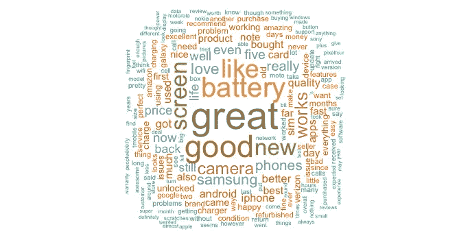
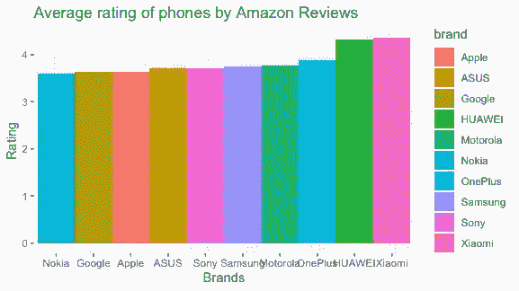

# 手机游戏。r 和“ggplot2 ”,看看亚马逊用户评论能告诉我们什么是最值得购买的智能手机

> 原文：<https://towardsdatascience.com/game-of-phones-decadf9c0a14?source=collection_archive---------48----------------------->

## 亚马逊用户的智能手机评论和一些可视化效果，看看人们最喜欢哪些品牌。

玛丽安·克罗恩在 [Unsplash](https://unsplash.com?utm_source=medium&utm_medium=referral) 上的照片

由于 web 服务的巨大增长和我们在过去十年中看到的数据爆炸，互联网上的大量评论数据令人震惊。像 IMDB 和 Yelp 这样的网站已经创建了完整的生态系统，对产品、电影、餐馆和个人进行比较和评论。大多数基于互联网的零售公司，如亚马逊或易趣，也已将评论纳入其采购平台，以创建一个以客户为中心的最佳产品层级。

数以千计甚至数百万计的评论散布在 Twitter 和脸书等社交媒体平台上，但也存在于零售网站和评论网站上。这些网站上有大量公开可用的数据，并且有巨大的空间来深入研究这些原始和非结构化的数据，以获得有可能为商业、市场研究和创新带来利润的见解。大多数评论也与评级相关联。一篇评论通常看起来像一个简短的段落，有一个标题，描述被评论的主题，然后是一个评级，通常是五分或十分。

网上有很多智能手机的原始消费者数据。与指派专家评论者来决定最好的手机相反，成千上万关于同一款手机的客户评论可以作为更平衡的最终用户意见挖掘的试金石。

# 数据

本项目使用的数据集可从 Kaggle[T5 这里](https://www.kaggle.com/grikomsn/amazon-cell-phones-reviews) **获得。**

合并后的完整数据集包含 82，815 个条目，分为以下几列:

品牌:产品品牌:具有 10 个类别的分类变量
标题:产品标题:被评论产品的名称
url:产品 url:购买产品的 URL 链接
图像:产品图像 URL:产品图像的 URL 链接
评级:产品平均价格。评级:用户评论对产品的平均评级 Url:产品评论页面 URL:产品评论页面的 URL 总评论数:产品总评论数:产品价格总评论数:产品价格:产品的潜在价格范围

姓名:审核人姓名
评级:审核人评级(等级 1 至 5)
日期:审核日期:进行审核的日期
已验证:有效客户:客户是否为已验证的亚马逊客户标题:审核标题:审核的标题

正文:评论内容:评论的主要内容
有用的投票:有用的反馈:评论得到了多少反馈。

# 清洁和争论

初始清洗过程的第一步是移除被认为不需要的色谱柱。图片、网址、姓名、评论者网址、正文和有用的投票已被删除。标题栏(已经合并)和用户评分栏也被删除。

在检查了“价格”变量后，完成了初始清洁过程的下一步，由于 NA 的数量很大，并且许多行都有一个价格数字范围，因此决定不将该变量包括在研究中。

最初争论过程的第一步是获取两个数据集并执行“左连接”以创建一个合并的数据集。这是使用“ASIN”ID 作为合并的键来完成的。

下一步是将每个评论的标题与评论的实际内容结合起来，创建一个包含标题和评论正文的超级专栏。

**观想主题**

该项目涵盖了许多品牌的手机和一个解决方案的配色方案，将尊重所有手机的品牌完整性，同时表达了品牌的多样性。我们决定用一系列类似彩虹的颜色作为三个观想的主题，以保持它们之间的一致，并突出观想者对信息的中立性。

视觉呈现从微观到宏观。第一种视觉化聚焦于评论的总体概述；关于手机，最常见的词汇和情感是什么？

下一个可视化更深入一步，关注用户对特定品牌的感受。我想向用户展示市场上最受欢迎的品牌是什么。

# 一介词云

需要进行一些额外的清理，以使一些东西值得注意，所以一些常见的英语“停用词”(无助于理解情感的词，如连词和代词)和标点符号被从集合中删除，因为它们在这种情况下对分析情感没有用处。
创建前十个单词的术语文档矩阵，以评估哪些单词在集合中出现得最频繁。从 TDM 中可以清楚地看到，由于一些关于手机的显而易见的词频繁出现，需要将更多的词添加到停用词列表中。例如，单词“电话”是最流行的(不奇怪，考虑到它们是电话评论)

作者图片

前一万篇评论的样本(由于大量数据的内存错误，不可能包含所有评论)。然后，需要将这些列转换成文本文件，以便对它们进行适当的操作。下一步是将文档中所有不必要的字符变成空白。

从这里开始，所有的文本都被转换成小写，以使内容标准化，并在这种形式下看起来更具视觉吸引力。

# 见识

当人们评论手机时，什么想法和观点最流行？。这是亚马逊手机评论的总体视图，也是数据集内容的总体视图。

“随机顺序”参数被设置为 false，因此可以很容易地理解哪些词在评论中出现频率最高。单词的最大数量被设置为 200，以便不使图表过载，单词只需要出现一次就可能被包括在内。

选择了“Dark2”配色方案，限定为八种颜色。这符合一开始设定的彩虹配色方案，也最大限度地减少了试图理解一个有太多颜色的图表的心理负担。

这种可视化与评论内容的总体视图相关，旨在回答关于电话的总体情绪和语言使用的问题。

# 更深入的观察…

作者图片

这种可视化的第一个清理元素是标准化“标题”变量的名称，因为由于不可见的字符，功能正在减少。

**扯皮**:

对于这一个，有必要找到具有最佳评级的品牌，因此创建了一个新变量，它将为每个品牌保存一行，与此相关联的值将是所有品牌评论的平均值的组合。

使用“重新排序”功能从最低到最高显示评级也很重要，以明确显示等级中的最佳品牌。

# 见识

viz 试图回答亚马逊评论中关于顶级品牌的问题。用户评论认为哪些品牌是最好的。
绘制了所有品牌及其相应平均评级的条形图，并加入了彩虹配色方案。

## 嗯，有意思……..

在这里可以找到一些很酷的发现和见解，通过进一步研究数据集，还会有更多的发现。

在完成这个项目时，我想到的一件事是关于数据科学中的公平和代表性。由于探索的性质，如果我创造了自己的手机品牌；**【我-艾伦】**，给自己一个五星评价，那么我将拥有亚马逊上评价最高的手机，并将位于我自己的条形图顶部。

这个项目的所有 R 代码都可以在我的 Github 页面上的 [**这里**](https://github.com/apcoyne/phone_review_viz/commit/063d6f5509b551dc62af4b1f8d085e09b7896c76) 找到。:)