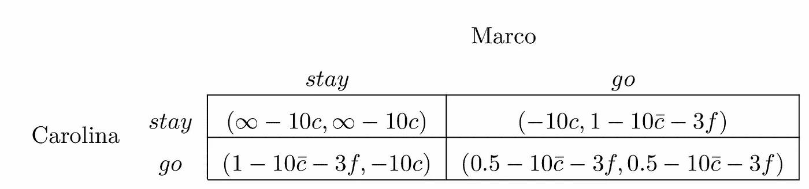

# 博弈论在起作用:意大利的“温和”封锁

> 原文：<https://towardsdatascience.com/game-theory-at-work-italys-gentle-lockdowns-caab8c4c4722?source=collection_archive---------45----------------------->

## 为什么罗马会沦陷…今年秋天

加布里埃拉·克莱尔·马里诺在 Unsplash:罗马论坛上的照片

**介绍:意大利更温和的封锁方式**

由于 COVID 疫苗只有几个月的时间了，抗体治疗和其他治疗方法也获得了使用许可，人类对该病毒的战争即将结束。因此，各国政府决心在最后的战场上最大限度地减少伤亡，并尽可能多地将我们带到 COVID 的另一边。

尽管各国将公共卫生置于经济问题之上，但他们希望在这样做的同时，不要让太多的企业倒闭，也不要让太多的工人失业。为了达到微妙的平衡，意大利政府制定了一项全国封锁政策，根据 Rt 值捕捉到的感染传播速度调整限制。[该政策根据当地 Rt 值](https://www.bloomberg.com/news/articles/2020-11-04/italy-targets-milan-turin-in-clampdown-to-slow-virus-surge)将意大利的 21 个地区用颜色编码为黄色、橙色和红色，因此据称与 2020 年 3 月驯服第一波感染的一刀切封锁相比，在更大程度上保护了经济。

意大利政府没有理会意大利医学委员会提出的在全国范围内推广三月式封锁的请求。封锁国家造成的经济损失也必须考虑在内——这是政府将医生的担忧置于一边的论点。从医生的角度来说，他们认为封锁和释放的政策——T2——以色列政府走上了一条明显成功的道路——可能在保护企业和就业方面做得更好。医生们指出，对于食品旅游业来说，即使是宵禁和地区流动限制这样的小限制也可能太多，无法带来利润。在高风险行业运营的公司利润率非常低，需要规模来维持经营。
对不同病毒遏制政策的成本效益评估并不是我在这篇文章中要触及的主要话题——如果感兴趣的话，[查看一下经济学家 Favero、Ichino 和 Rustichini 的概要](https://poseidon01.ssrn.com/delivery.php?ID=463070022024114103074084076067081109057049057076086029076127065089066079006024116093117033048052107045040093001029110016009103021041003015023086116101070099116004103054086021070065116065114092080017127092086068092124031023067030127103083016112031102087&EXT=pdf)。相反，我想确定的是，意大利政府宣称的通过更温和的方式让人们留在国内的目标，是否在政策本身的力所能及的范围之内。作为剧透或者免责声明，我给出的答案是，很可能不会。然而，我的主要目标是展示基本博弈理论能走多远，以获得对政府政策潜在后果的洞察。

为红区设想的主要规定是从晚上 10 点开始宵禁，不准跨地区移动，公共交通以 50%的能力运行，除了去看医生、慢跑、购物和很少的其他活动外，不准移动。黄色和橙色区域的限制更温和，但是我将在我的玩具示例中使用红色区域。意大利人出门时必须准备好自我声明，以证明他们没有加入其他家庭，没有因为不必要的原因外出，或者更糟的是，没有跨越地区边界。未能出示自我声明或出示的声明未列出外出的有效理由的犯罪者将被处以 400€的罚款，如果在声明发布后三天内被清除，罚款将减至 280€。
然而，更重要的是，与[三月创纪录的 110，000 英镑罚款](https://www.independent.co.uk/news/world/europe/coronavirus-italy-lockdown-police-charges-fines-quarantine-lombardy-a9427046.html)相比，立法者似乎采取了更宽容的态度，拒绝派遣军队，更多地依靠公民的合作。我们面临的问题是，软锁定和中等规模、宽松的罚款相结合，是否可能达到政府的底线。我将推敲一些基本的博弈论来证明它很可能不会，这源于 COVID 作为一种传染性很强、但并不致命的疾病的本质——如果你还没有听过的话，我恳求你听听[这个彼得·阿提亚的播客](https://peterattiamd.com/peterhotez/)。

**博弈论:一种非常生疏的方法**

请考虑以下设置。卡罗莱纳和马可代表了意大利人口的特征，位于最重要的人口统计数据(年龄、收入、教育等)的中间。).Carolina 是女性，45 岁，税后收入€20，000 英镑/年，拥有高中文凭，总体健康。同样，马尔科——他是“他”——45 岁，健康，过着意大利中产阶级的生活。他们住在一起，见面时会顺便拜访。在周六下午，他们可以选择看网飞的节目或者出去散步。他们真的不应该离开，但他们知道找到一个理由打破自我认证并不难。Carolina 上次去购物时忘记拿牙膏了，Marco 真的很想吃杂货店里那些美味的蔬菜，加上他最近没怎么锻炼，所以警察为什么要干涉他对健康的追求呢？这不正是政府想要扶植的吗？
当这些想法在他们的脑海中不断翻找时，意大利的秋季让他们脱颖而出，并诱使他们在立法者面前一试身手。这些是卡罗莱娜和马可的选择参数:

*   *U* 是散步的效用，归一化为 1(*U*= 1)；
*   如果它们相遇，效用减少一半；
*   得到 COVID 的负效用是 10*U*；
*   无 COVID 国家的效用设为无穷大(∞)；
*   被罚款的负效用是 3 *U* (近似值)。3 天的有偿工作)；
*   *c̅* 是散步时得到 COVID 的概率，它*严格小于*1 并且*非常接近* e 为 0(0<*c̅*≪1)；
*   *c* 是待在家里得到 COVID 的概率，比*c̅*【0<*c*<*c̅*≪1 略少*；*
*   *f* 是被警察拦下发现没有有效自行申报时被罚款的概率，比 *c̅* 和*c*(0<*f*<*c*<*c̅*≪1).少

*图 1 描绘了每种反应组合的收益。马可和卡罗来娜在两个选项中选择一个:呆在家里(*逗留*和去散步(*去*)。此外，它们不能通信，必须彼此独立行动。
Carolina 选择的期望是 Marco 选择去散步，这将她的选择集减少到图 2 所示的条件集；出于同样的原因，Marco 的选择集减少到如图 3 所示。世界的合作状态(*停留*，*停留*)要求马可和卡罗琳娜协调行动；然而，他们怀有相互的期望，认为对方会叛变；因此，当各方作为效用最大化的代理人独立行动时，最大化社会效用的世界状态就丧失了。*

**

*图 1:收益矩阵*

**

*图 2:卡罗莱纳州的收益矩阵*

**

*图 3:马可的收益矩阵*

*现在让我们更仔细地看看个人的选择。卡罗莱纳州必须在*停留*和*出发*之间选择一个，条件是马可要走。如前所述，每一方都期望另一方背叛，因此只有条件集是可行的。
一旦选择留下，Carolina 将以概率 *c* (即–10*c*)获得 COVID 的负效用。当选择去的时候，她会拿走去散步收益的一半(即 0.5)，以概率 *c̅* 得到柯维德的负效用(即–10*c̅*)，以概率 *f* 得到罚款的负效用(即 3 *f* )。值得注意的是，呆在家里——通过家人、在当地杂货店等——获得 COVID 的概率。—大约等于散步时被感染的几率(即 *c* ≈ *c̅* )。卡罗莱纳选择*停留*选项必须满足的条件是:*

**U* ( *待*)>U(*走*)*

*或-10*c*t64】0.5-10*c̅*3*f*。因为 *c* ≈ *c̅* ，10 个 *c* 和 10 个 *c̅* 条款相互抵消；求解 *f* 得到条件*f*1/6。这意味着，卡罗莱纳州选择*留在*的可能性必须至少高达 17%。这个数字是一个不切实际的高概率，甚至没有接近目前在意大利红区交易的 f。请注意，所需的概率越小，罚款越大(即，与罚款相关的负效用从 3U 增加到 4U，依此类推)。*

*因此，在当前的政策体制下，提高罚款可能是让意大利人留在国内的唯一可行选择，但这与支持更温和封锁的理由背道而驰。因此，意大利的卡罗莱纳州最终挤满了意大利的街道，而不是平坦的曲线。
同样，马尔科预计卡罗莱娜会叛变，这将他的选择限制为(*去*，*留*)和(*去*，*去*)。他的决策反映了卡罗莱纳州，他也选择去。总的来说，( *go* ， *go* )是一个纳什均衡，这意味着意大利的温和封锁未能温和地推动传染曲线下降。*

*宽松的政策和 COVID 的性质相结合，COVID 是一种高传染性、低致死率的病毒，主要来自渐近感染，似乎正在将意大利置于不可避免的硬性封锁的轨道上。这可能是弥合现在和疫苗推出之间的差距，避免普遍医疗保健失败的唯一途径。*

***博弈论:一种生疏的方法***

*为了清楚起见，我在上面的例子中用博弈论“欺骗”了一点。毕竟，本文的目的是提供一些博弈论的直觉来强调软锁定策略的一些潜在缺点。然而，我们可以通过使用行为社会科学对无 COVID 国家的效用进行参数化，从而得到更好的结果。一般来说，我们贴现未来效用，因为它本来就不如现在效用有价值；因为我们没有意识到未来效用的真正价值。虽然我们确实知道今天把多余的钱存起来并投资到股票市场会给我们带来一些重大的终身回报，但我们的大脑被某种形式的预感所欺骗，夸张地贴现了这些未来的收益。我没有用“夸张地”这个词来炫耀，而是引入了双曲线贴现。为了对一项 30 天后到期的投资进行建模，我们需要考虑货币的时间价值——也就是说，明天一美元的价值比今天少了*δ*——以及我们现在的偏好——也就是说，我们只愿意对未来金额的估值乘以我们今天的估值。返回双曲线贴现效用函数:*

**u*(30)=*β*(1-*δ*)⁰*u**

*将此与我们的主要讨论联系起来，我们可以模拟卡罗莱纳州和马尔科对意大利封锁政策的反应，这种反应受到时间贴现和当前偏差的影响。这让我们可以参数化他们承诺的从现在起 30 天内无 COVID 国家的效用。我将使用一些有意义的数字，但是最终目标是更好理解，而不是扩展我们的数学肌肉。因为卡罗来纳和马可非常关心他们的国家，100 *U* 是他们对一个月后无 COVID 国家的估价。他们以 10% ( *δ* =0.10)折现未来效用，并受到当前偏差的影响( *β* =0.2)。因此，与该选择相关的效用由下式给出:*

**u*(30)= 0.2(0.9)⁰(100)≈0.85*

*请注意，当前偏差参数的值 0.2 远非不现实。想象一下，在一个现在没有 COVID 的国家和 30 天以后同样的情况之间，有一个选择。甚至那些否认 COVID 真实性的人也不会拒绝这笔交易。然而，有多少(中值)意大利人会购买第二种产品呢？无论是因为他们缺乏关于锁定政策有效性的信息，还是因为他们认为情况会比那更快好转，或者无论他们目前的偏见是什么，很可能会有 20%的人会接受这笔交易。*

*说到这里，让我们再次转向博弈论，看看图 4 中新的收益矩阵。我们这次不需要“作弊”来说明( *go* ， *go* )是一个纳什均衡。让我们为卡罗琳娜做一下心算。当马可选择*留*时，她将在获得 1–10*c̅*–3*f*≈1 和去或获得 0.85–10*c̅*≈0.85 和留之间做出选择。因为去获得更大的效用，Carolina 愿意调整她的自我认证，去去走走。类似地，当马尔科选择离开时，她将在留下来获得消极效用或离开并获得 0.5–10*c̅*–3*f*≈0.5 之间做出选择；因此，她会选择去。Marco 会照着做，不管 Carolina 选不选，他都会选择去，这样就使得( *go* ， *go* )成为这个博弈唯一的纳什均衡。*

**

*图 4:收益矩阵(双曲线贴现)*

*最重要的评论如下。与(*停留*、*停留*)均衡相关联的社会效用远大于与(*进行*、*进行*均衡相关联的私人效用最大化。不幸的是，当不协调的各方在市场上交易“公用事业”时，这种状态是无法实现的。*

**U* ( *停留*，*停留*)= 2(0.85–10*c̅*)≈1.7
*u*(*go*，*go*)= 2(0.5–10*c̅*–3*f*)≈1*

*总的来说，行为社会科学给了我们更多的视角，让我们了解以前被带走的东西。这绝不是博弈论的一次大跳水，而是展示了它的广泛应用。在我们的案例中，行为激励和信息缺乏的相互作用可能会致命地阻碍一项基于硬锁定和自由开放之间的妥协的政策。*

***结论***

*在这篇文章中，我应用了基本博弈论来揭示意大利 2020 年秋季停摆的潜在后果，这在很大程度上——“过度”可能是更好的词——取决于公民合作。由于 COVID 的性质，它是一种与埃博拉病毒甚至 SARS-CoV 非常不同的感染，其致死率低到不会让人们躲在家里，软封锁似乎相当无效，因为它的目标是平坦曲线和减轻对医疗保健系统的打击。
最有可能的是，意大利医学委员会建议的更短、更严格的封锁能够更好地实现这些目标，而不必牺牲更大的经济。这是因为在任何形式的封锁下，经济都无法以接近有效的方式运行。因此，今秋的几次理发和浓咖啡可能会使罗马沦陷。*