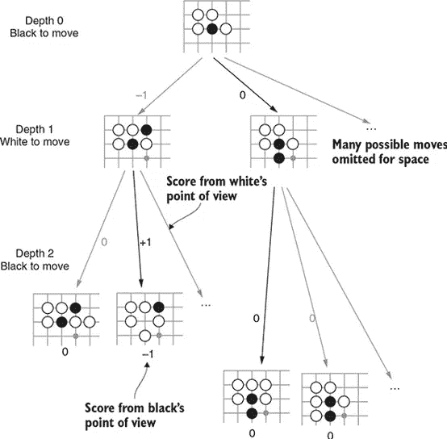
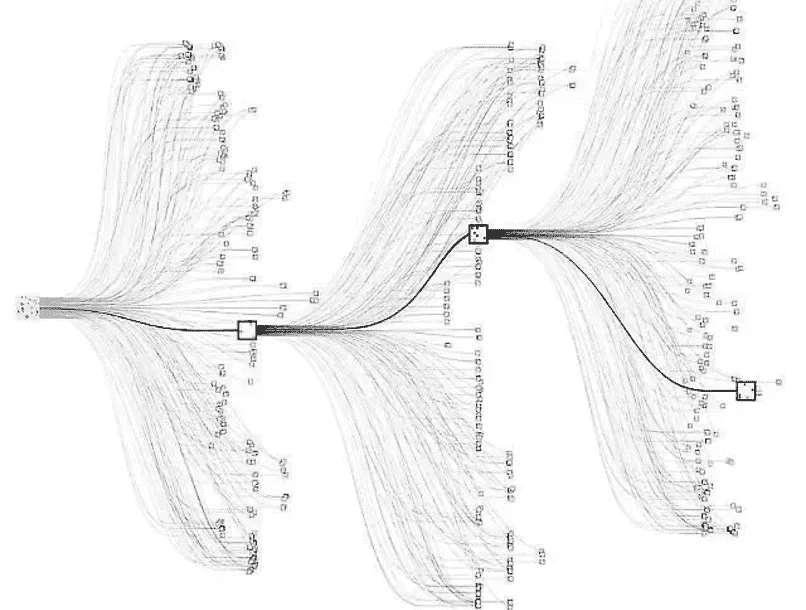

# AlphaGo 中的博弈论概念

> 原文：<https://towardsdatascience.com/game-theory-concepts-within-alphago-2443bbca36e0?source=collection_archive---------53----------------------->

## DeepMind 利用了许多创新的人工智能方法，但如果没有博弈论的概念，它们可能不会如此有效地工作。

# 介绍

围棋可以说是世界上最古老的棋类游戏，起源于大约 4000 年前的东亚，是两个人玩的游戏。围棋通常是在一块由 19 条竖线和 19 条横线组成 361 个交叉点的方形木板上，用 181 颗黑棋和 180 颗白棋来下。每个玩家依次(黑棋先走)在任意两条线的交点上放置一颗石头，在此之后这颗石头不能被移动，使得这个游戏成为一个完全信息的连续游戏。目标是通过用他们自己的石头做的边界完全包围空点来征服领土，其中被包围的对手的石头被捕获并从棋盘上拿走。拥有最多点数(征服领域)的玩家赢得游戏(大英百科全书)。

DeepMind 是一个由科学家、工程师、机器学习专家等组成的团队，共同努力推动人工智能的发展。他们利用自己的技术实现广泛的公共利益和科学发现，并与他人合作应对重大挑战，确保安全和道德。他们的众多突破之一是 AlphaGo，它是第一个击败职业人类围棋选手的计算机程序，第一个击败围棋世界冠军的计算机程序，可以说是历史上最强的围棋选手(DeepMind，2017)。虽然 AlphaGo 的大部分成功可以归功于各种创新的人工智能方法，如深度学习和卷积神经网络，但允许这些模型工作的许多概念来自博弈论领域。在整篇论文中，我将实现 DeepMind 的科学家、工程师和机器学习专家用来构建 AlphaGo 的各种博弈论概念，alpha go 是近年来人工智能历史上最伟大的成就之一

# 扩展形式游戏

围棋是完全信息的序贯博弈。玩家按顺序移动，每个玩家在游戏结束时都有相同的信息。在显示和分析连续移动博弈时，我们以博弈树的形式显示和分析它，这通常被称为扩展形式博弈。一个广泛形式的游戏有许多关键方面，如玩家可能行动的顺序，他们在每个决策点的决策，每个玩家对另一个玩家的信息，以及每个节点结束时的收益(《策略的游戏》，2010)。以下是围棋游戏的新颖博弈树:

(来源: [Livebook](https://livebook.manning.com/book/deep-learning-and-the-game-of-go/chapter-4/1) )

用于分析广泛形式博弈的一个常用策略是回退/逆向归纳，这是一个从问题(博弈树)的末端开始在时间上逆向推理以确定任何子博弈完美均衡的过程。在这些更新颖的广泛形式的游戏中，你可以使用回滚策略来确定任何均衡，但围棋游戏的问题是它有 250^150 可能的移动。如果人类可以使用逆向归纳法假设性地分析所有可能走法的博弈树，那么即使从宇宙开始以来的所有时间都不足以在围棋中进行完整的树搜索(DeepMind，2020)。DeepMind 的 AlphaGo 程序利用了一个深度强化学习卷积神经网络，该网络结合了蒙特卡罗树搜索。蒙特卡洛树搜索只预测每一步可能出现的可能序列的极小一部分，计算这些假设序列导致的输赢次数，并使用这些计数给每一步可能的移动打分(Melanie Mitchell，2019)。下图是一个假想的围棋博弈树:

(资料来源: [Nikhil Cheerla](https://nikcheerla.github.io/deeplearningschool/2018/01/01/AlphaZero-Explained/) ，2018 年)

# **效用最大化**

原则上，当 AlphaGo 给自己的每一步棋打分时，我们实际上是在谈论最大化预期效用。利用深度强化神经网络和蒙特卡罗树搜索通过自我游戏进行学习，AlphaGo 可以独自玩数百万场游戏。在这些游戏中，程序会预测它可能采取的行动及其收益，以预测如果选择该行动的获胜概率。收益是代理人的效用，我们知道我们想要最大化我们的效用，而对手想要最小化我们的效用。因此，通过在可能的移动的树搜索中向前看(只是短暂地),什么决策将最大化代理的效用并同时增加获胜概率？

# **极大极小和阿尔法-贝塔剪枝**

极大极小是博弈论中使用的一个决策规则，用来在假设你的对手最优/理性的情况下找到玩家的最优移动。两个玩家轮流成为最大化者和最小化者，在每个序列中，一个特定的移动可能会将对手置于最小化状态。当对手(最大化者)最小化你的效用时，最小最大算法是一个决策规则，用于最小化最坏情况下的潜在损失。但由于围棋的可能走法比宇宙中的原子更多，极大极小算法无法在完整的博弈树上成功完成其目标(Google AI，2016)。这就是修剪的用武之地。修剪是指你“剪掉”游戏树中“不”从第二个节点出现的分支。更简单地说，这是一种减少由极大极小算法在其搜索树中评估的节点数量的方法。还记得围棋的博弈树是如此之大，以至于从宇宙开始以来的所有时间都不足以进行完整的树搜索，因此极大极小算法不能成功地完成它的目标吗？阿尔法-贝塔剪枝法与蒙特卡洛树搜索相结合，可以扭转乾坤。回想一下，蒙特卡罗树搜索法只预测了每一步可能出现的序列中的极小一部分。通过并行运行 alpha-beta 剪枝算法，您可以获得一个高效的决策程序，该程序寻求效用最大化，并反过来增加获胜概率(或者至少我们希望如此)。

# **结论**

DeepMind 的 AlphaGo 是近年来人工智能历史上最伟大的成就之一，这要归功于各种深度学习方法、计算机处理和计算机硬件的发展。随着人工智能、机器学习和强化学习等所有围绕 AlphaGo 的流行词汇的出现，一些对 AlphaGo 的成就做出贡献的博弈论概念经常被忽视。博弈论的概念和方法，如广泛形式的游戏，逆向归纳，效用最大化，极大极小和修剪，已经存在了几十年，看到它们在人工智能中的应用是令人振奋的。

*参考文献*

AlphaGo:目前为止的故事。(未注明)。检索于 2020 年 5 月 8 日，来自[https://deep mind . com/research/case-studies/alpha go-the-story-迄今为止](https://deepmind.com/research/case-studies/alphago-the-story-so-far)

第四章。用树搜索深度学习和围棋对弈。(未注明)。2020 年 5 月 8 日检索，来自[https://live book . manning . com/book/deep-learning-and-the-game-of-go/chapter-4/39](https://livebook.manning.com/book/deep-learning-and-the-game-of-go/chapter-4/39)

新泽西州 cheer la(2018 年 1 月 1 日)。AlphaZero 解释道。2020 年 5 月 9 日检索，来自[https://nikcheela . github . io/deep learning school/2018/01/01/alpha zero-Explained/](https://nikcheerla.github.io/deeplearningschool/2018/01/01/AlphaZero-Explained/)

迪克西特，A. K .，斯凯斯，s .，，雷利，D. H. (2015)。*战略游戏*。纽约。:W. W .诺顿。

米切尔梅勒妮。(2020).*人工智能:思考人类的指南*。小号:皮卡多。

西尔弗博士和哈萨比斯博士(2016 年 1 月 27 日)。AlphaGo:用机器学习掌握围棋这个古老的游戏。2020 年 5 月 7 日检索，来自[https://ai . Google blog . com/2016/01/alpha go-mastering-ancient-game-of-go . html](https://ai.googleblog.com/2016/01/alphago-mastering-ancient-game-of-go.html)

大英百科全书的编辑们。(2017 年 4 月 24 日)。走吧。2020 年 5 月 8 日从[https://www.britannica.com/topic/go-game](https://www.britannica.com/topic/go-game)检索