# 游戏:数据集的金矿

> 原文：<https://towardsdatascience.com/gaming-a-gold-of-dataset-b94df0582544?source=collection_archive---------34----------------------->

## 如果算法可以被动学习，而不需要提供注释，会怎么样？—嗯，这正是游戏可以帮助我们的！

这篇文章讲述了我如何从一个项目中脱离出来，构建了一个东西或程序，而这个东西或程序是无人监督的(我猜同时也是有人监督的)。使用 GTA V mods，我为计算机视觉任务创建了一个数据集，由游戏中看到的对象组成。我还将展示一个小的物体检测器在现实世界中的表现。

TLDR，在游戏图像上训练的物体检测器，在真实世界的图像上概括得非常好。

本文分为以下几个部分:

1.  机器学习导论
2.  数据集对机器学习重要吗？
3.  游戏和游戏玩家能帮助制作更好的数据集吗？
4.  训练物体探测器
5.  演示，显示对象检测的结果

我应该强调，这不是一个修改 GTAV 的教程，我不能解释和提供代码(也许以后，有一天当我有更多的时间)来使用 GTAV API 获取游戏世界信息。你可以在一个单独的类上玩物体检测器的小演示可以在[这里](https://colab.research.google.com/drive/1CC9eRVRR3rRTx99UIv8ugjmVJwdT6y5Y?usp=sharing)找到。[这个](https://forums.gta5-mods.com/topic/14693/quick-start-guide-to-modding-grand-theft-auto-v)指南可以帮助你开始在侠盗猎车手 v 中进行改装，如果你想更深入地从游戏世界中提取信息，这个工具可以作为起点。

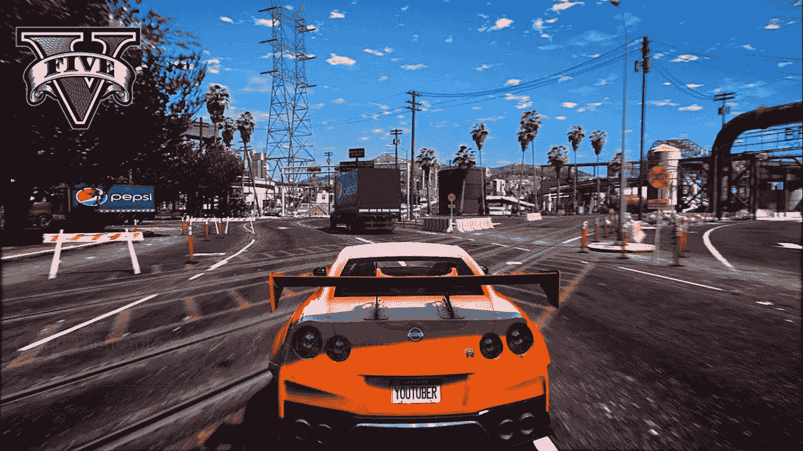

来源:[https://img.youtube.com/vi/Usx-Cf8TlNI/0.jpg](https://img.youtube.com/vi/Usx-Cf8TlNI/0.jpg)

# 机器学习导论

如果你有机器学习的先验知识，那么你可以跳过这一节。因为这篇文章不是关于学习机器学习，而是关于一个应用，所以我不能在这里深入讨论机器学习的概念。以下是一些很棒的文章，可以帮助你理解这个计算机科学领域:

1.  [机器学习很有趣](https://medium.com/machine-learning-for-humans/why-machine-learning-matters-6164faf1df12)
2.  [为什么机器学习很重要](https://medium.com/@ageitgey/machine-learning-is-fun-80ea3ec3c471)

如果我是 ELI5(像我五岁一样解释)机器学习是人工智能的一种形式，其中程序或算法被设计成能够自己学习。像人类一样，被称为神经元的小逻辑单元(下图中的圆圈)帮助**算法**从经验中学习(或从计算机、数据的角度来说)。算法中的参数会改变并学习数据集中的模式。

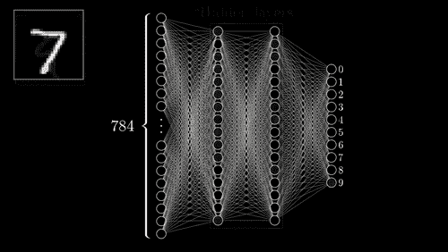

这个视频是学习机器学习的一个很好的起点。https://www.youtube.com/watch?v=aircAruvnKk&list = plzhqobowtqdnu 6 r 1 _ 67000 dx _ ZCJB-3pi

# 数据集对机器学习重要吗？

数据是任何学习形式的基本必需品。我们人类在经历或阅读/听到他们的经历后，学会了感知或理解行为的能力。数据集，不管有没有标记，都是所有机器学习任务的基础。

为了训练机器学习模型，需要大量数据。俗话说:“人越多越开心”，这句话再正确不过了。当前最先进的(SOTA)机器学习模型需要海量数据，例如，许多 NLP 任务的[伯特](https://github.com/google-research/bert)、SOTA 都是在数十 GB 的数据上训练的。

[Imagenet](https://devopedia.org/imagenet) 一个标准的图像分类数据集大约有 144 千兆字节的压缩数据和> 300 千兆字节的未压缩数据。不用说，被标记的数据对于人工智能的进步是非常重要的。

在处理一个项目时，我遇到了一个问题，我使用的对象检测器无法识别图像帧中的所有对象。我试图对图片框中的所有对象进行索引，这将使图片搜索变得更加容易。但是所有的图像都被标记为**人类**，无法检测图像帧中的其他物体，搜索没有像我希望的那样工作。

这个问题的理想解决方案是收集这些对象的数据，并重新训练对象检测器来识别新的对象。这不仅无聊而且耗时。我可以使用 [GANs](https://arxiv.org/pdf/1904.09135.pdf) ，这是一种机器学习算法，以其创建人工和类似的输入示例而闻名，在手动组织一些样本后创建更多样本，但这也很无聊，需要资源来训练 GANs 生成更多数据。

现在我唯一能做的就是使用互联网服务，比如 [ScaleAI](https://scale.com/) 和[谷歌云平台](https://cloud.google.com/vision/automl/docs/human-labeling)，来创建一个数据集。但是这些服务对每张带注释的图片收费 0.05 美元。为 15 个类别创建一个 100 张图片的数据集意味着我将不得不为这个数据集花费 120 美元。仅仅为了一个简单的项目而花费这么多美元不是一个可行的选择。

# 游戏和游戏玩家能帮助制作更好的数据集吗？

在所有选项中，我开始希望如果有一个人造的世界，所有的物体都已经有了各自的标签。这样我就不必花时间搜索样本，然后小心翼翼地为它们生成注释。然后我意识到游戏世界是这种人工或虚拟世界的最好例子。当世界被创建时，游戏引擎拥有所有必要的信息，它知道哪些纹理位于哪里，并且知道所有其他物体的位置。看看游戏的当前状态，开发者正在挑战极限，创造与现实世界几乎没有区别的游戏环境。PS5 上的虚幻引擎 5 [演示](https://www.youtube.com/watch?v=qC5KtatMcUw)展示了下一代游戏机将夸耀的图形保真度。拥有一个与真实世界非常相似的虚拟世界，应该是测试和学习算法的一个很好的模拟。允许算法访问游戏世界的信息，让它了解角落和缝隙，这将是一件很棒的事情。

我想到的第一个游戏是[神秘海域 4:盗贼末路](https://www.youtube.com/watch?v=dQw4w9WgXcQ)。


F

一个令人惊叹的游戏，有一个很好的故事，它有所有的元素，我们想从测试环境。它拥有所有的自然地形类型:平原，高原，洞穴，海岸，它还拥有近乎照片般逼真的图形，这意味着物体探测器将学习更接近真实世界的特征和形状。但问题是，我在大学里没有 ps4，也没有办法以我喜欢的方式访问未知的资源。

游戏的另一个选择可以满足我的要求:

1.  摄影现实主义
2.  修改界面以允许访问游戏世界数据

《侠盗猎车手:v》的基地虽然已经有 7 年的历史了，但与大多数其他游戏相比，它更像真实世界。这个游戏有广泛的支持 mods 和作出改变/与游戏世界互动。这个游戏，在使用了一些 mods 之后，可以用它所有的灯光和倒影看起来非常惊人

GTA V 社区做出了一些令人愤慨的修改，其中默认的玩家模型被自定义模型所取代。这是一件非常非常棒的事情，我稍后会继续讨论。

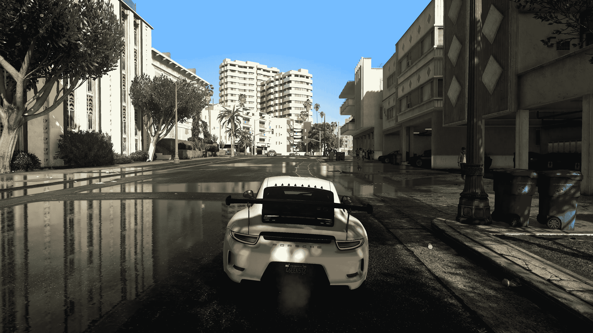

摄影现实主义

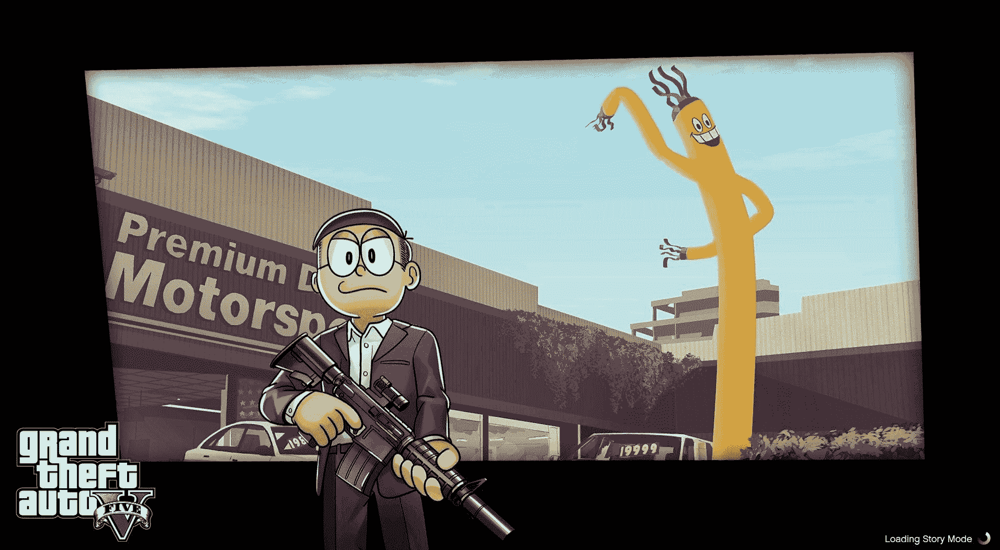

大雄作为玩家模型，lol

我首先阅读了一些关于使用 Rage Engine(GTA 使用的引擎)的 API 的文章和指南。很少有好的例子或指南来帮助我实现我想要达到的目标。但幸运的是，有一个[惊人的工具](https://www.gta5-mods.com/tools/map-info-tool)做了一些接近我试图实现的事情，它给出了用户当前图像帧中许多对象的位置。

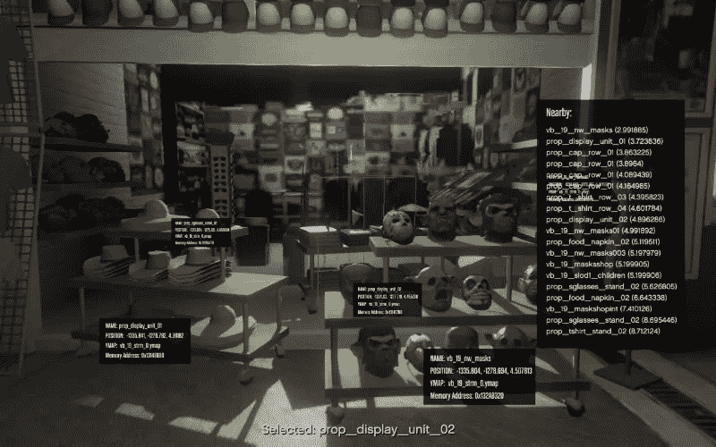

使用地图工具打开用户界面

这个工具最棒的地方在于它的源代码可以在 [Github](https://github.com/CamxxCore/MapInfoTool) 上找到。有了这个坚实的起点后，任务就归结为如何从游戏世界中访问对象信息，比如它的位置和类型。这是在长时间阅读代码、编译错误代码之后实现的。我可以从游戏屏幕上记录结果。我从简单的日志开始:

```
# the first log file that was created script running inside of GTA V
[{
  "label": "car",
  "location": [
    [248.42533936651586, 173.41176470588235],
    [442.5429864253394, 278.841628959276]
  ],
  "group_id": "non-living"
},
{
  "label": "trevor",
  .....
  "group_id": living"
},
{
  "label": "cat",
  .....
  "group_id": living"
}]
```

有些事情很简单，比如获得命名对象的位置，比如使用[哈希](https://nitanmarcel.github.io/shvdn-docs.github.io/namespace_g_t_a.html#af3b53fbeac4469166a20fc1e97f2572c)单独识别的字符。渐渐地，我学会了与 API 交互，以获取行人和附近行驶的汽车等物体的位置。我无法完全破解游戏世界来获得我想要的所有物体的位置信息，但这是一个很好的起点。最初的结果看起来很有希望，当检测到物体时，脚本会对游戏进行截图，并保存物体的位置。结果看起来像这样:

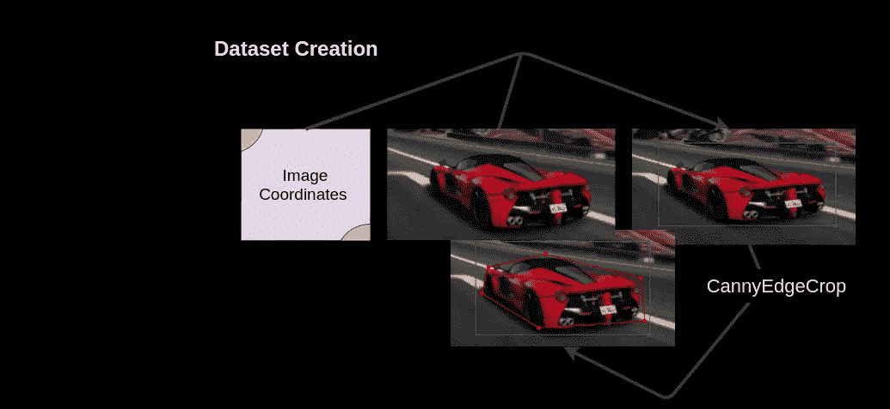

从游戏世界获得的图像坐标用于创建边界框。额外:我曾经用 CannyEdgeCropping 来使边界框更精确。

# 训练物体检测器

有了这些令人满意的结果，我继续创建更多的样本。我决定用 14 个物体:

1.  类人:行人或人类、狗和猫(3)
2.  有生命但不像人的东西:树(4)
3.  非生物:汽车、卡车、自行车、火车、船、交通信号、广告牌(6)

在获得足够的数据来训练模型之后。我开始在我的大学服务器上训练一个 [RetinaNet](https://arxiv.org/abs/1708.02002) 模型，这是一个中等强大的机器，配有 Quadro P5000 和英特尔至强 G6132。选择 RetinaNet 没有特别的原因，我有使用它的经验。我从头开始训练网络，因为使用预先训练的权重会扼杀这个项目的想法，即使用游戏世界的知识并将其应用到现实世界中。

经过一小时又一小时的等待，我意识到看着缓慢的训练进度不会加快速度，决定今天到此为止，睡觉。在漫长的等待之后，训练结束了，表演时间到了。在由游戏图像组成的测试集上测试该模型。结果似乎是公平的:

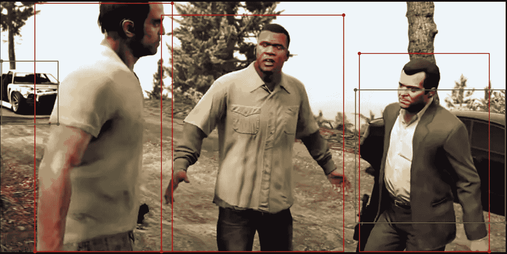

结果似乎很好，但我不明白正确的汽车是如何检测出来的。绿色是汽车，红色是人。圆圈是坐标。

结果和预期的一样，现在是在真实对象上测试性能的时候了。我认为从结果来看，这个实验可以说是成功的:

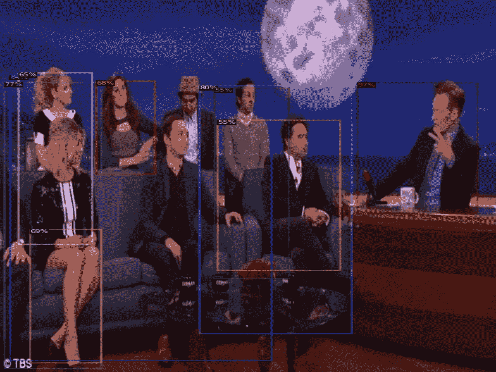

我讨厌物体探测器没找到谢尔顿和拉杰什

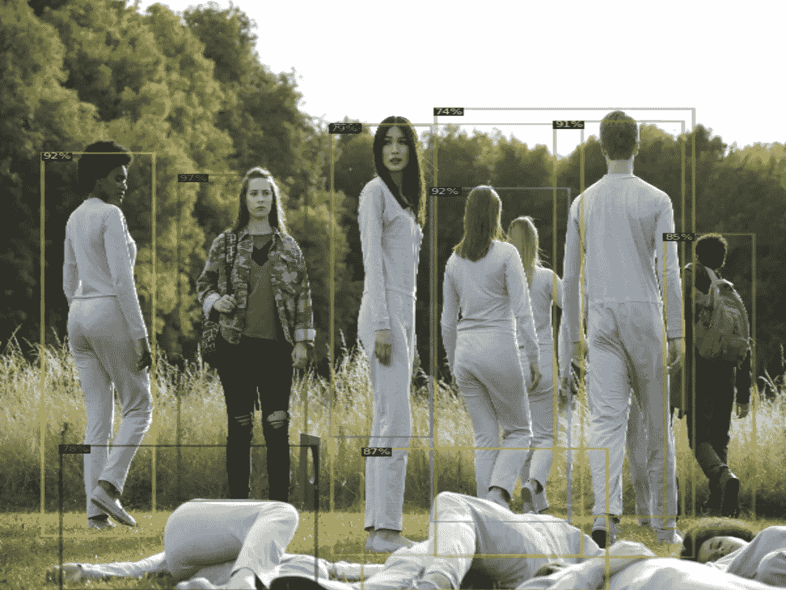

模特再次表现良好

大多数物体都被很好地识别了，但是我注意到了一个错误:

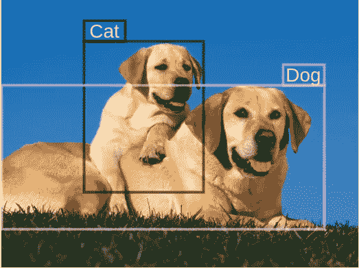

我认为这是因为游戏中缺少猫和狗的不同玩家模型。该模型能够学习数据集中不同对象的形状，但由于猫和狗的样本种类有限，这些类的情况并不顺利。它不能学习让它区分狗和猫的特征。狗和猫的模型数量是有限的，修改和添加新的模型可以弥补这种情况。

# 演示

该模型在图像上表现良好，但不要相信我的话。我创造了一个 [colab 笔记本](https://colab.research.google.com/drive/1CC9eRVRR3rRTx99UIv8ugjmVJwdT6y5Y?usp=sharing)，你可以在 5 分钟内训练你自己的模型从图像中识别人类。为了保持尽可能低的运行时间，笔记本只有来自游戏的 **200** 个人体样本的小数据集。这种低数量的样本足以显示这种模型的潜力。

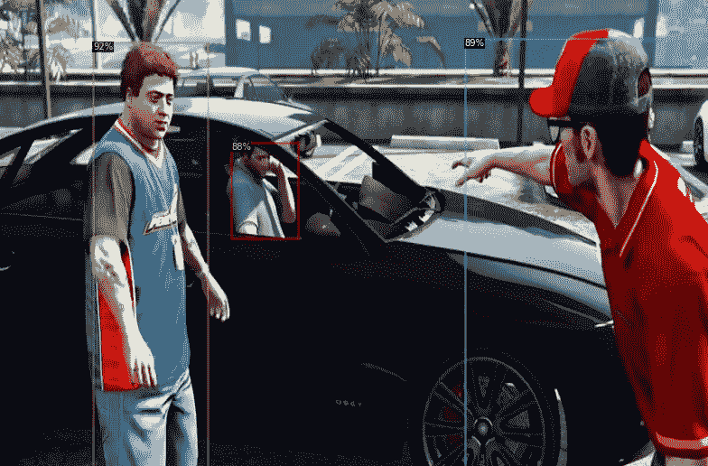

测试集上的检测

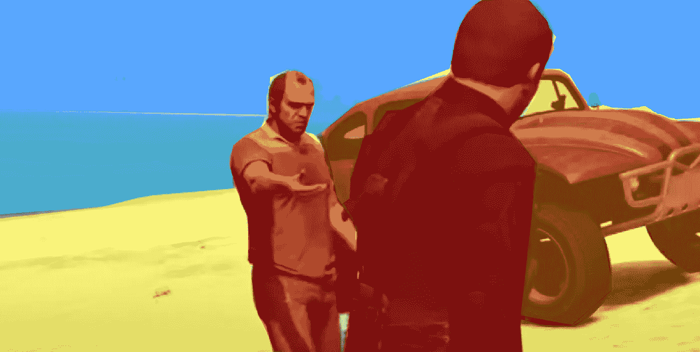

物体的小贴图和它们的纹理位置，这些部分目前有点奇怪。仍然需要做一些数学方面的工作。

在启动并运行了对象检测之后，我想让语义分割工作起来，因为这是自动标注的真正潜力所在。利用游戏引擎的纹理知识来获得像素级分割。我还没想好怎么从 GTA V 用的游戏引擎 RAGE engine 获取基于纹理的信息，获取物体的位置是一回事，获取物体的位置和区域覆盖又是另一回事。后者是我目前的困境。

我相信这一点的潜力是巨大的，通过使用 mods，我们可以很容易地用那些我们想要建立探测器的东西来替换玩家模型。在这项技术中，我们可以替换一个简单的布娃娃的角色模型，该模型可以作为创建一个在各种环境中角色外观的大型数据库的基础。


示例:此处的玩家模型由海鸥模型替换而来。来源:[维基百科](https://en.wikipedia.org/wiki/Modding_in_Grand_Theft_Auto)

随着我的 [GSoC 选择](https://summerofcode.withgoogle.com/projects/#5500640064700416)，我的时间减少了，开发环境也改变了。我希望将来能回到这个项目中来。我计划上传所有图片及其标签的 31GB 数据集，但目前这是不可能的，因为我大学的互联网服务慢得令人难以忍受。

我在这里的下一个博客将是我正在进行的另一个项目的开发日志，或者是 GSoC 博客的启动博客，我将在未来 3 个月内发布这些博客，以展示我在 CERN 的工作进展。