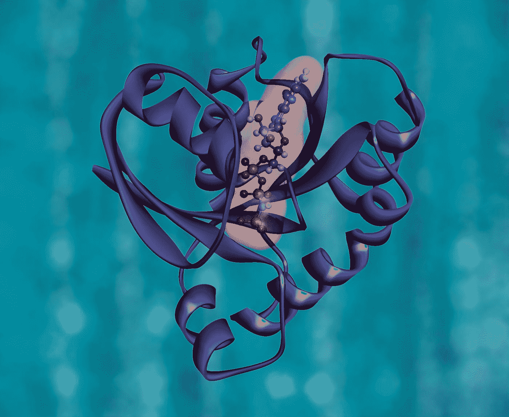

# 游戏新冠肺炎:让我们通过玩游戏打败病毒！

> 原文：<https://towardsdatascience.com/gaming-covid-19-lets-defeat-the-virus-by-playing-a-game-f8433805fe7d?source=collection_archive---------24----------------------->

## 在一个封闭的世界里，无助感可能会压倒一切，但我们都可以在自己舒适的家中用电脑打败病毒

***编者按:*** [*走向数据科学*](http://towardsdatascience.com/) *是一份以数据科学和机器学习研究为主的中型刊物。我们不是健康专家或流行病学家，本文的观点不应被解释为专业建议。想了解更多关于疫情冠状病毒的信息，可以点击* [*这里*](https://www.who.int/emergencies/diseases/novel-coronavirus-2019/situation-reports) *。*

照片由[克里斯蒂娜@ wocintechchat.com](https://unsplash.com/@wocintechchat?utm_source=medium&utm_medium=referral)在 [Unsplash](https://unsplash.com?utm_source=medium&utm_medium=referral) 上拍摄

全世界都在担心冠状病毒的传播。我们被锁在家里，感到无能为力。计算机让我们与外界保持联系，并让我们保持理智([点击此处，了解在禁闭期间可以做的有趣的人工智能活动](/fun-artificial-intelligence-activities-for-kids-under-coronavirus-lockdown-7177969a2ba1?source=friends_link&sk=f3242d9fcb064b0cebcddf6763d5528b))。但是我们能做更多来帮助科学界吗？

答案是，可以！每个人都可以尽自己的一份力量来帮助医学研究人员找到疫苗，阻止病毒的传播。好消息是我们不需要成为生物医学科学家。你所要做的就是成为一名公民科学家(公众参与和合作科学研究以增加科学知识的实践)。

为此，普通人自愿分享和贡献数据监测和收集项目。在现实中，一个人不需要太多的参与！在冠状病毒的研究中，我们所要做的就是玩一个免费的游戏，这个游戏在 https://tinyurl.com/BeatCOVID-19 叫做 Foldit。

[国立癌症研究所](https://unsplash.com/@nci?utm_source=medium&utm_medium=referral)在 [Unsplash](https://unsplash.com?utm_source=medium&utm_medium=referral) 上拍摄的照片

这个游戏的工作原理是给用户一个难题，他们必须解决它。潜在的想法相当简单。我们都知道我们的身体由各种细胞组成，这些细胞需要蛋白质来分解食物，发送信号和其他东西。这些蛋白质是由成排的元素(如碳、氧、硫等)组成的。)都像链子一样互相牵着。然而，链条不是在一条直线上，而是折叠起来，使其紧凑。如果不同的蛋白质具有匹配的形状，它们就会相互作用。把它想象成一把锁和一把钥匙相互作用。只有正确的钥匙才能打开特定的锁。

冠状病毒 Foldit 游戏显示了冠状病毒蛋白质的一部分，该部分通常与人类相互作用。玩家必须设计一种折叠蛋白质来匹配冠状病毒，并阻止这些相互作用。这项任务在现实生活中可能相当复杂，因为一个蛋白质可能由数百种元素组成。尽管如此，游戏把它表现为一个简单的拖拽任务。Foldit 试图通过利用人类的解谜直觉来预测蛋白质的结构，并让人们竞争折叠最佳蛋白质。

然后，华盛顿大学将测试最有希望的解决方案，作为新冠肺炎可能的现实世界疫苗。一些人对这种方法表示怀疑，但这种方法在 2011 年 Foldit 播放器帮助研究人员解码艾滋病病毒时确实有效。

[达威特](https://unsplash.com/@oneminch?utm_source=medium&utm_medium=referral)在 [Unsplash](https://unsplash.com?utm_source=medium&utm_medium=referral) 拍摄的照片

找出哪种可能的结构是最好的被认为是生物学中最困难的问题之一。目前的方法花费大量的时间和金钱，即使对计算机来说也是如此。如果游戏不适合你，你仍然可以通过允许研究人员使用你的电脑来帮助他们。人们只需下载一个名为 Folding @ home(https://tinyurl.com/BeatCOVID-19Home)的小应用程序，并让它在后台运行，就可以做到这一点。然后，这个程序将把你的计算机连接到一个国际网络上，这个网络使用分布式程序来完成大量的计算任务。你仍然可以在任何时候关闭应用程序，但是如果计算机处于闲置状态，也可以让科学家使用它的能量。

一旦他们拥有了这种计算能力，科学家们就可以使用人工智能来创建算法来解决折叠问题。这些公司中最新的一家是谷歌的 DeepMind，它刚刚发布了一个名为“自由建模”的工具，以帮助科学家预测以前从未见过的蛋白质的蛋白质结构。他们希望减少预测蛋白质结构的时间，因为这种实验通常需要在实验室进行数月。通过这样做，他们希望阻止病毒的传播并拯救一些生命。

Saneej Kallingal 在 [Unsplash](https://unsplash.com?utm_source=medium&utm_medium=referral) 上拍摄的照片

在一个封闭的世界里，无助感可能会压倒一切。但是今天的机器可以创造奇迹。它们可以帮助我们直接或间接地为科学的进步做出贡献。这是我们的选择。最棒的是它不需要任何医学专业知识。所以，当我们都在家的时候，为什么我们不通过下载这些应用程序来积极地帮助对抗新冠肺炎呢？

*这篇文章最初发表于 https://www.businesstoday.com.mt***请在下面留下你的想法，如果你喜欢这篇文章，请随时关注我🐦[推特](https://twitter.com/alexieidingli)，🔗 [LinkedIn](https://www.linkedin.com/in/alexieidingli/) 或者😊[脸书](https://www.facebook.com/alexieidingli/)**

*   **[中国如何用科技钉死冠状病毒！](/how-china-nailed-the-coronavirus-using-technology-77703dc94a37)**
*   **[冠状病毒的多米诺效应](/the-domino-effect-of-the-coronavirus-66fdd72fc9fd)**
*   **[在冠状病毒封锁状态下为孩子们提供有趣的人工智能活动](/fun-artificial-intelligence-activities-for-kids-under-coronavirus-lockdown-7177969a2ba1)**

**[**阿列克谢·丁力教授**](http://www.dingli.org/) 是马耳他[大学](https://www.um.edu.mt/)的 AI 教授。二十多年来，他一直在人工智能领域进行研究和工作，协助不同的公司实施人工智能解决方案。他的工作被国际专家评为世界级，并赢得了几个当地和国际奖项(如欧洲航天局、世界知识产权组织和联合国等)。他出版了几本同行评审的出版物，并且是马耳他[的一部分。由马耳他政府成立的人工智能工作组，旨在使马耳他成为世界上人工智能水平最高的国家之一。](https://malta.ai/)**