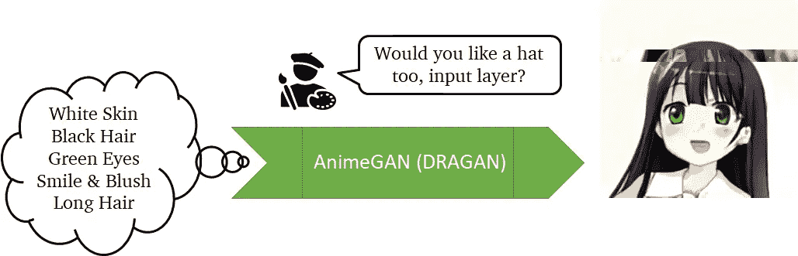

# 甘 2020 年要读的论文

> 原文：<https://towardsdatascience.com/gan-papers-to-read-in-2020-2c708af5c0a4?source=collection_archive---------16----------------------->

## 生成性对抗网络的阅读建议。

甘游戏

生成对抗网络(GANs)是近十年来提出的最具创新性的想法之一。其核心是，GANs 是一个从一组相似元素生成新元素的无监督模型。例如，在给定人脸图像集合的情况下产生原始人脸图片，或者从预先存在的旋律中创建新的曲调。

GANs 已经发现了图像、文本和声音生成的应用，是人工智能音乐、深度假货和内容感知图像编辑等技术的核心。除了纯粹的生成，GANs 还被用于将图像从一个领域转换到另一个领域，并作为一种风格转移的手段。再增加一个应用，它们适合作为半监督学习的智能数据增强技术。

在这篇文章中，我选择了 10 本 2020 年前最令人大开眼界的读本。特别是，我选择了五篇论文，它们扩展了在哪里和如何使用 GANs 的视野，以及五篇解决训练 GANs 的具体技术挑战的论文。

至于我以前关于阅读建议的文章，我提供了每篇文章的简要概述和一系列阅读它的理由，加上一些关于相同或相关主题的进一步阅读的想法。

我们走吧。

# 排名第一的 GAN (2014)

> 伊恩·古德菲勒等人[《生成性对抗性网络》](https://papers.nips.cc/paper/5423-generative-adversarial-nets) *神经信息处理系统的进展*。2014.

2014 年，Ian Goodfellow [和他的朋友](https://www.wired.com/2017/04/googles-dueling-neural-networks-spar-get-smarter-no-humans-required/)在一家酒吧讨论如何使用人工智能合成图像。典型的边喝啤酒边聊。当他的朋友们在讨论统计方法时，他主张使用两个神经网络来共同学习“如何绘画”和“判断绘画”。前者在后者的反馈上训练，后者训练从假图像中识别出真实图像，就是为了痛击前者。

最初，这个想法遭到了批评:训练一个网络是困难的，训练两个是疯狂的。尽管如此，带着醉意，古德菲勒回到家，连夜编写了代码。令他惊讶的是，它成功了。

甘游戏

**理由#1:** 好点子随时随地都能冒出来。携带一个 notes 应用程序。

**理由 2:** 和任何“经典论文”一样，阅读它会把我们带回到一个并非我们今天使用的所有东西都存在的时刻。2014 年流行哪些深度学习技术？哪些不是？

**原因#3:** Goodfellow 使用 MNIST 和 CIFAR-10 数据集演示了 GANs。更大规模的数据集(和分辨率)需要一些时间才能被驯服。如果他从 ImageNet 开始，他会把 GANs 作为一个坏主意扔掉。这篇论文提醒我们永远不要低估玩具数据集上提出的创新也是玩具。任何想法都有可能在两三篇论文之外取得突破。

**延伸阅读:**虽然 gan 是生成性任务中最成功和最容易使用的方法，但它们不是唯一的方法。两个相关的选择是[变分自动编码器(VAEs)](https://arxiv.org/abs/1906.02691) 和[自回归模型](https://arxiv.org/abs/1601.06759)。两者都值得一试，而且都有其优劣势。

# 第二名 StyleGAN (2019 年)

> 卡拉斯、泰罗、萨穆利·莱恩和蒂莫·艾拉。[“基于风格的生成式对抗网络生成器架构。”](http://openaccess.thecvf.com/content_CVPR_2019/html/Karras_A_Style-Based_Generator_Architecture_for_Generative_Adversarial_Networks_CVPR_2019_paper.html)*IEEE 计算机视觉与模式识别会议论文集*。2019.

五年后，GANs 现在能够生成在大规模语料库上训练的高分辨率可定制画像。虽然从 2014 年到 2019 年提出了许多新颖的想法，它们当然启发了作者的许多决定，但这一切都归结于架构、AdaIN、Wasserstein loss 和小说数据集: [Flickr-Faces-HQ 数据集(FFHQ)](https://github.com/NVlabs/ffhq-dataset) 。

该论文的核心思想是在每一级上采样中输入不同的噪声矢量。这与大多数以前的工作形成了鲜明的对比，以前的工作只把噪音作为第一步。通过调整每个分辨率的噪声向量，作者可以通过篡改较低级别的噪声来控制“高级细节”，并通过篡改较低级别的噪声来控制“低级细节”。

对斯泰尔根建筑的直觉。在不同的阶段应用不同的噪声来控制“风格”，而中央“主要”噪声被用作“本质”。由[克里斯托弗·坎贝尔](https://unsplash.com/@chrisjoelcampbell?utm_source=medium&utm_medium=referral)在 [Unsplash](https://unsplash.com?utm_source=medium&utm_medium=referral) 上拍摄的肖像

**原因#1:** 虽然每年在深度学习方面做出的贡献数量巨大，但一些论文显示，只需要其中的一小部分就可以实现最先进的结果。这篇论文就是一个很好的例子。

**理由#2:** 本质上，这项工作的主要贡献是一种运用噪音的新颖方式。不涉及任何重要的新算法或数学公式。事实上，从第三页开始就是评估页。

**原因#3:** 另一方面，他们必须收集整个数据集，并在[八个 Tesla V100 GPUs 上运行整整一周](https://github.com/NVlabs/stylegan)。在 AWS 上， *p3.16xlarge* 实例的这种用法大约是 4000 美元。技术上的贡献可能是巧妙的，但达到这一点的计算成本相当高。

**延伸阅读:**2019 年底，[一篇后续论文出炉](https://arxiv.org/abs/1912.04958)，修剪了模型的几个边缘。然而，更令人印象深刻的是其他作者使用 StyleGAN 作为工具独立开发的工作。我最喜欢的是 [Image2StyleGAN](http://openaccess.thecvf.com/content_ICCV_2019/html/Abdal_Image2StyleGAN_How_to_Embed_Images_Into_the_StyleGAN_Latent_Space_ICCV_2019_paper.html) 。作者的想法是训练一个网络来找到一张脸的相应噪声，然后使用 StyleGAN 将其生成。通过这种方式，网络可以用来设计预先存在的图像，就像它们是任何其他生成的图片一样。

# 排名第三的 Pix2Pix 和 CycleGAN (2017 年)

> *Isola，Phillip，et al .*[*使用条件对抗网络的图像到图像翻译*](https://phillipi.github.io/pix2pix/)*IEEE 计算机视觉与模式识别会议论文集。2017.*
> 
> 朱，严军，等.[“使用循环一致的对立网络进行不成对的图像到图像的翻译”](https://arxiv.org/abs/1703.10593)*IEEE 计算机视觉国际会议论文集*。2017.

最初的 GAN 公式是无人监督的:图像是凭空产生的。然而，许多作者设计了监督公式，其中一些先验知识给网络。这些被称为“有条件的”方法。其中，Pix2Pix 和 CycleGAN 架构最为人所知。

Pix2Pix 模型处理诸如将线条画转换成成品画的问题，允许用户通过改进/改变他们的草图来进行某种程度的艺术控制。反过来，CycleGAN 模型放松了对成对训练样本的需要。它最著名的用途是用马代替斑马，用苹果代替橙子。然而，将堡垒之夜变成 PUBG 无疑对年轻一代更有吸引力。

与传统的无条件方法不同，Pix2Pix 算法支持“艺术控制”。

**原因#1:** 随着 GANs 质量的提高，艺术控制变得更加令人兴奋。条件模型为 GANs 在实践中变得有用提供了途径。

**原因# 2:**pix 2 pix 背后的主要组件是 U-Net 架构，它最初是为生物医学图像分割而提出的。这凸显了深度学习的许多应用如何相互促进。你可能不是 GAN 研究人员，但一些 GAN 创新可能正是你现在需要的。

**原因 3:**cycle gan 的论文特别展示了一个有效的损失函数是如何在解决难题时创造奇迹的。至于第二点，通过不同的连接方式可以改进很多。

**延伸阅读:**如果你从来没有编码过 GAN，我强烈推荐你。它们是深度学习深度学习的绝佳练习:)。TensorFlow 2 文档中有三篇关于构建[原始 GAN](https://www.tensorflow.org/tutorials/generative/dcgan) 、[pix 2 pix 模型](https://www.tensorflow.org/tutorials/generative/pix2pix)和[cycle GAN](https://www.tensorflow.org/tutorials/generative/cyclegan)的优秀文章。

# #4 半监督学习(2016)

> Salimans，Tim，et al. [“训练 gans 的改进技术”](https://papers.nips.cc/paper/2016/hash/8a3363abe792db2d8761d6403605aeb7-Abstract.html) *神经信息处理系统进展*。2016.

虽然生成东西通常是焦点，但是 GANs 也可以作为辅助工具来改进其他任务。其中一个用途是半监督学习:当大量未标记的数据可用，但只给出一小组标记的例子时。换句话说，如何利用未标记的数据。

本文给出了用 GAN 训练分类器的基本公式。本质上，分类器被联合训练来对图像进行分类并检测假货，而生成器则努力生成不被视为假货的可分类照片。这样，未标记的数据可以用于训练生成器，生成器进而为分类器学习提供更多数据。

**理由#1:** 半监督学习是降低数据成本最有前途的想法之一。许多领域，比如医学成像，注释起来非常昂贵。在这种情况下，这种提法可能会省钱。这个想法是由[图灵奖获得者 Yann LeCun](https://www.youtube.com/watch?v=UX8OubxsY8w) 倡导的。

**原因 2:** 我们大多数人都熟悉数据扩充的概念，比如添加随机裁剪、缩放、旋转和镜像。在这方面，GANs 可以作为“美食数据补充”

**原因#3:** 虽然这项工作并没有直接关注它的哲学，但据说“如果你能创造出某种东西，你就知道它的一切”。这是生成学习被认为对高级智能至关重要的主要原因之一。本文是 GANs 如何帮助其他任务的一个例子。

**原因#4:** 除了关注半监督学习，本文还分享了一套改进和评估 GANs 的技巧。其中，他们提出了广泛使用的 Inception Score，这是评估 GANs 的主要指标之一。

**延伸阅读:**强烈推荐观看三位转折奖获得者的 [AAAI 20 主题演讲](https://www.youtube.com/watch?v=UX8OubxsY8w)。主题是 CNN 的未来、半监督学习和神经网络推理。我一直在我的大多数文章中推荐这个演讲，我怎么强调观看顶级主题演讲的重要性都不为过。阅读论文很重要，但听作者说些什么是另一半。

# #5 动漫甘(2017)

> 金，，等.[“基于生成对抗网络的动漫角色自动生成研究”](https://arxiv.org/abs/1708.05509) *arXiv 预印本 arXiv:1708.05509* (2017)。

这个列表中的第五个条目，非正式地说，是 AnimeGAN。所有以前提出的方法都处理自然图像。不过，GANs 在其他领域也可以大有用武之地，比如[外服生成](https://waifulabs.com)、[精灵完成](https://www.sbgames.org/sbgames2019/files/papers/ComputacaoFull/197880.pdf)、[漫画风格化](http://openaccess.thecvf.com/content_cvpr_2018/papers/Chen_CartoonGAN_Generative_Adversarial_CVPR_2018_paper.pdf)、[深度假货](https://www.theguardian.com/technology/2020/jan/13/what-are-deepfakes-and-how-can-you-spot-them)等等。虽然这篇论文并不特别有名，或者不如这份名单中的其他论文那样知名，但它很好地展示了除了面孔和汽车之外，还有许多探索的途径。

作为艺术控制手段的半监督学习。用 [make.girls.moe](https://make.girls.moe/#/) 生成

**理由#1:** 甘并不局限于自然的形象和好看的人。生成方法可以用于各种各样的任务(远远超出图像领域)。

**原因#2:** 本文展示了标记数据集的使用，可以利用它来指导生成器选择特定的发型或眼睛颜色。公式几乎与半监督学习中的公式相同。然而，在这种情况下，我们并不关心训练好的分类器。

**延伸阅读:**GANs 虽然进化很快，但很多成果都停留在学术界。当模型作为交互工具公之于众时，这是件好事。很多东西只能现场学习，比如把算法逼到极致，或者玩弄不寻常的选择。下面是一些有趣的链接: [Pix2Pix](https://affinelayer.com/pixsrv/) ， [AnimeGAN](https://make.girls.moe/#/) ， [StyleTransfer](https://reiinakano.com/arbitrary-image-stylization-tfjs/) ， [SketchRNN](https://magenta.tensorflow.org/assets/sketch_rnn_demo/index.html) ， [AutoDraw](https://www.autodraw.com/) ，以及[art breader](https://www.artbreeder.com/)。

到目前为止，所展示的作品已经阐述了什么是 GANs，以及如何应用它们来解决计算机视觉中的几个任务。另一方面，下面的工作集中在训练和实现 GANs 的技术方面，例如新的损失和正则化技术

# 第六名沃瑟斯坦损失(2017 年)

> Arjovsky、Martin、Soumith Chintala 和 Léon Bottou。[《瓦塞尔斯坦甘》](https://arxiv.org/abs/1701.07875) *arXiv 预印本 arXiv:1701.07875* (2017)。

自首次亮相以来，gan 就以难以训练而闻名:大多数时候，生成器无法生成任何有用的东西，或者一遍又一遍地生成相同的东西(模式崩溃)。虽然多年来已经提出了许多“技巧”，但瓦瑟斯坦损失是第一个成为主流并通过时间考验的原则性方法之一。

总的想法是用一个批评家来取代 de discriminator，它判断图像的真假，而批评家只是为每张图像给出一个分数。与法官不同，批评家是无界的；它可以给出任何分数:一分、负三分、一百分等等。在训练过程中，评论家训练尽可能地将假货与真货区分开来，而生成器则训练尽量缩小这种差距。

非正式地说，这种方法的主要优点是它提出了一个不稳定的问题。批评家可以改变自己的观点，降低真实图像的分数，或者提高虚假图像的分数。这是一场猫捉老鼠的游戏。生成器总是在追逐 reals 的分数，reals 总是在逃跑。

沃瑟斯坦损失取代了批评家的鉴别器。

**原因#1:** 大多数论文都是以温和的介绍开头；这张纸从 0 到 100 真的很快。它的大胆值得一读(如果你热爱数学，这本书正适合你)

**理由#2:** 没有什么是完美的。虽然许多报纸试图掩盖它们的缺点，但其他报纸热衷于强调和承认它们。这应该得到称赞，因为它邀请其他人做出贡献。引用论文:

> 重量剪裁显然是一种很糟糕的实施 Lipschitz 约束的方式

**原因# 3:**2017 年后出版的许多著名的 gan 使用了 Wasserstein loss 和一些现在在第二个版本中没有使用的内容。这无疑是该领域的一篇里程碑式的论文，任何从事这方面工作的人都应该阅读。

**延伸阅读:**虽然这份文件或多或少已经成为训练 GANs 的首选文件，但它几乎不是唯一使用的文件。两个值得特别注意的是[感知](https://arxiv.org/abs/1603.08155)和[总方差](https://arxiv.org/abs/1605.01368)损失。前者使用冻结的 VGG 网络作为感知相似性的度量，而后者惩罚图像梯度，鼓励平滑。

# #7 光谱标准(2018)

> *Miyato，Takeru，et al.* [*“生成对抗网络的谱归一化”*](https://arxiv.org/abs/1802.05957) *arXiv 预印本 arXiv:1802.05957 (2018)。*

Wasserstein 损失以要求梯度为 [1-Lipschitz](https://en.wikipedia.org/wiki/Lipschitz_continuity) 为代价显著改善了收敛。为了加强这一点，作者建议将权重削减到[-0.01，0.01]。后来，Miyato *等人*引入了一种更优雅的方法:光谱归一化。

本文的主要思想是将权重矩阵的最大特征值约束为 1，这反过来保证了 Lipschitz 要求。为了保持较低的计算成本，作者还建议通过使用幂迭代来近似特征值计算，这是非常有效的。

**原因#1:** 正如上一篇文章中提到的，突出你的弱点会吸引其他作者来投稿。虽然本文的措辞并非如此，但它是对重量削减的直接回应。

原因 2: 正常化是一个比大多数人意识到的要大得多的话题。许多选择属性可以通过专门的规范和仔细的激活功能设计来执行，例如 [SELU 激活功能](https://arxiv.org/abs/1706.02515)。

**原因#3:** 这除了是一种范数，也是一种正则化，是神经网络中经常被忽略的话题。除了辍学之外，阅读关于这个问题的成功论文令人耳目一新。

**延伸阅读:**归一化技术的其他最新进展是[组归一化](https://arxiv.org/abs/1803.08494)和[自适应实例归一化](http://openaccess.thecvf.com/content_iccv_2017/html/Huang_Arbitrary_Style_Transfer_ICCV_2017_paper.html)技术。前者解决了小批量批量标准的一些缺点，而后者是任意风格转换的关键突破之一。后者也用于#2，以将数据流调节到噪声向量。

# #8 自我关注甘(2018)

> 张，韩，等.[“自我注意生成性对抗网络”](https://arxiv.org/abs/1805.08318) *arXiv 预印本 arXiv:1805.08318* (2018)。

尽管文本和图像处理的整体创新大相径庭，但偶尔也会相互启发。来自自然语言处理社区的[注意力是你所需要的全部](http://papers.nips.cc/paper/7181-attention-is-all-you-need)论文提出了注意力机制，这是一种向 CNN 添加全局级推理的方法。

本文将这一概念引入到 GAN 领域，作为提高图像质量的一种手段。概括地说，自我注意机制计算“每个像素对其他像素的看法”因此，它允许网络在全局级别的关系上进行推理。这是通过取展平图像自身的外积来实现的。

自关注机制计算从每个像素到每个其他像素的分数。

**原因#1:** 注意力正在深度学习领域掀起风暴。在 2020 年，每个领域都有一个基于注意力的解决方案。甘也不例外。

**原因#2:** 获取展平图像的外积非常耗费时间和内存，这限制了这种技术在一些低分辨率层上的应用。这在两代 GPU 之前是不可能的。从现在开始的两代人，我们将会看到哪些耗电的方法？

**延伸阅读:**我强烈推荐阅读关于注意力机制的[原创论文，因为现在它几乎无处不在。从某种意义上说，它向世界展示了全球层面的推理可以带来什么。然而，它是非常昂贵的。出于这个原因，许多团队正在研究更有效的方法来吸引注意力。一种这样的方法是](http://papers.nips.cc/paper/7181-attention-is-all-you-need)[重整器，高效变压器](https://arxiv.org/abs/2001.04451)。如果你对我对这两篇论文的看法感到好奇，我已经在我的[人工智能论文(2020 年阅读)的](/ai-papers-to-read-in-2020-ac0e4e91d915)文章中涉及了它们。

# #9 边界平衡氮化镓

> 贝特洛、大卫、托马斯·舒姆和卢克·梅斯。[“开始:边界平衡生成对抗网络。”](https://arxiv.org/abs/1703.10717) *arXiv 预印本 arXiv:1703.10717* (2017)。

大多数 GAN 问题归因于发生器和鉴别器网络之间缺乏平衡。在这篇论文中，谷歌的研究人员提出了一种方法来加强两个参与者之间的平衡，并提出了一种收敛度量来评估发电机在各个时代的演变。此外，通过调整平衡，作者能够权衡图像质量的多样性。

**理由#1:** 提议相当激进:鉴别器是自动编码器，我们比较编码真假图像的损失。

**原因#2:** 很难判断 GAN 是否在改进，因为在达到某个质量水平后，人工检查是不可靠的。有一个简单的计算收敛指标是非常方便的。

**理由#3:** 除了均衡思想，其他都很标准。这显示了如何准确地建模一个问题可以创造奇迹。不需要花哨的图层、规范，也不需要昂贵的操作。

**延伸阅读:**同样， [BigGAN 的论文](https://arxiv.org/abs/1809.11096)表明，仅仅使用更大的模型和四到八倍的批量就可以极大地提高图像质量。类似地， [ProGAN 论文](https://arxiv.org/abs/1710.10196)显示，先用小分辨率进行训练，然后逐步加倍，可以帮助达到更高的分辨率，而无需改变模型。

# #10 甘人生而平等吗？(2018)

> Lucic，Mario 等人[“甘人生来平等吗？大规模的研究。”](https://arxiv.org/abs/1711.10337) *神经信息处理系统的进展*。2018.

我把这一篇留到最后是有原因的:这是迄今为止对 GANs 最广泛的比较研究之一。之前的九个参赛作品都因其高质量的成果和技术突破而备受赞誉。然而，还存在许多其他配方。在本文中，你可以看看不太为人所知的想法，如最小二乘甘或德拉甘。

**理由 1:** 如果你从这么远的地方来，你很可能会喜欢上甘斯。有什么比一份调查报告更值得继续阅读呢？

**原因#2:** 本文有一个方便的表格，列出了七种不同配方的发生器和鉴频器损耗。如果实现 GANs 不是你的计划，这个表仍然是一个数学阅读练习。

**原因#3:** 作为一项比较研究，本文中有几段专门介绍了如何对 gan 进行定量比较，以及进行公平比较所面临的挑战。

**延伸阅读:**关于比较 GANs 这个话题，[初始得分](https://arxiv.org/abs/1606.03498) (IS)和[弗雷歇初始距离](https://arxiv.org/abs/1706.08500) (FID)是广泛使用的图像集之间相似性的度量。Sajjadi 等人提出了一种不太为人所知的方法，该方法分别采用了质量和多样性的精度和召回分数度量。理解如何比较甘和甘本身一样重要。

我希望这本书对你和我来说都是令人兴奋的。请让我知道你认为符合这个列表的其他文件。我将很高兴阅读和考虑他们的未来列表。😃

如果你喜欢这篇文章，并想继续下去。我还写了 2020 年要读的 [AI 论文](/ai-papers-to-read-in-2020-ac0e4e91d915)和 2020 年要读的[另外十篇 AI 论文](/ten-more-ai-papers-to-read-in-2020-8c6fb4650a9b)。它们总共涵盖了 50 多篇其他文章(包括链接和延伸阅读)

欢迎评论或[联系我](https://www.linkedin.com/in/ygorreboucas/)。如果你刚接触媒体，我强烈推荐[订阅](https://ygorserpa.medium.com/membership)。对于数据和 IT 专业人士来说，中型文章是 [StackOverflow](https://stackoverflow.com/) 的完美搭档，对于新手来说更是如此。注册时请考虑使用[我的会员链接。](https://ygorserpa.medium.com/membership)你也可以直接支持我[请我喝杯咖啡](https://www.buymeacoffee.com/ygorreboucas):)

感谢阅读:)