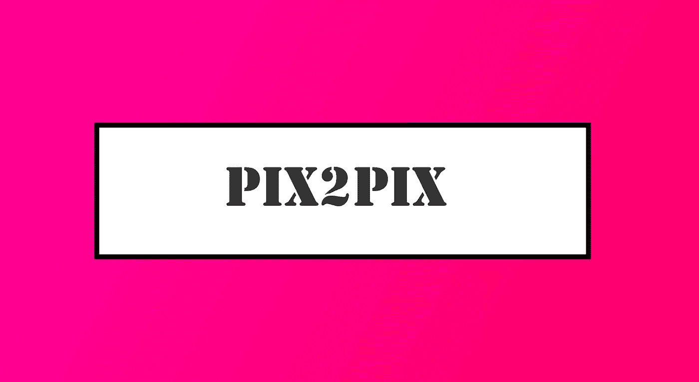
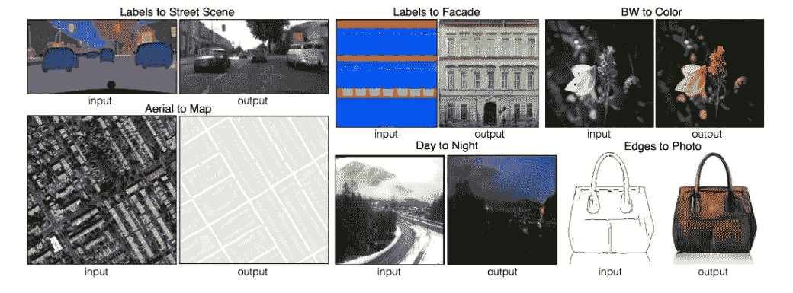
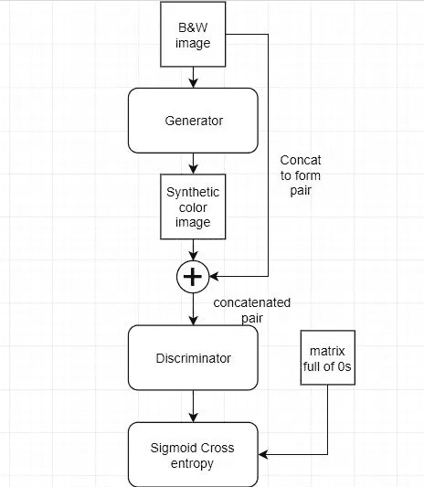
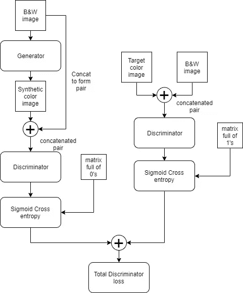
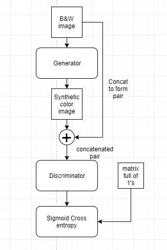

# GAN Pix2Pix 生成模型

> 原文：<https://towardsdatascience.com/gan-pix2pix-generative-model-c9bf5d691bac?source=collection_archive---------6----------------------->

## 使用 Pix2Pix 模型进行图像到图像的翻译

Pix2Pix

# Pix2Pix GAN:简介

我们听到很多关于深度学习的语言翻译，其中神经网络学习从一种语言到另一种语言的映射。事实上，谷歌翻译用它来翻译 100 多种语言。但是，我们能对图像做类似的工作吗？当然，是的！如果有可能捕捉错综复杂的语言，那就一定有可能将一幅图像翻译成另一幅图像。的确，这显示了深度学习的力量。

Pix2Pix GAN 论文早在 2016 年就由[菲利普·伊索拉](https://arxiv.org/search/cs?searchtype=author&query=Isola%2C+P)、[、](https://arxiv.org/search/cs?searchtype=author&query=Zhu%2C+J)、[周廷辉](https://arxiv.org/search/cs?searchtype=author&query=Zhou%2C+T)、[阿列克谢·阿夫罗斯](https://arxiv.org/search/cs?searchtype=author&query=Efros%2C+A+A)发表。在这里找到论文。后来在 2018 年进行了修订。当它发表后，互联网用户尝试了一些创造性的东西。他们将 pix2pix GAN 系统用于各种不同的场景，如模仿一个人的动作，将一个人的视频逐帧翻译给另一个人。很酷，不是吗？使用 pix2pix，我们可以将任何图像映射到任何其他图像，就像对象的边缘映射到对象的图像一样。此外，我们将详细探讨它的架构和工作原理。现在，让我们开始吧！

**来源:GitHub**

# Pix2Pix GAN 如何工作？

# cGAN:概述

听说过生成逼真合成图像的 GANs(生成对抗网络)吗？类似地，Pix2pix 属于一种称为条件 GAN 或 cGAN 的类型。他们有一些条件设置，并在这种条件下学习图像到图像的映射。而基本 GAN 从随机分布向量生成图像，不应用任何条件。迷茫？试着得到这个。

比方说，我们有一个用 MS-COCO 数据集的图像训练的 GAN。在 GANs 中，用发生器网络产生的输出图像是随机的。也就是说，它可以生成数据集中任何对象的图像。但是，有了 cGAN，我们可以生成我们想要的图像。如果我们想让它生成一个人，它会生成一个人的图像。这是通过调节 GAN 实现的。

# Pix2Pix GAN:概述

让我们再举一个图像到图像转换任务的例子，即“黑白到彩色图像”的转换。在 pix2pix cGAN 中，B&W 图像作为生成器模型的输入。并且，所生成的模型的输出和给定的输入(B&W 图像)图像对是所生成的对(伪对)。B&W 输入图像和目标输出(即输入 B&W 图像的真实颜色版本)形成真实对。

鉴别器将给定的图像对分类为真实图像对或生成图像对。Pix2Pix 中使用的那个与我们通常期望的分类器输出不同。它生成一个输出分类，对输入图像对中的多个面片进行分类(patchGAN)。我将详细解释它。在下面的描述中，连接被表示为⊕.

# Pix2Pix GAN 架构

Pix2Pix GAN 有一个生成器和一个鉴别器，就像普通 GAN 一样。对于我们的黑白图像彩色化任务，输入 B&W 由生成器模型处理，它生成输入的彩色版本作为输出。在 Pix2Pix 中，生成器是一个 U-net 架构的卷积网络。

它接收输入图像(B&W，单通道)，将其通过一系列卷积和上采样层。最后，它产生一个输出图像，其大小与输入相同，但有三个通道(彩色)。但是在训练之前，生成器只产生随机输出。

在生成器之后，合成图像与输入 B&W 图像连接。因此，颜色通道的数量将是四个(高 x 宽 x 4)。该级联张量作为输入馈入鉴别器网络。在 Pix2Pix 中，作者采用了一种不同类型的鉴别器网络(patchGAN 类型)。patchGAN 网络采用连接的输入图像，并产生大小为 NxN 的输出。

# 损失函数

## 鉴频器损耗

鉴别器损失函数衡量鉴别器预测的好坏。鉴别器损失越小，识别合成图像对就越准确。

GANs 中使用的普通二进制分类器只产生一个输出神经元来预测真假。但是，patchGAN 的 NxN 输出预测输入图像中的许多重叠面片。例如，在 Pix2Pix 中，输出大小为 30x30x1，可预测输入的每个 70×70 面片。我们将在另一篇文章中看到更多关于 patchGANs 的内容。30×30 输出馈入对数损耗函数，该函数将其与 30×30 零矩阵进行比较(因为它是生成的而不是真实的)。

**合成图像对丢失**

这就是所谓的发电损失。从数据集中计算 B&W 对及其相应的彩色图像的真实损失。这是真的一对。因此，“实际损失”是 NxN 输出的 sigmoid 交叉熵和一个 NxN 大小的矩阵。

鉴频器总损耗是上述两种损耗的总和。损失函数的梯度是相对于鉴别器网络计算的，并且被反向传播以最小化损失。当鉴别器损耗反向传播时，发电机网络的权重被冻结。唷！现在我们差不多完成了。

**鉴别器的损失函数**

## 发电机损耗

发生器损耗衡量合成图像的真实程度。通过最小化这个，生成器可以产生更真实的图像。

**发电机损耗功能**

这种损耗几乎与生成损耗相同，只是它是 NxN 鉴频器输出的 sigmoid 交叉熵和一个矩阵。当这种损耗反向传播时，鉴频器网络的参数被冻结。并且只调整生成器的权重。

为了提高生成图像的美观性，pix2pix 论文的作者添加了一个 L1 损失项。它计算目标图像和生成图像之间的 L1 距离。然后乘以参数“λ”,并添加到发电机损耗中。

# 训练 Pix2Pix 模型

为了训练模型将 B&W 图像转换为彩色图像，我们必须向网络提供输入和目标图像。因此，可以使用任何带有彩色图像的数据集，如 ImageNet。数据集可以通过将彩色图像转换成 B&W 来构成输入。并且彩色图像本身形成目标。因此，可以通过迭代数据集、将图像一个接一个地或成批地馈送到 pix2pix 模型来训练网络。

# 就这样…完成了！

那是给你的 pix2pix！希望你对 pix2pix GAN 是什么以及它是如何工作的有一个清晰的认识。

了解如何在自定义数据集上训练 cGAN 模型。

[1。如何用 5 个简单的步骤训练一个人工智能 cGAN 模型](https://hackerstreak.com/colorizing-pokemon-with-deep-learning/)