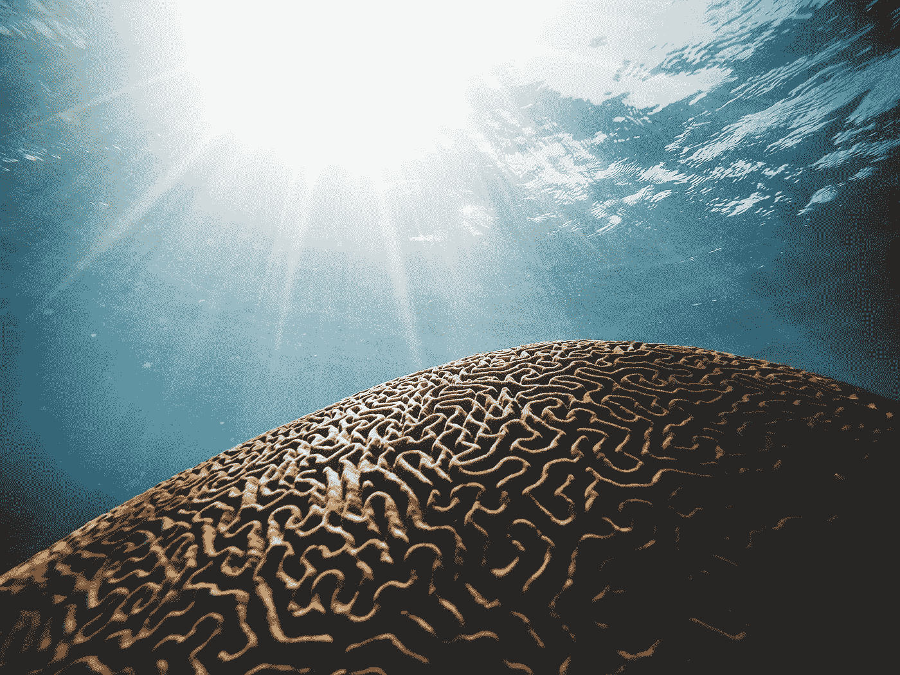

# 安钢:如何培养大脑

> 原文：<https://towardsdatascience.com/gangan-how-to-grow-a-brain-44d61c4f8251?source=collection_archive---------57----------------------->

## ~*gan 是类比机器，它得到 meta ~*

照片由[丹尼尔·奥伯格](https://unsplash.com/@artic_studios?utm_source=unsplash&utm_medium=referral&utm_content=creditCopyText)在 [Unsplash](https://unsplash.com/s/photos/brain?utm_source=unsplash&utm_medium=referral&utm_content=creditCopyText) 上拍摄

**TL；博士**——如果你有两个神经网络，每个用于一个不同的任务，那么你有时可以找到一个 GAN，它将一个任务 ***转换为另一个任务****。类比！因此，找到**GAN，它‘GAN’成对的 GAN**，你就可以增长层次抽象。使用这些 gan 在观察到的数据分布*之外做出预测*——类比让你零射击新任务。*

我应该从一个具体的例子开始:

**扔石头**

假设你有一个已经训练好的观看视频的神经网络。它观察了几千个小时的人们拿着、扔着和扔着棒球。你的网络很擅长预测抛物线轨迹。但是，只见过棒球做那种事情。你给它看一个有人扔石头的*单*视频，神经网络就丢了。可恶。

但是，等等！如果你能训练出一只能拍下扔石头视频每一帧的狗，然后 ***把石头转换成棒球*** ，那么你就又是金牌了！当然，获得更多摇滚视频可能更容易，但当你试图解决*在线学习*时，这个问题变得不可克服，特别是对于*长尾事件*，以及更具适应性、更安全的神经网络所必需的*泛化能力*。

这里的关键概念是:采用一个众所周知的任务(棒球轨迹)，将其与 GAN 翻译器(摇滚到棒球)结合，从而通过类比做出合理准确的预测*。(实际上润色视频的每一帧，使摇滚看起来像棒球，可能太笨拙了。你只需要一个 GAN 来做*任何让 rock-translator 网络具有预测性的事情；*神经网络生成的*训练机制的发展*表明，在我们看来，最佳类比转换可能看起来**。)***

**可以把甘的类比推理能力看作是他自己的一块小石头。因为我们正在用这些东西建造一座大教堂…**

****甘的甘****

**假设你一直在用这些 gan 在*数百*个不同的任务之间形成类比。*每一个*任务对，你都要检查是否有一个*紧凑而准确的*‘GANalogy’通常情况下，除非你让你的神经网络变得庞大，以便它能记住所有的东西，否则你无法获得一个像样的 GAN。那些是在感觉层面上*实际上不同于*的任务。忽略那些；如果 GAN 看起来像他们中的一员，就不要费心全程训练它了。**

**然而，即使 GAN 模拟网络缩减到几百个神经元，仍有一些任务运行得很好。那些甘人是守护者。一旦你把所有你能理解的 GAN 都弄懂了，你就可以说:“对于这些****两个****GAN*，有 GAN 翻译吗？”*这些* GanGANs 会是像“(摇滚到棒球)作品像(雕塑到人)”和“(电场到磁场)作品像(矩阵到矩阵)”这样的东西。 ***真实、有用的比喻*** 。包括任务到 GAN 和低层到高层 GAN。*每一个*对！***

***一层一层，向上到更大的抽象，找到工作的 gan。当然，它们中的许多都是多余的——例如，你可能有一个棒球到岩石的 GAN、棒球到苗条和苗条到岩石的 GAN……*冗余让你* ***检查*** *你的工作*，类似于专家神经网络模型的混合。更重要的是，如果几个不同的答案路径都给了*相同的结果*，它们更有可能是正确的答案，因为**的错误往往会使*与*互不相同，而事实是*与*** 一致。类似地，自我一致性作为唯一的约束最近仅从[视频](https://www.youtube.com/watch?v=eTYcMB6Yhe8)中生成了近 SOTA 无监督深度感知。***

*****永远记住细节*****

***我有理由相信，你永远不会想要明确地组合原始的感觉网络，这是一个错误，希望“将众多任务集成到一个单一的端到端神经网络中，将提高性能”。第*号保留*所有微小的感觉网络，并保留每一个单独的和多余的干，*只要它实际上起到类比的作用*。这样，任何一个*组件*任务都有能力独立地与一个*新*任务相结合，形成一个**专门且独特的类比**。相比之下，已经**集成到单片端到端网络**中的任务将*从新的 GAN 模拟形成中*模糊，因为单片网络*作为一个整体*不是模拟的。***

***随着安钢的进展，我会继续更新，我还不想过多地谈论细节。简而言之:有许多*更抽象的损失函数*可能值得*添加*到单个网络的损失函数，以有效地调节这些 gan 的生成和整合。此外，用于推理阶段的 GANs 架构显然有很大的作用；我受到了关于[元神经元](/using-meta-neurons-to-learn-facts-from-a-single-training-example-781ca0b7424d)的工作的启发，这些元神经元用于组合 GAN 输出的不和谐声音。Hinton 的胶囊也是一个值得记住的好模型。请随意尝试——我很慢而且不稳定，所以你可能会在我之前完成。:)***