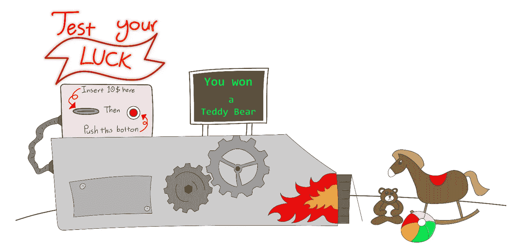
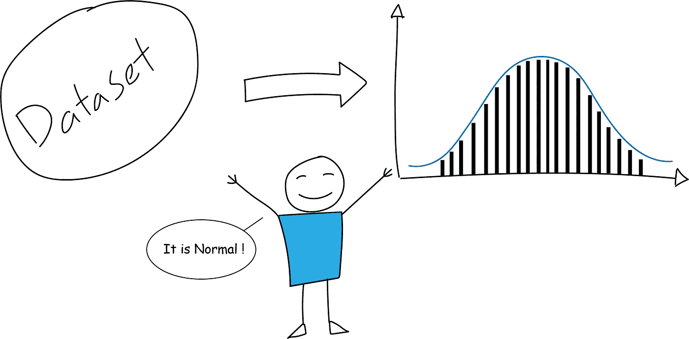
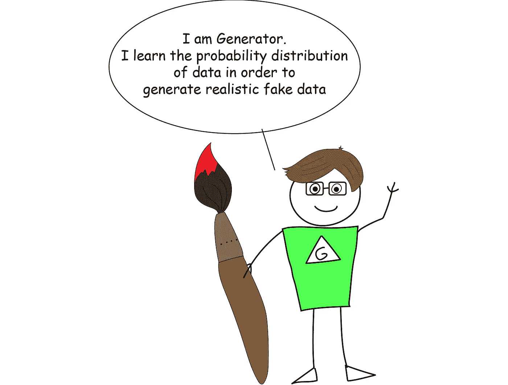
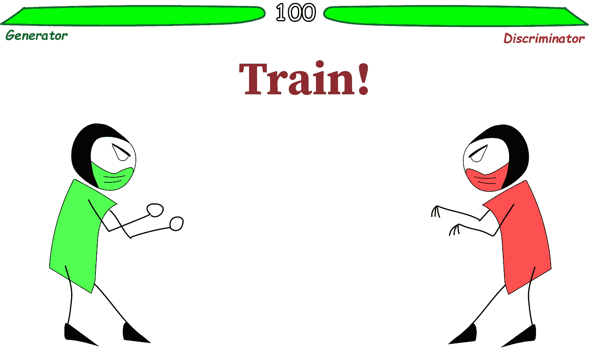

# 甘斯:不同的视角

> 原文：<https://towardsdatascience.com/gans-a-different-perspective-3f2648da6a28?source=collection_archive---------42----------------------->

## 一个直观和无障碍的介绍，以生成敌对网络

生成对抗网络是现代人工智能领域最热门的话题之一。在本文中，我们将从一个不同的角度来看 GANs，即，不把 GANs 看作美丽图像的生成器，而是看作概率分布转换函数。我们将探索 GAN 的核心思想，而不会被实现和复杂的数学所困扰。我们从分析我们手头的问题类型开始。然后，我们了解解决方案的需求如何塑造 GAN 理念。

# 欢迎来到游乐园！

假设我们拥有一个游乐园。在这个公园里，我们有一台机器，它接收 10 美元，然后随机返回一个价值在 1 美元到 100 美元之间的物品。这台机器在游客中很受欢迎，因为他们不时赢得非常酷和昂贵的东西。此外，这台机器对我们来说很有利可图。因此，机器的赠品选择逻辑准确地击中了甜蜜点，确保了我们和客户的满意度。

作者图片

因此，我们想增加更多的这种机器，以获得更多的利润。但是，有一个问题。这台机器超级贵。因此，我们有兴趣制造我们的机器。为此，我们需要弄清楚机器的项目选择逻辑。显然，选择一个项目的关键参数是它的价值。如果一个项目是昂贵的，它应该是不太可能被选中，以保证我们的利润。然而，如果我们降低选择昂贵物品的概率，就会导致游客的不满。因此，我们的目标是尽可能精确地了解物品价值的概率分布。首先，我们有一个以前机器的赠品列表及其相应的价格。首先，我们试图看看赠品的分布。如果分布类似于一个众所周知的概率分布，问题就解决了。我们使用概率分布作为我们新机器的项目选择逻辑的核心。我们从这个分布中抽取样本来决定返回哪个项目。

作者图片

# 复杂的机器，复杂的问题

然而，如果我们遇到一个复杂的赠品分布，我们需要设计一种方法来学习一个生成过程的概率分布，只给出分布中的样本。

作者图片

换句话说，我们需要一个模型来查看我们的数据，并找出机器逻辑。*的主要观点是，学习数据的概率分布是数据生成的主要任务。*

# 转型生成

让我们抽象地描述我们的目标。首先，我们有一组数据，从这一点开始，我们称之为**真实数据**。我们的目标是伪造与真实数据相似的人工数据。人工数据通常被称为**假数据**。因此，我们需要一个模型来查看真实数据并生成逼真的假数据。目标很明确。现在，我们需要从抽象的目标转向更详细的任务描述，并希望将它与更熟悉的东西联系起来。为此，我们需要改变对问题的看法。首先，我们需要熟悉一下**变换函数**。假设我们有一组来自概率分布的样本。通过应用变换函数，我们可以将这些样本从它们的原始分布变换成期望的目标分布。理论上，我们可以从任何源分布转换到任何目标分布。然而，计算这些变换函数并不总是解析可行的。

现在，让我们回到我们的问题。我们可以把我们的世代问题重新定义为一个转变的任务。我们从已知的分布开始。通常，我们选择均值为 0、标准差为 1 的高斯分布。我们称这种分布为“潜在空间”。现在，我们需要定义一个转换函数，将样本从我们的潜在空间转换到数据空间。换句话说，我们的变换函数从潜在空间中提取样本，并输出数据空间中的样本，也称为数据点。瞧！我们生成数据！只有一个问题。解析地定义这个函数是不可能的。但是，我们不是用神经网络来近似解析定义不了的复杂函数吗？是的，我们有，这正是我们要做的。我们使用神经网络来近似我们的转换函数。我们称这种神经网络为“生成器”，因为最终它会生成数据。挺懂事的。

作者图片

现在谈到使用神经网络，我们需要定义一个损失函数来训练我们的网络。损失函数是正确训练和真实数据生成的关键。因此，我们需要根据我们的目标精确地定义它。

# 鉴别器:非常有用

一般来说，损失函数评估我们的神经网络在我们的目标方面表现如何，并向模型提供反馈(以梯度的形式)以改进自身。这里，我们需要一个损失函数来衡量我们生成的数据遵循真实数据分布的程度。换句话说，我们想要一个损失函数，它可以告诉我们，我们的假数据有多真实。尽管如此，我们没有任何关于真实数据分布的信息。这从一开始就是我们的主要问题。然而，我们可以通过区分真实数据和虚假数据来达到同样的目的。

假设我们的损失函数可以区分真实数据和虚假数据。

作者图片

然后，我们可以将我们的假数据提供给这个函数。对于那些与真实数据难以区分的假样本，我们不需要做任何事情。对于其他假样本，损失函数将提供反馈来更新和改进我们的生成器。

作者图片

更具体地说，我们可以使用一个分类器作为损失函数，可以对真实数据和虚假数据进行分类。如果一个生成的数据点被分类为真实的，这意味着它类似于真实的数据，我们不需要采取任何进一步的行动。对于那些被识别为生成数据的假样本，我们会问损失函数，我们应该如何更新我们的生成器，以使这些样本看起来更真实。损失函数以梯度的形式提供答案，以更新我们的神经网络中的权重。

看来我们已经找到了解决方案的最后一部分！然而，我们必须注意另一个问题。虽然我们建议的损失函数满足我们的要求，但在实践中并不容易实现。因此，我们的损失函数是一个复杂的函数，我们可以定义它的特征，但我们不能直接实现它。看起来是个死胡同。但是，是什么阻碍了我们使用神经网络来近似这个损失函数呢？没什么！所以，我们开始吧。我们可以使用分类器神经网络作为我们的损失函数。我们称这个网络为“鉴别器”，因为它可以鉴别真实和虚假的数据。非常明智的命名。

作者图片

最重要的是，我们非常熟悉使用神经网络进行分类。我们知道如何训练它们，它们的损失函数，以及它们的输入和输出应该是什么样子。然而，同时训练两个神经网络不是常规的事情。现在，最后的问题是，我们应该如何一起训练所有这些网络。

# 让火车开始吧！

作者图片

如果我们在开始训练生成器之前有了完美的分类器，我们的训练将变得非常简单。不幸的是，在训练过程的开始，我们的鉴别器就像我们的生成器一样毫无头绪。更糟糕的是，我们不能在开始训练生成器之前训练鉴别器，因为我们需要假数据来训练鉴别器。如你所见，这两个网络在训练中相互依赖。发生器需要来自鉴别器的反馈来改进，并且鉴别器需要随着发生器的改进而保持更新。因此，我们交替训练它们。对于一个批次，我们训练鉴别器来区分真假样品。然后对于一个批次，我们训练生成器生成被鉴别器识别为真实的样本。这种方法被称为“对抗训练”。当我们使用对抗训练进行数据生成任务时，我们得到生成性对抗网络，简称 GAN。

然而，当我们看训练程序时，我们看不到“对手”本身。为了找出“对抗性训练”这个术语的来源，我们应该仔细看看两个网络的目标。鉴别器的目标是尽可能准确地对真实数据和虚假数据进行分类。因此，在鉴别器训练阶段，鉴别器试图正确地识别假样本。另一方面，我们训练生成器生成逼真的假数据。为了通过真实性测试，生成器应该让鉴别器相信它生成的数据是真实的。换句话说，生成器试图愚弄鉴别器，而鉴别器试图不被生成器愚弄。这些相互矛盾的目标启动了培训过程。

在培训期间，两个网络都在目标方面有所改进。最后，在某个点上，生成器变得如此之好，以至于鉴别器无法区分假数据和真实数据，这就是我们完成训练的点。

作者图片

# 陷阱。很多啊！

对于一个非常困难的问题，GANs 是一个美丽而复杂的解决方案。借助 GAN，我们可以快速、高效、精确地解决一个长期存在的问题，并为许多激动人心的应用铺平道路。然而，在开始应用之前，我们应该了解 GANs 的常见问题。首先，生成器是一个神经网络，根据定义，它是一个黑盒。虽然经过训练的生成器将关于真实数据分布的信息嵌入到其权重中，但我们无法显式访问它。当我们处理低维数据时，我们可以通过采样来检索这些信息，但对于高维数据，我们无能为力。此外，与其他神经网络不同，GANs 损失函数提供的关于训练进度的信息很少。在培训期间，我们需要手动检查发电机样品，以检查培训进度。最后，如前所述，训练发生在生成器和鉴别器之间的战斗中。如果他们停止互相争斗，训练过程就会加快，不幸的是，他们经常在一段时间后停止争斗。造成这个问题的原因有很多。例如，如果其中一个网络比另一个提高得快得多，它就会压倒另一个网络，训练就会停止。因此，网络架构应该是平衡的。但是平衡是什么意思呢？这个问题没有直接的答案。通常，人们应该通过反复试验来找到它们。所以 GAN 训练过程相当不稳定。对于稳定性问题有许多建议的解决方案，但是它们大多解决一个并增加另一个，或者需要满足一些特定的条件。简而言之，提高甘的训练进度仍然是一个未解决的问题，围绕这一问题的研究非常活跃。

# 结论:冰山一角

让我们回到我们的昂贵的机器开始。从时间和资源的角度来看，这台机器象征着所有昂贵的数据生成过程。假设我们有一个中等规模的人脸数据集，对于一个应用程序，我们需要一个更大的数据集。我们可以拿起相机，给人们拍照，然后把它们添加到数据集中。然而，这是一个耗时的过程。现在，如果我们在可用的图像上训练一个 GAN，我们可以在几秒钟内生成数百个图像。因此，数据扩充是 GANs 最突出的应用之一。

数据稀缺并不是唯一的动机。让我们回到人脸数据集。如果我们想使用这些照片，我们很可能会遇到隐私问题。但是如果我们使用实际上并不存在的人的假图像呢？非常好！没人会在意。因此，GANs 为数据隐私问题提供了一个简洁的解决方案。甘的研究团队现在非常活跃，每天都有新的应用或改进被提出。尽管如此，仍有许多东西有待发现。这只是冰山一角。