# GANs 和低效映射

> 原文：<https://towardsdatascience.com/gans-and-inefficient-mappings-f185fdd62a78?source=collection_archive---------21----------------------->

## 甘人如何把自己绑在绳结里，为什么这会损害训练和质量

图片来源:[维基共享资源](https://commons.wikimedia.org/wiki/File:Complex_ceiling_architecture_(9330887903).jpg)

> 给手机用户的一个警告:这篇文章中有一些厚的 gif 图片。

生成对抗网络(GANs)被誉为生成艺术中的下一个大 Thing™️，这是有充分理由的。新技术一直是艺术的驱动因素——从颜料的发明到照相机到 Photoshop——GANs 是自然的下一步。例如，考虑以下图片，发表在 2017 年埃尔加马尔等人的[论文](https://arxiv.org/pdf/1706.07068.pdf)中。

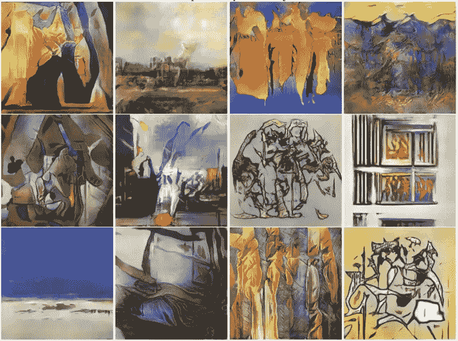

图一:残创作的抽象艺术(来源: [arXiv:1706.07068v1](https://arxiv.org/pdf/1706.07068.pdf) )

如果你不熟悉 GANs，[这篇文章](/this-will-change-the-way-you-look-at-gans-9992af250454)包含了训练过程的简要概述。简而言之，GANs 将随机噪声作为输入，并且(如果训练顺利的话)产生与真实数据不可分辨的输出，真实数据实际上可以是任何东西(一组抽象画、名人的照片、手写数字等)。).

与之前的变分自动编码器一样，在 GAN 文献中，输入值通常与输出没有明确的关系，这是一个记录良好的问题。正如我前面提到的，GANs 接受随机噪声(通常是 100 个随机的正态分布值)作为输入，每个随机数都可以看作是控制输出的杠杆。理想情况下，每个杠杆对应一个特征——在生成人脸的情况下，将有一个杠杆用于微笑或皱眉，一个用于肤色，一个用于头发长度，等等；这种情况很少发生，这使得把 GANs 用于艺术有些冒险。作为这个问题的可视化，考虑下面的动画:

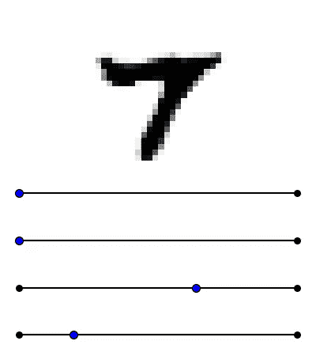

图 2:(上图)在 MNIST 数据集上训练的 GAN 的输出。当(底部)控制杆被调整时，输出无意识地改变，一次一个，而其余的保持不动。只有两个杆被调节，其他 12 个(静态)杆未显示。

在这里，我使用 16 维的潜在空间在 MNIST 手写数字数据集上训练了一个 GAN。我使用这个 GAN 生成了一个随机样本，然后举例说明了当一个输入值被调整而其他值固定不变时，输出是如何变化的。正如你所看到的，这两个杠杆都没有以一种人类可能会觉得直观或有用的方式改变输出；第一个杠杆控制数字是 7 还是 9 以及笔画角度，而第二个杠杆控制数字是 7 还是 9 以及笔画*粗细*。很蠢，对吧？人们可以想象生成“手写”数字的理想工具是什么样的:第一个杠杆控制生成哪个数字，从 0 到 9；第二杠杆控制笔画的粗细；第三个控制冲程角度；第四，循环……你明白了。相反，我们看到这些特征中的几个由单个杠杆控制，其中一个由多个杠杆控制。想象一下，如果 Photoshop 的旋转工具也通过色轮旋转图像的色调，那将是多么令人沮丧！

这里显而易见的问题是，对于图像生成来说，这是一个低效的、完全混乱的界面。然而，还有另一个不太明显的问题:输入和输出之间扭曲复杂的关系也阻碍了训练，限制了输出的整体质量。

# 问题一:螺旋

正如我在[这篇文章](/training-a-gan-to-sample-from-the-normal-distribution-4095a11e78de)中所解释的，GANs 本质上是一种建模一些数据分布的工具，无论是正态分布还是人脸分布。因此，GAN 是从某个潜在空间到某个样本空间的变换或映射。当 GANs 的学生一头扎进像图像生成这样的高维问题时，这一点经常被忽视。在这里，我打算使用简单的二维问题来演示低效的映射问题，第一个问题如下所示:

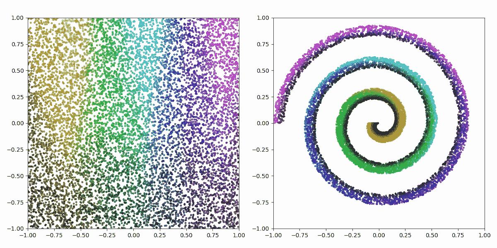

图 3:(左)将[[-1，1]，[-1，1]]中的均匀噪声映射到螺线的简单函数的潜空间和(右)样本空间。色调和值用于演示潜在空间中的哪个区域映射到样本空间中的哪个区域

这是一个相当简单的函数，它将输入空间中的 x 轴映射到样本空间中沿螺旋的位置(角度和半径)，将 y 轴映射到螺旋内的横向位置。出于可视化的目的，x 轴也映射到色调，y 轴映射到值(彩色对黑色)。为了进一步阐明此功能，请考虑以下动画:

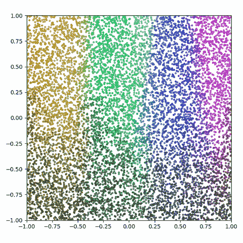

图 4:图 3 中描述的函数的潜在空间和样本空间之间的线性插值

那么，问题是训练一个 GAN，它能够以这样一种方式从这个螺旋分布中采样点，使得来自 GAN 的一批和来自真实函数的一批是不可分辨的。注意，GAN 不必学习原始映射；只要输出分布相同，任何映射都可以。

## 结果:

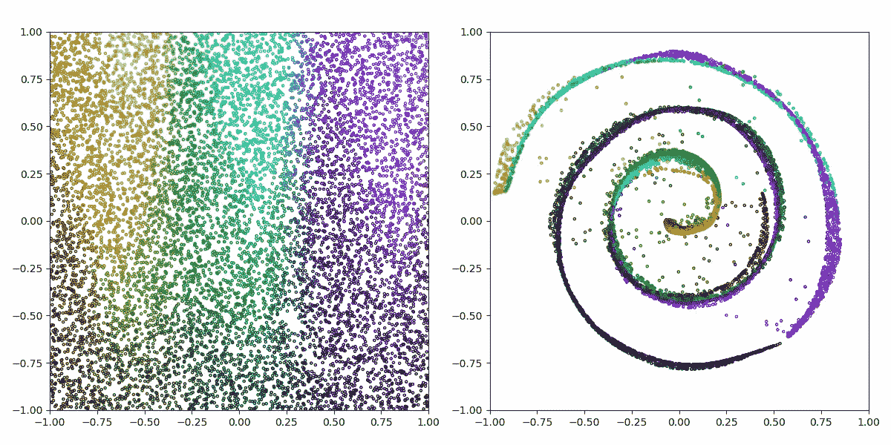

图 5:(左)GAN 的潜在空间和(右)输出分布

使用典型的 GAN 训练技术(代码可在文章末尾获得)对 GAN 进行 60k 训练步骤的训练。如你所见，GAN 成功地学会了螺旋分布。然而，它有几个问题:

1.  它比目标函数要细得多。尽管螺旋的某些部分具有一定的宽度，GAN 基本上将这种分布减少到 2 维空间中的 1 维流形。
2.  输出很乱；注意散布在螺旋负空间的点。这些从来没有在目标函数中出现过，那么它们在这里做什么呢？
3.  注意点(0.60，-0.63)和(0.45，0.17)的奇怪伪影；这些不连续性导致分布中的空洞。
4.  将 GAN 产生的螺旋中的色调和值的分布与原始函数中的进行比较(图 3)；它们的有序性要差得多，并且没有显示出潜在空间(杠杆)和产出之间的明确关系。

所有这四个问题在这个动画中都有说明:

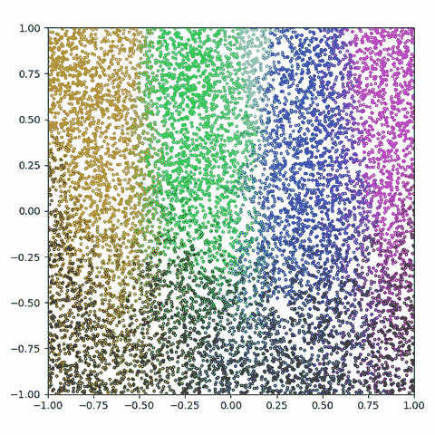

图 6:潜在空间和 GAN 输出之间的线性插值

如你所见，这四个问题实际上都是同一个问题。比较图 6 和图 4，我们可以看到 GAN 已经学会了一种低效的映射。首先考虑潜伏空间右上角的撕裂；裂口上方的潜在空间区域被映射到螺旋的最外面部分，而紧靠裂口下方的区域被映射到螺旋的中心。这种撕裂行为解释了混乱(问题 2)；位于*和*上的任何一点都被映射到这两个极端之间的某个地方，通常落在螺旋的负空间。它还解释了(0.60，-0.63)处的伪像(问题 3)，因为在该区域中生成的点是从潜在空间中的远点映射的，这也是为什么颜色的色调和值也不一致(问题 4)。最后，通过映射的复杂性解释了学习分布(问题 1)的皮肤性；分布的大部分方差来自于沿着螺旋的位置*，而在*螺旋宽度内的位置*不太重要。因此，甘人首先学会了如何制造螺旋。每当它试图扩大范围时，映射的复杂性会导致一些其他区域中断，就像新手开发人员的意大利面条代码一样(我们都经历过)。GAN 基本上把自己困在了一个无法逃脱的局部极小值中。如果你很好奇(如果不是，恕我直言，你为什么要读这篇文章？)，这是 GAN 训练时的样子:*

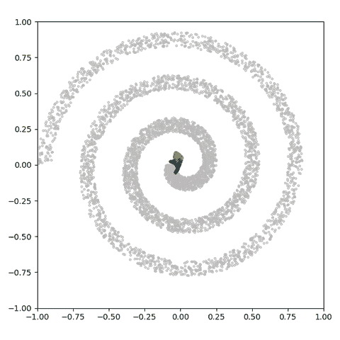

图 7:训练期间螺旋生成 GAN 的输出(彩色)和来自目标函数的样本(灰色)。

图 7 显示，GAN 很快了解到最外层和最内层区域的不兼容映射，其余分布被迫在它们之间进行协调。

# 问题二:八个高斯人

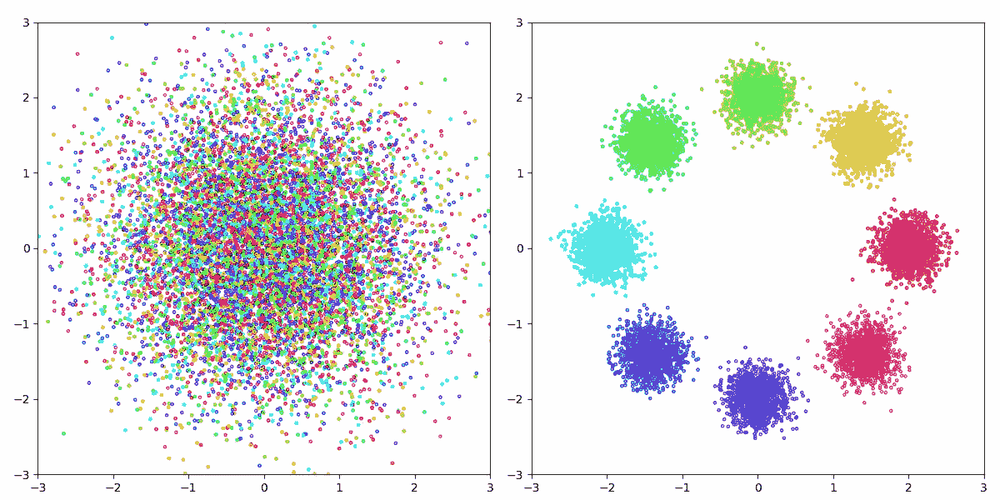

图 8:八高斯问题，左边是潜在空间，右边是样本空间。

该函数将 2.5 维空间映射到 2 维空间。潜在空间中的前两个维度是独立的、标准的正态分布值。剩余的“0.5”是具有八个可能值的离散维度，被编码为长度为八的向量，其中一个值被设置为一，而其余的值为零。在图 8 中，潜在空间中的随机样本通过在 x 轴和 y 轴上绘制两个连续维度来说明，而离散维度由颜色表示。目标函数基于潜在维度的值，通过以因子 0.2 重新缩放正态分布并将其移动到八个点之一，将该潜在空间映射到样本空间。这个过程在这里是动画:

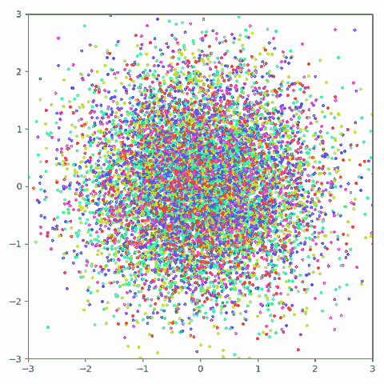

图 9:八高斯问题的潜在空间和样本空间之间的线性插值

那么，问题是训练一个 GAN，它能够以这样一种方式从这八个高斯分布中采样点，使得来自 GAN 的一批和来自真实函数的一批是不可分辨的。注意，就像上面的螺旋问题一样，GAN 不必学习原始映射，但是有一个简单的映射显然是更可取的。

## 结果:

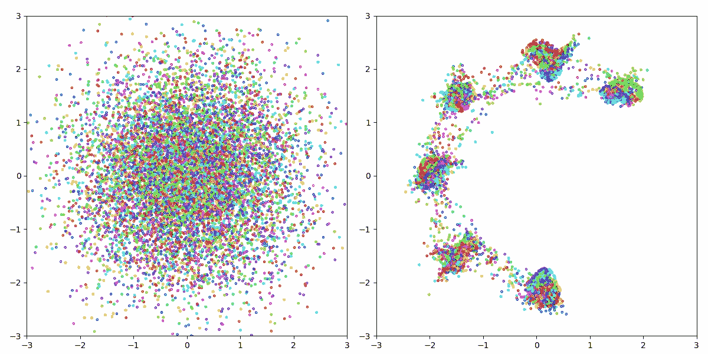

图 10:(左)在八高斯问题上训练的 GAN 的潜在空间和(右)输出分布

很糟糕。GAN 完全不能在两种模式下产生样本(模式崩溃)，它在模式之间产生大量的点，它不能产生正态分布的模式，并且在潜在空间和样本空间之间明显没有合理的关系。这一点在下面的动画中更加明显:

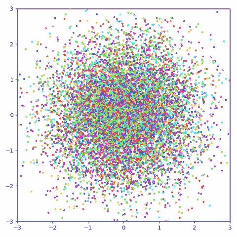

图 11:潜在空间和 GAN 输出之间的线性插值

显而易见，两个连续潜值内的不同区域被剪切并映射到六个样本空间模式。这与螺旋问题中的撕裂提出了同样的问题；落在裂缝上的点被映射到模式之间的负空间。尽管解决方案很简单(即缩小连续维度，并将离散维度中的每个值映射到不同的模式)，但 GAN 陷入了局部最小值，无法将自己挖出来。

# 问题三:一个高斯

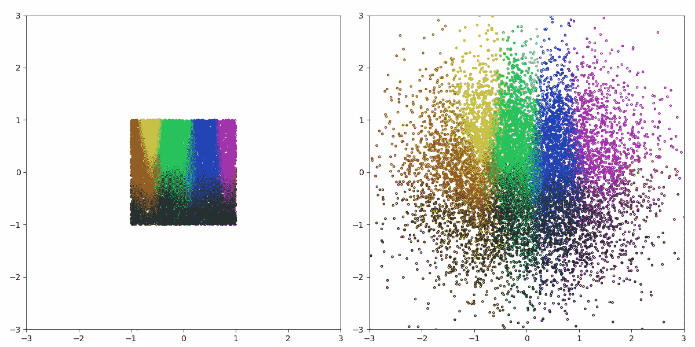

图 12:“一个高斯”问题，潜在空间在左边，样本空间在右边。

八高斯问题显然太难了，所以这里有一个更简单的问题:将二维均匀噪声转换成二维标准正态噪声。如同在螺旋问题中，通过沿着 x 轴旋转色调和沿着 y 轴改变潜在空间的值来给点着色。最简单的映射很简单:独立扩展每个维度。这里举例说明了这一点:

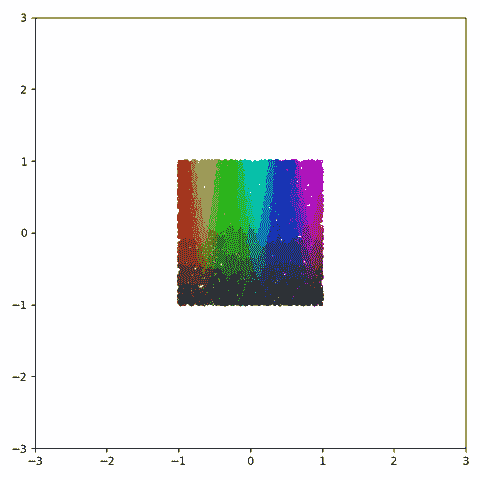

图 13:一个高斯问题的潜在空间和样本空间之间的线性插值

## 结果:

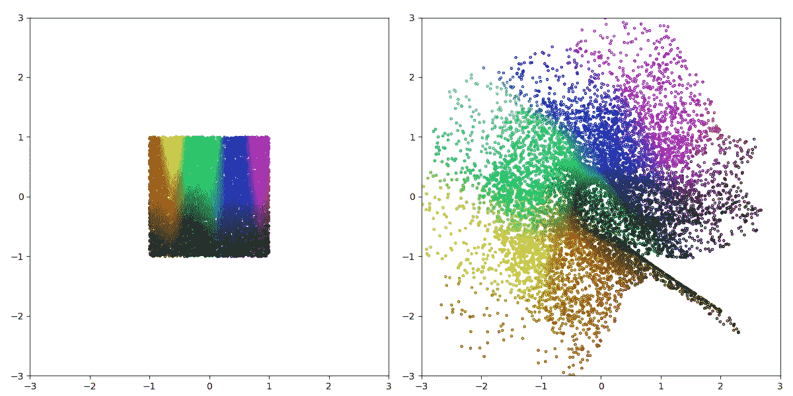

图 14:(左)在一个高斯问题上训练的 GAN 的潜在空间和(右)输出分布

正如你所看到的，即使是从简单的二维正态分布中采样，GAN 仍然会打结。最值得注意的是，GAN 似乎将潜在空间折叠在自身上，导致样本空间右下角出现扭结、间隙和突起。以下是插值动画:

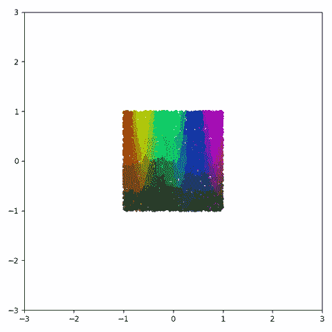

图 15:潜在空间和 GAN 输出之间的线性插值

# 结束语

可能我已经反复强调了这一点。然而，我希望上面的可视化已经清楚地表明，输入和输出特征之间的模糊关系不仅仅是一个简单的不便，而是一个更基本的问题的征兆。如果您对用于训练上述 GANs 的代码或可视化代码感兴趣，两者都可以在以下 github repo 中获得:

 [## ConorLazarou/培养基

### 低效 GAN 映射的训练代码和可视化

github.com](https://github.com/ConorLazarou/medium/tree/master/12020/visualizing_gan_mapping)