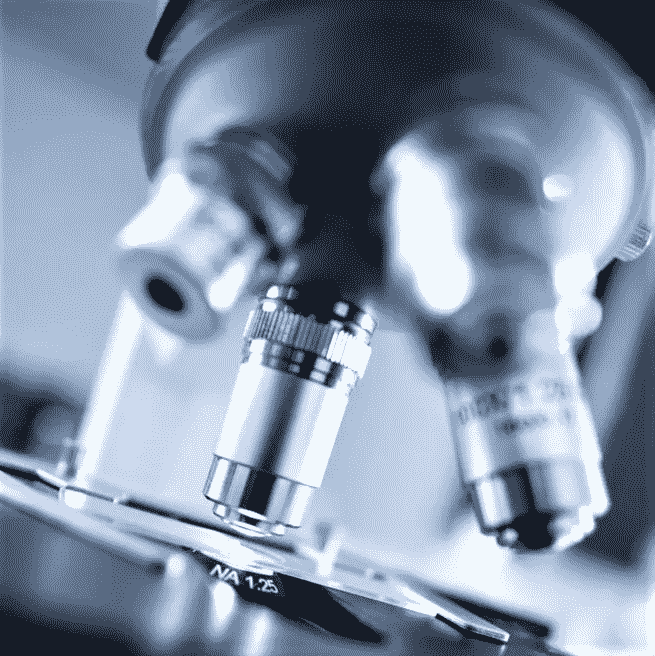
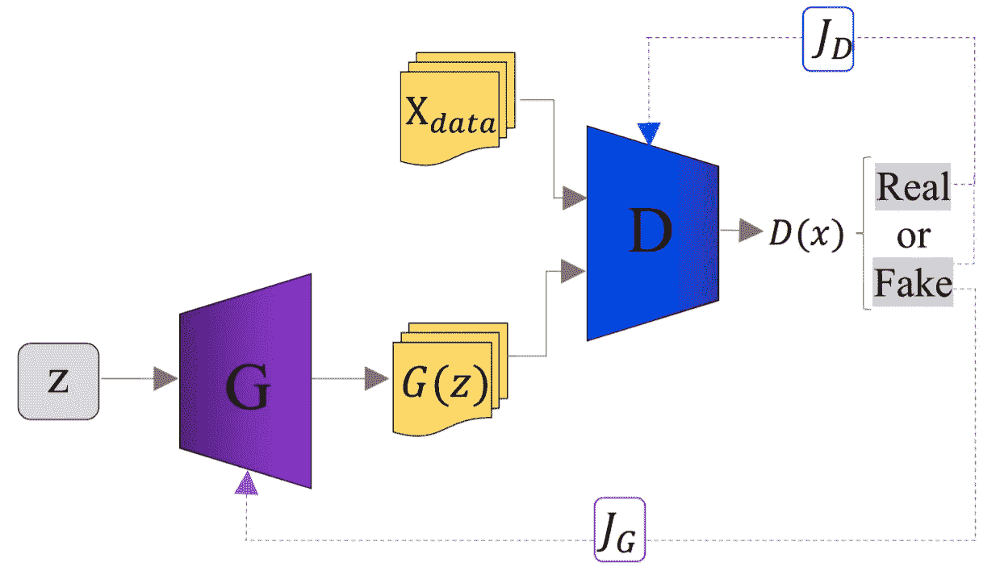
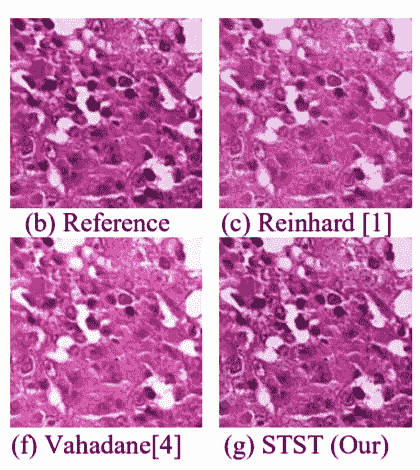
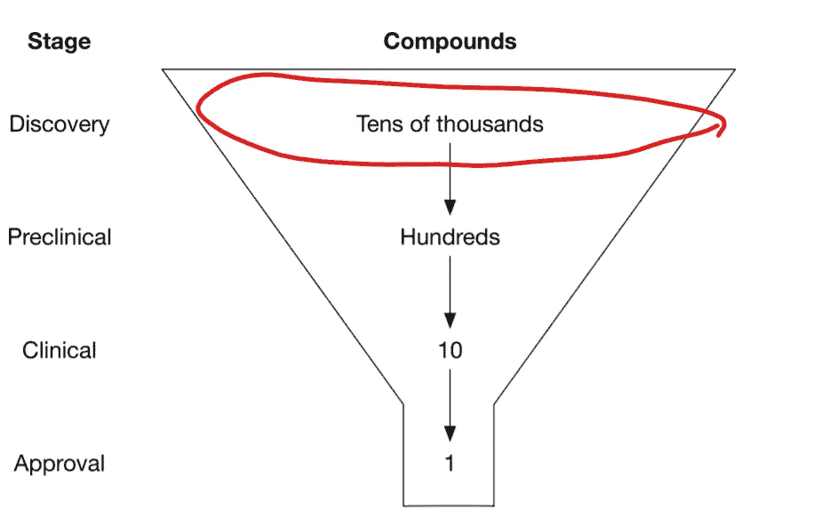
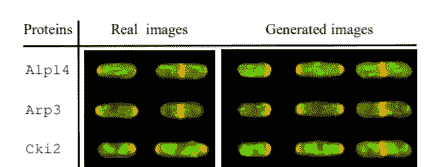

# 推动生物研究的甘斯

> 原文：<https://towardsdatascience.com/gans-for-driving-biological-research-d1c2d678036c?source=collection_archive---------41----------------------->

图片来自[【来源】](https://www.pexels.com/photo/shallow-focus-photography-of-microscope-2280547/)

# 介绍

像 GANs 这样的生成网络对于其他深度学习模型来说是独一无二的，因为它们生成样本，而不是优化输出。这允许一定程度的创造性；科学家可以分析生殖模型的输出，以了解生物系统。

本文的目的是详细说明 GANs 在科学研究中的潜在应用，所以我将假设对 GANs 有一个初步的了解。基本上，GANs 包含一个生成器，它在鉴别器的帮助下学习数据集的分布，从而产生一个能够输出新样本的模型。该架构如下所示:

GANs 的一般架构。图片来自[来源](https://arxiv.org/ftp/arxiv/papers/2002/2002.00647.pdf)

我将 GANs 对科学研究的贡献分为三大类:准备、指导和建模。

## 准备

准备研究样本可能是生物学研究中最不吸引人的部分之一。当我们有一些数据，并且我们想把这些数据转换成图像时，GANs 是有用的(当我们输入数据时，我们使用条件 GANs，或 cGANS)。因此，我们需要分析在准备阶段我们可能需要在哪里生成图像。

一篇论文[1]使用 cGANs 作为用于计算分析的标准化染色组织细胞的方法。进行染色标准化是为了减少染色组织中的不一致性(例如，一些样本可能比其他样本染色更深)，并为计算机辅助检测系统准备这些组织。

然而，执行染色标准化的标准技术通常会扭曲组织结构中的细微之处。作者利用 cGAN 来解决这个问题，因为 cGAN 可以更好地了解组织样本的底层结构，从而保留其结构。因此，cgan 可以用作组织分析管道中的预处理步骤。

标准标准化与 cGAN 染色到染色翻译(STST)。目标是使生成的染色与参考相似。图片来自[【来源】](https://arxiv.org/ftp/arxiv/papers/2002/2002.00647.pdf)

## 方向

GANs 对于在科学研究中建立潜在的方向特别有用:我们可以使用 GANs 生成分子或尝试潜在的蛋白质结构。

GANs 输出的分子很少是稳定的或潜在有用的，但我们可以随后使用其他深度学习模型来筛选数据集中少数有前途的分子。这将通过产出比我们用标准技术生产的更多的可行药物来推进药物发现(药物发现的标准技术意味着仅仅依靠高级化学家的想象力)[2]。

红圈代表 GANs 将影响的药物研发阶段。图片修改自[【来源】](https://www.oreilly.com/library/view/deep-learning-for/9781492039822/)

然而，药物发现的过程不仅仅是发现可能的药物。测试是严格的，一种药物通过这些标准的概率极低。对于一种有用的药物，它必须与预期的蛋白质或途径发生反应，以产生预期的效果，同时不与我们无数的其他身体系统发生反应。这样的壮举必然是困难的；甘斯只是让我们更快地失败。

GANs 还可以通过产生潜在的蛋白质设计来提出新的科学方向。然而，输出新的蛋白质比生成小分子要困难得多，因为无数的相互作用促成了蛋白质的复杂结构。因此，使用 GANs 来设计新的蛋白质并不像产生更小的分子那样发达。然而，由于新的蛋白质被用于工业(例如，洗衣液使用酶)，蛋白质设计的任务不受生物系统中分子下游效应的限制。

## 建模

GAN 能够输出新的图像，因为它学习了特定种类的成像的分布。例如，如果 GAN 在猫的数据集上训练，它学习猫图像的分布，因此能够基于该分布输出图像(看起来像猫)。我们可以用同样的方法来模拟生物系统。

如果一种蛋白质影响整个细胞的结构，那么我们可以修改代表该蛋白质的特征向量，以生成细胞结构的图像。使用这种 GANs，我们可以通过在细胞发育的不同阶段取样来研究细胞结构的变化。然后，我们可以插入输入蛋白质的特征向量，从而产生细胞发育的连续模型[4]。

细胞结构取决于红色染色的蛋白质。图片来自[【来源】](https://arxiv.org/abs/1708.04692)

我们可以将相同的过程应用于过多的系统，例如组织发育建模[5]。随后，当我们进一步研究该系统时，我们可以导出影响该系统的附加变量。我们可以通过添加新发现的变量来重新训练我们的 GAN，然后 GAN 将成为生物系统的一个更加精确的模型。然后，当我们发现所有重要的变量时，GAN 实际上将是生物系统的完美代表:我们输入一些变量，然后它生成生物系统的确切条件。

鉴于实际上任何生物系统的复杂性，我们还远远没有实现这个理想，随着我们对它们的进一步研究，GANs 有可能代表生物系统的完美数学模型。

## 参考

1.  萨利希，佩加*等人*。[基于 Pix2Pix 的染色到染色翻译](https://arxiv.org/ftp/arxiv/papers/2002/2002.00647.pdf)。
2.  使用基于潜在向量的生成对抗网络的从头分子生成方法。
3.  拉姆松达、巴拉思、*等*。*面向生命科学的深度学习。*
4.  奥索金，安东，*等人*。生物图像合成。
5.  韩，，*等*。用有监督的遗传神经网络学习组织的生成模型