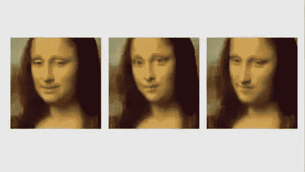
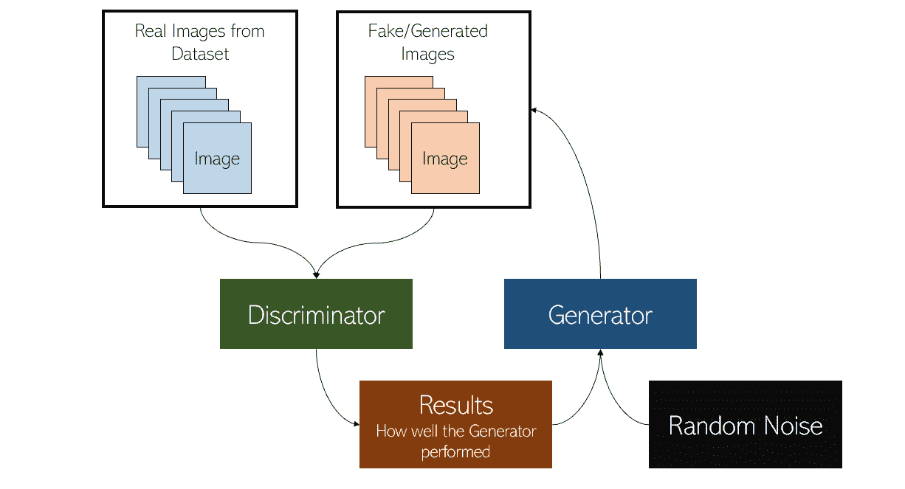
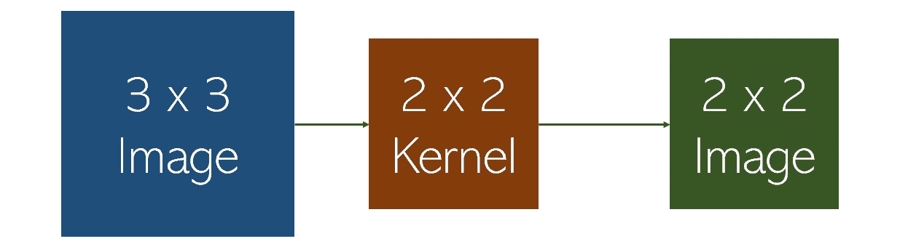
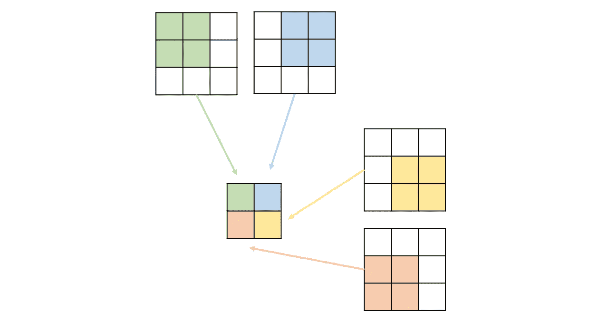
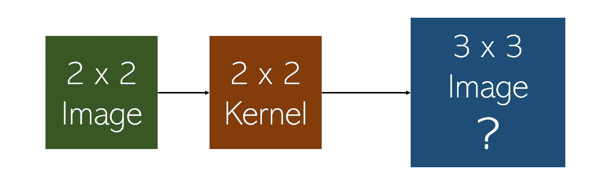
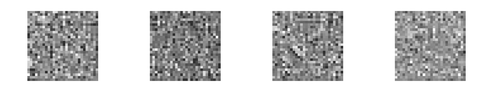

# 每个人的 GANs

> 原文：<https://towardsdatascience.com/gans-for-everyone-an-intuitive-explanation-of-the-revolutionary-concept-2f962c858b95?source=collection_archive---------42----------------------->

## 革命性人工智能概念的直观解释

[来源](https://www.businessinsider.in/samsungs-new-deepfake-tech-can-make-einstein-and-mona-lisa-come-back-to-life/articleshow/69522978.cms)。图片免费分享。

> "对抗训练是自切片面包以来最酷的事情."— [脸书首席人工智能科学家 Yann LeCun](https://www.quora.com/What-are-some-recent-and-potentially-upcoming-breakthroughs-in-unsupervised-learning)

生成对抗网络(GAN)在机器学习领域已经显示出巨大的能力和潜力来创建逼真的图像和视频。除了其生成能力，对抗性学习的概念是一个框架，如果进一步探索，可能会导致机器学习的巨大突破。

本文将使用易懂的解释和图表，本能地解释 GANs 如何工作，他们在训练中遇到什么挑战，以及对抗性学习的力量。

GAN 是由两个模型组成的系统:发生器和鉴别器。

鉴别器只是一个分类器，它确定给定的图像是来自数据集的真实图像还是来自生成器的人工生成的图像。这个二元分类器将采用卷积神经网络的形式。

生成器的任务是接收随机输入值(噪声),并使用去卷积神经网络创建图像。可以把这个概念想象成为随机数发生器设置一个种子，同样的输入噪声会产生同样的输出。生成器使用随机噪声作为各种种子来产生图像。

作者创建的图像。

双模型系统的目标是让生成器欺骗鉴别器，但也让鉴别器以其所能达到的最高精度对生成器的图像进行分类。这两个有价值的*对手*(生成性*对抗性*网络)之间的持续战斗意味着两种模式都通过试图击败对方而变得更好。生成器使用鉴别器来获得关于其图像可信度的反馈，并且鉴别器从生成器获得更多数据来进行训练。

去进化神经网络(DNN)是 GAN 的心脏。它是负责生成图像的算法。顾名思义，卷积神经网络可以被认为是“反向运行 CNN”，但其机制要复杂得多。DNNs 也称为 deconvs 或转置卷积神经网络，它使用类似于 CNN 的层，但向后向上采样(与向下采样相反)，使图像更大。

这比 CNN 还难。通过压缩或概括图像信息来缩小图像，比放大图像而不使其模糊且细节不变要容易得多。这个问题用转置卷积(反卷积)来解决。

在这个意义上，如果 DNN 是 GAN 的心脏，转置回旋就是动脉。理解反卷积首先需要理解卷积。例如，考虑以下卷积:

作者创建的图像。

假设步幅为 1，如下执行以下卷积。卷积将图像概括为一个较低的维度。

作者创建的图像。

去卷积层的目标与卷积层相反:获取一个简化的图像和一个可训练的内核，并预测“原始图像”在这种情况下，随机噪声将通过一系列反卷积进行转换，以产生更清晰的图像。

作者创建的图像。

基于鉴别器的结果训练这些转置卷积。如果鉴别器表现不佳，那么生成器的当前权重是可取的，并且适当地欺骗了鉴别器。但是，如果鉴别器性能良好，则需要大幅改变生成器的当前权重，以降低鉴别器的性能。换句话说，鉴别器是发电机的损失函数。

虽然这个想法是革命性的，但众所周知，GANs 很难训练。GANs 中的一个常见故障是鉴别器超过了生成器，以 100%的确定性识别生成的图像是假的。因为鉴别器用作调整反卷积层权重的损失函数，所以绝对确定性不会给生成器留下下降的梯度。

训练 GANs 的另一个常见故障是模式崩溃，即生成器发现并利用鉴别器中的弱点。当 GAN 生成相似的图像而不管随机输入的变化时，可以在 GAN 中识别模式崩溃。这意味着生成器只生成它知道几乎总是会欺骗鉴别器的图像。这意味着生成器没有改进，因为鉴别器给出的结果很差，这意味着生成器正在产生理想的结果。模式崩溃有时可以通过以某种方式“加强”鉴别器来纠正(例如，通过调整其训练速率或重新配置其层)。

用 GANs 生成手写数字。照片来自[奥莱利](https://www.oreilly.com/content/generative-adversarial-networks-for-beginners/)。图片免费分享。

GANs 基于这样一种理念，即两个实力相当的个体之间的竞争会促进双方的发展，并要求双方都受到健康而谨慎的监管，以免一方剥削另一方。

生成对抗网络和对抗学习作为一个领域仍然非常年轻，并显示出巨大的潜力。他们有巨大的潜力来塑造数字世界——无论是好是坏。Deepfakes 有能力将人们的脸放在令人反感的视频上(通过指定图像作为生成器的输入噪声)，可以摧毁生命并欺骗数百万人。危险的深度伪装的解决方案可能在于对抗性学习本身——加强和分析鉴别器。