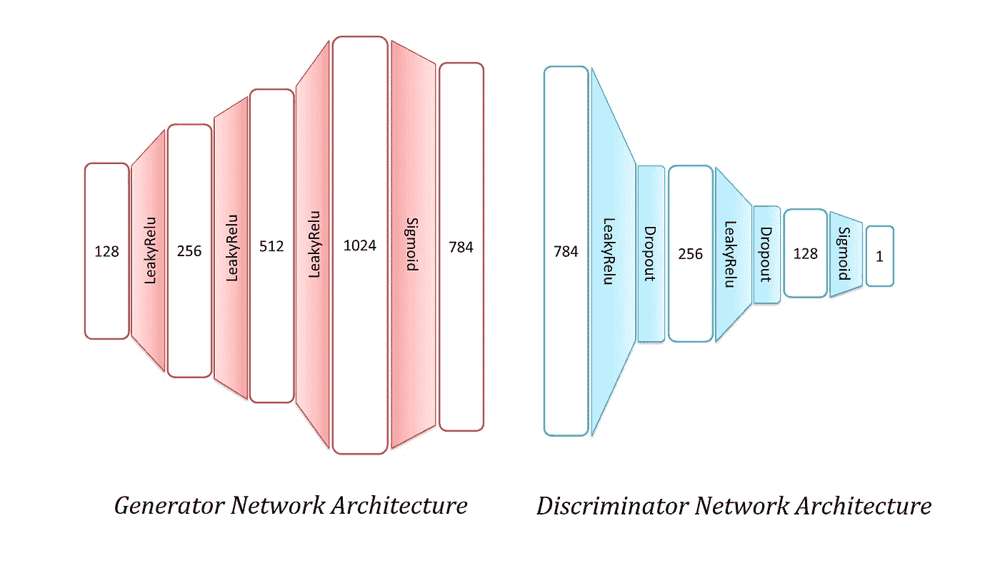

# 甘斯从零开始。

> 原文：<https://towardsdatascience.com/gans-from-scratch-8f5da17b3fb4?source=collection_archive---------12----------------------->

## 生成对抗网络及其在 PyTorch 中的实现

去年，生成对抗网络(GANs)凭借那些令人印象深刻的人类面孔在人工智能领域掀起了一场风暴。他们真的很酷，不是吗？它们基本上是从无到有产生的。

*没什么？？。*咳嗽*炫耀*咳嗽*。你们用数据来训练模型。我们知道这些“机器学习”是如何工作的。这只是一个输入输出函数的近似值。没什么让人印象深刻的。这只是另一种算法。*

不完全是。甘氏属于内隐学习方法。在显式学习模型中，模型直接从数据中学习其权重。而在隐式学习中，模型在没有数据直接通过网络的情况下进行学习。

*啊！，所以是强化学习？*

RL 和 GANs 之间有一些相似之处，因为他们都使用演员-批评家的方法。但学习的性质在甘是不同的。

*好吧！我放弃了。所以，把甘解释成我 5 岁。*

好吧。因此，在巴塞罗那市，一个新的警察被任命来验证驾驶执照的真实性。他的工作是分类合法的和假的。因为他是新人，所以不管他的分类是否正确，他都会从他的同事那里得到反馈。镇上还有一个新的伪造者，他的目标是制造假驾照。所以，伪造者打印任何他认为是执照的东西，然后提交给警察。警察然后接受/拒绝它。每当警察拒绝它时，伪造者从错误中吸取教训，并试图开发一个万无一失的许可证，当它被接受时，他生产更多类似的许可证。但是当警察接受假执照时，他被同事纠正了。通过相互学习，警察和伪造者都会做得更好。

*咄！似乎应该由同事来验证*

我以为你才 5 岁。好吧，这是一个更好的版本。在 GANs 中，有两个网络鉴别器(警察)和生成器(伪造者)。生成器创建假数据(图像)，鉴别器对图像进行分类。基于来自鉴别器的结果，生成器开始学习创建越来越好的图像。因此，鉴别器和发生器都竞相提高性能。他们互相学习，每次跑步都越来越好。有趣的是，这两个网络都在学习过程中。所以，即使是鉴别器也不能一直正确分类。假设鉴别器将假图像分类为真图像，生成器从该结果得知生成的图像是好图像。当鉴别器通过从训练数据(同事)获得反馈来学习时，这将被修复。听起来他们两个肯定会融合。但是 GANs 的收敛性和稳定性是一个独立的话题。

嗯，我必须说 GANs 现在听起来很有趣。因此，基本上生成器在看不到数据的情况下学习数据的底层分布。但是它从鉴别器网络学习，鉴别器网络也随着发生器同时学习。令人印象深刻。现在我想实现 GANs 并创造这些新的人工智能人。


卡拉斯等人[https://arxiv.org/abs/1812.04948](https://arxiv.org/abs/1812.04948)

呃。没那么快。为了这个结果，你需要更好地了解 CNN，大量的超参数调整，8 特斯拉 GPU 和一周的培训时间。在笔记本电脑上训练 20 分钟的基本数据集上的香草甘怎么样？听起来不错？那我们就这么做吧。

我使用 PyTorch 来实现它们。是的，我已经能听到来自 Keras/Tensorflow 人的“嘘声”。保持冷静，抓住机会适应它，就像我一样。

# 数据集:

听说过 MNIST 数据集吗？。是的，我们会用到它。图像是灰度的，形状为 28×28 像素。让我们从`torch.datasets`模块加载数据集。图像被展平，并且使用`multiple_transforms`将值归一化为 0–1。`DataLoader`功能帮助批量切片训练数据。

```
from torch.datasets import MNIST
from torchvision import transformstrans = transforms.Compose([transforms.ToTensor(), torch.flatten])
traindata = MNIST(root='./data', transform=trans, train=True, download=True)
trainloader = torch.utils.data.DataLoader(traindata, batch_size=6000, shuffle=True)
```

## 网络架构:

我们将使用具有以下配置的全连接网络。不要对层和神经元感到困惑。您可以根据需要删除/添加层。这种配置有一些最佳实践，我将在后面解释。发生器的输入是任意值的噪声。在这里，我选择了 128 个神经元。生成器的输出必须与训练数据值(784)的形状相匹配。鉴别器得到 784 个神经元的输入，输出单个值，不管是真(1)还是假(0)。



将整个架构转化为网络相当简单。实现`nn.Modules`类并定义`forward`函数。pytorch 最棒的地方就是亲笔签名的功能性。这意味着，我们不需要做背后的数学运算。自动计算所有神经元的梯度。

酷毙了。一旦定义了这两个类，我们就可以实例化它们了。别忘了定义成本函数和要使用的优化算法。

```
discriminator = Discriminator()
generator = Generator()criterion = nn.BCELoss()
discrim_optim = optim.Adam(discriminator.parameters(), lr= 0.0002)
generat_optim = optim.Adam(generator.parameters(), lr=0.0002)
```

*为什么要进行这种 BCELoss 和 Adam 优化？*

香草甘使用极大极小算法。最小最大损失通过生成器和鉴别器预测概率的对数损失来计算。BCELoss 是二元交叉熵损失，它是概率的对数损失。可以使用两个不同的损失函数来训练生成器和鉴别器，但是这里我们对两者使用一个损失函数。对于权重更新，我们使用 Adam optimizer，因为每个人都在使用它。哈哈，jk。你可以试试其他优化软件，比如 SGD，Adagrad。

这样，模型设计完成了。耶。现在，让我们训练模型。

## **模特培训:**

无论会发生什么样的混乱，都发生在这里。我们一步一步来。所以我们必须同时训练鉴别器和发生器。这基本上意味着以下步骤。

1.  向前通过鉴别器
2.  反向传播鉴别器误差
3.  更新鉴别器权重
4.  向前通过发电机
5.  反向传播生成器错误
6.  更新发电机重量

重复一遍。

```
# Noise input for generator
def noise(x,y):
    return torch.randn(x,y)for epoch in range(2000):
    for pos_samples in trainloader:
        # Training Discriminator network
        discrim_optim.zero_grad()
        pos_predicted = discriminator(pos_samples[0])
        pos_error = criterion(pos_predicted, torch.ones(batches,1)) neg_samples = generator(noise(batches, 128))
        neg_predicted = discriminator(neg_samples)
        neg_error = criterion(neg_predicted, torch.zeros(batches,1)) discriminator_error = pos_error + neg_error
        discriminator_error.backward()
        discrim_optim.step()

        # Training generator network
        generat_optim.zero_grad()
        gen_samples = generator(noise(batches, 128))
        gen_predicted = discriminator(gen_samples)
        generator_error = criterion(gen_predicted, torch.ones(batches, 1))
        generator_error.backward()
        generat_optim.step()
```

就是这样。搞定了。

*哇哇哇。慢点。我有很多问题！*

*为什么只索引数据，* `*pos_samples[0]*` *。训练数据的标签怎么了？
-* 漂亮的斑点。在香草甘，我们不在乎标签。我们基本上给出所有的训练数据来训练网络，而不管它来自哪个类。因此，发生器网络必须拟合权重，以重现不同噪声输入的所有变化。也就是说，GANs 有几个变化，它考虑了像辅助 GANs 这样的标签。

*这个 zero_grad()对于优化器来说是什么？* -对于每个时期，我们希望梯度为零，以便在每次反向传播期间计算的梯度可以在神经元中没有剩余梯度的情况下出现。如果没有 zero_grad()，梯度将在每个时期累积，这在像 RNNs 这样的网络中很有用。

如何将两个错误相加并执行 backward()？
——好大的 pythonic 吧？这是 pytorch 的亲笔签名模块。它负责反向传播这两个错误。

好的，那么现在你如何知道网络何时被训练？。我应该观察哪个成本函数？
- 如前所述，收敛是 GAN 中一个有趣的问题。严格来说，当鉴别器和生成器都达到纳什均衡时，GAN 就被称为被训练。由于 GAN 是一个极小极大问题，当一个网络最大化其成本函数时，另一个网络试图最小化它。我们正在训练两者来提高。纳什均衡状态下，代理人不改变其行动的过程，不管其他代理人的决定。在训练过程中，一个网络从另一个网络开始训练，但是当它到达一个点，不管另一个网络的决定，鉴别器或生成器都不会变得更好时，它就达到了纳什均衡。实际上，给定一组相同的真实和伪造图像，鉴别器将检测每个真实和伪造图像为真实的，因此预测精度将为 50%。

## 最佳实践:

几乎没有关于更好的模型和更快收敛的最佳实践。我故意把这个放在最后，因为有些讨论可能会改变代码，如果在主要内容中解释，会导致混乱。

*   在最后一层，对鉴别器使用 sigmoid 激活函数，对生成器使用 tanh 函数。在这种情况下，发电机的输出将在范围(-1，1)内。因此，我们还必须将训练数据标准化到这个范围(-1，1)
*   不是为 1 训练真实图像，为 0 训练虚假图像，而是用 0.98 和 0.02 或类似的值训练它们
*   为了快速检查您的 GAN 设置是否正常工作，请将训练数据限制在单个类中，并检查它们的表现如何。在包含 10 个类的 MNIST 数据集上，对于一些未失真的图像，可能需要几个小时的时间，因此最好检查一下配置是否适用于有限的数据集。
*   由于生成器比鉴别器需要更多的训练时间，所以在鉴别器中使用丢弃层可以阻止过拟合。

## 以下是完整的代码:

感谢您阅读帖子。如果你发现了任何错误或有疑问，请在评论中告诉我。

欢迎通过 [Github](https://github.com/chmodsss) 、 [Twitter](https://twitter.com/chmodsss) 和 [Linkedin](https://www.linkedin.com/in/sivasuryas) 联系我。干杯！。

非常感谢[文章](https://medium.com/ai-society/gans-from-scratch-1-a-deep-introduction-with-code-in-pytorch-and-tensorflow-cb03cdcdba0f)作者[迭戈·戈麦斯莫斯克拉](https://medium.com/u/2ae3e490bdf8?source=post_page-----8f5da17b3fb4--------------------------------)。