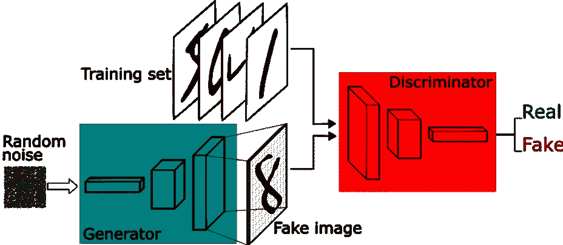
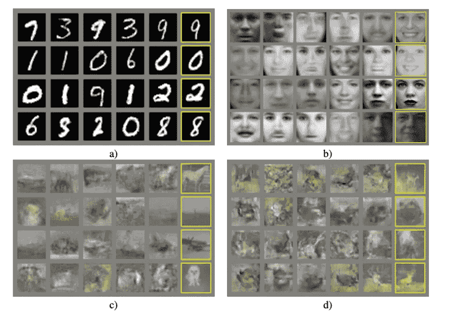
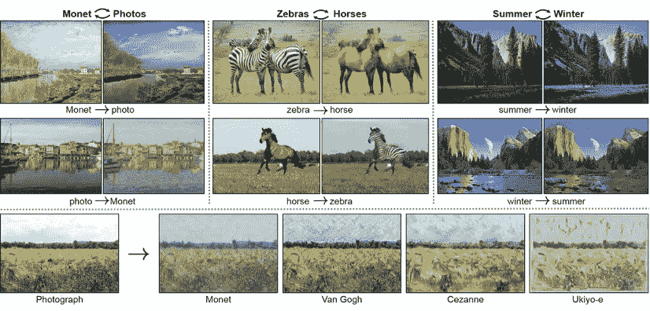
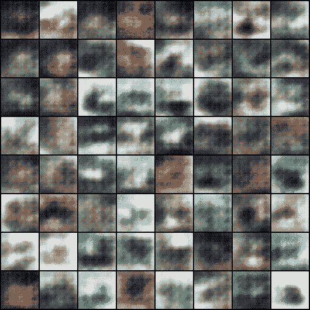

# 生成对抗网络

> 原文：<https://towardsdatascience.com/gans-generative-adversarial-networks-db42fe064f58?source=collection_archive---------49----------------------->

## 深度学习领域的 GANs

## 深入深度学习的神奇世界，释放您机器的艺术能力。

> “我们不断前进，打开新的大门，做新的事情，因为我们很好奇，好奇心不断引领我们走上新的道路。”—华特·迪士尼

机器学习是我们生活中不可或缺的一部分。从我们手机键盘顶部的东西到驱动自动驾驶汽车领域的东西，它无处不在。机器学习领域每天都在进步，不断有创新和新想法出现。机器学习的一个贡献，确切地说是深度学习领域，是 GAN 生成性对抗网络，在我看来，这是科学创造的一种纯粹的魔法形式。

GAN 是一类致力于创造新事物的深度学习框架。与用于检测各种事物的传统深度学习技术不同，GAN 用于产生新的事物。把甘想成一个画家；它喜欢画画。识别一个特定的物品，比如说一顶帽子，任何有文化的人都能做到。我们可以使用深度学习框架在计算机上轻松模拟这一点。而甘则是向创造力迈进了一步，一个接近智力的层次。

信用:[此人不存在](https://thispersondoesnotexist.com/)

上面显示的图像不是真人，而是由机器从头开始生成的。这就是甘的全部。

甘是伊恩·古德菲勒和他的同事在 2014 年提出的，当时伊恩 28 岁。作为甘的父亲，他被认为是赋予机器想象力的人。传说有一天晚上，伊恩的朋友在一家酒吧就一台*生产图像的机器*找到了他。现在，让我们仔细看看伊恩的甘斯。

在我们大致了解 GANs 如何工作之前，我请求您阅读一些关于深度学习的内容，所有这些都是通用算法，如反向传播和 CNN，以便更好地理解 GANs。以下是一些有用的链接。

> 1.反向传播[[http://neuralnetworksanddeeplearning.com/chap2.html](http://neuralnetworksanddeeplearning.com/chap2.html)
> 
> 2.CNN[[https://brohrer . github . io/how _ convolatile _ neural _ networks _ work . html](https://brohrer.github.io/how_convolutional_neural_networks_work.html)]
> 
> 3.自适应反进化网络[[https://ieeexplore.ieee.org/document/6126474](https://ieeexplore.ieee.org/document/6126474)

GAN 的两个主要支柱是发生器和鉴别器。这是两个复杂的神经网络，是 GAN 的神奇背后的工作手。

我们先用一个例子来试着理解这些。

把生成器和鉴别器分别看成是学生和助教(TA)。他们两个都是来这里接受检查的。让我们假设他们一开始什么都不知道。学生(生成者)的工作是写答案，助教(鉴别者)的作用是从答案本上检查答案。最初，学生们草草写出几个随机答案，然后交给助教。TA 随机给那些答案分配粗分，然后他接着用答题卡查答案。这样做的时候，助教会意识到自己的错误并从中吸取教训，同时给出正确的分数。

此外，一旦学生得到分数的反馈，他就会了解自己的错误，并努力写得更好，接近正确答案。这种双重循环的循环继续下去，直到产生的答案真正接近正确的答案。简单来说，这就是 GAN 的工作原理。

生成性对抗性网络框架由[塔尔斯·席尔瓦](https://www.freecodecamp.org/news/an-intuitive-introduction-to-generative-adversarial-networks-gans-7a2264a81394/)

如上所述，生成器和鉴别器都是神经网络。生成器，顾名思义，生成新的数据实例；另一方面，discriminator 充当生成的数据实例的判断者。这两个网络都是从零开始训练的，同时它们在猜测的游戏中相互竞争。这个游戏是基于数据分布的标准。我们不会深究他们工作的数学原理。生成器从样本随机噪声中生成假图像(老实说，没有什么是真正随机的，所以让我们称之为伪随机)，然后它将假图像传递给鉴别器，希望这些假图像被鉴别器接受为真实图像。鉴别器还传递地面实况，即真实的分类数据集。鉴别器试图通过首先给图像 0(假)和 1(真)之间的随机概率来识别真假照片。然后，它从错误中学习并反向传播错误以提供更好的概率。这个循环继续，直到它给所有图像接近正确的概率，即对于真实图像接近 1，对于伪图像接近 0。一旦完成，假图像的概率的反馈被反向传播到生成器，然后生成器试图创建具有更好概率的新图像。这种双循环一直持续到生成图像的可能性接近 1。简而言之，这就是甘的工作方式。

信用:[生成对抗网络](https://arxiv.org/pdf/1406.2661.pdf)

## TL；速度三角形定位法(dead reckoning)

*   生成器从随机噪声中生成图像，并将其向前发送。
*   鉴别器给出接收图像的概率。
*   鉴别器从真实数据集中学习，并提供更准确的概率。然后，它向后返回。
*   生成器从返回的概率中学习，并尝试创建具有更好概率的图像。

演职员表: [CycleGAN](https://junyanz.github.io/CycleGAN/)

现在来说说 GAN 的一些好玩有趣的现实生活应用；这将帮助你认识到甘斯到底有多神奇。

下面是由[杰森·布朗利](https://machinelearningmastery.com/impressive-applications-of-generative-adversarial-networks/)列出的 GAN 的一些奇妙应用。请仔细阅读他的文章，了解所有这些应用。

*   生成图像数据集的示例
*   生成人脸照片
*   生成逼真的照片
*   生成卡通人物
*   图像到图像的翻译
*   文本到图像的翻译
*   语义图像到照片的翻译
*   人脸正面视图生成
*   生成新的人体姿态
*   照片到表情符号
*   照片编辑
*   面部老化
*   照片混合
*   超分辨率
*   照片修复
*   服装翻译
*   视频预测
*   3D 对象生成

你可以在这个神奇的网站上看到甘的行动，【thispersondoesnotexist.com】。该网站使用 StyleGAN2，每当您访问该网站时，它都会向您呈现一张计算机生成的随机图片，照片中的人在现实生活中并不存在。只是不断刷新。生成的图像逼真得令人震惊，这有助于展示 GANs 的真正力量。该网站由 Phillip Wang 创建，旨在展示 StyleGAN2 和 GANs 的总体潜力。这不是很神奇吗？！

现在，我们知道了 GAN 的能力，让我们尝试用 python 编写我们自己的 DCGAN。

这主要归功于哈德琳·德·庞特维斯。

首先，你需要由彩色图像组成的数据集。请访问此链接下载 *CIFAR-10 python 版本*数据集。

[https://www.cs.toronto.edu/~kriz/cifar.html](https://www.cs.toronto.edu/~kriz/cifar.html)

提取数据集并将其放入“数据”文件夹中。此外，在同一目录中创建一个空文件夹来保存输出图像。在包含数据和空文件夹的目录中启动一个新的 python 文件。

注意:如果您不想手动下载数据集，或者在下载时遇到一些问题，请不要担心。下面 Colab 文件中的第四个代码单元格将为您完成这项工作。

## Google Colab 上的 DCGAN

提示:你可以在 Google Colab 上编写完整的 DCGAN 代码。在你的 Goggle Colab 笔记本中，进入运行时>更改运行时类型，在硬件加速器下选择 ***GPU*** 。

Google Colab 笔记本链接—[https://Colab . research . Google . com/drive/1 hnpkzucnm _ VM-A-Z _ lwxs 4c 9 lnva 9 ez？usp =共享](https://colab.research.google.com/drive/1iHnpkzUcnm_vm-A-Z_LWXS4c9lNva9Ez?usp=sharing)

我们的模型每走 100 步后的输出图像。

## 有用的链接

> 1.生成敌对网络[【https://arxiv.org/abs/1406.2661】T2
> 
> 2.反向传播[【http://neuralnetworksanddeeplearning.com/chap2.html】T4
> 
> 3.CNN[[https://brohrer . github . io/how _ convolatile _ neural _ networks _ work . html](https://brohrer.github.io/how_convolutional_neural_networks_work.html)]
> 
> 4.适应性去进化网络[[https://ieeexplore.ieee.org/document/6126474](https://ieeexplore.ieee.org/document/6126474)
> 
> 5.计算机视觉& GANs[[https://www . superdata science . com/courses/computer-Vision-z-learn-opencv-GANs-cutting-edge-ai](https://www.superdatascience.com/courses/computer-vision-z-learn-opencv-gans-cutting-edge-ai)]

## 进一步阅读

> 1.迈克尔·乔丹
> 
> 2.[深度卷积生成对抗网络](https://arxiv.org/abs/1511.06434)
> 
> 3. [StyleGAN](https://arxiv.org/abs/1912.04958)
> 
> 4. [CycleGAN](https://arxiv.org/abs/1703.10593)