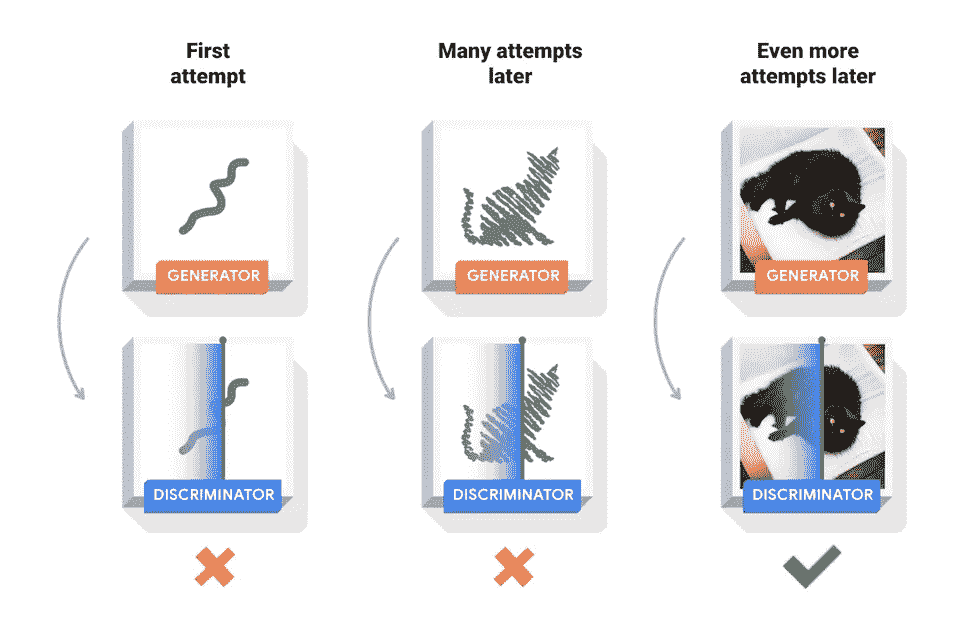

# GANs:利用技术创造更美好的明天

> 原文：<https://towardsdatascience.com/gans-leveraging-technology-for-a-better-tomorrow-ea192087b4e4?source=collection_archive---------50----------------------->

## 下面的文章讨论了 GAN 的基础知识以及它的一些变种。

当有人只是把自己的脸实时换成一些已知人物的脸，是不是很神奇？或者，当你看到一幅时尚的肖像画仅仅通过提供一个小的布局就用电脑制作出来时，你会变得非常好奇和兴奋吗？这就是我们在这篇文章中要揭示的。所有这些很酷的想法大多是在机器学习中的一个现代想法的帮助下实现的，即 **GANs** 。

> 注意:上述想法也可以通过有效使用计算机图形包来实现，这超出了本文的范围，但是我在参考资料部分添加了一些链接。

GANs 或**生成对抗网络**是一类能够生成与真实图像相似的图像的网络。如果你熟悉**风格转移**的概念，那么 GANs 的想法对你来说并不陌生。然而，你可以从参考部分的链接中得到一个很好的风格转换的复习。GANs 有各种各样的应用，像图像-图像翻译，文本-图像翻译，实时视频模拟，生成卡通人物等等。我认为 GANs 也可以证明自己有用的一个想法是对数据进行上采样。(仔细想想！).

最近，我参加了一个由 IEEE 主办的技术写作比赛，该比赛旨在写任何技术的未来的潜在和有益的用例，因此我写下了关于 GANs 的内容。你可以在参考资料部分找到这篇文章的 PDF 文档！

# 目录:

1.  [定义](#bbe4)
2.  [GANs 的当前使用案例](#fa82)
3.  [甘的种类](#5566)
4.  [结论](#dd10)
5.  [参考文献](#8710)

## 1.定义:

基本上如上所述，GANs 或生成对抗网络是我们生成与真实世界图像相似的图像的网络。但是等等！到底是谁生成了这些图像？图像生成怎么可能呢？模型是如何训练的？模型如何学习映射来生成图像？我们不用卷积网络吗？你会在文章中找到所有这些问题的答案，所以请仔细阅读。

特定的 GAN 包含两个不同的网络。其中一个被称为**发生器网络**，另一个被称为**鉴别器网络**。生成器模型(作为艺术家)试图生成与真实图像相似的图像，鉴别器模型(作为艺术评论家)区分真实图像和生成的图像。

> 注意，鉴别器网络也被称为**对抗网络**，因此得名生成对抗网络。


图片来源:[https://www.tensorflow.org/tutorials/generative/dcgan](https://www.tensorflow.org/tutorials/generative/dcgan)



图片来源:[https://www.tensorflow.org/tutorials/generative/dcgan](https://www.tensorflow.org/tutorials/generative/dcgan)

GAN 网络的理想条件是鉴别器网络无法区分真实图像和发生器网络产生的图像。

在非常基础的水平上，发生器和鉴别器网络的工作可以概括为

生成器模型不会直接看到真实图像，并且只对观察到的图像(或 DCGAN 情况下的矢量)起作用。在生成图像之后，该图像被发送到鉴别器网络，该网络将其分类为真或假。鉴别器网络也能看到真实的图像，因此能从中获取一些信息。对于生成图像的输入，我们从鉴别器网络获得的输出包含一些关于真实图像的信息。然后，我们根据该输出计算发电机网络的损耗。通过这种方式，生成器网络获得关于真实图像的信息，然后在下一次尝试中，它试图生成与真实图像更相似的图像。通过不断的练习，生成器模型变得能够生成与鉴别器不能分类的真实图像非常相似的图像。

## 2.GANs 的当前使用案例:

对于技术社区来说，gan 并不是什么新鲜事物，几十年来，我们的技术社区已经发展到如此程度，以至于研究的速度比以前更快了。因此，我们已经在许多领域实施了 GANs，并且效果很好。让我们揭开其中的一些领域:

## a)深度假:

DeepFake 是 GANs 的一个惊人的实现，其中图像或视频中的一个人被一个长相相似的人取代。不仅是图像在这里被替换，而且说话者的声音有时也会改变。


图片来源:[https://en.wikipedia.org/wiki/Deepfake](https://en.wikipedia.org/wiki/Deepfake)

然而，这种技术引入了各种负面用法，如[名人色情视频](https://en.wikipedia.org/wiki/Celebrity_sex_tape)、[复仇色情](https://en.wikipedia.org/wiki/Revenge_porn)、[假新闻](https://en.wikipedia.org/wiki/Fake_news)、[恶作剧](https://en.wikipedia.org/wiki/Hoax)和[金融诈骗](https://en.wikipedia.org/wiki/Accounting_scandals)。虽然 DeepFake 可以用于许多错误的任务，但它也有各种积极的实现，如电影配音，教育学生等。

## b)生成肖像:

GANs 的一个非常有益的实现是从零开始生成美丽而有创意的肖像。我们可以以成对(其中存在 b/w 观测图像和真实图像的直接映射)和不成对(其中不存在 b/w 观测图像和真实图像的直接映射)的形式向这些模型提供训练样本。

## c) ExGANs:

ExGANs 或范例生成对抗网络是脸书正在实施的一种方法。ExGANs 是一种有条件的 GANs，它利用样本信息来产生高质量、个性化的内部绘制结果。这种方法特别使用 ExGANs 将闭着眼睛的人的图像转换成睁着眼睛的相同图像。


图片来源:[https://research . FB . com/WP-content/uploads/2018/06/Eye-In-Painting-with-Exemplar-Generative-Adversarial-networks . pdf](https://research.fb.com/wp-content/uploads/2018/06/Eye-In-Painting-with-Exemplar-Generative-Adversarial-Networks.pdf)

> 还有其他领域也大量使用了 GANs。请参阅参考资料部分了解更多信息。

# 3.gan 的类型:

虽然 GAN 有多种变体，但今天我们将讨论三种常见类型的 GAN，即 DCGAN、Pix2Pix GAN 和 CyclicGAN。这些 GANs 的实现由 tensor flow**发布为官方教程，所以不要忘记查看。好了，让我们开始吧:**

## a) DCGAN:

**DCGANs** 或**深度卷积生成对抗网络**是学习从**噪声向量**到图像的映射的 GANs 的一些基本形式。现在你可能会想，我们如何把一个矢量转换成图像？这个问题的答案很简单。它使用**转置卷积层**对输入执行*反卷积*。这与**卷积层**所做的正好相反。卷积层从输入图像中提取特征，使得通道的数量增加，但是在转置卷积层中，新的特征被添加到输入向量中，从而将它们转换成图像。


图片来源:作者


图片来源:作者

生成器网络建立在一系列[转置卷积+ BatchNorm + LeakyReLU 层]之上。鉴别器网络是一个正常的分类器，它使用卷积层来分类输入图像是真实的还是生成的。

**鉴别器损耗**是真实图像输出和生成图像输出的综合损耗。使用的损失函数是 **BinaryCrossEntropy** (但选择不受限制)。**发生器损耗**是根据我们从鉴频器网络获得的输出计算的，用于将生成的图像作为输入。

```
def discriminator_loss(real_op, gen_op):
    loss = tf.keras.losses.BinaryCrossentropy(from_logits=True)
    real_loss = loss(tf.ones_like(real_op), real_op)
    gen_loss = loss(tf.zeros_like(gen_op), gen_op)
    return real_loss + gen_lossdef generator_loss(gen_op):
   loss = tf.keras.losses.BinaryCrossentropy(from_logits=True)
   return loss(tf.ones_like(gen_op), gen_op)
```

## b)pix 2 pix gan:

这些类别的任务属于**条件任务**的范畴。条件甘是那些基于输入图像中的条件生成图像的甘类。例如，考虑下面的图像-


图片来源:[https://arxiv.org/pdf/1611.07004.pdf](https://arxiv.org/pdf/1611.07004.pdf)

在上面的图像中，我们必须使用左边的图像生成右边的图像。在这里，我们可以看到输入和输出之间存在直接关系，并且该模型非常容易学会基于这样的对来生成图像。这种数据也被称为**成对数据**。

现在，一个特定的 Pix2Pix GAN 也有一个生成器和一个鉴别器模型。但是在这里，它们和在 DCGANs 中使用的不一样。发生器网络利用**U-Net**架构，鉴别器网络利用 **PatchGAN** 架构。

U-Net 架构基本上是一个普通的**编码器-解码器网络**,增强了层间的**跳跃连接**。添加跳过连接的论点可能是模型将同等地学习每一层的编码和解码特征。Pix2Pix 网络中使用的 U-Net 架构(特别是在关于*城市景观*数据集的 tensorflow 教程中)可以被可视化为-


图片来源:作者

现在来描述鉴别器网络！鉴别器网络是一个 PatchGAN 网络。但是首先什么是 PatchGAN 网络呢？PatchGAN 网络属于机器学习分类器类，它学习对输入数据中的高频结构进行分类。他们在*面片*的尺度上惩罚结构。这些模型使用从图像中提取的小块用于分类任务。鉴别器使用一个 N×N 的小块来鉴别一幅图像是真是假。通常图像的一个 *70x70* 部分被用于分类，因为它产生更好的结果。这一点从[原论文](https://arxiv.org/pdf/1611.07004.pdf)中的解释可见一斑。


图片来源:[https://arxiv.org/pdf/1611.07004.pdf](https://arxiv.org/pdf/1611.07004.pdf)

鉴别器损耗通过计算真实图像和生成图像的输出的交叉熵之和来获得。生成器除了计算生成图像的损失外，还计算目标图像和生成图像之间距离的 **L1 范数**。

```
def discriminator_loss(disc_real_op, disc_gen_op):
    loss = tf.keras.losses.BinaryCrossentropy(from_logits=True)
    real_loss = loss(tf.ones_like(disc_real_op), disc_real_op)
    gen_loss = loss(tf.zeros_like(disc_gen_op), disc_gen_op)
    return real_loss + gen_lossdef generator_loss(disc_gen_op, generated_op, target, lambda=10):
    loss = tf.keras.losses.BinaryCrossentropy(from_logits=True)
    gan_loss = loss(tf.ones_like(disc_gen_op), disc_gen_op)
    l1_loss = tf.reduce_mean(tf.abs(target - generated_op))
    gen_loss = gan_loss + (lambda*l1_loss)
    return gen_loss
```

## c)循环甘斯:

环状氮化镓是应用最广泛的一类氮化镓。在深入循环 GANs 之前，让我们先谈谈**未配对数据**。考虑下面的图像-


图片来源:[https://arxiv.org/pdf/1703.10593.pdf](https://arxiv.org/pdf/1703.10593.pdf)

左侧的一对图像在它们之间具有一定程度的对应性，正如我们已经讨论过的，它们被称为**配对数据**。右侧的图像在它们之间没有任何对应关系，被称为**不成对数据**。在许多情况下，我们只能得到不成对的数据，因为创建成对数据的成本更高，而且不容易获得。

现在你可能会问-

> 只针对不成对数据的训练，你在实现一个全新的架构？我们不能用以前的方法学习不成对的数据吗？

答案是肯定的，您可以使用以前的方法，但这在性能方面不会有太大的好处。因此，我们需要一种新的方法来处理这种数据。不仅是未配对的数据，我们还可以使用 **CyclicGANs** 从配对的数据中学习，并产生非常有希望的结果。

现在让我们来考虑一下使用周期因子的一些原因

> 我们考虑两组图像，即 X 和 Y，作为我们要在其间转换图像的两个域。

1.  假设我们学会了从集合 x 中的图像“a”生成集合 Y 中的图像“b”。现在我们对图像“b”运行生成器模型。你能保证我们能找回 a 的形象吗？不，如果使用上述 GANs 的变体，我们不能保证这一点。
2.  我们能自信地说集合 X 中的所有图像都将被映射到集合 Y(双射)中的所有图像吗？

这两个问题都已经被 CyclicGANs 解决了。现在让我们了解一下 CyclicGANs 的架构。

一个特定的循环 GAN 由两个发生器网络和两个鉴别器网络组成。

两个发电机网络即 **G** 和 **F** 互为逆。 **G** 从集合 **X** 到 **Y** ， **G:X →Y** ，以及 **F** 从集合 **Y** 到 **X** ， **F:Y →X** 中的图像学习映射。


图片来源:作者

为了将两个发生器网络的输出分类为真或假，我们有两个鉴别器网络，即 **Dx** 和 **Dy** 。 **Dx** 基本将 **F** 生成的图像分为真假， **Dy** 将 **G** 生成的图像分为真假。


图片来源:作者

鉴别器损耗(对抗性损耗)和发电机损耗实现为-

```
def discriminator_loss(real_op, gen_op):
    loss = tf.keras.layers.BinaryCrossentropy(from_logits=True)
    real_loss = loss(tf.ones_like(real_op), real_op)
    gen_loss = loss(tf.zeros_like(gen_op), gen_op)
    return real_loss + gen_lossdef generator_loss(gen_op):
    loss = tf.keras.layers.BinaryCrossentropy(from_logits=True)
    return loss(tf.ones_like(gen_op), gen_op)
```

> 请注意，我们通常将鉴频器损耗乘以 1/2，这是因为与发生器网络相比，它的学习速度较慢。

除了这些损失之外，还有一个**循环一致性损失**，它完成了循环一致性的目标函数。循环一致性丢失解决了我们前面遇到的反向映射问题。这种损失确保了从集合 **X** 映射到集合 **Y** 的图像具有到其自身的反向映射。让我们听听这篇论文中关于为什么要引入循环一致性损失的一些话

> 有了足够大的容量，网络可以将同一组输入图像映射到目标域中图像的任意随机排列，其中任何学习到的映射都可以导致与目标分布匹配的输出分布。因此，单独的对抗性损失不能保证学习的函数能够将单个输入*【Xi】映射到期望的输出*易*。*

敌对网络不能保证期望的输出，这导致我们引入循环一致性损失。考虑下面的图片-


图片来源:【https://arxiv.org/pdf/1703.10593.pdf 

考虑图像的左侧，我们可以看到它使用 **G** 从图像 **x** 生成图像 **y_hat** ，我们再次传递这个生成的图像以使用 **F** 获得图像 **x_hat** 。恰恰相反的是在图像的右侧。
现在一致性损失基本上衡量的是 **x** 和 **x_hat** (左侧)之间的相似性，我们也称之为**前向循环一致性损失**，根据 **y** 和 **y_hat** (右侧)之间的相似性计算的损失也称为**后向循环一致性损失**。这个损失基本上是真实({x，y})和生成({x_hat，y_hat})图像之间的距离的 **L1(或曼哈顿)范数**。

循环一致性丢失可以实现为

```
def cyclic_consistency_loss(generator, cycled_image, real_image, lambda=10):
    loss = tf.reduce_mean(tf.abs(cycled_image - real_image))
    return loss*lambda
```

因此，[对抗性损失+λ*(前向循环一致性损失+后向循环一致性损失)+发电机损失]一起构成了循环性问题的完整目标函数。这里的**λ**是一个要调整的超参数。

> 注意，在上面讨论的任何方法中，用于模型建立的其他超参数的选择完全是场景特定的。但在我看来，原始文件中指定的值通常会有更好的结果。

# 4.结论:

虽然 GANs 在架构和工作方面都非常棒，但是还有更多值得探索的地方。我们不需要认为甘斯会接受工作或其他什么。甘人在他们的地方很酷，但仍然依赖人类完成各种任务。

# 5.参考资料:

*   [https://arxiv.org/abs/1705.04058](https://arxiv.org/abs/1705.04058)
*   [https://arxiv.org/pdf/1703.10593.pdf](https://arxiv.org/pdf/1703.10593.pdf)
*   [https://drive . Google . com/file/d/1 kayaspozrkowruyvfygopody 3 ZD rd 74 x/view？usp =共享](https://drive.google.com/file/d/1KayaSPOZrkOwruYvfygopODy3zdrd74x/view?usp=sharing)
*   https://www.tensorflow.org/tutorials/generative/dcgan
*   【https://www.tensorflow.org/tutorials/generative/pix2pix 
*   [https://www.tensorflow.org/tutorials/generative/cyclegan](https://www.tensorflow.org/tutorials/generative/cyclegan)
*   [https://research . FB . com/WP-content/uploads/2018/06/Eye-In-Painting-with-Exemplar-Generative-Adversarial-networks . pdf](https://research.fb.com/wp-content/uploads/2018/06/Eye-In-Painting-with-Exemplar-Generative-Adversarial-Networks.pdf)

我希望我很成功地向你表达了我的观点。我已经尽力解释了原文中的观点。然而，如果你仍然对任何部分有疑问，或者觉得我没有正确地描述一件事，请随意在评论中写下。
~快乐编码~