# GARCH 和谷歌相处融洽。GG！

> 原文：<https://towardsdatascience.com/garch-google-getting-along-good-gg-aaaefff2e498?source=collection_archive---------41----------------------->

## 使用 GARCH 过程预测谷歌股票收益的波动性。


照片由[安吉拉·孔波妮](https://unsplash.com/@angelacompagnone?utm_source=medium&utm_medium=referral)在 [Unsplash](https://unsplash.com?utm_source=medium&utm_medium=referral) 上拍摄

G 在本文中，我们将关注 GARCH/ARCH 模型及其重要性，尤其是在金融相关领域。在这里，我们将对谷歌股票价格回报的波动性进行建模和预测，然后进行一些与未来几天回报值的波动性相关的推断。在应用中，如果一只股票的回报波动性较小，我们可能会投资于风险较小的股票，而不是在给定的时期内，同样的模型波动性更大或变化更大。

研究*条件异方差*的主要动机与金融中资产收益的波动性有关。波动性的重要性是显而易见的，因为它有广泛的应用，如期权定价、风险管理(风险价值计算)、波动指数(VIX)交易。因此，如果我们能有效地预测波动性/方差，我们就能创造更复杂的工具来制定交易策略。这里有一个快速的术语介绍，忽略这里的数学方程。更多信息，请参考。

# 广义自回归

AR 或自回归项突出了与序列中先前元素相关联的方差的线性组合。AR 滞后阶数， *p* 定义滞后版本的阶数，用于回归给定时间序列中的方差。换句话说，ARCH(p)过程遵循一个 [AR(p)](https://machinelearningmastery.com/autoregression-models-time-series-forecasting-python/) 过程。相关的问题是，我们是否可以应用 [MA(q)](https://otexts.com/fpp2/MA.html) 或移动平均模型来模拟我们的方差以及 AR 过程，这是 GARCH 或广义 ARCH 过程的动机，它试图考虑移动平均成分以及自回归成分。因此，GARCH(2，2)过程由 AR(2)和 MA(2)过程组成。而简单的 ARCH 过程不考虑移动平均项；ARCH(p)模型。

# 条件异方差

让我们先快速地看一下我们所说的*异方差*是什么意思，然后是*条件*部分。当在一个变量集合中，我们看到一个在某个区域(或子集)上相当大的增加或减少的方差分组时，比如在一段时间内，它通常不同于集合中的其余变量，并且我们可以看到变化方差的“群集”，那么这种形式的规则变化在数学上被称为异方差。这种不同形式的金融波动可以由各种原因触发，这些原因导致序列*相关*异方差，以变化方差的周期为条件。换句话说，方差的增加与方差的进一步增加相关。

现在，我们对正在进行的工作有了一个大致的了解，让我们开始实现，并通过预测一段时间内的值来做一些有趣的预测。

## 程序步骤:

1.  从雅虎财经获取谷歌股票数据。
2.  计算和分析资产回报。
3.  确定阶数并拟合 GARCH 模型。
4.  训练模型。
5.  验证模型。
6.  预测。

> **获取谷歌股票数据**

Python 中的 yfinance 包支持直接从 yahoo finance 中轻松获取股票数据。我们必须提供正确的股票代码，如谷歌的“GOOG”或微软的“MSFT ”,以创建股票包装器。然后，我们使用*。包装器的 history()* 方法，通过指定数据的开始和结束日期来获取数据帧形式的数据(这里是 *df_goog* )。我们获取 2015 年到最近可用日期的数据。

```
today = datetime.today().strftime('%Y-%m-%d')
td1 = yf.Ticker('GOOG')
df_goog = td1.history(start = '2015-01-01', end = today, period = '1d')
df_goog.info()
```

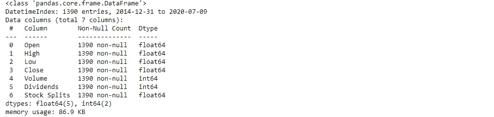

> **计算和分析资产收益**

我们通过将我们的数据帧移动一个周期，然后使用 NumPy 的*，来计算对数回报(这里知道[](https://tradingqna.com/t/why-stock-returns-are-calculated-in-log-scale/806)*为什么对数回报优于正常回报)。【T21 日志()】法。我们的数据框中添加了一个相同的列。**

```
*df_goog_shifted = df_goog.Close.shift(1)
df_goog['Return'] = np.log(df_goog.Close/df_goog_shifted).mul(100)
df_goog.dropna(inplace = True)
df_goog*
```

*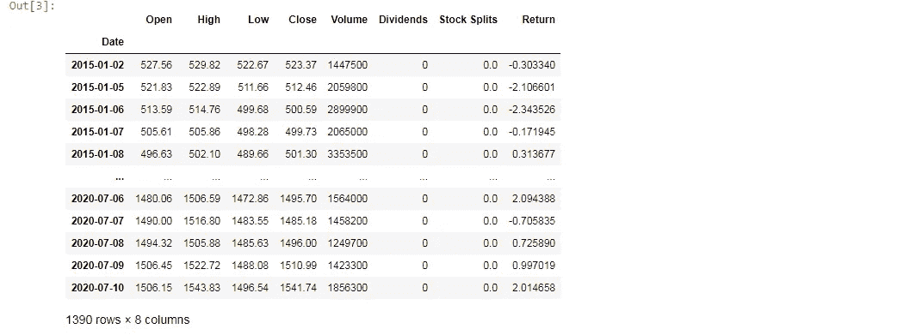*

*接下来，我们通过绘制 2015 年以来每天的数据来可视化我们的资产回报。*

```
*yr = pd.date_range(start = '2015', end = '2020' , freq = 'Y')
ret = df_goog['Return']
fig = plt.figure()
plt.plot(ret)
plt.title("Asset Returns")
for i in yr:
    plt.axvline(i, linestyle = '--' , color = 'gray')*
```

*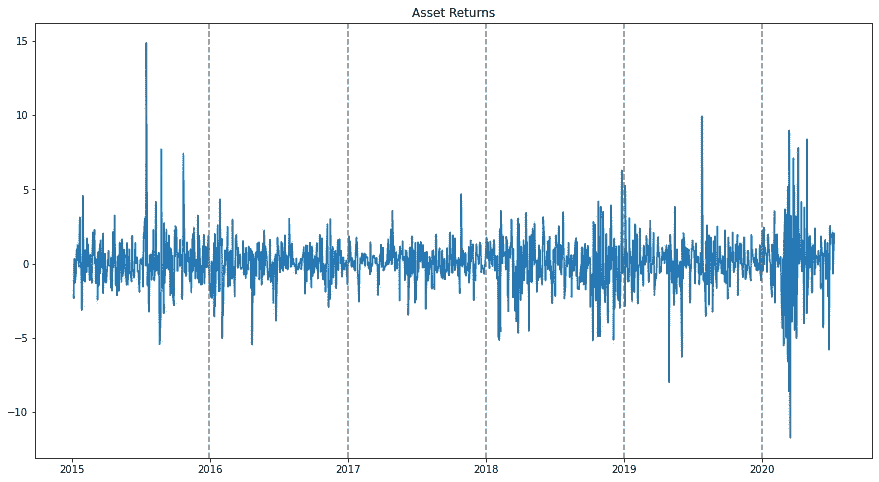*

*为了检查回报是否平稳，我们应用了 [*增广迪基富勒*](https://www.machinelearningplus.com/time-series/augmented-dickey-fuller-test/#:~:text=Augmented%20Dickey%20Fuller%20test%20(ADF%20Test)%20is%20a%20common%20statistical,the%20stationary%20of%20a%20series.) 测试；零假设的统计检验，表明由于趋势分量，序列是非平稳的。从*stats models . TSA . stat tools*我们导入 *adfuller* API 作为 *adf。*检验的 p 值是检验结果的第二个要素。*

```
*p_val = adf(ret)[1]
print("Since the pvalue:",p_val,"in the Augmented Dicky Fuller test is less than 5% we easily reject \
the null-hypothesis that returns are non-stationary")*
```

*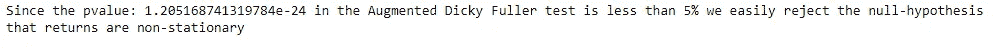*

*因此，我们可以得出结论，我们的回报是相当稳定的，可以建模。这是必要的，以确保平稳性，因为这种模型像 ARMA，ARIMA，GARCH 等。可以应用于平稳过程。(知道[为什么吗？](https://www.itl.nist.gov/div898/handbook/pmc/section4/pmc442.htm#:~:text=A%20common%20assumption%20in%20many,do%20not%20change%20over%20time.&text=The%20differenced%20data%20will%20contain%20one%20less%20point%20than%20the%20original%20data.))此外，直观上看不出季节性。*

> ***确定阶次并拟合 GARCH 模型***

*通过绘制几个滞后的收益平方的偏自相关图，我们得到了 GARCH 过程的阶 *p* 和 *q* 的概念。*stats models . graphics . TSA plots*的 *plot_pacf* 就是用来实现这个目的的。*

**从 statsmodels.graphics.tsaplots 导入 plot_pacf**

```
*fig = plot_pacf(ret**2, lags = 20, zero = False)*
```

*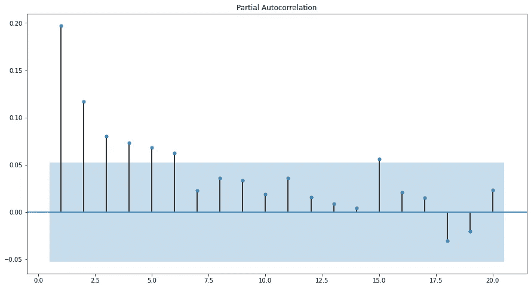*

*我们观察到，在滞后 2 之后，该图似乎停止了，这表明了它的重要性。这表明我们可以尝试 GARCH(2，2)过程。现在，我们拟合模型，为此，我们使用了 *arch* API 的 *arch_model* 函数。假设标准化残差的分布函数是学生 t 的分布函数。*

**从 arch 导入 arch_model**

```
*model = arch_model(ret , p = 2, q = 2, dist = 't').fit(disp='off')
model.summary()*
```

*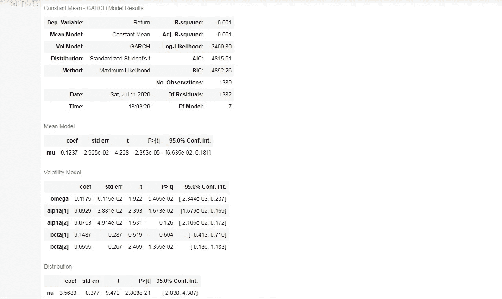*

> ***训练模型***

*为了训练我们的模型，我们使用固定 [*滚动窗口预测*](https://www.r-bloggers.com/formal-ways-to-compare-forecasting-models-rolling-windows/) (一种回溯测试)的技术，其中窗口大小是固定的。我们的想法是预测特定范围内的值，然后在我们知道该范围内的实际(真实)值时，移动窗口以包括这些预测值，从而更好地训练我们的模型，并再次预测下一个范围。这使预测适应新的观测结果，并避免回顾偏差。它也较少受到过度拟合的影响。在所取的窗口大小上重复该过程。*

*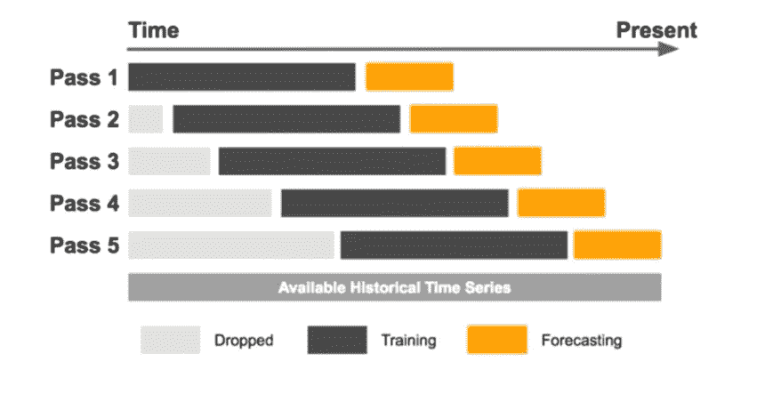*

*[图像来源](https://eng.uber.com/omphalos/)*

*这里，我们取一个窗口大小为一年中交易天数的 5 倍(即 252)，并利用历史数据来训练我们的模型。生成回报以及预测值的曲线图。在使用 *arch_model* 函数拟合一个模型之后，我们使用*。forecast()* 方法通过设置参数 *horizon = 1 来预测紧接的下一个值。*准确地说，是进行 1 天滚动窗口预测。请记住，我们需要找到标准偏差，这就是为什么我们取预测方差的平方根。*

```
*rolling = []
window = 252*5
for i in range(window):
    train_data = ret[:-(window-i)]
    model = arch_model(train_data, p = 2, q = 2).fit(disp='off')
    pred = model.forecast(horizon = 1)
    rolling.append(np.sqrt(pred.variance.values)[-1,:][0])
rolling = pd.Series(rolling , index = ret.index[-window:])
plt.plot(ret[-window:])
plt.plot(rolling)
plt.legend(['Returns','Volatility'])
plt.title('Rolling Window Forecast')*
```

*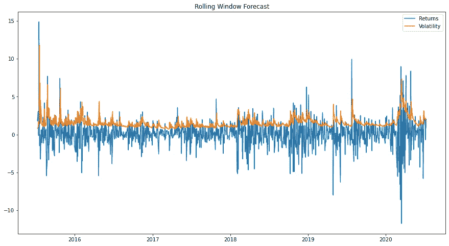*

*我们可以看到，我们的模型能够捕捉随时间变化的方差。有必要知道橙色曲线表明我们的股票回报有多波动。当收益偏离均值时，波动率曲线也会偏离，以表明方差变化的时期。橙色长尖峰表示高波动时期，而较短的尖峰表示资产回报波动较小的时期。从视觉上看，我们的模型似乎工作得还不错，但最好在其他统计测试的帮助下进行验证。*

> ***验证模型***

*数学上，标准残差是残差除以其标准差。它是对观察值和期望值之间差异强度的度量。标准残差应遵循一个[白噪声](https://en.wikipedia.org/wiki/White_noise)过程；一个过程，其中变量是连续不相关的(在任何滞后时间都相互独立)，具有零均值和有限方差。我们将在这里使用三种验证技术:*

*a)绘制标准化残差图，直观地查看残差是否遵循白噪声过程。这里，标准化残差 *std_resid* 通过使用*来计算。resid* 和*。我们的模型对象的 conditional_volatility* 属性如下面的代码所示。*

*b)绘制自动相关图，以验证标准残差在任何滞后时间都不显著相关。除了滞后零点之外，在图中看不到明显的滞后。*

*从*stats models . graphics . TSA plots*导入 *plot_acf**

```
*std_resid = model.resid/model.conditional_volatility
fig, ax = plt.subplots(nrows = 2, ncols = 0)
ax[0] = plt.plot(std_resid, color = ‘r’)
plt.title(‘Standardised Residuals’)
for i in yr:
 plt.axvline(i, linestyle = ‘ — ‘ , color = ‘gray’)
ax[1] = plot_acf(std_resid,lags = 20)*
```

*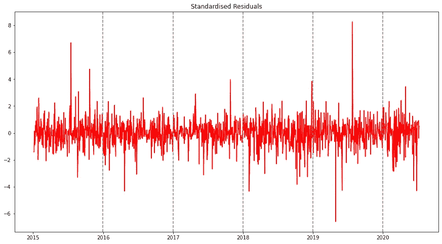***

*c)执行[l 接线盒](https://www.statisticshowto.com/ljung-box-test/)测试。这个测试的动机不仅仅是检查不同滞后的随机性，就像案例 b 一样，相反，它让我们了解基于指定滞后数的变量的总体随机性。零假设:数据是独立分布的。每个滞后的 p 值大于 5%，表明我们未能拒绝零假设。*

**从 statsmodels.stats.diagnostic 导入 acorr_ljungbox**

```
*lb_test = acorr_ljungbox(std_resid, lags = 20)
lb_test[1] //gives us the p-values at each lag*
```

*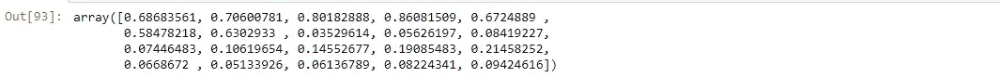*

*在上述所有三种情况下，可以得出合理的结论，因为我们的模型正在产生表示白噪声过程的标准化残差，变量是随机的，因此彼此不相关，我们拟合和训练的模型工作得相当好。*

> ***预测***

*最后，是时候做一些预测了！我们将使用我们的模型来获得未来七天的波动预测。为了实现这一点，我们指定*视界*参数等于 7。这里需要注意的是，这些预测逐渐趋向于长期平均值。*

```
*future_index = pd.date_range(start = (df_goog.index[-1]+timedelta(1)).strftime("%Y-%m-%d"), periods = 7, freq = 'D')
predict = model.forecast(horizon = 7)
pred_vol = np.sqrt(predict.variance.values[-1:][0])
pred_vol = pd.Series(pred_vol,index = future_index)
plt.plot(pred_vol, marker = 'o', markerfacecolor = 'r', linestyle = '--', markeredgecolor = 'k', markersize = 6)
plt.title("Next seven day volatility forecast")
plt.grid(True)*
```

*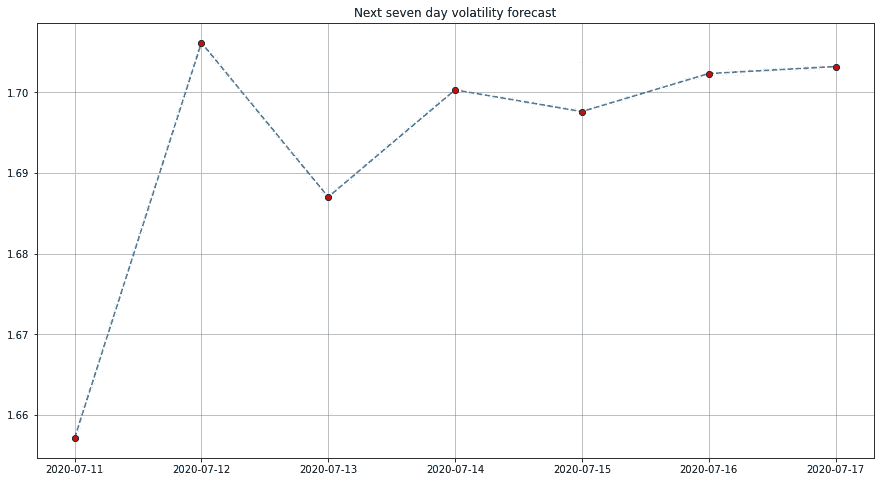*

*预测表明波动性变化会略有增加，然后最终下降。那么回报的波动性是高还是低呢？投资谷歌是不是一个风险很大的时候？你能有多自信？*

**注:*您可以选择更高阶的模型，如 GARCH(3，0)或 GARCH(3，3)模型，但请记住，模型摘要中的 *omega* 、 *alpha、*和 *beta* 参数的值应该非常重要。另外，不要忘记检查和验证相应的标准残差。*

*在我的 [GitHub](https://github.com/swarn6/GARCH/blob/master/Untitled4.ipynb) 上找到 jupyter 笔记本。*

**参考资料:-**

*[](https://www.quantstart.com/articles/Generalised-Autoregressive-Conditional-Heteroskedasticity-GARCH-p-q-Models-for-Time-Series-Analysis/) [## 时间序列的广义自回归条件异方差 GARCH(p，q)模型

### 在这篇文章中，我们将考虑著名的广义自回归条件异方差模型…

www.quantstart.com](https://www.quantstart.com/articles/Generalised-Autoregressive-Conditional-Heteroskedasticity-GARCH-p-q-Models-for-Time-Series-Analysis/) 

领英:-

[](https://www.linkedin.com/in/swarn6/) [## Swarnim Pandey — SRM 大学—印度北方邦勒克瑙| LinkedIn

### 查看世界上最大的职业社区 LinkedIn 上的 Swarnim Pandey 的个人资料。Swarnim 有 2 份工作列在…

www.linkedin.com](https://www.linkedin.com/in/swarn6/)*