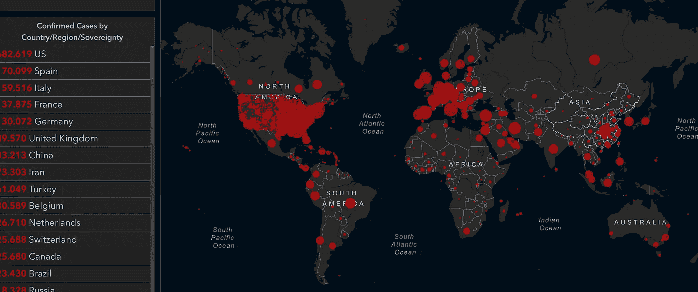
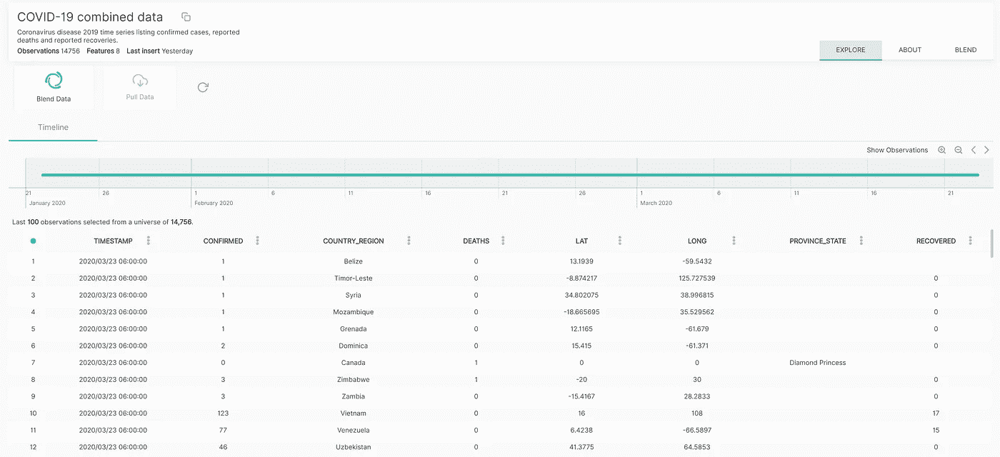
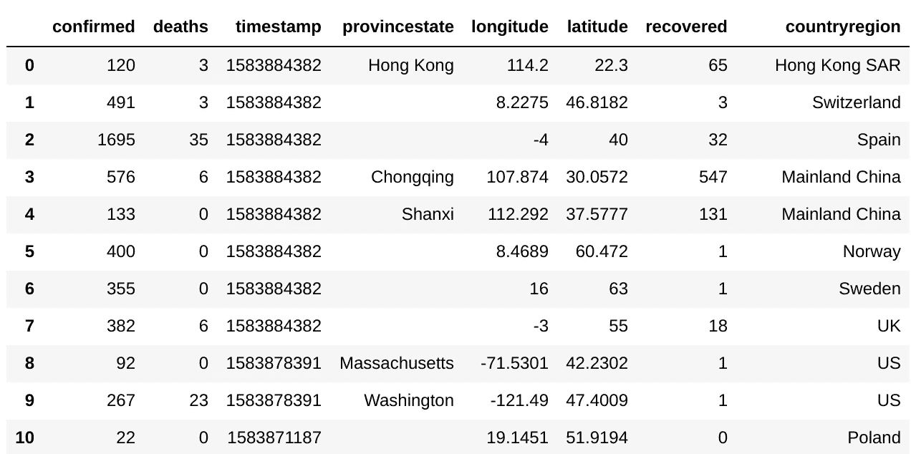
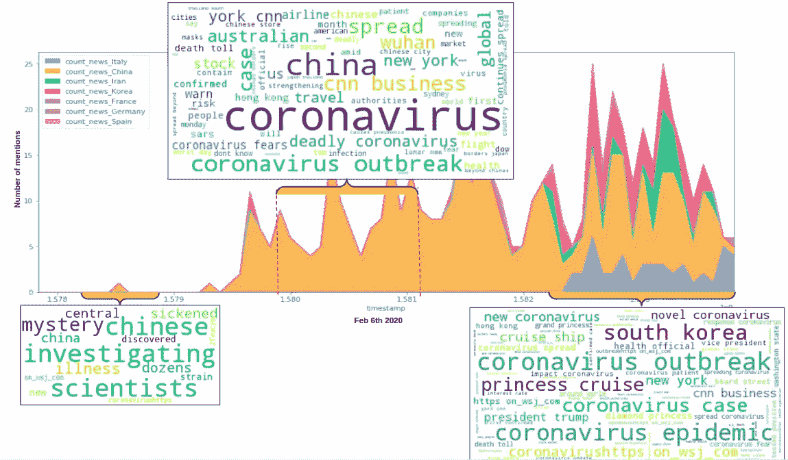
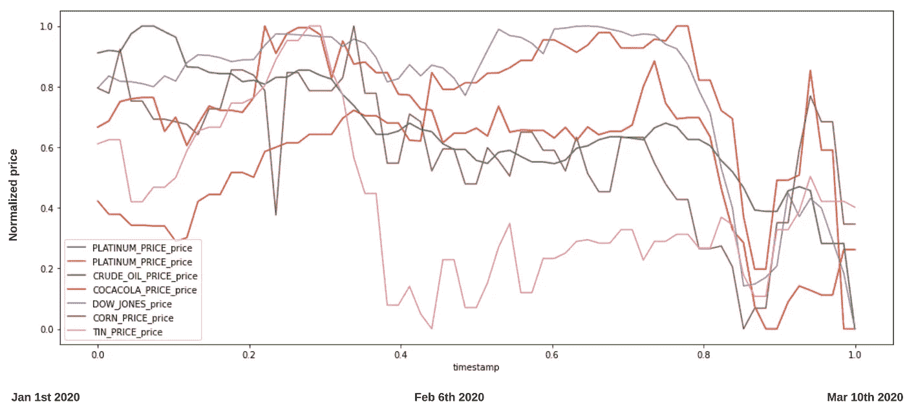
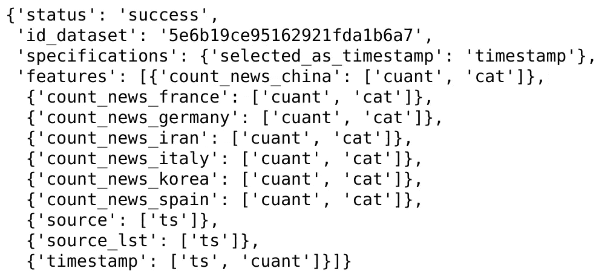
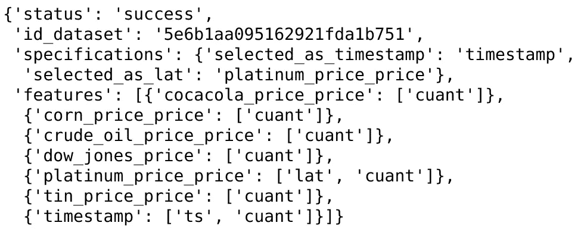
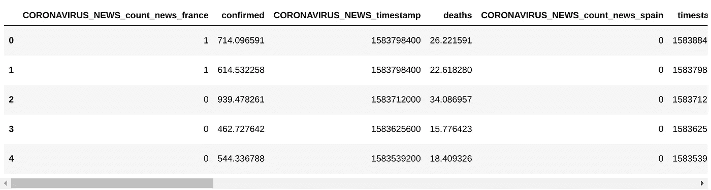

# 用 Python 收集所有冠状病毒相关数据的简单方法

> 原文：<https://towardsdatascience.com/gather-all-the-coronavirus-data-with-python-19aa22167dea?source=collection_archive---------3----------------------->

## 简单是关键。

**注:我最近出版了本教程的* ***R 版*** *，你可以在这里找到*[](/a-simple-way-to-gather-all-coronavirus-related-data-with-r-b1e7ecb74346)**。**

*冠状病毒在全球的传播令人担忧。截至今日(2020 年 7 月 15 日)，冠状病毒 **确诊病例**超 1300 万。*****

**

*约翰·霍普斯金地图*

# *目标*

*这篇文章的目的是**获得研究所需的数据**，并通过将所有相关数据收集到一个**Pandas**数据框架中**获得关于新冠肺炎的主动可见性**。*

# *步伐*

*   *步骤 1:设置技术**先决条件***
*   *第二步:聚集**新冠肺炎**确诊病例*
*   *第三步:收集 COVID 的**消息***
*   *第四步:收集**财务**和其他**指标***
*   *第五步:**将所有的数据混合在一起***

# *第一步。先决条件*

*   *安装 Python 2.6+或 3.1+版本*
*   *安装 pandas，matplotlib，openblender 和 wordcloud(带 pip)*

```
*$ pip install pandas OpenBlender matplotlib wordcloud*
```

# *第二步。收集新冠肺炎确诊病例*

*CSSE 正在做惊人的工作**上传每日数据** [这里](https://github.com/CSSEGISandData/COVID-19/tree/master/csse_covid_19_data/csse_covid_19_daily_reports)。然而，它非常杂乱**并且在许多不同的数据集上**，所以**我将它分类并上传为一个单独的** OpenBlender [数据集](https://www.openblender.io/#/dataset/explore/5e7a0d5d9516296cb86c6263/or/35):*

**

*让我们通过运行以下脚本将数据**拉入熊猫数据帧**:*

```
*from matplotlib import pyplot as plt
import OpenBlender
import pandas as pd
import json
%matplotlib inline action = 'API_getObservationsFromDataset'parameters = { 
 'token':'**YOUR_TOKEN_HERE**',
 'id_dataset':'5e7a0d5d9516296cb86c6263',
 'date_filter':{
               "start_date":"2020-01-01T06:00:00.000Z",
               "end_date":"2020-03-11T06:00:00.000Z"},
 'consumption_confirmation':'on',
 'add_date' : 'date'
}

df_confirmed = pd.read_json(json.dumps(OpenBlender.call(action, parameters)['sample']), convert_dates=False, convert_axes=False).sort_values('timestamp', ascending=False)
df_confirmed.reset_index(drop=True, inplace=True)
df_confirmed.head(10)*
```

**

*   ***注意**:要获得令牌，您*需要*在 [openblender.io](https://www.openblender.io/#/welcome/or/35) (免费)上创建一个帐户，您可以在您个人资料图标的“帐户”选项卡中找到它。*

*因此，现在我们有了按日期和地点汇总的确诊病例数、死亡人数和康复人数。*

**

*这里我们可以看到伊朗、意大利和韩国确诊病例的爆发。我们还可以看到西班牙、法国和德国开始**崛起**。*

# *第三步。收集新冠肺炎的消息*

*我们将从这些来源收集 **COVID 新闻**和文本:[华尔街日报](https://www.openblender.io/#/dataset/explore/5e2ef74e9516294390e810a9)、 [CNN 新闻](https://www.openblender.io/#/dataset/explore/5e1ded6b9516290a010e03ea)、 [ABC 新闻](https://www.openblender.io/#/dataset/explore/5d8852059516294231c596c0)和[今日美国推特](https://www.openblender.io/#/dataset/explore/5e32fd289516291e346c1726)(你可以寻找其他来源)*

**

*所以让我们获取数据。*

```
*action = 'API_getOpenTextData'parameters = {
    'token':'**YOUR_TOKEN_HERE**',
    'consumption_confirmation':'on',
    'date_filter':{"start_date":"2020-01-01T06:00:00.000Z", 
                   "end_date":"2020-03-10T06:00:00.000Z"},
    'sources':[
                # Wall Street Journal
               {'id_dataset' : '5e2ef74e9516294390e810a9', 
                 'features' : ['text']},
                # ABC News Headlines
               {'id_dataset':"5d8848e59516294231c59581", 
                'features' : ["headline", "title"]},
                # USA Today Twitter
               {'id_dataset' : "5e32fd289516291e346c1726", 
                'features' : ["text"]},
                # CNN News
               {'id_dataset' : "5d571b9e9516293a12ad4f5c", 
                'features' : ["headline", "title"]}
    ],
    'aggregate_in_time_interval' : {
              'time_interval_size' : 60 * 60 * 24
    },
    'text_filter_search':['covid', 'coronavirus', 'ncov'],
    'add_date' : 'date'    
}
df_news = pd.read_json(json.dumps(OpenBlender.call(action, parameters)['sample']), convert_dates=False, convert_axes=False).sort_values('timestamp', ascending=False)df_news.reset_index(drop=True, inplace=True)*
```

*以上，**我们指定了**以下内容:*

*   *我们选择了 4 个来源来收集数据。具体来说，带有文本的功能列*
*   *我们指定要从 1 月 1 日到今天(3 月 10 日)的数据*
*   *我们要求将新闻汇总成 24 小时小组或观察*
*   *我们**过滤了提及“冠状病毒”、“冠状病毒”或“ncov”的新闻***

```
*# Let's take a look
df_news.head(20)*
```

**

*每个观察都是按天对新闻的**聚合，我们有 **source** 和 **source_lst** ，前者是所有新闻的串联，后者是该时段的新闻列表。***

***时间戳**(返回为 [unix 时间戳](https://www.epochconverter.com/))是指从前一个时间戳到当前时间戳(严格来说是之前)的间隔内发生的新闻:*

**

*现在让我们来看看一些感兴趣的*国家*的**提及次数**。*

```
*interest_countries = ['China', 'Iran', 'Korea', 'Italy', 'France', 'Germany', 'Spain']for country in interest_countries:
    df_news['count_news_' + country] = [len([text for text in daily_lst if country.lower() in text]) for daily_lst in df_news['source_lst']]df_news.reindex(index=df_news.index[::-1]).plot(x = 'timestamp', y = [col for col in df_news.columns if 'count' in col], figsize=(17,7), kind='area')*
```

****

*我们来看一个来自**最近 20 天**新闻的词云。* *可选步骤(如果要安装 wordcloud* ):*

```
*from os import path
from PIL import Image
from wordcloud import WordCloud, STOPWORDS, ImageColorGeneratorplt.figure()
plt.imshow(WordCloud(max_font_size=50, max_words=80, background_color="white").generate(' '.join([val for val in df['source'][0: 20]])), interpolation="bilinear")
plt.axis("off")
plt.show()plt.figure()
plt.imshow(WordCloud(max_font_size=50, max_words=80, background_color="white").generate(' '.join([val for val in df['source'][0: 20]])), interpolation="bilinear")
plt.axis("off")
plt.show()*
```

**

**上面的代码生成了图像的最后一个 wordcloud。*

*早期新闻中的关键词如“神秘”、“正在调查”、“几十个”**与后期关键词**如“中国”、“冠状病毒”、“全球”形成对比。**更有**最近的:“新型冠状病毒”、“冠状病毒流行”、“爆发”、“巡航”、“新型冠状病毒”等..*

# *第四步。收集财务和其他指标*

*为此，我们可以从道琼斯数据集中分离出来，混合其他几个数据，比如**汇率**(日元、欧元、英镑)**材料价格**(原油、玉米、铂、锡)，或者**股票**(可口可乐、道琼斯)。*

```
*action = 'API_getObservationsFromDataset'

parameters = {
 'token':'**YOUR_TOKEN_HERE**',
 'id_dataset':'5d4c14cd9516290b01c7d673', 'aggregate_in_time_interval':{"output":"avg","empty_intervals":"impute","time_interval_size":86400}, 'blends':[
        #Yen vs USD              
{"id_blend":"5d2495169516290b5fd2cee3","restriction":"None","blend_type":"ts","drop_features":[]}, # Euro Vs USD
{"id_blend":"5d4b3af1951629707cc1116b","restriction":"None","blend_type":"ts","drop_features":[]}, # Pound Vs USD              
{"id_blend":"5d4b3be1951629707cc11341","restriction":"None","blend_type":"ts","drop_features":[]}, # Corn Price    
{"id_blend":"5d4c23b39516290b01c7feea","restriction":"None","blend_type":"ts","drop_features":[]}, # CocaCola Price     
{"id_blend":"5d4c72399516290b02fe7359","restriction":"None","blend_type":"ts","drop_features":[]}, # Platinum price             
{"id_blend":"5d4ca1049516290b02fee837","restriction":"None","blend_type":"ts","drop_features":[]}, # Tin Price
{"id_blend":"5d4caa429516290b01c9dff0","restriction":"None","blend_type":"ts","drop_features":[]}, # Crude Oil Price
{"id_blend":"5d4c80bf9516290b01c8f6f9","restriction":"None","blend_type":"ts","drop_features":[]}],'date_filter':{"start_date":"2020-01-01T06:00:00.000Z","end_date":"2020-03-10T06:00:00.000Z"},
'consumption_confirmation':'on' 
}df = pd.read_json(json.dumps(OpenBlender.call(action, parameters)['sample']), convert_dates=False, convert_axes=False).sort_values('timestamp', ascending=False)
df.reset_index(drop=True, inplace=True)print(df.shape)
df.head()*
```

**

*所以现在我们有了一个单独的数据集,其中包含每日观察到的价格随时间的变化。如果我们想要比较它们，我们最好将它们归一化到 0 到 1 之间，这样我们就可以更好地欣赏这些模式:*

```
*# Lets compress all into the (0, 1) domain
df_compress = df.dropna(0).select_dtypes(include=['int16', 'int32', 'int64', 'float16', 'float32', 'float64']).apply(lambda x: (x - x.min()) / (x.max() - x.min()))
df_compress['timestamp'] = df['timestamp']# Now we select the columns that interest us
cols_of_interest = ['timestamp', 'PLATINUM_PRICE_price', 'CRUDE_OIL_PRICE_price', 'COCACOLA_PRICE_price', 'open', 'CORN_PRICE_price', 'TIN_PRICE_price', 'PLATINUM_PRICE_price']
df_compress = df_compress[cols_of_interest]
df_compress.rename(columns={'open':'DOW_JONES_price'}, inplace=True)# An now let's plot them
from matplotlib import pyplot as plt
fig, ax = plt.subplots(figsize=(17,7))
plt = df_compress.plot(x='timestamp', y =['PLATINUM_PRICE_price', 'CRUDE_OIL_PRICE_price', 'COCACOLA_PRICE_price', 'DOW_JONES_price', 'CORN_PRICE_price', 'TIN_PRICE_price', 'PLATINUM_PRICE_price'], ax=ax)*
```

**

*有趣的是，几乎所有的**(除了锡价)都遵循**相似的模式**。***

# ***第五步。将所有数据混合在一起***

***现在，我们将把**新冠肺炎确诊病例**、**冠状病毒新闻**和**经济指标**数据排列成按照时间混合的**单一数据集**。***

***为了混合数据，让我们将创建的数据集上传到 OpenBlender:***

```
***# First the News Datasetaction = 'API_createDataset'parameters = { 
 'token':'**YOUR_TOKEN_HERE**',
 'name':'Coronavirus News',
 'description':'YOUR_DATASET_DESCRIPTION',
 'visibility':'private',
 'tags':[],
 'insert_observations':'on',
    'select_as_timestamp' : 'timestamp',
 'dataframe':df_news.to_json() 
}

OpenBlender.call(action, parameters)***
```

******

```
***# And now the Financial Indicatorsaction = 'API_createDataset'parameters = { 
 'token':'**YOUR_TOKEN_HERE**',
 'name':'Financial Indicators for COVID',
 'description':'YOUR_DATASET_DESCRIPTION',
 'visibility':'private',
 'tags':[],
 'insert_observations':'on',
 'select_as_timestamp' : 'timestamp',
 'dataframe':df_compress.to_json() 
}

OpenBlender.call(action, parameters)***
```

******

*****注意:您将希望在下面使用每个数据集的“id_dataset”。****

***现在，我们只需提取初始新冠肺炎数据集，并通过将来自我们创建的数据集**的“id _ dataset”s**放置在“id _ blend”字段上，来混合我们创建的新数据集。***

```
***action = 'API_getObservationsFromDataset'# ANCHOR: 'COVID19 Confirmed Cases'
# BLENDS: 'Coronavirus News', 'Financial Indicators for COVID'

parameters = { 
 'token':'**YOUR_TOKEN_HERE**',
 'id_dataset':'5e7a0d5d9516296cb86c6263',
 'date_filter':{
               "start_date":"2020-01-01T06:00:00.000Z",
               "end_date":"2020-03-11T06:00:00.000Z"} ,'filter_select' : {'feature' : 'country_region', 'categories' : ['Italy']},'aggregate_in_time_interval':{"output":"avg","empty_intervals":"impute","time_interval_size":86400}, 'blends':[{"id_blend":"**YOUR_CORONA_NEWS_ID**","restriction":"None","blend_type":"ts","drop_features":[]},
            {"id_blend":"**YOUR_FINANCIAL_INDICATORS_ID**","restriction":"None","blend_type":"ts","drop_features":[]}] 
}df = pd.read_json(json.dumps(OpenBlender.call(action, parameters)['sample']), convert_dates=False, convert_axes=False).sort_values('timestamp', ascending=False)
df.reset_index(drop=True, inplace=True)***
```

***上面我们**选择了“意大利”**、**的观测值，按天**以秒为单位(8640)进行聚合，**混合了新数据**。***

```
***df.head()***
```

******

***现在我们有了一个数据集，它包含了所有数据按时间混合的**日常信息！*****

***这有很大的发展空间。***

***请发布进一步的发现。***