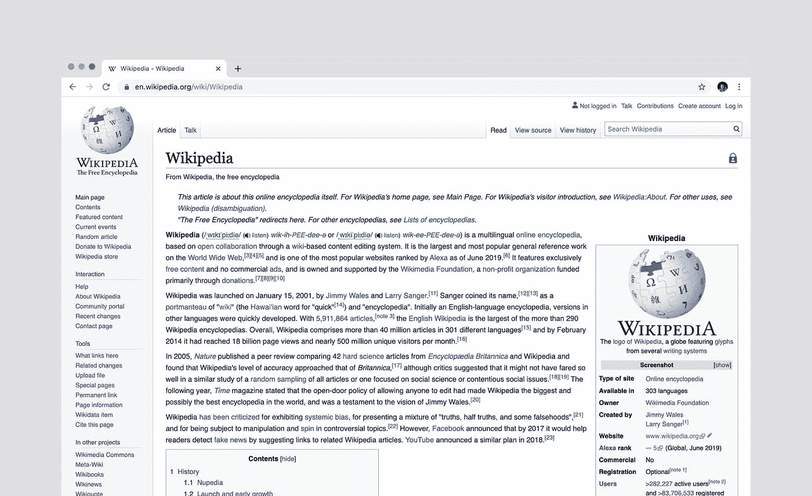

# 收集您的数据:“不那么怪异”的 API！

> 原文：<https://towardsdatascience.com/gather-your-data-the-not-so-spooky-apis-da0da1a5992c?source=collection_archive---------74----------------------->


照片由 [Fotis Fotopoulos](https://unsplash.com/@ffstop?utm_source=medium&utm_medium=referral) 在 [Unsplash](https://unsplash.com?utm_source=medium&utm_medium=referral) 上拍摄

## 当 python 处理互联网文件时。

数据分析周期从收集和提取开始。我希望[我之前的博客](/gather-your-data-the-common-ones-6086ed04b905?source=friends_link&sk=de3cac3fa648dd226aea85abe759d67e)给出了如何使用 python 从常见文件格式中收集数据的想法。在这篇博客中，我将着重于从那些并不常见但却有着最真实应用的文件中提取数据。

无论您是否是数据专业人员，您现在可能都已经遇到了术语 API。大多数人对这个相当常见的术语有一个相当模糊或不正确的概念。

## 使用 python 中的 API 提取数据


照片由 [Yogas 设计](https://unsplash.com/@yogasdesign?utm_source=medium&utm_medium=referral)在 [Unsplash](https://unsplash.com?utm_source=medium&utm_medium=referral) 上拍摄

> **API** 是**应用编程接口**的首字母缩写，它是一个软件中介(中间人)，允许两个应用相互对话。

每次你使用像 Tinder 这样的应用程序，发送 WhatsApp 信息，在手机上查看天气，你都在使用 API。它们允许我们在设备、应用程序和个人之间共享重要的数据和公开实际的业务功能。虽然我们可能没有注意到它们，但 API 无处不在，在幕后为我们的生活提供动力。

我们可以把 API 比喻成银行的 ATM(自动柜员机)。银行让我们可以使用他们的自动提款机来查询余额、存款或提取现金。所以在这里，ATM 是帮助银行和我们这些顾客的中间人。

类似地，Web 应用程序使用 API 将面向用户的前端与所有重要的后端功能和数据连接起来。Spotify 和网飞等流媒体服务使用 API 来分发内容。像特斯拉这样的汽车公司通过 API 发送软件更新。更多的例子，你可以查看文章[5**我们日常生活中使用的 API 的例子**](https://nordicapis.com/5-examples-of-apis-we-use-in-our-everyday-lives/)。

在数据分析中，API 最常用于检索数据，这将是这篇博客的重点。

当我们想从一个 API 中检索数据时，我们需要发出一个请求。请求在网络上随处可见。例如，当您访问这篇博文时，您的 web 浏览器向面向数据科学的 web 服务器发出了一个请求，该服务器以这个网页的内容作为响应。

[API 请求](https://monashdatafluency.github.io/python-web-scraping/section-3-API-based-scraping/)以同样的方式工作——你向 API 服务器请求数据，它响应你的请求。使用 API 主要有两种方式:

1.  通过使用 URL 端点的命令终端，或者
2.  通过编程语言特定的包装器。

例如， **Tweepy** 是一个著名的 Twitter API python 包装器，而 **twurl** 是一个命令行界面(CLI)工具，但两者可以实现相同的结果。

这里我们关注后一种方法，并将使用基于原始 **MediaWiki API** 的名为 **wptools** 的 Python 库(包装器)。 [MediaWiki](https://www.mediawiki.org/wiki/API:Main_page) action API 是 [Wikipedia 的 API](https://www.simplifiedpython.net/wikipedia-api-python/) ，它允许访问一些 Wiki 特性，如身份验证、页面操作和搜索。



照片由[卢克·切瑟](https://unsplash.com/@lukechesser?utm_source=medium&utm_medium=referral)在 [Unsplash](https://unsplash.com?utm_source=medium&utm_medium=referral) 上拍摄

[Wptools](https://pypi.org/project/wptools/) 对 MediaWiki APIs 进行只读访问。你可以通过传统的 Mediawiki API 从任何语言的任何 Wikimedia 项目中获得关于 wiki 站点、类别和页面的信息。您可以从页面信息框中提取非结构化数据，或者通过 Wikidata API 获取关于页面的结构化、链接的开放数据，并从高性能 RESTBase API 获取页面内容。

在下面的代码中，我使用 python 的 wptools 库访问了圣雄甘地维基百科页面，并从该页面提取了一个图像文件。对于 Wikipedia URL ' https://en . Wikipedia . org/wiki/Mahatma _ Gandhi '，我们只需要传递 URL 的最后一位。

get 函数获取所有内容，包括摘录、图像、infobox 数据、wiki 数据等。呈现在那一页上。通过使用。data()函数我们可以提取所有需要的信息。我们对 API 的请求得到的响应很可能是 JSON 格式的。

## 用 python 从 JSON 读取数据


克里斯托夫·高尔在 [Unsplash](https://unsplash.com?utm_source=medium&utm_medium=referral) 上拍摄的照片

> **JSON** 是 **JavaScript 对象符号**的首字母缩写。它是一种轻量级的数据交换格式。人类读&写就像机器解析&生成一样容易。JSON 已经迅速成为事实上的信息交换标准。

在浏览器和服务器之间交换数据时，数据只能是文本。JSON 是文本，我们可以将任何 JavaScript 对象转换成 JSON，并将 JSON 发送到服务器。

例如，你可以用浏览器直接访问 [GitHub 的 API](https://www.freecodecamp.org/news/what-is-an-api-in-english-please-b880a3214a82/) ，甚至不需要访问令牌。当你在你的浏览器[https://api.github.com/users/divyanitin](https://api.github.com/users/divyanitin)中访问一个 GitHub 用户的 API 路由时，你得到的 JSON 响应如下:

```
{
  "login": "divyanitin",
  "url": "https://api.github.com/users/divyanitin",
  "html_url": "https://github.com/divyanitin",
  "gists_url": "https://api.github.com/users/divyanitin/gists{/gist_id}",
  "type": "User",
  "name": "DivyaNitin",
  "location": "United States",
}
```

浏览器似乎已经很好地显示了 JSON 响应。这样的 JSON 响应已经可以在您的代码中使用了。从这段文字中提取数据很容易。然后你可以对这些数据做任何你想做的事情。

Python 原生支持 JSON。它附带了一个 json 内置包，用于编码和解码 JSON 数据。JSON 文件在{}中存储数据，类似于字典在 Python 中存储数据的方式。类似地，JSON 数组被翻译成 python 列表。

在我上面的代码中，wiki_page.data['image'][0]访问 image 属性中的第一个图像，即一个 JSON 数组。使用 Python json 模块，您可以像读取简单的文本文件一样读取 json 文件。

read 函数 json.load()返回一个 json 字典，使用 pandas 可以很容易地将其转换为 Pandas 数据帧。DataFrame()函数。您甚至可以使用 pandas.read_json()函数将 JSON 文件直接加载到 dataframe 中。

## 从互联网上读取文件(HTTPS)


照片由 [Edho Pratama](https://unsplash.com/@edhoradic?utm_source=medium&utm_medium=referral) 在 [Unsplash](https://unsplash.com?utm_source=medium&utm_medium=referral) 上拍摄

> **HTTPS** 代表**超文本传输协议安全**。它是一种网络浏览器和网络服务器相互交流的语言。web 浏览器可能是客户端，而托管网站的计算机上的应用程序可能是服务器。

我们正在编写与远程 API 一起工作的代码。你的地图应用获取附近印度餐馆的位置，或者 OneDrive 应用启动云存储。所有这一切都是通过 HTTPS 的请求实现的。

[Requests](https://requests.readthedocs.io/en/master/) 是 python 中的一个多功能 HTTPS 库，具有各种应用。它作为客户端和服务器之间的请求-响应协议。它提供了通过 HTTPS 访问 Web 资源的方法。它的应用之一是使用文件 URL 从网上下载或打开文件。

要发出“GET”请求，我们将使用 requests.get()函数，该函数需要一个参数—我们要请求的 URL。

在下面的脚本中，open 方法用于将二进制数据写入本地文件。在这里，我们使用 python 的[操作系统库](https://docs.python.org/3/library/os.html)在系统上创建一个文件夹并保存提取的 web 数据。

json 和 requests import 语句加载 Python 代码，允许我们使用 JSON 数据格式和 HTTPS 协议。我们使用这些库是因为我们对如何发送 HTTPS 请求或者如何解析和创建有效 JSON 的细节不感兴趣，我们只想用它们来完成这些任务。

一种流行的 web 架构风格叫做 [**REST(表述性状态转移)**](https://realpython.com/api-integration-in-python/#appendix-rest-in-a-nutshell) ，它允许用户通过 **GET** 和 **POST** 调用(两种最常用的调用)与 web 服务进行交互。

**GET** 一般用于获取一些已经存在的对象或记录的信息。相比之下， **POST** 通常用在你想创造一些东西的时候。

REST 本质上是一组用于构建 web API 的有用约定。我所说的“web API”指的是通过 HTTP 与您交互的 API，它向特定的 URL 发出请求，并经常在响应中获得相关的数据。

例如，Twitter 的 REST API 允许开发人员访问核心 Twitter 数据，Search API 为开发人员提供了与 Twitter 搜索和趋势数据进行交互的方法。

这个博客主要关注所谓的互联网文件。我介绍了使用简单的 API 提取数据。大多数 API 都需要认证，就像我之前的类比 ATM 一样，需要我们输入 pin 来认证我们对银行的访问。

你可以看看我的另一篇文章[Twitter Analytics:“WeRateDogs”](/twitter-analytics-weratedogs-a441be7d4a85?source=friends_link&sk=b1fa174b4808c69f30c299b3e83471fe)，这篇文章关注的是 twitter API 的数据争论和分析。我已经在这个项目中使用了所有上述脚本，你可以在[我的 GitHub](https://github.com/divyanitin) 上找到相同的代码。

众所周知，最常见的互联网文件之一是 HTML。从互联网上提取数据有一个通用术语叫网络搜集。在这种情况下，我们使用 HTML 直接访问网站数据。在我的下一篇博客中，我会涵盖同样的内容，从“基本”到“必须知道的”。

如果你喜欢这篇博文，请在下面留下评论，并与朋友分享！