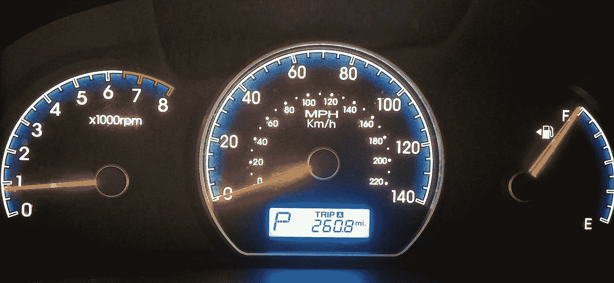
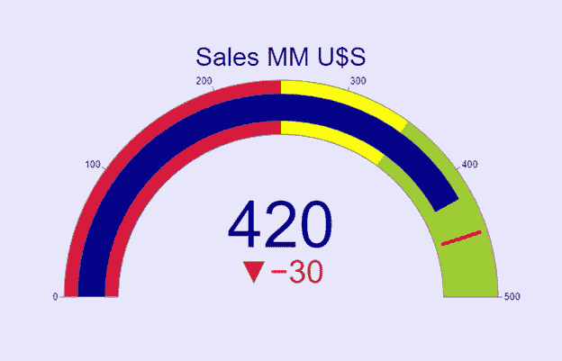
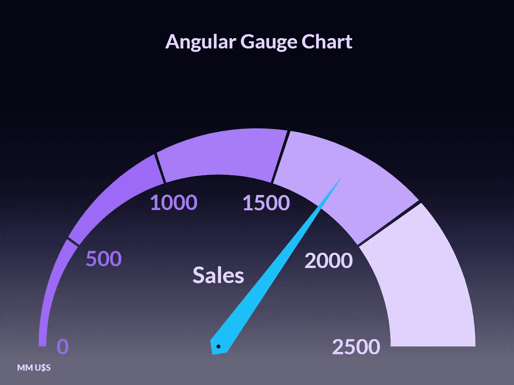
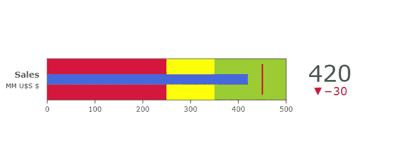
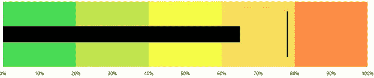
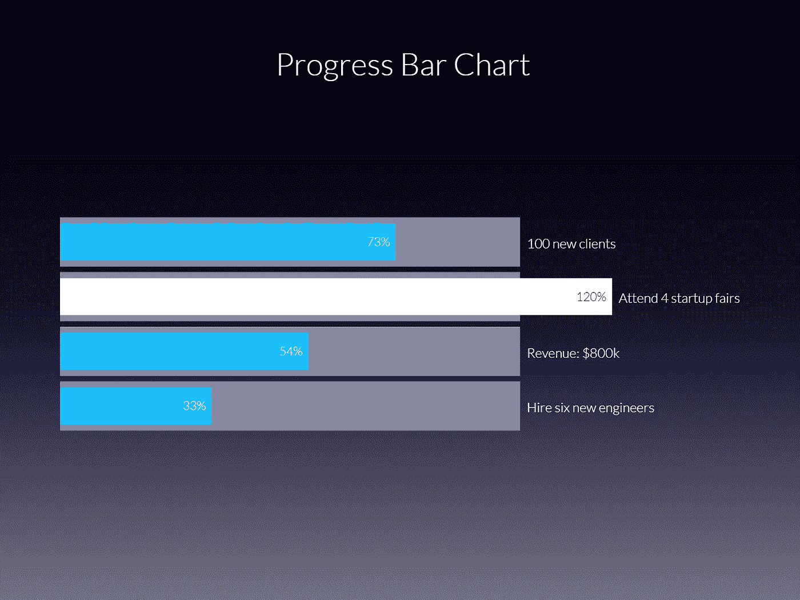

# 仪表图和项目符号图

> 原文：<https://towardsdatascience.com/gauge-bullet-charts-cfe171ca3094?source=collection_archive---------23----------------------->

## **为什么&怎么样，用量具讲故事**

图片由来自 Pixabay 的 Brett Hondow 提供

商业智能(BI)是商业环境中使用的一套方法和资源(理论概念、算法、软件、工具、技术)，其基本目标是**将信息转化为知识**。商业智能的目的是支持更好的商业决策，以提高任何商业组织的生产力和绩效。

BI 在很大程度上依赖于一套核心的分析工具:平衡记分卡、仪表盘和关键绩效指标。

**平衡记分卡** (BS)是一种管理工具，允许将短期运营控制与被研究公司的长期愿景和战略相结合。为此，BS 制定、实施、控制和管理组织的战略，有效地将战略规划、运营管理以及团队和个人绩效评估联系起来。

**关键绩效指标**(KPI)是任何组织为了实现其战略计划都需要衡量、监控和执行的最重要的指标。

商业智能**仪表板**是一种技术驱动的方法，它使用**数据可视化工具**来显示 KPI，以便跟踪有助于业务运营和成功的主要因素。它是在追求公司设定的目标过程中所涉及的主要指标的图形表示。

企业主和公司高管总是想要简单的解决方案。从这个意义上说，数据分析师必须让仪表板易于查看、导航和理解。用于在仪表板上显示 KPI 的两种传统图形是仪表图和项目符号图。

我们分别来分析一下。

# **1。-仪表图**

**又名**:车速表图表、表盘图表、角度规图表

**为什么**:广泛用于商业智能(BI)可视化，特别是**仪表板中，**用于指示数据或测量值是否在某个值范围之内、之下或之上。它们是非常简单的图形，能够很快抓住观众的注意力，即使是非专业观众也是如此。它们提供关于一个**单一定量测量**的信息，将它的当前值与一个目标和一系列由不同颜色的条带表示的范围进行比较。下图表明当前销售值(420)在令人满意的范围内，但比预定目标低 30 个单位。

图 1:标准仪表图。目标是 450。阈值在 250 和 350。

**如何:虽然有不同的格式，但最常见的是对应于车辆的速度表:一个**径向数字刻度**分成几个部分，每个部分用特定的颜色标识；指针或指针在径向标尺上移动；最小或下限值、最大或上限值和**目标值。**范围或扇区的数量是可变的，但通常有三个扇区，红色表示低于下限阈值的扇区，黄色表示阈值之间的扇区，绿色表示高于上限阈值的扇区。建议不要显示超过五个范围或扇区。**

**以下是与不同颜色相关的一些可能的**定性值**:差、满意和好；绿色表示满意，黄色表示小心，红色表示报警；差、一般、优秀；红色代表低性能，黄色代表正常性能，绿色代表高性能。这些定性值的范围广泛用于 BI 演示或仪表板上，以显示给定公司的业务绩效。目标值可以是要达到的目标、基准或要超过的先前值。**

**不要将仪表图与圆环图(圆环图)混淆。虽然前者仅报告定量测量，但环形图与可分为单个部分的整体相关，以及每个部分如何以相对或绝对方式与总量相关(整体的**部分**分析**)。****

****仪表图在用数据讲述故事时有几个优点****:****

> ****它们非常简单，通俗易懂，迅速抓住观众的注意力；****
> 
> ****观众对它们很熟悉:汽车速度计、电脑游戏中的指示器、烤箱或火炉中的温度指示等。不像更复杂的图形，没有必要“浪费时间”去解释它们；****
> 
> ****颜色的顺序，从红色到绿色，是直观和立即理解的；****
> 
> ****大多数商业和公司主管更喜欢它们，因为它们简单、清晰、即时地传输关键数据；****

****但是它们也充满了缺点，在讲故事的时候必须考虑到这些缺点:****

> ****它们的简单性不允许它们描绘背景；****
> 
> ****他们经常通过省略关键信息来误导观众，导致糟糕的故事情节。****
> 
> ****人类很难通过角度来比较数值；我们总是喜欢通过从共同基线开始的长度进行比较(**项目符号图**)；****
> 
> ****它们占据了大量的物理空间，而且它们的格式会分散观众的注意力。仪表板和记分卡上经常堆满了指标，这使得讲故事的过程变得更加复杂；****
> 
> ****请记住**色盲**(色觉缺陷)大约影响十二分之一的男性和两百分之一的女性。最常见和最有问题的颜色缺乏形式被称为“红绿色盲”，准确地说是仪表中常用的两种颜色。由于这些原因，实际的趋势是将扇区编码为具有从暗到亮的不同强度的单一色调。较深的颜色强度用于低值或差值，而较浅的颜色强度表示满意或优秀值(图 2)；****
> 
> ****最后一个警告来自 Robert Kosara (#1):“在数据可视化中，仪表只是解决了错误的问题。业务决策不能只基于某个度量的当前值，而是需要历史和背景。数值通常也不会像加速器上的压力大小和汽车速度那样快速变化，也不会直接相关。****

********

****图 2:角度规图。用 Vizzlo 创建，有权限(#2)。****

*****Matplotlib* 库没有允许我们直接绘制仪表图的功能。在以下网站可以找到一个非常巧妙的解决问题的方法:[https://water gramming . WordPress . com/2018/06/04/creating-shaded-dial-plots-in-python/](https://waterprogramming.wordpress.com/2018/06/04/creating-shaded-dial-plots-in-python/)。一个更简单的解决方案是基于 *Plotly* 图形库，它有一个*指示器*功能:[https://plotly.com/python/gauge-charts/](https://plotly.com/python/gauge-charts/)。****

# ******2。-项目符号图******

******又名**:项目符号图****

******为什么**:著名的数据可视化专家**Stephen first**开发了一种替代量规的方法，他将其命名为子弹图(#3)。关键的想法是通过添加补充措施来丰富信息，以描绘背景，使用更少的物理空间，没有分散观众注意力的装饰。项目符号图提供有关单个定量测量的信息，将它的当前值与目标值以及一系列由不同颜色的条带指示的范围进行比较。****

******如何**:它们类似于标准条形图(它们通过长度或高度对信息进行编码)，但与标准条形图的不同之处在于，它们包括一个中间窄条，指示所报告的数值变量的当前值。它们也有一条垂直线显示目标或对象，以及不同的范围或扇区(通常是三个),用不同颜色的带或单一色调的不同强度来指示。与仪表图不同，**不同的类别可以在单个图表中进行比较**。****

********

****图 3:标准的项目符号图。目标是 450。阈值在 250 和 350。****

****标准项目符号图有五个组成部分(#3):****

> ****指示测量变量和相应测量单位的文本标签；****
> 
> ****沿着线性轴的定量刻度，其刻度和数字标识等间距的测量间隔；****
> 
> ****用清晰可见的条形编码的主要或特色测量，其基线可能不为零；****
> 
> ****垂直于图表方向绘制的细线形式的比较度量(如果代表主要度量的条是水平的，则为垂直线；如果代表主要度量的条是垂直的，则为水平线)；****
> 
> ****两到五个定性的绩效范围，表示主要衡量标准的定性状态。这些范围通过不同的颜色或单一色调的不同强度来区分。****

****项目符号图以**垂直或水平方向**呈现。水平项目符号图允许在垂直轴上显示不同的类别，而数字值由水平轴上的数量刻度表示。相反，垂直项目符号图允许在水平轴上显示不同的类别，而在垂直轴上用数量刻度显示数值。定量刻度允许您在线性轴上显示变量的测量值，比仪表的角轴更容易读取。****

********

****图 4:具有五个扇区的水平定向的项目符号图。目标是 78%。****

****与仪表图类似，范围或部门最常见的定性值有:差、满意和好；绿色表示满意，黄色表示小心，红色表示报警(图 4)；差、一般、优秀；低于绩效、一般绩效和高于绩效。****

****仪表板上的项目符号图和其他 BI 可视化工具通常显示的数字变量是销售额、收入、利润、费用、客户数量和相关数据。****

****不要将项目符号图表与**进度条** **图表**混淆。后者是一个图形控制元素，用于可视化某个操作的进度，如下载文件、传输文件或安装软件。一些可视化工具建议使用进度条作为业务指示器，如下图所示:****

********

****图 5:进度条形图。用 Vizzlo 创建，有权限(#2)。****

****与仪表图一样，Matplotlib 没有允许您立即绘制项目符号图的功能。同样，我发现了一个基于 Matplotlib 和 Seaborn 的非常巧妙的解决方案:【https://pbpython.com/bullet-graph.html[。我还找到了一个更好的基于 Plotly 的解决方案:](https://pbpython.com/bullet-graph.html)[https://plotly.com/python/bullet-charts/](https://plotly.com/python/bullet-charts/)****

****中国一所大学进行的一项科学研究比较了 40 名大学生在面对水平子弹图、垂直子弹图和角度规图(#4)时的情绪差异。每个图形备选方案所需的**认知负荷**、学生感知的**满意度**以及每个可视化备选方案的**美学效果**被用作主观指标。该研究得出结论，垂直方向的项目符号图产生最高的满意度和最低的认知负荷。相比之下，角度规图导致最低的满意度，最高的认知负荷，尽管它们是最具美感的。****

****我建议你将这些结果用于你的下一次商业演示。****

****在许多公司进行数字化转型的背景下，商业智能和数据可视化技术变得越来越重要。可视化和图表定制的可能性非常多:有几十种不同的图表在可视化数据时提供了很大的灵活性，但有时只需要简单、易于理解的图表，就可以迅速抓住观众的注意力。仪表和项目符号图提供了简单性和熟悉性，这是观众非常欣赏的。****

****特别是，我们建议使用项目符号图，因为它们能够在较小的空间内编码更多的信息。****

****如果你对这篇文章感兴趣，请阅读我以前的:****

******直方图，为什么&怎么样，讲故事，提示&扩展******

**** [## 直方图，为什么和如何

### 讲故事、技巧和扩展

towardsdatascience.com](/histograms-why-how-431a5cfbfcd5) 

**平行坐标剧情，为什么&怎么样，用平行线讲故事**

 [## 平行坐标图

### 为什么&如何:用类比讲故事

towardsdatascience.com](/parallel-coordinates-plots-6fcfa066dcb3) 

*参考文献*

*# 1:*[*https://eagreyes . org/crisis/data-display-vs-data-visualization*](https://eagereyes.org/criticism/data-display-vs-data-visualization)

# 2:[https://vizzlo.com/](https://vizzlo.com/)

*# 3:*[*https://www . perceptual edge . com/articles/misc/Bullet _ Graph _ Design _ spec . pdf*](https://www.perceptualedge.com/articles/misc/Bullet_Graph_Design_Spec.pdf)

*#4:，，郭，，牟力军，“子弹图与仪表图:基于眼动跟踪方法的工业可视化人类信息处理评价”，T. Z. Ahram 和 C. Falcã(编辑。):AHFE 2018，AISC 794，第 752–762 页，2019。*[*https://doi.org/10.1007/978-3-319-94947-5_74*](https://doi.org/10.1007/978-3-319-94947-5_74)****