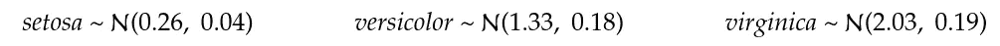

# 高斯混合模型和期望最大化(完整解释)

> 原文：<https://towardsdatascience.com/gaussian-mixture-models-and-expectation-maximization-a-full-explanation-50fa94111ddd?source=collection_archive---------4----------------------->

美国宇航局在 [Unsplash](https://unsplash.com?utm_source=medium&utm_medium=referral) 拍摄的照片

在[之前的文章](https://medium.com/analytics-vidhya/latent-probabilistic-modeling-part-1-a541722419af)中，我们描述了线性回归的贝叶斯框架，以及我们如何使用潜在变量来降低模型的复杂性。

在本帖中，我们将解释潜在变量是如何被用来构建分类问题的，即高斯混合模型(或简称 GMM)，它允许我们执行软概率聚类。

这个模型是由一个名为期望最大化(简称 EM)的优化过程训练出来的，我们将对此进行全面的回顾。在本文的最后，我们还将看到为什么我们不使用传统的优化方法。

> 这篇文章包含一些数学符号和推导。我们不想吓唬任何人。我们相信，一旦直觉被赋予，深入数学去真正理解事物是很重要的。
> 
> 这篇文章的灵感来自 Coursera 上的一门优秀课程:[机器学习的贝叶斯方法](https://www.coursera.org/learn/bayesian-methods-in-machine-learning/home/welcome)。如果你对机器学习感兴趣，我绝对推荐这门课程。

# 高斯混合模型

该模型是一种软概率聚类模型，它允许我们使用混合高斯密度来描述点对于一组聚类的成员关系。这是一种软分类(与硬分类相反),因为它分配属于特定类别的概率，而不是确定的选择。本质上，每个观察将属于每个类，但是具有不同的概率。

我们以著名的虹膜分类问题为例。所以我们有 150 朵鸢尾花，分成 3 类。对于它们中的每一个，我们都有萼片的长度和宽度，花瓣的长度和宽度，以及类别。

让我们使用 seaborn 包的 pair 图快速浏览一下数据:

作者图片

高斯混合模型试图将数据描述为来自高斯分布的混合物。首先，如果我们只取一个维度，比如花瓣宽度，试着去适应 3 种不同的高斯分布，我们会得到这样的结果:

作者图片

该算法发现，最有可能代表数据生成过程的混合物由以下三种正态分布组成:

setosa 花瓣宽度更加集中，平均值为 0.26，方差为 0.04。另外两个班级相对来说更分散，但是位置不同。现在让我们看看二维的结果，比如花瓣宽度和花瓣长度。

作者图片

混合物的成分如下:

请注意，GMM 是一个非常灵活的模型。可以证明，对于足够大数量的混合物，并且适当地选择所涉及的参数，可以近似任意地接近任何连续的 pdf(这需要额外的计算成本)。

## 形式化——MLE

那么算法如何找到描述混合物的最佳参数集呢？

我们从定义概率模型开始。观察到任何观察值的概率，即概率密度，是 K 个高斯分布的加权和(如前一节所示) :

每个点是 K 个加权高斯分布的混合，这些加权高斯分布由平均值和协方差矩阵参数化。所以总体来说，我们可以把观察到一个特定观测的概率描述为一个混合物。为了确保您完全理解，在上面使用花瓣宽度的一维示例中，在区域[0.2，0.3]中观察到花瓣宽度的概率最高。我们也很有可能在区域[1.2，1.5]和[1.8，2.2]中观察到花瓣宽度。

注意，在 3 个集群的情况下，参数集将是:

然后，我们希望找到最大化数据集可能性的参数值。我们想找到参数的最大似然估计。也就是我们要找到最大化所有数据点一起观测到的概率(即联合概率)的参数，解决以下优化问题:

注意，数据集的完全联合概率可以被矢量化(即分解为单个概率的乘积，使用π运算符)，仅在假设观察值是同分布([同独立分布](https://en.wikipedia.org/wiki/Independent_and_identically_distributed_random_variables))的情况下。当它们存在时，事件是独立的，观察一个数据点的概率不受其他概率的影响。

我们通常最大化对数似然，而不是似然，部分原因是它将概率的乘积转化为总和(更容易操作)。这是因为自然对数是单调递增的[凹函数](https://en.wikipedia.org/wiki/Concave_function)，不改变最大值的位置(导数为零的位置将保持不变)。

现在最大似然估计可以用许多不同的方法来完成。这可以通过直接优化(找到偏导数为零的点)或数值优化(如梯度下降)来实现。GMM 的 MLE 没有使用这些方法，原因如下，我将解释。但是我把它留在文章的最后，因为我想先了解最相关的材料。GMMs 的最大似然估计是使用期望最大化算法完成的。

# 期望最大化

## GMM 训练直觉

首先，我们将直观地描述 GMM 模型训练过程中发生的事情，因为这将真正有助于为 EM 建立必要的直觉。假设我们又回到了一维例子，但是这次没有标签。试着想象我们如何给下面的观察分配聚类标签:

作者图片

好吧，如果我们已经知道高斯分布在上面的图中的位置，对于每个观察值，我们可以计算聚类概率。让我们画这张图，这样你就能记住它了。因此，我们将为下面的点分配一种颜色:

作者图片

直观地，对于一个选定的观察值和一个选定的高斯值，属于该聚类的观察值的概率将是高斯值和所有高斯值之和之间的比率。类似于:

好吧，但是你怎么知道高斯人在上面的图中的位置呢？我们如何找到高斯参数)？好吧，假设我们已经拥有了观察的标签，就像这样:

作者图片

现在我们可以很容易地找到参数值并画出高斯图。单独考虑这些点就足够了，比如说红点，然后找到最大似然估计。对于高斯分布，可以证明以下结果:

将上述公式应用于红色点、蓝色点和黄色点，我们得到以下正态分布:

作者图片

给定正态分布参数，我们可以找到观察标签，给定观察标签，我们可以找到正态分布参数。所以看起来我们有一个先有鸡还是先有蛋的问题，对吗？

事实上，解决这个问题并不难。我们只是需要从某个地方开始。所以我们可以将高斯参数设置为随机值。然后，我们通过迭代两个连续步骤直到收敛来执行优化:

1.  我们使用当前的高斯参数为观察值分配标签
2.  我们更新高斯参数，使拟合更有可能

这将产生以下结果:

作者图片

如你所见，当我们到达第四步时，我们已经处于最佳状态。

## EM 直觉

期望值最大化算法的执行方式完全相同。事实上，我们上面描述的 GMMs **的优化过程是 EM 算法的一个具体实现。EM 算法只是被更一般和更正式地定义(因为它可以应用于许多其他优化问题)。**

因此，总的想法是，我们试图最大化一个似然性(更常见的是对数似然性)，也就是说，我们试图解决以下优化问题:

这一次我们不是说可能性 P(x _ I |θ)是高斯混合。它可以是任何东西。

现在，让我们把事情形象化！假设对数似然(log P(X |θ))是以下一维分布:

作者图片

使这种算法有效的主要技巧在于特定函数的定义和使用。该函数以这样的方式定义，即在参数空间中的任何给定点，我们肯定知道它将总是具有低于或等于对数似然的值。它被称为下界。我们称之为 L(下图红色部分):

作者图片

现在，事实上，我们不使用单个下界，而是使用由参数θ的向量和变分分布 q 参数化的一族下界。因此 L(θ，q)可以位于任何地方，只要它保持为似然性的下界:

作者图片

EM 算法从分配随机参数开始。假设我们从以下下限开始:

作者图片

该算法现在将执行两个连续的步骤:

1.  固定θ并调整 q，使下限尽可能接近对数似然。例如，在第一步中，我们计算 q1:

作者图片

2.固定 q 并调整θ，使下限最大化。例如，在第二步中，我们计算θ1:

作者图片

因此，总结一下这种直觉，EM 算法将寻找最大可能性(或至少是局部最大值)的困难分解为一系列更容易处理的连续步骤。为了做到这一点，它引入了一个由向量θ参数化的下界，我们希望找到它的最优解，以及一个我们也可以随意修改的变分下界 q。

## 詹森不等式

这个不等式在某种程度上只是凹函数定义的重新表述。回想一下，对于任何凹函数 f，任何权重α和任意两点 x 和 y:

事实上，这个定义可以推广到两点以上，只要权重总和为 1:

如果权重总和为 1，那么我们可以说它们代表一种概率分布，这给出了詹森不等式的定义:

凹函数对期望值的投影总是大于或等于凹函数的期望值。

## EM 形式化

期望值最大化算法用于利用潜在变量的模型。一般来说，我们定义一个潜在变量 t 来解释一个观察值 x。通过观察，有一个潜在变量的实例。所以我们可以画出下图:

作者图片

还因为 t 解释了观察值 x，所以它定义了观察值属于其中一个聚类的概率。所以我们可以写:

现在观察的完全可能性可以写成边际可能性(即通过排斥 t):

现在回想一下，我们正在尝试解决以下优化问题:

我们还介绍了詹森不等式，它可以写成:

我们想用这个不等式来帮助我们定义下界。我们希望这个下限取决于θ和一个变分分布 q，诀窍是这样引入 q:

通过乘以和除以 q，我们没有改变任何东西。现在我们可以利用詹森不等式:

我们成功地建立了一个依赖于θ和 q 的边际对数似然的下界。因此，我们现在可以通过交替执行以下两个步骤来最大化完整的下界:

***期待步骤:***

我们固定θ，并尝试使下限尽可能接近可能性，也就是说，我们尝试最小化:

通过进一步的额外步骤(我将在此拯救您)，我们可以证明:

因此，为了找到变分分布 q 的下一个值(k+1 ),我们需要独立地考虑每个观察值 x_i，并且对于每个类，我们计算该观察值属于类 p(t_i|x_i，θ)的概率。回想一下，根据贝叶斯法则:

现在我们可以把高斯混合模型联系起来。我们在上面的公式中发现了我们直观推导出的结果，即:

**最大化步骤:**

我们固定 q，并最大化下限，其定义为:

现在减法中的第二项不依赖于θ，所以我们可以写成:

现在我们通常选择一个容易优化的凹函数。在高斯混合模型的情况下，我们使用高斯分布的最大似然估计。

如果你想看完整的推导，让我们得到 m-step 中参数更新的封闭表达式，我把它们写在了一篇专门的文章中[(为了不使这篇文章超载)。](https://medium.com/@biarnes.adrien/em-of-gmm-appendix-m-step-full-derivations-4ae95cdd40c9)

> 如果你红了这一点，恭喜你！你现在应该很好地掌握了 GMM 和 EM。或者，如果您想了解为什么我们不使用传统方法来找到最佳参数集，请继续阅读。

那么，如果我们从零开始，在高斯混合模型的情况下，如何进行最大似然估计呢？

## 直接优化:第一种方法

找到最大似然估计的一种方法是将对数似然相对于参数的偏导数设置为 0，并求解方程。我们称这种方法为直接优化。

正如您所看到的，这种方法是不切实际的，因为高斯分量的总和出现在测井曲线中，使得所有参数都联系在一起。例如，如果 K=2，我们试图求解α_1 的方程，我们有:

我们用链式法则完成了第一步……但是我们不能用其他参数来表达参数α_1。所以我们被困住了！我们不能解析地解这个方程组。这意味着我们不能使用解析表达式一步找到全局最优，或者至少是局部最优。

## 数值优化:第二种方法

好吧，我们还能做什么？嗯，我们必须依靠数值优化方法。例如，我们可以尝试使用我们最喜欢的[随机梯度下降](https://en.wikipedia.org/wiki/Stochastic_gradient_descent)算法。它是如何工作的？

嗯，我们随机初始化参数θ的向量，并迭代数据集的观测值。在步骤 k，我们为一个选定的观察值计算似然的梯度。然后，我们通过在梯度的相反方向上采取一个步骤(使用特定的学习速率η)来更新参数值，即:

使用链式法则，我们可以计算其余参数的偏导数(就像我们上面对α_1 所做的那样)。例如，对于μ_1，我们将得到以下结果:

现在你要告诉我，参数仍然是相互依赖的。是的，但是我们不再解方程了。首先，我们用当前位置的值和当前的参数集来计算偏导数。这是一种迭代算法。

假设我们在计算θ。我们有θ⁰=(α_0，α_1，μ_0，μ_1，σ_ 0，σ_ 1)，我们有第一个选择的观察值 x_0。给定偏导数的公式，我们就有了计算θ所需的一切。并且我们继续进行连续的步骤，直到收敛(也就是说，当前的步骤变得太小)。

作者图片

例如，我通过模拟优化带有两个参数(x 和 y)的 [Beale 函数](https://en.wikipedia.org/wiki/Test_functions_for_optimization) B 来生成上面的动画。我们从一个随机点开始，大约在(-3.5，-3.5)，在每一步，我们将参数更新到最小值。

> 注意，在现实中，由 Tensorflow 或 PyTorch 等数值框架执行的损失函数的微分并不像我们上面所做的那样执行。我们不像在高中时那样使用一套硬编码的数学规则(也就是所谓的手动微分)。甚至可能没有方便的导数公式。使用[自动微分](https://en.wikipedia.org/wiki/Automatic_differentiation)完成。

好的，这个看起来不错！所以我们结束了？别这么快！我们忘记了一件重要的事情。我们必须满足两个约束来解决这个优化问题。我们正在约束条件下执行[优化。](https://en.wikipedia.org/wiki/Constrained_optimization#:~:text=In%20mathematical%20optimization%2C%20constrained%20optimization,of%20constraints%20on%20those%20variables.)

第一个是混合权重的和α必须是非负的，并且总和为 1。这允许观察数据点的概率是适当的概率密度函数；那就是:

为了克服这一限制，我们可以使用[拉格朗日乘数](https://en.wikipedia.org/wiki/Lagrange_multiplier)将其纳入优化问题；即把问题重新表述为:

λ作为附加参数添加到矢量θ中。然后，我们再次运行我们的随机优化程序，我们完成了！嗯，没那么快！真正的问题在于第二个约束。回想一下，多正态概率密度函数写为:

但是矩阵σ不能任意！它是一个协方差矩阵，因此应考虑某些属性:

*   对角项是方差，因此必须是正的
*   矩阵必须是对称的
*   对于两个不同的预测值，其协方差的平方必须小于其方差的乘积
*   矩阵必须是可逆的
*   行列式必须是正数

当矩阵是[半正定的](https://en.wikipedia.org/wiki/Definite_symmetric_matrix)时，这些条件被满足。

这是一个非常难以满足的约束，并且仍然是一个活跃的研究领域。事实上，凸优化有一个专门的子领域，叫做[半定规划](https://en.wikipedia.org/wiki/Semidefinite_programming)。它真正成为一门学科是从 90 年代开始的，用的方法有[内点](https://en.wikipedia.org/wiki/Interior-point_method)或[增广拉格朗日](https://en.wikipedia.org/wiki/Augmented_Lagrangian_method)。但是[混合模型](https://en.wikipedia.org/wiki/Mixture_model)在此之前已经出现，并导致了期望最大化算法。

> 如果您不理解以上所有内容(尤其是关于拉格朗日公式的部分)，请不要担心。你需要明白的是，传统的求参数最大似然估计的方法不适用于高斯混合模型。

# 结论

在这篇文章中，我们已经对高斯混合模型和期望最大化进行了全面的回顾，从视觉上(给出一些见解)和更正式地给出了完整的数学推导。

这篇文章在数学上相当沉重，但我认为如果你设法花时间，它真的是值得的。对这种模型有更深入的了解会让你理解遍布机器学习和统计领域的许多不同技术。而下一次你试图去理解另一款同口径的车型，就简单多了。我向你保证！

在此期间，照顾好你自己和你所爱的人！