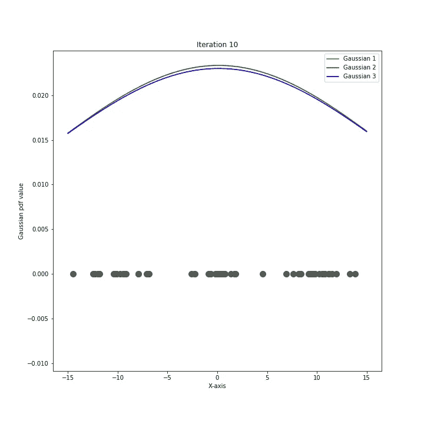

# 高斯混合模型(GMM)

> 原文：<https://towardsdatascience.com/gaussian-mixture-models-gmm-6e95cbc38e6e?source=collection_archive---------11----------------------->

## 理解 GMM:思想、数学、EM 算法和 python 实现

来源:[弗兰克诉](https://unsplash.com/@franckinjapan)通过 [Unsplash](https://unsplash.com/photos/JjGXjESMxOY)

B ***rief* :高斯混合模型是一种流行的无监督学习算法。GMM 方法类似于 K-Means 聚类算法，但是更健壮，因此由于其复杂性而更有用。在这篇文章中，我将给出一个鸟瞰图，数学( *ba* ye *s* ic maths，nothing ab *normal* )，python 从头实现以及使用 sklearn 库。**

# 介绍

查看我关于 K-means 聚类的博客是一个好主意(3 分钟阅读)，以获得聚类、无监督学习和 K-Means 技术的基本概念。在聚类中，给定一个未标记的数据集 ***X*** ，我们希望将样本分组到 ***K*** 个聚类中。在 GMMs 中，假设**的不同子群体( ***K*** 共)遵循一个[正态分布](https://en.wikipedia.org/wiki/Normal_distribution)，虽然我们只有总体 ***X(*** 因此得名高斯混合模型)的概率分布信息。我们的任务是能够找到 ***K*** *高斯的*的参数以便将数据*X[*进行探索性的数据分析*](https://en.wikipedia.org/wiki/Exploratory_data_analysis)**或者对新的数据做出预测。*****

# *****对 K-均值聚类的改进*****

*****K-means 使用欧几里德距离函数来发现数据中的聚类。只要数据相对于质心遵循圆形分布，这种方法就能很好地工作。但是如果数据是非线性的，椭圆形的呢？还是数据有非零协方差？如果聚类有不同的均值和协方差呢？*****

*****这就是高斯混合模型拯救世界的地方！*****

> *****GMM 假设产生数据的是高斯分布的混合物。它使用数据点到聚类的软分配(即，概率性的，因此更好),与数据点到聚类的硬分配的 K-means 方法形成对比，假设数据围绕质心呈圆形分布。*****

*****简而言之，GMM 捕获工作得更好，因为 **(A)** 它通过使用软分配来捕获属于不同聚类的数据点的不确定性，并且 **(B)** 它对圆形聚类没有偏见。因此，即使对于非线性数据分布，它也能很好地工作。*****

# *****戈-梅-莫三氏:男性假两性畸形综合征*****

******GMM* 的目标函数是最大化数据 X、 ***p(X)*** 的*似然值或对数似然值 ***L*** (因为 log 是单调递增函数)。通过假设混合了 ***K*** 高斯分布来生成数据，我们可以将***【p(X)***写成边缘化概率，对所有数据点的所有 ***K*** 聚类求和。******

********************

*****似然值*****

**********

*****对数似然值*****

*****利用上面对数函数内的求和，我们无法获得解析解。虽然看起来很龌龊，但这个问题有一个优雅的解决方案: [***期望最大化(em)算法***](https://en.wikipedia.org/wiki/Expectation–maximization_algorithm) 。*****

# *****数学*****

********EM 算法*** 是一种*迭代*算法，用于寻找*模型的最大似然估计(MLE)* ，其中参数无法直接找到，就像我们这里的情况。它包括两个步骤:e *预期*步骤和*最大化*步骤。*****

1.  ********期望步骤*** :计算隶属值 *r* _ *ic。*这是数据点 *x_i* 属于聚类 *c* 的概率。*****

**********

*****2. ***最大化步骤*** :计算一个新的参数 *mc* ，该参数决定了属于不同聚类的点的分数。通过计算每个聚类 c 的 [MLE 的](https://stats.stackexchange.com/questions/351549/maximum-likelihood-estimators-multivariate-gaussian)来更新参数μ、π、σ*****

**********

*****重复 E-M 步骤，直到对数似然值 *L* 收敛。*****

# *****密码*****

*****让我们从头开始用 python 写一个 GMM 的基本实现。*****

*****生成一维数据。*****

*****初始化 GMM 的参数:μ，π，σ。*****

*****运行 EM 算法的第一次迭代。*****

*****EM 算法的单次迭代*****

**********

*****将这段代码放在 for 循环中，并将其放入一个 class 对象中。现在我们正在谈话！*****

*****GMM-1D 级*****

********************

*****我们已经有了一个模型，可以运行一维数据。同样的原理也适用于更高维度(≥ 2D)。唯一不同的是，我们将在这种情况下使用多元高斯分布。让我们为 2D 模型编写代码。*****

*****让我们生成一些数据并编写我们的模型。*****

**********

*****2D 斑点*****

*****让我们对这个模型做一些预测。*****

************************************************************

*****使用 [***sklearn***](https://scikit-learn.org/stable/tutorial/index.html) ，同样的任务可以在几行代码内完成。很圆滑，是吧？*****

**********

*****因此，GMM 将样本分类为属于第二类。有用！*****

# *****结论*****

*****实现高斯混合模型并不困难。一旦你对数学有了清晰的认识，就可以找到模型的最大似然估计，无论是 1D 还是更高维的数据。这种方法在执行聚类任务时是健壮且有用的。既然您已经熟悉了 GMMs 的 python 实现，那么您就可以使用数据集执行一些很酷的事情了。假设给你一个病人的数据集，包含两个参数:红细胞体积和红细胞血红蛋白浓度，没有病人和健康病人的标签。插入上面的模型来聚集数据将会给你两个不同的(*几乎是*)质量，你可以使用它们来进行进一步的分析和预测。*****

# *****来源*****

1.  *****[https://www.youtube.com/watch?v=qMTuMa86NzU](https://www.youtube.com/watch?v=qMTuMa86NzU)*****
2.  *****[https://www . python-course . eu/expectation _ maximization _ and _ Gaussian _ mixture _ models . PHP](https://www.python-course.eu/expectation_maximization_and_gaussian_mixture_models.php)*****