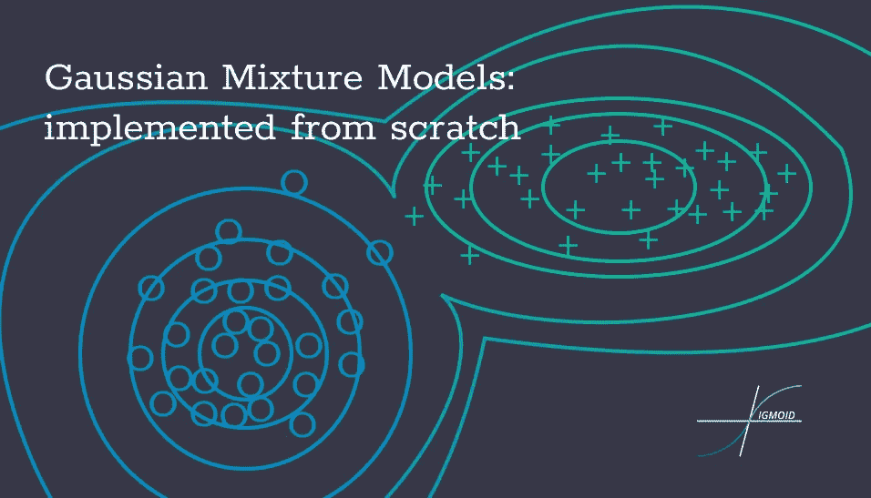
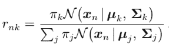
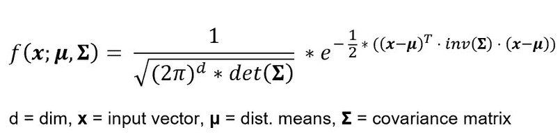
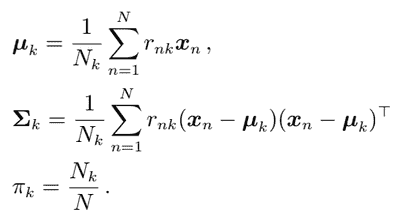
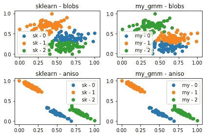

# 高斯混合模型:从零开始实现

> 原文：<https://towardsdatascience.com/gaussian-mixture-models-implemented-from-scratch-1857e40ea566?source=collection_archive---------12----------------------->



从机器学习和人工智能领域的兴起，概率论是一个强大的工具，它允许我们处理许多应用中的不确定性，从分类到预测任务。今天，我想和你们讨论更多关于概率和高斯分布在聚类问题中的应用，以及 GMM 模型的实现。所以让我们开始吧

## 什么是 GMM？

GMM(或高斯混合模型)是一种算法，它使用对数据集密度的估计来将数据集分成初步定义数量的聚类。为了更好地理解，我将同时解释这个理论，并展示实现它的代码。

对于这个实现，我将使用 [EM(期望最大化)](https://en.wikipedia.org/wiki/Expectation%E2%80%93maximization_algorithm)算法。

## 理论和代码是最好的结合。

首先让我们导入所有需要的库:

```
import numpy as np
import pandas as pd
```

我强烈建议在自己实现模型时遵循 sci-kit learn library 的标准。这就是为什么我们将 GMM 作为一个类来实现。让我们也来看看 __init_function。

```
class GMM:
    def __init__(self, n_components, max_iter = 100, comp_names=None):
        self.n_componets = n_components
        self.max_iter = max_iter
        if comp_names == None:
            self.comp_names = [f"comp{index}" for index in range(self.n_componets)]
        else:
            self.comp_names = comp_names
        # pi list contains the fraction of the dataset for every cluster
        self.pi = [1/self.n_componets for comp in range(self.n_componets)]
```

简而言之， **n_components** 是我们想要拆分数据的集群数量。 **max_iter** 表示算法进行的迭代次数，comp_names 是具有 n_components 个元素的字符串列表，这些元素被解释为聚类的名称。

## 拟合函数。

因此，在我们使用 EM 算法之前，我们必须分割我们的数据集。之后，我们必须启动 2 个列表。一个包含每个子集的平均向量(向量的每个元素都是列的平均值)的列表。第二个列表包含每个子集的协方差矩阵。

```
def fit(self, X):
        # Spliting the data in n_componets sub-sets
        new_X = np.array_split(X, self.n_componets)
        # Initial computation of the mean-vector and covarience matrix
        self.mean_vector = [np.mean(x, axis=0) for x in new_X]
        self.covariance_matrixes = [np.cov(x.T) for x in new_X]
        # Deleting the new_X matrix because we will not need it anymore
        del new_X
```

现在我们可以讨论 EM 算法了。

## EM 算法。

顾名思义，EM 算法分为两步——E 和 m。

## 电子步骤:

在估计步骤中，我们计算 r 矩阵。它是使用下面的公式计算的。



计算 r(责任)矩阵的公式(来源——mathematis for Machine Learning Book)

*r 矩阵*也被称为**‘职责’**，可以用以下方式解释。行是来自数据集的样本，而列代表每个聚类，该矩阵的元素解释如下:rnk 是样本 n 成为聚类 k 的一部分的概率。当算法收敛时，我们将使用该矩阵来预测点聚类。

同样，我们计算 N 个列表，其中每个元素基本上是 r 矩阵中对应列的和。下面的代码就是这样做的。

```
for iteration in range(self.max_iter):
    ''' ----------------   E - STEP   ------------------ '''
    # Initiating the r matrix, evrey row contains the probabilities
    # for every cluster for this row
    self.r = np.zeros((len(X), self.n_componets))
    # Calculating the r matrix
    for n in range(len(X)):
        for k in range(self.n_componets):
            self.r[n][k] = self.pi[k] * self.multivariate_normal(X[n], self.mean_vector[k], self.covariance_matrixes[k])
            self.r[n][k] /= sum([self.pi[j]*self.multivariate_normal(X[n], self.mean_vector[j], self.covariance_matrixes[j]) for j in range(self.n_componets)])
    # Calculating the N
    N = np.sum(self.r, axis=0)
```

指出多元正态只是应用于向量的正态分布公式，它用于计算向量在正态分布中的概率。



下面的代码实现了它，采用行向量、均值向量和协方差矩阵。

```
def multivariate_normal(self, X, mean_vector, covariance_matrix):
    return (2*np.pi)**(-len(X)/2)*np.linalg.det(covariance_matrix)**(-1/2)*np.exp(-np.dot(np.dot((X-mean_vector).T, np.linalg.inv(covariance_matrix)), (X-mean_vector))/2)
```

看起来有点乱，但是你可以在那里找到完整的代码。

## m 步:

在最大化步骤中，我们将逐步设置均值向量和协方差矩阵的值，用它们来描述聚类。为此，我们将使用以下公式。



M-step 的公式(来源-mathematis for Machine Learning Book)

在代码中，我希望:

```
''' ---------------   M - STEP   --------------- '''
# Initializing the mean vector as a zero vector
self.mean_vector = np.zeros((self.n_componets, len(X[0])))
# Updating the mean vector
for k in range(self.n_componets):
    for n in range(len(X)):
        self.mean_vector[k] += self.r[n][k] * X[n]
        self.mean_vector = [1/N[k]*self.mean_vector[k] for k in range(self.n_componets)]
# Initiating the list of the covariance matrixes
self.covariance_matrixes = [np.zeros((len(X[0]), len(X[0]))) for k in range(self.n_componets)]
# Updating the covariance matrices
for k in range(self.n_componets):
    self.covariance_matrixes[k] = np.cov(X.T, aweights=(self.r[:, k]), ddof=0)
self.covariance_matrixes = [1/N[k]*self.covariance_matrixes[k] for k in range(self.n_componets)]
# Updating the pi list
self.pi = [N[k]/len(X) for k in range(self.n_componets)]
```

我们已经完成了拟合函数。创造性地应用 EM 算法将使 GMM 最终收敛。

## 预测函数。

预测函数实际上非常简单，我们只需使用多元正态函数，该函数使用每个聚类的最佳均值向量和协方差矩阵，以找出哪个给出最大值。

```
def predict(self, X):
        probas = []
        for n in range(len(X)):
            probas.append([self.multivariate_normal(X[n], self.mean_vector[k], self.covariance_matrixes[k])
                           for k in range(self.n_componets)])
        cluster = []
        for proba in probas:
            cluster.append(self.comp_names[proba.index(max(proba))])
        return cluster
```

## **结果。**

为了测试该模型，我选择将其与 sci-kit 库中实现的 GMM 进行比较。我使用 sci-kit 学习数据集生成函数生成了 2 个数据集——使用不同的设置生成 _ blobs。这就是结果。



我们的模型与 sci-kit learn 模型的比较。

我们的模型和 sci-kit 模型的聚类几乎相同。很好的结果。完整的代码你可以在[那里找到](https://github.com/ScienceKot/mysklearn/tree/master/Gaussian%20Mixture%20Models)。


来源——tenor.com

这篇文章是西格蒙德和❤一起写的。

有用的链接:

*   [https://github . com/science kot/mysklearn/tree/master/Gaussian % 20 mixture % 20 models](https://github.com/ScienceKot/mysklearn/tree/master/Gaussian%20Mixture%20Models?fbclid=IwAR0oexiLBSatnB9ukeo_gLL6dR_Dd2T_uO7K7VHmCkavcRfrXKbyhyBIJbc)
*   [https://en . Wikipedia . org/wiki/Expectation % E2 % 80% 93 最大化 _ 算法](https://en.wikipedia.org/wiki/Expectation%E2%80%93maximization_algorithm)
*   用于机器学习的数学由 Cheng Soon Ong、Marc Peter Deisenroth 和 A. Aldo Faisal 编写