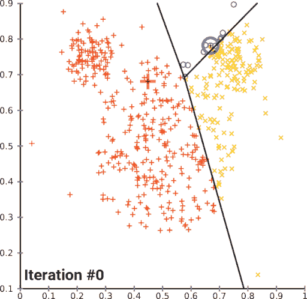
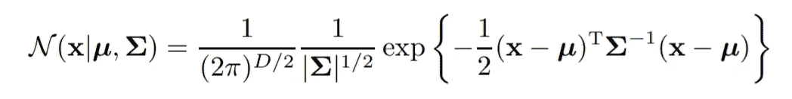
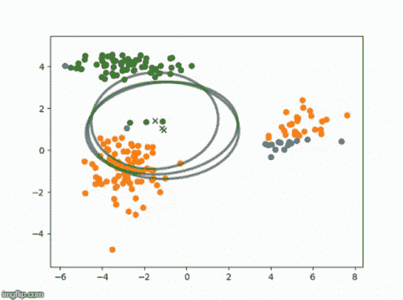
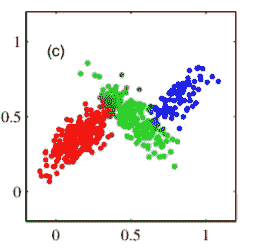
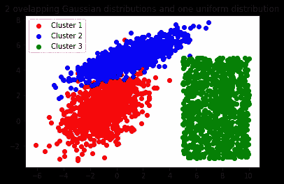
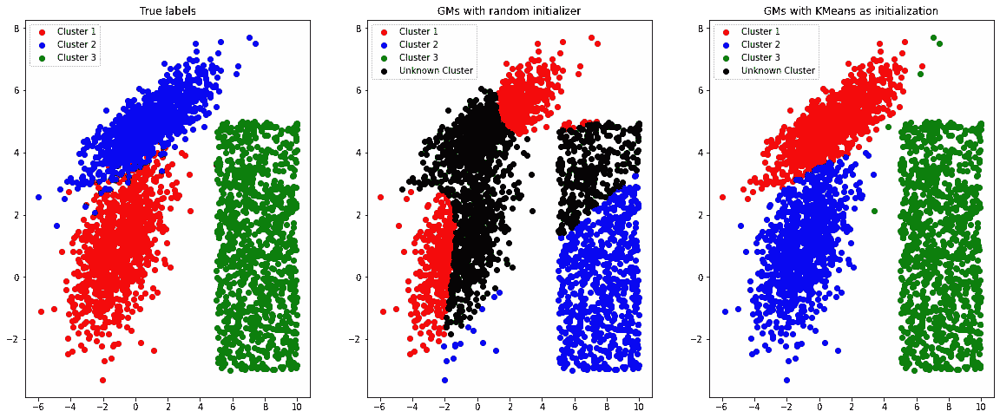
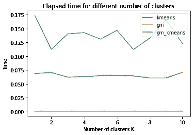

# 高斯混合模型与 K-均值。选哪个？

> 原文：<https://towardsdatascience.com/gaussian-mixture-models-vs-k-means-which-one-to-choose-62f2736025f0?source=collection_archive---------1----------------------->

## 两种流行聚类算法的性能比较

G.混合物对 k .平均(1957)。帆布油画。顺便说一句，没有明显的赢家。伯明翰博物馆信托基金会在 [Unsplash](https://unsplash.com?utm_source=medium&utm_medium=referral) 上拍摄的照片

K -Means 和高斯混合(GMs)都是聚类模型。然而，许多数据科学家倾向于选择更流行 K-Means 算法。即使 GMs 可以证明在某些聚类问题上是优越的。

在本文中，我们将看到这两种模型在速度和健壮性方面提供了不同的性能。我们还将看到，使用 K-Means 作为 GMs 的初始化器是可能的，这有助于提高聚类模型的性能。

# 它们是如何工作的

首先，让我们回顾一下这些算法的理论部分。这将有助于我们在文章的后面理解他们的行为。

## k 均值

K-Means 是一种流行的非概率聚类算法。该算法的目标是最小化失真度量*J*。我们通过以下迭代程序实现这一点【1】:

1.  选择集群的数量 *K*
2.  初始化定义每个聚类中心点的向量 **μ_k**
3.  将每个数据点 **x** 分配到最近的聚类中心
4.  为**和**每个集群重新计算中心点 **μ_k**
5.  重复 3–4，直到中心点停止移动

下面的 GIF 很好地说明了这个迭代过程:

K=3 时的 K 均值。重新计算每个聚类的数据点标签和平均值，直到收敛。[【来源】](https://commons.wikimedia.org/wiki/File:K-means_convergence.gif)

K-Means 算法将收敛，但它可能不是全局最小值。为了避免收敛到局部最小值的情况，K-Means 应该用不同的参数重新运行几次。

K-Means 执行硬分配，这意味着每个数据点必须属于某个类，并且没有分配给每个数据点的概率。

K 均值的计算成本是 O(KN)，其中 K 是聚类的数量，N 是数据点的数量。

## 高斯混合

高斯混合基于 *K* 个独立的高斯分布，用于建模 *K* 个独立的聚类。提醒一下，多元高斯分布如下所示:

多元高斯分布。 **μ** 是 D 维均值向量， **∑** 是 DxD 协方差矩阵。修改自[1]

高斯混合的推导是相当复杂的，所以为了更深入的数学解释，我建议看看这篇文章。

关于 GMs 要知道的最重要的事情是，这个模型的收敛是基于 EM(期望最大化)算法的。它有点类似于 K-Means，可以总结如下[1]:

1.  初始化 **μ，∑，**和混合系数 **π** 并评估对数似然 L 的初始值
2.  使用当前参数评估责任函数
3.  使用新获得的职责获得新的 **μ、∑、**和 **π**
4.  再次计算对数似然 L。重复步骤 2–3，直到收敛。

高斯混合也将收敛到局部最小值。

通过下面的 GIF，我们可以很容易地看到高斯混合的收敛情况:

高斯混合的收敛性。[【来源】](https://tenor.com/view/gaussian-mixture-models-emmethod-math-gauss-computer-science-nerd-gif-15288262)

K-均值和高斯混合的第一个明显区别是决策边界的形状。GMs 更加灵活，使用协方差矩阵 **∑** 我们可以使边界*为椭圆形，*与使用 K-means *的*圆形*边界相反。*

还有一点就是 GMs 是一个概率算法。通过将概率分配给数据点，我们可以表达我们对给定数据点属于特定聚类的信念有多强。

使用每个数据点属于某个簇的概率的簇的软分配。图片作者[1]

如果我们比较这两种算法，高斯混合似乎更稳健。然而，GMs 通常比 K-Means 慢，因为它需要 EM 算法的更多迭代来达到收敛。它们也可以快速收敛到局部最小值，这不是一个非常理想的解决方案。

在本文的剩余部分，我们将使用 Scikit-learn 库来研究这些模型在实践中的表现。

# 比较性能

[*谷歌 Colab 笔记本这部分可以在这里找到*](https://github.com/KacperKubara/ml-cookbook/tree/master/kmeans_and_gms)

我们将从为此任务创建一个合成数据集开始。为了使它更具挑战性，我们将创建 2 个重叠的高斯分布，并在边上添加一个均匀分布。

生成的数据集如下所示:

## 聚类形状

让我们动手用 K-Means 和高斯混合进行初始聚类。我们将使用从 Scikit-Learn 导入的模型。此外，我们将以相同的方式为两种模型设置参数。两个模型的最大迭代次数、聚类数和收敛容差设置相同。

从聚类数据的第一眼看，我们可以看出它们的表现并不太好。虽然 K-Means 以与真实聚类相似的方式对数据进行聚类，但是 GM 聚类看起来相当不可靠。

## k 均值+高斯混合= ❤️

GMs 的问题是它们很快收敛到局部最小值，这对这个数据集来说不是很理想。为了避免这个问题， *GMs 通常用 K-Means* 初始化。这通常工作得很好，它改善了用 K-Means 生成的聚类。我们可以通过改变 GaussianMixture 类中的一个参数来创建带有 K-Means 初始化器的 GM:

我们还可以利用 GMs 的概率特性。通过添加阈值，在本例中为 0.33，我们能够标记模型不确定的带标签的数据点。这里变得非常有趣，因为对于普通 GM 来说，大多数数据点的概率都很低，如下图所示。

此外，具有 K 均值初始化器的 GMs 似乎表现最好，并且聚类几乎与原始数据相同。

## 计算时间

现在让我们看看这些算法的计算时间。结果相当令人惊讶。计算时间是用不同数量的聚类和上述所有 3 个模型来测量的。

结果是:

很奇怪，普通的 K-Means 比带有 K-Means 初始化器的 GM 要慢。在幕后，Scikit-Learn 似乎应用了 K-Means 的优化版本，它需要更少的迭代来收敛。

此外，香草转基因需要很短的时间。这是因为它很快就找到了一个局部最小值，而这个最小值甚至还没有接近全局最小值。

# 那么我应该选择哪种算法呢？

如果你寻找鲁棒性，带有 K-Means 初始化器的 GM 似乎是最好的选择。如果你用不同的参数进行实验，K-Means 理论上应该更快，但是从上面的计算图中我们可以看出，带有 K-Means 初始化器的 GM 是最快的。GM 本身并没有太大的用处，因为它对于这个数据集收敛得太快而不是最优解。

*感谢您的阅读，希望您喜欢这篇文章！*

# 关于我

我是阿姆斯特丹大学的人工智能硕士学生。在我的业余时间，你可以发现我摆弄数据或者调试我的深度学习模型(我发誓这很有效！).我也喜欢徒步旅行:)

如果你想了解我的最新文章和其他有用的内容，以下是我的其他社交媒体资料:

*   [领英](https://www.linkedin.com/in/kacperkubara/)
*   [GitHub](https://github.com/KacperKubara)

# 参考

[1] [模式识别与机器学习(信息科学与统计)](https://www.goodreads.com/book/show/55881.Pattern_Recognition_and_Machine_Learning)