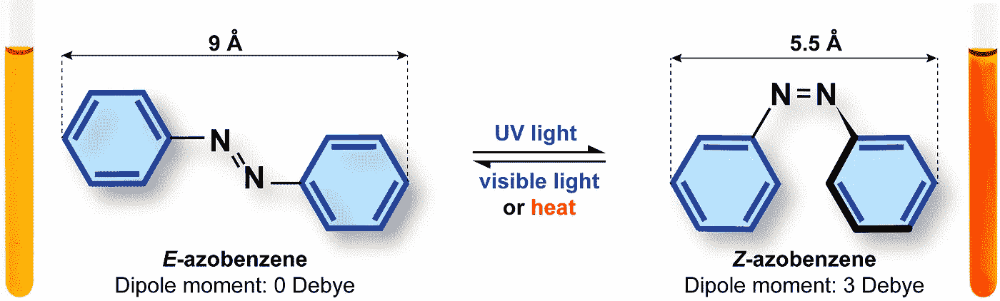
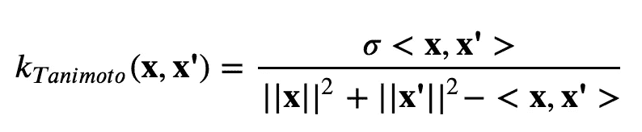
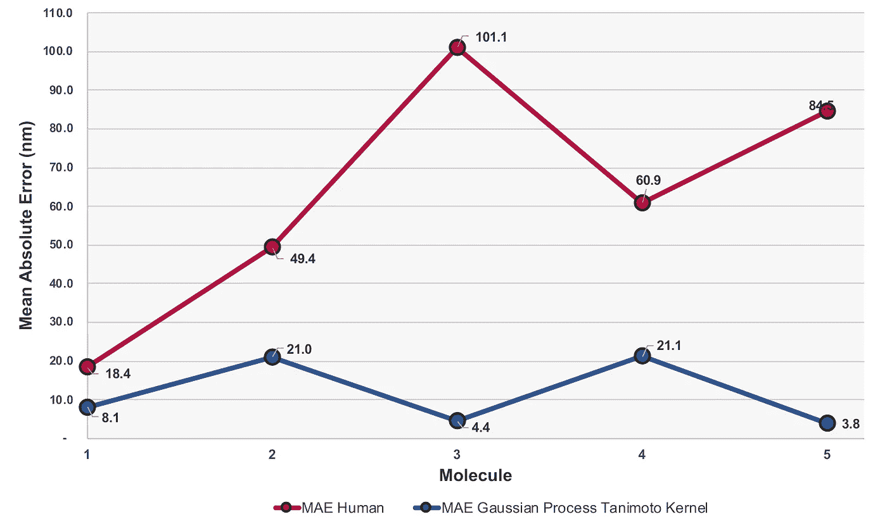
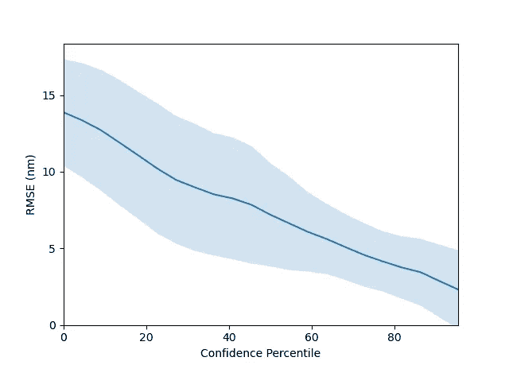
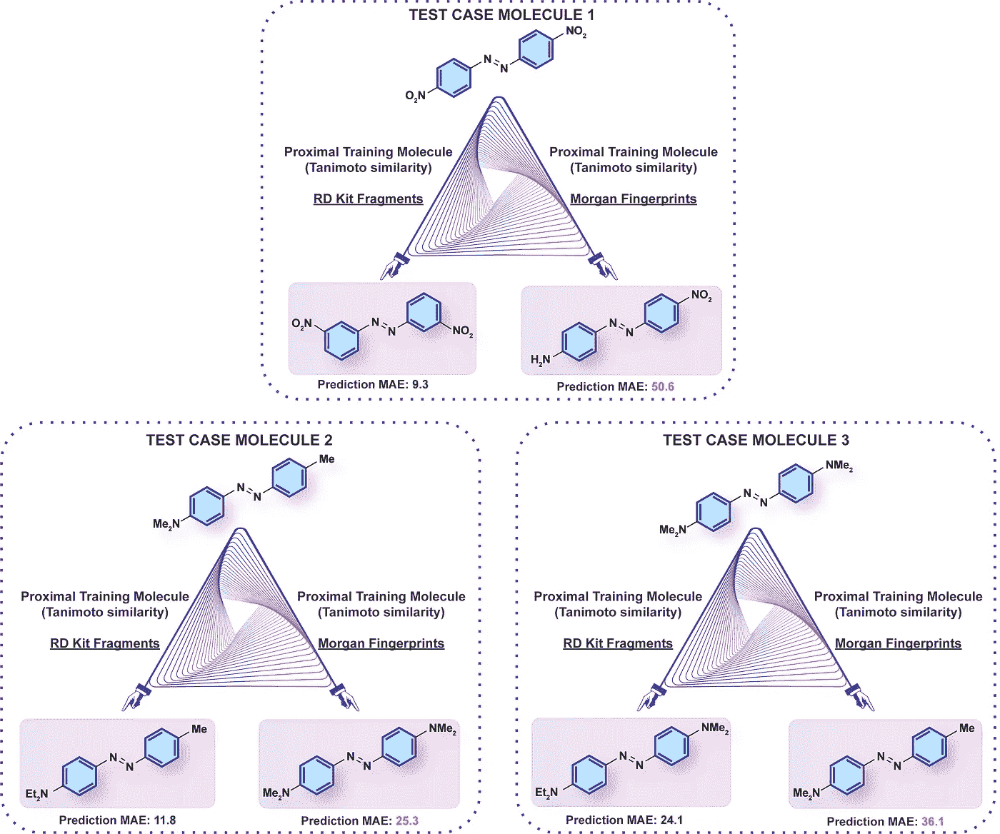

# GPflow 中分子的高斯过程回归

> 原文：<https://towardsdatascience.com/gaussian-process-regression-on-molecules-in-gpflow-ee6fedab2130?source=collection_archive---------25----------------------->

这篇文章演示了如何通过创建自定义的 Tanimoto 内核来操作摩根指纹，使用 [GPflow 库](https://gpflow.readthedocs.io/en/master/)训练高斯过程(GP)来预测分子属性。请访问我的 [GitHub 回购](https://github.com/Ryan-Rhys/The-Photoswitch-Dataset/blob/master/examples/gp_regression_on_molecules.ipynb)Jupyter 笔记本！

在这个例子中，我们将尝试预测实验确定的分子光开关的电子跃迁波长，这类分子在光照射下会发生 E 和 Z 异构体之间的可逆转变。



图片来自[光电开关数据集](https://chemrxiv.org/articles/preprint/The_Photoswitch_Dataset_A_Molecular_Machine_Learning_Benchmark_for_the_Advancement_of_Synthetic_Chemistry/12609899)论文

要事第一，依赖！

```
conda create -n photoswitch python=3.7

conda install -c conda-forge rdkit

conda install scikit-learn pandas

pip install git+https://github.com/GPflow/GPflow.git@develop#egg=gpflow
```

我们将从导入我们将要使用的所有机器学习和化学库开始。

对于我们的分子表示，我们将使用广泛使用的摩根指纹。在这种表示下，分子被表示为位向量。因此，标准高斯过程核，如平方指数核或 Matern 核，在设计时会考虑到连续空间，因此不太理想。然而，我们可以定义一个自定义的“Tanimoto”或“Jaccard”内核，作为我们的位向量之间的相似性度量。



在代码方面，在 GPflow 中定义一个定制的 [Tanimoto 内核相对简单](https://gpflow.readthedocs.io/en/master/notebooks/tailor/kernel_design.html.)

下面的定义与上面给出的等式略有不同，因为我们计算的是矩阵输入的 Tanimoto 相似性。

接下来，我们读入光开关分子，用微笑串表示。我们预测的性质是每个分子的 E 异构体的电子跃迁波长。一般来说，对于任何数据集，GP 只需要一个分子微笑列表和一个属性值数组。

我们使用键半径 3 将我们的分子转换成 2048 位摩根指纹。我们用 X 表示分子，用 y 表示属性值。我想这可能会更容易跟踪输入和输出是什么！

我们定义一个效用函数来标准化我们的输出值。在安装全科医生之前，这是典型的良好做法。请注意，虽然代码也支持输入的标准化，但我们稍后将选择不使用它。原因是标准化一个位向量，而不是一个实值向量，似乎没有太大的意义(至少对我来说！).

我们定义了 80/20 的训练/测试分割。

接下来我们安装 GP。我们可以检查学习到的核超参数，尽管在位向量的情况下这些参数可能不那么有用！

现在我们可以输出训练并测试均方根误差(RMSE)、平均绝对误差(MAE)和 R 值。

```
Train RMSE (Standardised): 0.036
Train RMSE: 2.422 nm

Test R^2: 0.916
Test RMSE: 17.997 nm
Test MAE: 11.333 nm
```

还不错！在我们的[论文](https://chemrxiv.org/articles/preprint/The_Photoswitch_Dataset_A_Molecular_Machine_Learning_Benchmark_for_the_Advancement_of_Synthetic_Chemistry/12609899)中，我们将 GP-Tanimoto 模型的预测与一群人类光开关化学家的预测进行了比较，在组成测试集的所有 5 种分子的情况下，这些预测实现了更低的测试误差:



MAEs 是在所有人类参与者的每个分子的基础上计算的。图片来自[光电开关数据集](https://chemrxiv.org/articles/preprint/The_Photoswitch_Dataset_A_Molecular_Machine_Learning_Benchmark_for_the_Advancement_of_Synthetic_Chemistry/12609899)论文

GPs 的一个定义特征是它们能够产生校准的不确定性估计。在分子发现活动中，这些不确定性估计有助于捕捉模型的可信度；如果测试分子与训练中看到的分子非常不同，模型可以告诉你这是猜测！

用程序术语来说，可以通过检查变量 y_var 来访问测试集的不确定性。人们可以通过例如以下方式获得预测的排序置信度列表

其输出一个列表，在该列表中分子(由它们的测试集索引表示)通过它们的预测置信度被排序。下面的[脚本](https://github.com/Ryan-Rhys/The-Photoswitch-Dataset/blob/master/property_prediction/predict_with_GPR.py)提供了进一步的细节

从图形上看，可以生成置信-误差曲线，以检查 GP 获得的不确定性实际上与测试集误差相关。



图片来自[光开关数据集](https://chemrxiv.org/articles/preprint/The_Photoswitch_Dataset_A_Molecular_Machine_Learning_Benchmark_for_the_Advancement_of_Synthetic_Chemistry/12609899)论文。

在 x 轴上方的图中，置信百分点可以简单地通过根据该测试输入位置处的预测方差对测试集的每个模型预测进行排序来获得。例如，位于第 80 个置信百分位数的分子将是具有最低模型不确定性的 20%测试组分子。然后，我们测量 200 个随机训练/测试分割的每个置信百分点的预测误差，以查看模型的置信与预测误差是否相关。我们观察到 GP-Tanimoto 模型的不确定性估计与预测误差正相关。

从该图中得到的实际收获是一个概念证明，即模型不确定性可以被结合到选择在实验室中物理合成哪些光开关分子的决策过程中；如果一个“未合成”分子的预测波长值是所期望的，并且这个预测的可信度很高，那么你可能想要实现它！

GPs 的另一个好处是:通过检查学习到的内核，有可能解释不同分子表示捕获的化学。更多详情请见我们的[论文](https://chemrxiv.org/articles/preprint/The_Photoswitch_Dataset_A_Molecular_Machine_Learning_Benchmark_for_the_Advancement_of_Synthetic_Chemistry/12609899)！



图片来自[光电开关数据集](https://chemrxiv.org/articles/preprint/The_Photoswitch_Dataset_A_Molecular_Machine_Learning_Benchmark_for_the_Advancement_of_Synthetic_Chemistry/12609899)论文。

图归功于艺术上不知疲倦的[雷蒙德·塔瓦尼](https://twitter.com/RaymondThawani)。请在 [Twitter](https://twitter.com/Ryan__Rhys) 上寻求评论/反馈/讨论！如果你觉得这篇文章中的数据或实现有用，请考虑引用以下文章:

GPflow 中的 Photoswitch 数据集和 Tanimoto GP 实现:

```
@article{Thawani2020,
author = "Aditya Thawani and Ryan-Rhys Griffiths and Arian Jamasb and Anthony Bourached and Penelope Jones and William McCorkindale and Alexander Aldrick and Alpha Lee",
title = "{The Photoswitch Dataset: A Molecular Machine Learning Benchmark for the Advancement of Synthetic Chemistry}",
year = "2020",
month = "7",
url = "https://chemrxiv.org/articles/preprint/The_Photoswitch_Dataset_A_Molecular_Machine_Learning_Benchmark_for_the_Advancement_of_Synthetic_Chemistry/12609899",
doi = "10.26434/chemrxiv.12609899.v1"
}
```

GPflow:

```
@article{GPflow2017,
  author = {Matthews, Alexander G. de G. and {van der Wilk}, Mark and Nickson, Tom and
	Fujii, Keisuke. and {Boukouvalas}, Alexis and {Le{\'o}n-Villagr{\'a}}, Pablo and
	Ghahramani, Zoubin and Hensman, James},
    title = "{{GP}flow: A {G}aussian process library using {T}ensor{F}low}",
  journal = {Journal of Machine Learning Research},
  year    = {2017},
  month = {apr},
  volume  = {18},
  number  = {40},
  pages   = {1-6},
  url     = {http://jmlr.org/papers/v18/16-537.html}
}
```

谷本内核的创始人

```
@article{ralaivola2005graph,
  title={Graph kernels for chemical informatics},
  author={Ralaivola, Liva and Swamidass, Sanjay J and Saigo, Hiroto and Baldi, Pierre},
  journal={Neural networks},
  volume={18},
  number={8},
  pages={1093--1110},
  year={2005},
  publisher={Elsevier}
}
```

此处的所有图像受 CC BY-NC 许可的版权保护。