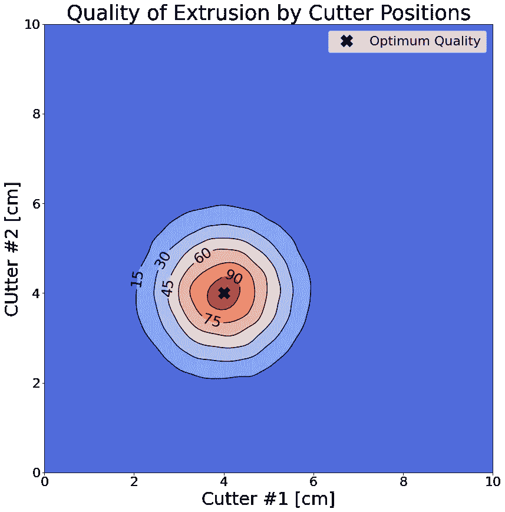
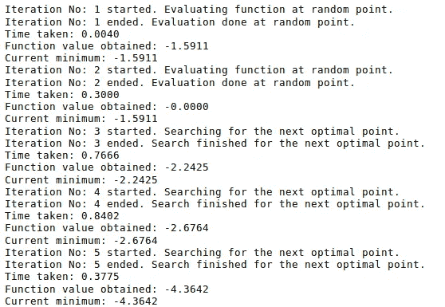
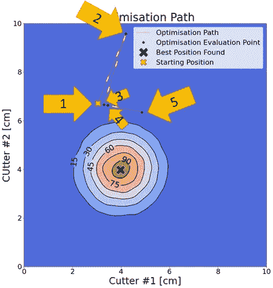
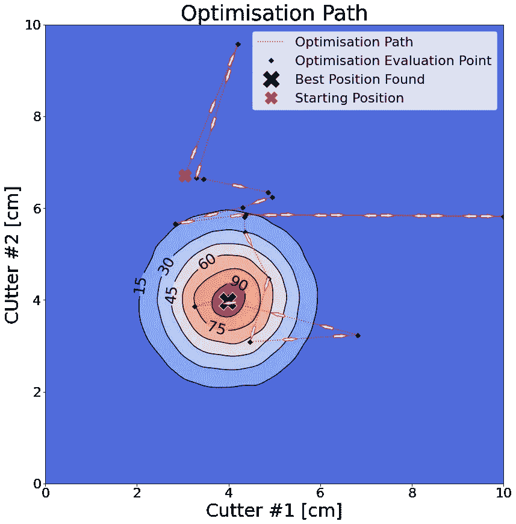
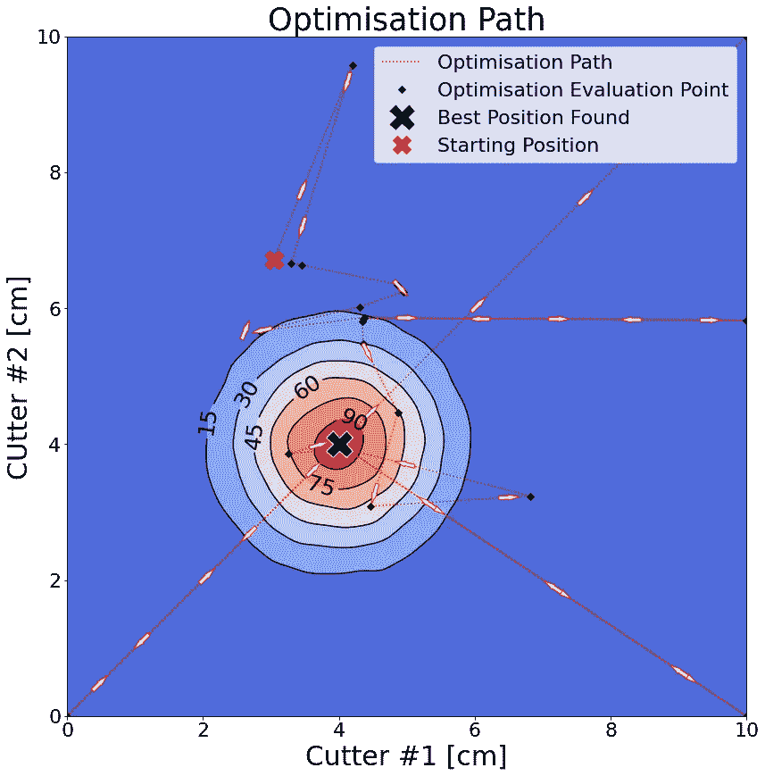

# 高斯过程:制定你自己的人生目标

> 原文：<https://towardsdatascience.com/gaussian-processes-make-your-own-objectives-in-life-6d78d3c0b49e?source=collection_archive---------39----------------------->

## 我们可以使用贝叶斯优化来调整我们的模型，但你知道它可以做得更多吗？

[我在](/gaussian-processes-smarter-tuning-for-your-ml-models-c72c7d4f5833)之前谈到过如何使用[高斯过程](https://en.wikipedia.org/wiki/Gaussian_process)来拟合模型超参数的替代函数，然后使用贝叶斯统计在少量迭代中找到最佳参数。这可以简单地用 sci-optimize 包中的几行代码( [BayesSearchCV](https://scikit-optimize.github.io/stable/modules/generated/skopt.BayesSearchCV.html) )来完成。如果你想要更多的数学链接，这是一个很好的选择。

但是，您可以更深入地挖掘，并相对容易地构建自己的目标函数。

## 我们为什么要这么做？

很高兴你问了。简单地说，如果你能想到一个优化问题和评估它的方法，你可以使用高斯过程(GP)来解决它。

唯一的警告是，它必须是昂贵的评估(无论是检索时间或成本)。如果你有一个只需要几秒钟就可以评估的东西，那么这个方法虽然很酷，但由于它增加了大量的计算开销，所以不是最有效的选择。这是因为每当你得到一个新点时，它必须重新计算并拟合一个代理分布到它已经评估过的所有点，因此它的性能随着迭代次数的增加而降低(这是一个 O(N)问题)。

因为我相信你会问，如果从随机抽样开始评估是不是既便宜又快捷。它通常会给出有竞争力的结果，因为它可以在 GP 只能做几个的时间内完成大量的评估(开销成为一个瓶颈)。random 在这里表现如此之好的原因纯粹是统计学上的，因为你可以执行的计算次数越多，你的猜测中至少有一个没有落在可接受区域内的概率就越低。


照片由[юліявівчарик](https://unsplash.com/@jusfilm?utm_source=medium&utm_medium=referral)在 [Unsplash](https://unsplash.com?utm_source=medium&utm_medium=referral) 上拍摄

## 我们会在哪里使用它？

使用范围相当广泛，例如:

*   调整工厂生产线设置以获得最佳质量输出
*   从大量组合中选择最佳药物或化学成分
*   调整路段上的交通灯以辅助交通流量和行人行走
*   优化您的上班旅行时间
*   平衡您的散热器，使它们辐射相同的温度

最后一个听起来有点疯狂，但它是一个你可以使用它的应用程序，如果我发现我的房子里有一个寒冷的房间，我可能会在这个冬天使用它。

一般来说，在运行优化时，如果行为没有太大的变化，这种方法非常有效。这不同于噪声数据，因为你可以添加元素来处理它(比如一个[白核](https://scikit-learn.org/stable/modules/generated/sklearn.gaussian_process.kernels.WhiteKernel.html#sklearn.gaussian_process.kernels.WhiteKernel)

# 好吧，那我们怎么做？代码时间！

当我说高斯过程时，我的意思是我们将高斯函数拟合到我们的数据(替代模型)，然后使用贝叶斯统计来预测基于该拟合的最可能的下一个值。

我将从一个问题开始，从一个挤压材料切割 4x4cm 厘米的碎片。我能做的就是移动两个刀具(一个上下，一个左右)。你会(正确地)猜测，如果我把每个切刀放在 4 厘米的地方，我就会得到我想要的。

如果我现在让一台计算机做这件事，但是我没有告诉它我想要什么或者怎么做(除了它能移动刀具之外)，那么它会怎么做？我可以使用随机猜测，但我希望它在得到正确答案之前，通过切割最少的部分来找到正确的答案。进入高斯过程！

我不能只告诉它“否”或“是”,因为它需要知道自己做得有多好，好了多少。即每次它做出猜测时，它都需要学习一些东西。因此，对于这个例子，我将在一个尺度上评分，如果它完全正确，就给它 100%，否则我将在这一点周围的半径内评分(我如何做，我将在后面讨论)。

如果你想象一下我会如何给刀具位置评分，它会是这样的:



刀具位置如何分级(最佳值为 4x4cm)

正如你所看到的，如果两个切刀都在 4 厘米处，我会给满分，轮廓被标记为我如何分级，因为它越来越远。

因此，要设置代码，我们需要首先定义它可以搜索的参数空间:

```
from skopt.space import Real# Define the parameter space types and ranges
space = [Real(0, 10, prior='uniform', name='Cutter #1'),
         Real(0, 10, prior='uniform', name='Cutter #2')]
```

我们在这里所做的是设置一个“1 号刀具”和“2 号刀具”的参数空间，并表示我们想要一个介于 0 和 10(这是刀具可以移动的厘米数)之间的实值(所以是浮点型)。我们设置的先验是“统一的”,因为我们希望它认为所有的值都具有同等的可能性。最后，我们将其命名为，这不是必需的，但是当稍后在目标函数中处理这些值时，这样会减少混淆。

**注意:**您也可以指定整数和类别，所以您不仅仅局限于浮点数。

现在我们有了这个，我们需要创建我们的目标函数。该函数的作用是从 GP 中获取每组建议的参数，然后对其进行评估/评分。GP 将使用这些分数来尝试最小化这个目标函数。

```
from skopt.utils import use_named_args
from scipy.stats import norm# Value is just used to standardise "value" to be from 0 to 100
max_value = norm(0).pdf(0)**2[@use_named_args](http://twitter.com/use_named_args)(space)
def objective(**params):
    """
    Returns our quality judgement for each set of parameters given
    """ # Calculate quality based on two gaussians
    cutter_1 = norm(4,1).pdf(params['Cutter #1'])
    cutter_2 = norm(4,1).pdf(params['Cutter #2'])
    value = cutter_1*cutter_2
    # Standardise the value to be from 0 to 100
    value = value/max_value*100
    # Because it is minimising we have to make value negative
    value = -1*value
    return value
```

这是怎么回事？嗯，内容有些随意(正如您将读到的)，但这里最重要的部分是“@use_named_args(space)”。这意味着每当函数接收到参数(一组要评估的猜测值)时，它们将被存储在变量“params”中，我可以使用前面为“space”定义的名称来提取它们。

对于本例，我之前将这两个参数命名为“1 号刀具”和“2 号刀具”,我可以通过以下语句在我的目标函数中访问它们的值:

```
# Access value for 'Cutter #1'
params['Cutter #1']
# Access value for 'Cutter #1'
params['Cutter #2']
```

这对复杂空间特别有用，有助于跟踪变量。

这个函数的其余部分就是我如何计算要返回的“分数”。有趣的是，我决定用两个高斯值(平均值为 4，标准差为 1)对结果进行分级。通过给每个轴分配一个高斯值，然后将它们相乘，我得到了一个围绕我想要的值的漂亮的“圆锥”形状。然后我可以调整这些，使我的判断更严厉(非常尖锐)或不严厉。

我计算一个“max_value”在它之前是这两个高斯的峰值。这是因为我可以标准化它，给出 0 到 100 的质量分数。

我们必须将该值反转为负值，因为该过程将尝试最小化该值。如果我不这样做，优化将与我想要的相反(选择可能的最差切割)。

注意:我同样可以从正确的位置得到猜测的直线距离并返回。这也是可行的。

## 让一切运转起来

我们现在可以定义高斯过程并让它运行:

```
from skopt import gp_minimize# GP process settings and return results stored in "res"
res = gp_minimize(objective, space, n_initial_points=2, n_calls=20,
                  verbose=True)
```

这里的“目标”和“空间”就是我们刚刚定义的函数和参数空间。“n_initial_points”是在开始使用数据点进行拟合并做出明智选择之前，您希望它首先生成的随机点数。在这里，我将它设置为 2(这是最小值)，以便您可以看到它更快地做出明智的选择，但在现实生活中，您通常希望这个值更高(10 左右)，以便您可以很好地覆盖参数空间。这减少了你错过另一个更好的解决方案的机会，并且你不仅仅是陷入了你找到的第一个极小值。

“n_calls”是你想做的迭代次数。此外，值得注意的是“n_initial_points”也从这里获得其分配(因此只有 18 个点将从高斯分布中拟合和估计)。

“verbose”是我设置的最后一个参数，通过将其设置为“True ”,我可以获得关于优化进展情况的信息。

优化的结果存储在“res”中，我们可以在以后查询它。

## 结果

因为我们将函数设置为 verbose，所以我们得到以下输出:



前五次迭代的输出

如果你记得前两个步骤是随机的，但它随后使用这两个点作出明智的猜测。当我们查看前五次迭代时，我们可以看到它发现的当前最小值在变化，并且变得越来越负(记住我们将分数设为负，这样它会适当地最小化)。

如果我们绘制这五次迭代，它看起来像这样:



根据得分值按顺序显示前五次迭代

在上面的例子中，我们可以看到前两次猜测都是错误的，但是一旦它停止了随机猜测，它就开始返回并在开始的地方附近寻找。在第五步，它已经搜索到更远的地方，但稍微接近 4 厘米和 4 厘米的最佳位置。

我还画出了它在 20 次迭代中找到的最佳位置，我们看到它确实找到了这个最佳位置。想象我们得到的所有步骤:



最佳参数的 20 次迭代的可视化

这里我们可以看到，该算法相对较快地(20 步)找到了最佳位置。这意味着，在我得到一个近乎完美的切割之前，我只需要接受 19 次糟糕的切割。

因为我们将结果存储在“res”中，所以我们可以通过访问各种键来查询它:

```
# Print out the best position found
res.x
>>> [3.973487161623168, 3.9749779608581903]
# Print out the value for the best position found
res.fun
>>> -99.93357042213998
```

非常接近！你必须记住，它根本不知道我们想要 4x4cm 的尺寸。它只知道对自己的努力有多高兴或多不高兴。

我们还可以通过访问“x_iters”和“func_vals”来访问返回的所有步骤和质量度量(以及我是如何制作图表的):

```
# Find out how many iterations were done
len(res.x_iters)
>>> 20
```

正好 20，正如我们将“n_calls”设置为。这个值 20 是任意的，是我为了减少图表的混乱而设置的。如果我将 n_calls 设置得更高，这意味着一旦它达到一个特别好的值，该过程可能会检查参数空间的其他区域，如下所示:



允许超过 20 次迭代时的搜索路径

从逻辑上讲，它这样做是为了验证没有更好的方法可用。如果是，它将在那里搜索，否则，它可能会返回到它找到的最佳值附近，并在它附近搜索，看看它是否可以进一步改善这些值。

**注意:**如果您想要可重复的结果，您可以在“gp _ minimise”中设置一个“random_state”值。

# 你已经达到目的了！

因此，使用这个简单的例子，我们已经能够建立一个目标函数，并找到我的问题的最佳解决方案。

虽然这看起来工作量很大，但是当你遇到一个不像这样容易计算的问题时，知道如何做是很有用的。

例如，对于我的散热器问题，我可以去调整所有的散热器阀门，等待一个小时，然后读取每个温度。我可能放进去的值是标准差。然后，该函数将尝试将该值降至零，这将表示每个散热器的温度相同。我可能还想减去中间温度，以鼓励算法尽可能将散热器开得更高(而不是把它们都关了，这样才能达到相同的温度！).因此，可以做很多调整。

我希望这是有用的，并希望很快再次见到你！


在 [Unsplash](https://unsplash.com?utm_source=medium&utm_medium=referral) 上由 [Veronika Nedelcu](https://unsplash.com/@vero_nedelcu?utm_source=medium&utm_medium=referral) 拍摄的照片